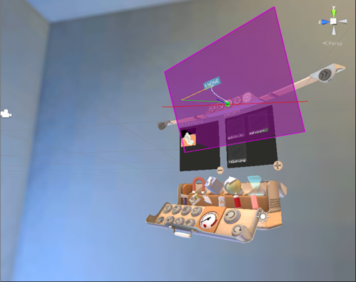
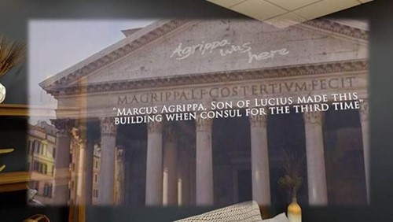

# Case study - Using the stabilization plane to reduce holographic turbulence

Working with holograms can be tricky. The fact that you can move around your space and see your holograms from all different angles provides a level of immersion that you can’t get with a normal computer screen. Keeping these holograms in place and looking realistic is a technical feat accomplished by both the Microsoft HoloLens hardware and the intelligent design of holographic apps.

## The tech

To make holograms appear as though they're actually sharing the space with you, they should render properly, without color separation. This is achieved, in part, by technology built-in to the HoloLens hardware which keeps holograms anchored on what we call a [stabilization plane](hologram-stability.md#reprojection).

A plane is defined by a point and a normal, but since we always want the plane to face the camera, we're really just concerned with setting the plane's point. We can tell HoloLens which point to focus its processing on to keep everything anchored and stable, but how to set this focus point is app-specific, and can make or break your app depending on the content.

In a nutshell, holograms work best when the stabilization plane is properly applied, but what that actually means depends on the type of application you’re creating. Let’s take a look at how some of the apps currently available for HoloLens tackle this problem.

## Behind the scenes

When developing the following apps, we noticed that when we didn't use the plane, objects would sway when our head moved and we'd see color separation with quick head or hologram movements. Over the course of the development timeframe, we learned through trial and error how to best use the stabilization plane and how to design our apps around the problems that it can't fix.

### Galaxy Explorer: Stationary content, 3D interactivity

[Galaxy Explorer](galaxy-explorer.md) has two major elements in the scene: The main view of the celestial content and the small UI toolbar that follows your gaze. For the stabilization logic, we look at what your current gaze vector intersects with in each frame to determine if it hits anything on a specified collision layer. In this case, the layers we’re interested in are the planets, so if your gaze falls on a planet, the stabilization plane is placed there. If none of the objects in the target collision layer are hit, the app uses a secondary “plan B” layer. If nothing is being gazed at, the stabilization plane is kept at the same distance as it was when gazing at the content. The UI tools are left out as a plane target as we found the jump between near and far reduced the stability of the overall scene.

The design of Galaxy Explorer lends itself well to keeping things stable and reducing the effect of color separation. The user is encouraged to walk around and orbit the content rather than move along it from side to side, and the planets are orbiting slowly enough that the color separation isn’t noticeable. Additionally, a constant 60 FPS is maintained, which goes a long way in preventing color separation from happening.

To check this out yourself, look for a file called LSRPlaneModifier.cs in the [Galaxy Explorer code on GitHub](https://github.com/Microsoft/GalaxyExplorer/tree/master/Assets/Scripts/Utilities).

### HoloStudio: Stationary content with a UI focus

In HoloStudio, you spend most of your time looking at the same model you’re working on. Your gaze doesn’t move a significant amount, except for when you select a new tool or want to navigate the UI, so we can keep the plane setting logic simple. When looking at the UI, the plane is set to whatever UI element your gaze snaps to. When looking at the model, the plane is a set distance away, corresponding with the default distance between you and the model.

### HoloTour and 3D Viewer: Stationary content with animation and movies

In HoloTour and 3D Viewer, you’re looking at a solitary animated object or movie with 3D effects added on top of it. The stabilization in these apps is set to whatever you’re currently viewing.

HoloTour also prevents you from straying too far away from your virtual world by having it move with you instead of staying in a fixed location. This ensures that you won’t get far enough away from other holograms for stability issues to creep in.

### RoboRaid: Dynamic content and environmental interactions

Setting the stabilization plane in RoboRaid is surprisingly simple, despite being the app that requires the most sudden movement. The plane is geared towards sticking to the walls or the surrounding objects and will float at a fixed distance in front of you when you’re far enough away from them.

RoboRaid was designed with the stabilization plane in mind. The reticle, which moves the most since it’s head-locked, circumvents this by using only red and blue which minimizes any color bleeding. It also contains a small bit of depth between the pieces, minimizing any color bleed that would occur by masking it with an already expected parallax effect. The robots don’t move very quickly and only travel short distances in regular intervals. They tend to stay around 2 meters in front of you, where the stabilization is set by default.

### Fragments and Young Conker: Dynamic content with environmental interaction

Written by Asobo Studio in C++, Fragments and Young Conker take a different approach to setting the stabilization plane. Points of interest (POI) are defined in the code and ordered in terms of priority. POIs are in-game content such as the Conker model in Young Conker, menus, the aiming reticle, and logos. The POIs are intersected by the user’s gaze and the plane is set to the center of the object with the highest priority. If no intersection occurs, the plane is set to the default distance.

Fragments and Young Conker also design around you straying too far from the holograms by pausing the app if you move outside of what’s been previously scanned as your play space. As such, they keep you within the boundaries that are found to provide the most stable experience.

## Do it yourself

If you have a HoloLens and would like to play around with the concepts within this article, you can download a test scene and try out the exercises below. It uses Unity’s built-in gizmo API and should help you visualize where your plane is being set. This code was also used to capture the screenshots in this case study.
1. Sync the latest version of [MixedRealityToolkit-Unity](https://github.com/Microsoft/MixedRealityToolkit-Unity).
2. Open the [HoloToolkit-Examples/Utilities/Scenes/StabilizationPlaneSetting.unity](https://github.com/Microsoft/MixedRealityToolkit-Unity/blob/htk_release/Assets/HoloToolkit-Examples/Utilities/Scenes/StabilizationPlaneSetting.unity) scene.
3. Build and configure the generated project.
4. Run on your device.

### Exercise 1

You'll see several white dots around you at different orientations. In front of you, you’ll see three dots at different depths. Air tap to change which dot the plane is set to. For this exercise, and for the other two, move around your space while gazing at the dots. Turn your head left, right, up, and down. Move closer to and farther from the dots. See how they react when the stabilization plane is set to different targets.

### Exercise 2

Now, turn to your right until you see two moving dots, one oscillating on a horizontal path and one on a vertical path. Once again, air-tap to change which dot the plane is set to. Notice how color separation is lessened and appears on the dot that is connected to the plane. Tap again to use the dot’s velocity in the plane setting function. This parameter gives a hint to HoloLens about the object’s intended motion. It’s important to know when to use this, as you’ll notice when velocity is used on one dot, the other moving dot will show greater color separation. Keep this in mind when designing your apps—having a cohesive flow to the motion of your objects can help prevent artifacts from appearing.

### Exercise 3

Turn to your right once more until you see a new configuration of dots. In this case, there are dots in the distance and one dot spiraling in and out in front of them. Air tap to change which dot the plane is set to, alternating between the dots in the back and the dot in motion. Notice how setting the plane position and the velocity to that of the spiraling dot makes artifacts appear everywhere.

**Tips**
* Keep your plane setting logic simple. As you’ve seen, you don’t need complex plane setting algorithms to make an immersive experience. The stabilization plane is only one piece of the puzzle.
* When at all possible, always move the plane between targets smoothly. Instantly switching distant targets can visually disrupt the scene.
* Consider having an option in your plane setting logic to lock onto a very specific target. That way, you can have the plane locked on an object, such as a logo or title screen, if needed.

## About the author

<table style="border-collapse:collapse">
<tr>
<td style="border-style: none" width="60px"></td>
<td style="border-style: none"><b>Ben Strukus</b> Software Engineer @Microsoft</td>
</tr>
</table>

## See also
* [MR Basics 100: Getting started with Unity](holograms-100.md)
* [Focus point in Unity](focus-point-in-unity.md)
* [Hologram stability](hologram-stability.md)
