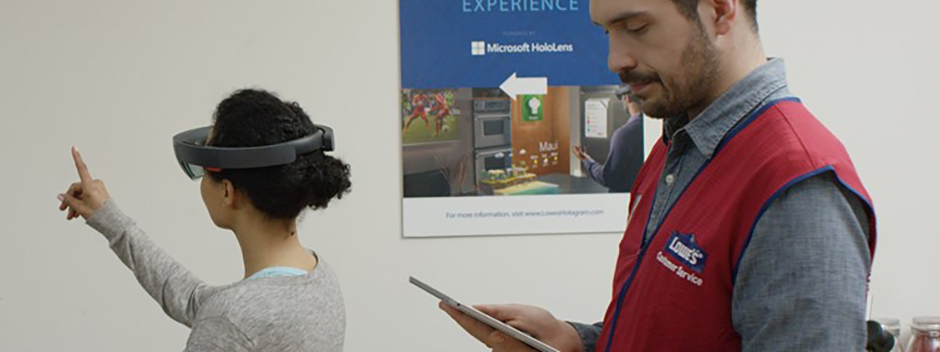
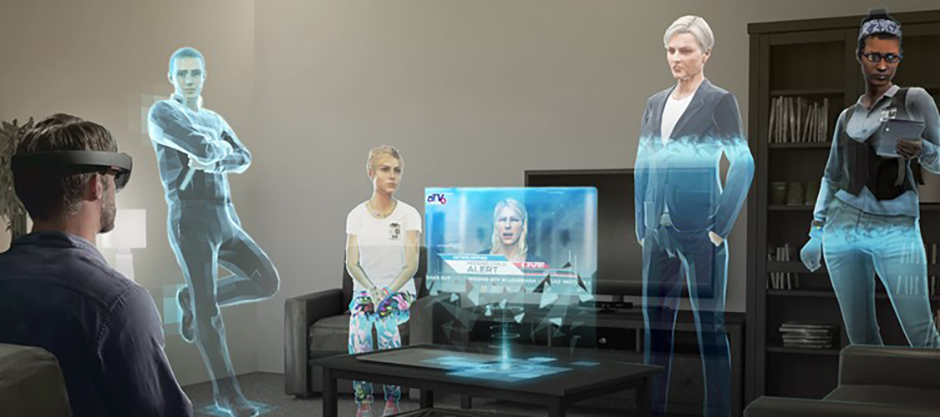
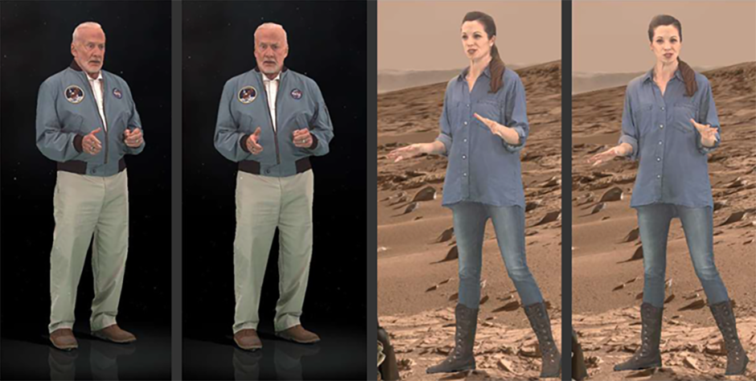

# Holographic frame

Users see the world of mixed reality through a rectangular viewport powered by their headset. On the HoloLens, this rectangular area is called the holographic frame and allows users to see digital content overlaid onto the real world around them. Designing experiences optimized for the holographic frame creates opportunities, mitigates challenges and enhances the user experience of mixed reality applications.

## Designing for content

Often designers feel the need to limit the scope of their experience to what the user can immediately see, sacrificing real-world scale to ensure the user sees an object in its entirety. Similarly designers with complex applications often overload the holographic frame with content, overwhelming users with difficult interactions and cluttered interfaces. Designers creating mixed reality content need not limit their experience to directly in front of the user and within their immediate view. If the physical world around the user is mapped, then all these surfaces should be considered a potential canvas for digital content and interactions. Proper design of interactions and content within an experience should encourage the user to move around their space, directing their attention to key content, and helping see the full potential of mixed reality.

Perhaps the most important technique to encouraging movement and exploration within an app is to **let users adjust to the experience**. Give users a short period of ‘task-free’ time with the device. This can be as simple as placing an object in the space and letting users move around it or narrating an introduction to the experience. This time should be free of any critical tasks or specific gestures (such as air-tapping), instead the purpose to let users accommodate to viewing content through the device before requiring interactivity or progressing through the stages of the app. If this is a user’s first time with the device this is especially important as they get comfortable seeing content through the holographic frame and the nature of holograms.

### Large objects

Often the content an experience calls for, especially real-world content, will be larger than the holographic frame. Objects that cannot normally fit within the holographic frame should be shrunk to fit when they are first introduced (either at a smaller scale or at a distance). The key is to **let users see the full size of the object** before the scale overwhelms the frame. For example, a holographic elephant should be displayed to fit fully within the frame, allowing users to form a spatial understanding of the animal's overall shape, before sizing it to [real-world scale](scale.md) near the user.

With the full size of the object in mind, users then have an expectation of where to move around and look for specific parts of that object. Similarly, in an experience with immersive content, it can help to have some way to refer back to the full size of that content. For example, if the experience involves walking around a model of a virtual house, it may help to have a smaller doll-house size version of the experience that users can trigger to understand where they are inside the house.

For an example of designing for large objects, see [Volvo Cars](holographic-frame.md#volvo-cars).

### Many objects

Experiences with many objects or components should consider using the full space around the user to avoid cluttering the holographic frame directly in front of the user. In general, it is good practice to introduce content to an experience slowly and this is especially true with experiences that plan to serve many objects to the user. Much like with large objects, the key is to **let users understand the layout of content** in the experience, helping them gain a spatial understanding of what’s around them as content is added to the experience.

One technique to achieve this is to provide persistent points (also known as landmarks) in the experience that anchor content to the real world. For example, a landmark could be a physical object in the real-world, such as a table where digital content appears, or a digital object, such as a set of digital screens where content frequently appears. Objects can also be placed in the periphery of the holographic frame to encourage user to look toward key content, while the discovery of content beyond the periphery can be aided by [attention directors](holographic-frame.md#attention-directors).

Placing objects in the periphery can encourage users to look to the side and this can be aided by attention directors, as described below. Refer to [Comfort](comfort.md#holographic-frame-considerations) for more detailed information on holographic frame considerations.

 

---

## Interaction considerations

As with content, interactions in a mixed reality experience need not be limited to what the user can immediately see. Interactions can take place anywhere in the real-world space around the user and these interactions can help encourage users to move around and explore experiences.

### Attention directors

Indicating points of interest or key interactions can be crucial to progressing users through an experience. User attention and movement of the holographic frame can be directed in subtle or heavy-handed ways. Remember to balance attention directors with periods of free exploration in mixed reality (especially at the start of an experience) to avoid overwhelming the user. In general, there are two types of attention directors:
* **Visual directors:** The easiest way to let the user know they should move in a specific direction is to provide a visual indication. This can be done through a visual effect (for example, a path the user can visually follow toward the next part of the experience) or even as simple directional arrows. Note that any visual indicator should grounded within the user's environment, not 'attached' to the holographic frame or the cursor.
* **Audio directors:** [Spatial sound](spatial-sound-design.md) can provide a powerful way to establish objects in a scene (alerting users of objects entering an experience) or to direct attention to a specific point in space (to move the user's view toward key objects). Using audio directors to guide the user’s attention can be more subtle and less intrusive than visual directors. In some cases, it can be best to start with an audio director, then move on to a visual director if the user does not recognize the cue. Audio directors can also be paired with visual directors for added emphasis.

### Commanding, navigation and menus

Interfaces in mixed reality experiences ideally are paired tightly with the digital content they control. As such, free-floating 2D menus are often not ideal for interaction and can be difficult for users to comfortably with inside the holographic frame. For experiences that do require interface elements such as menus or text fields, consider using a [tag-along method](billboarding-and-tag-along.md) to follow the holographic frame after a short delay. Avoid locking content to the frame like a heads-up display, as this can be disorienting for the user and break the sense of immersion for other digital objects in the scene.

Alternatively, consider placing interface elements directly on the specific content they control, allowing interactions to happen naturally around the user's physical space. For example, break a complex menu into separate parts. With each button or group of controls attached to the specific object the interaction affects. To take this concept further, consider the use of [interactable objects](interactable-object.md).

### Gaze and gaze targeting

The holographic frame presents a tool for the developer to trigger interactions as well as evaluate where a user's attention dwells. [Gaze](gaze-and-commit.md) is one of the [key interactions on HoloLens](interaction-fundamentals.md), where gaze can be paired with [gestures](gaze-and-commit.md#composite-gestures) (such as with air-tapping) or [voice](voice-input.md) (allowing for shorter, more natural voice-based interactions). As such, this makes the holographic frame both a space for observing digital content as well as interacting with it. If the experience calls for interacting with multiple objects around the user's space (for example, multi-selecting objects around the user's space with gaze + gesture), consider bringing those objects into the user's view or limiting the amount of necessary head movement to promote [user comfort](comfort.md).

Gaze can also be used to track user attention through an experience and see which objects or parts of the scene the user paid the most attention to. This can be especially use for debugging an experience, allowing for analytical tools like heatmaps to see where users are spending the most time or are missing certain objects or interaction. Gaze tracking can also provide a powerful tool for facilitators in experiences (see the [Lowe's Kitchen](holographic-frame.md#lowes-kitchen) example).

 

---

## Performance

Proper use of the holographic frame is fundamental to the [performance quality](understanding-performance-for-mixed-reality.md) experiences. A common technical (and usability) challenge is overloading the user's frame with digital content, causing rendering performance to degrade. Consider instead using the full space around the user to arrange digital content, using the techniques described above, to lessen the burden of rendering and ensure an optimal display quality.

Digital content within the holographic frame of the HoloLens can also be paired with the [stabilization plane](case-study-using-the-stabilization-plane-to-reduce-holographic-turbulence.md) for optimal performance and [hologram stability](hologram-stability.md).

 

---

## Examples

### Volvo Cars

<iframe width="940" height="530" src="https://www.youtube.com/embed/DilzwF90vec" frameborder="0" allow="accelerometer; autoplay; encrypted-media; gyroscope; picture-in-picture" allowfullscreen></iframe>

In the showroom experience from Volvo Cars, customers are invited to learn about a new car's capabilities in a HoloLens experience guided by a Volvo associate. Volvo faced a challenge with the holographic frame: a full-size car is too large to put right next to a user. The solution was to begin the experience with a physical landmark, a central table in the showroom, with a smaller digital model of the car placed on top of the table. This ensures the user is seeing the full car when it is introduced, allowing for a sense of spatial understanding once the car grows to its real-world scale later in the experience.

Volvo's experience also makes use of visual directors, creating a long visual effect from the small-scale car model on the table to a wall in the show room. This leads to a 'magic window' effect, showing the full view of the car at a distance, illustrating further features of the car at real-world scale. The head movement is horizontal, without any direct interaction from the user (instead gathering cues visually and from the Volvo associate's narration of the experience).

 

---

### Lowe's Kitchen

A store experience from Lowe's invites customers into a full-scale mockup of a kitchen to showcase various remodeling opportunities as seen through the HoloLens. The kitchen in the store provides a physical backdrop for digital objects, a blank canvas of appliances, countertops, and cabinets for the mixed reality experience to unfold.

Physical surfaces act as static landmarks for the user to ground themselves in the experience, as a Lowe's associate guides the user through different product options and finishes. In this way, the associate can verbally direct the user's attention to the 'refrigerator' or 'center of the kitchen' to showcase digital content.

 
*A Lowe's associate uses a tablet to guide customers through the HoloLens experience.*

The user's experience is managed, in part, by a tablet experience controlled by the Lowe's associate. Part of the associate's role in this case would also be to limit excessive head movement, directing their attention smoothly across the points of interest in the kitchen. The tablet experience also provides the Lowe's associate with gaze data in the form of a heatmap view of the kitchen, helping understand where the user is dwelling (for example, on a specific area of cabinetry) to more accurately provide them with remodeling guidance.

For a deeper look at the Lowe's Kitchen experience, see [Microsoft's keynote at Ignite 2016](https://www.youtube.com/watch?v=gC_4JxF0e_k).

 

---

### Fragments

In the HoloLens game Fragments, you living room is transformed into virtual crime scene showing clues and evidence, as well as a virtual meeting room, where you talk with characters that sit on your chairs and lean on your walls.

 
*Fragments was designed to take place in a user's home, with characters interacting with real-world objects and surfaces.*

When users initially begin the experience, they are given a short period of adjustment, where very little interaction is required, instead encouraging them to look around. This also helps ensure the room is properly mapped for the game's interactive content.

Throughout the experience, characters become focal points and act as visual directors (head movements between characters, turning to look or gesture toward areas of interest). The game also relies on more prominent visual cues when a user takes too long to find an object or event and makes heavy use of spatial audio (especially with characters voices when entering a scene).

 

---

### Destination: Mars

In the Destination: Mars experience featured at [NASA's Kennedy Space Center](https://blogs.windows.com/devices/2016/09/19/hololens-experience-destination-mars-now-open-at-kennedy-space-center-visitor-complex/), visitors were invited into an immersive trip to the surface of Mars, guided by virtual representation of legendary astronaut Buzz Aldrin.

 
*A virtual Buzz Aldrin becomes the focal point for users in Destination: Mars.*

As an immersive experience, these users were encouraged to look around, moving their head in all directions to see the virtual Martian landscape. Although to ensure the comfort of the users, Buzz Aldrin's narration and virtual presence provided a focal point throughout the experience. This virtual recording of Buzz (created by [Microsoft's Mixed Reality Capture Studios](https://www.microsoft.com/mixed-reality/capture-studios)) stood at real, human size, in the corner of the room allowing users to see him in near-complete view. Buzz's narration directed users to focus on different points in the environment (for example, a set of Martian rocks on the floor or a mountain range in the distance) with specific scene changes or objects introduced by him.

 
*The virtual narrators will turn to follow a user's movement, creating a powerful focal point throughout the experience.*

The realistic representation of Buzz provided a powerful focal point, complete with subtle techniques to turn Buzz toward the user to feel as though he is there, speaking to you. As the user moves about the experience, Buzz will shift toward you to a threshold before returning to a neutral state if the user moves too far beyond his periphery. If the user looks way from Buzz completely (for example, to look at something elsewhere in the scene) then back to Buzz, the narrator's directional position will once again be focused on the user. Techniques like this provide a powerful sense of immersion and create a focal point within the holographic frame, reducing excessive head movement and promoting [user comfort](comfort.md).

## See also
* [Instinctual interactions](interaction-fundamentals.md)
* [Comfort](comfort.md)
* [Scale](scale.md)
* [Head-gaze and dwell](gaze-and-dwell.md)
* [Hologram stability](hologram-stability.md)
