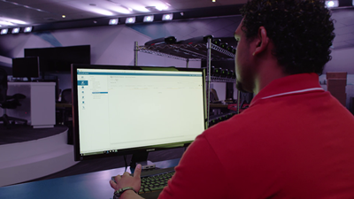

# Release notes - August 2016

The HoloLens team is listening to feedback from developers in the Windows Insider Program to prioritize our work. Continue to [give us feedback](https://docs.microsoft.com/windows/mixed-reality/give-us-feedback) through the Feedback Hub, the [developer forums](https://forums.hololens.com) and [Twitter via @HoloLens](https://twitter.com/hololens). As Windows 10 embraces the Anniversary Update, the HoloLens team is happy to deliver further improve to the holographic experience. In this update, we focused on major fixes, improvements, and introducing features requested by businesses and available in the Microsoft HoloLens Commercial Suite.

**Latest release:** Windows Holographic August 2016 Update (**10.0.14393.0**, Windows 10 Anniversary Release)

>[!VIDEO https://www.youtube.com/embed/tNd0e2CiAkE]

To [update to the current release](https://docs.microsoft.com/windows/mixed-reality/updating-hololens), open the *Settings* app, go to *Update & Security*, then select the *Check for updates* button.

## New features

**Attach To Process Debugging**
 HoloLens now supports attach-to-process debugging. You can use Visual Studio 2015 Update 3 to connect to a running app on a HoloLens and [start debugging it](https://docs.microsoft.com/windows/mixed-reality/develop/platform-capabilities-and-apis/using-visual-studio#debugging-an-installed-or-running-app). This works without the need to deploy from a Visual Studio project.

**Updated HoloLens Emulator**
 We've also released an updated version of the HoloLens Emulator.

**Gamepad Support**
 You can now pair and use Bluetooth gamepads with HoloLens! The newly released Xbox Wireless Controller S features Bluetooth capabilities and can be used to play your favorite gamepad-enabled games and apps. A [controller update](https://support.xbox.com/xbox-one/accessories/update-controller-for-stereo-headset-adapter) must be applied before you can connect the Xbox Wireless Controller S with HoloLens. The Xbox Wireless Controller S is supported by [XInput](https://msdn.microsoft.com/library/windows/desktop/hh405053(v=vs.85).aspx) and [Windows.Gaming.Input](https://msdn.microsoft.com/library/windows/apps/windows.gaming.input.aspx) APIs. You can access more Bluetooth controllers models through the [Windows.Gaming.Input](https://msdn.microsoft.com/library/windows/apps/windows.gaming.input.aspx) API.

## Improvements and fixes

We're in sync with the rest of the Windows 10 Anniversary update, so in addition to the HoloLens specific fixes, you're also receiving all the goodness from the Windows update to increase platform reliability and performance. Your feedback is highly valued and prioritized for fixes in the release.

We've improved the following experiences:
* log in experiences.
* workplaces join.
* power efficiency for device power state transitions.
* stability with Mixed Reality Captures.
* reliability for Bluetooth connectivity
* hologram persistence in multi app scenario.

We've fixed the following issues:
* the Visual Studio profilers and graphics debugger fail to connect.
* photos & documents don't show up in the file explorer in the device portal.
* the App Bar can flash when the cursor is placed above it while in Adjust mode.
* When in Adjust mode, the eye gaze dot cursor will change to the 4-arrow cursor sometime more slowly.
* "Hey Cortana play music" doesn't launch Groove.
* after the previous update, saying "Go Home" doesn't display the pins panel correctly.

## Introducing Microsoft HoloLens Commercial Suite

The Microsoft HoloLens Commercial Suite is ready for enterprise deployment. We've added several highly requested [commercial features](https://docs.microsoft.com/windows/mixed-reality/commercial-features) from our early business partners.

Contact your local Microsoft account manager to purchase the Microsoft HoloLens Commercial Suite.

### Key Commercial Features 

* **Kiosk mode.** With HoloLens kiosk mode, you can limit which apps to run to enable demo or showcase experiences. 
  
* **Mobile Device Management (MDM) for HoloLens.** Your IT department can manage multiple HoloLens devices simultaneously using solutions like Microsoft Intune. You can manage settings, select apps to install and set security configurations tailored to your organization's need. 
  
* **Windows Update for Business.** Controlled operating system updates to devices and support for long-term servicing branch.
* **Data security.** BitLocker data encryption is enabled on HoloLens to provide the same level of security protection as any other Windows device.
* **Work access.** Anyone in your organization can remotely connect to the corporate network through virtual private network on a HoloLens. HoloLens can also access Wi-Fi networks that require credentials.
* **Microsoft Store for Business.** Your IT department can also set up an enterprise private store, containing only your company’s apps for your specific HoloLens usage. Securely distribute your enterprise software to selected group of enterprise users.

### Development Edition vs. Commercial Suite

<table>
<tr>
<th>Features</th><th>Development Edition</th><th>Commercial Suite</th>
</tr><tr>
<td>Device Encryption (Bitlocker)</td><td></td><td style="text-align: center;">✔️</td>
</tr><tr>
<td>Virtual Private Network (VPN)</td><td></td><td style="text-align: center;">✔️</td>
</tr><tr>
<td><a href="https://docs.microsoft.com/windows/mixed-reality/develop/platform-capabilities-and-apis/using-the-windows-device-portal#kiosk-mode">Kiosk mode</a></td><td></td><td style="text-align: center;">✔️</td>
</tr><tr>
<th colspan="3" style="text-align: left;"> Management and deployment</th>
</tr><tr>
<td>Mobile Device Management (MDM)</td><td style="text-align: center;"></td><td style="text-align: center;">✔️</td>
</tr><tr>
<td>Ability to block unenrollment</td><td></td><td style="text-align: center;">✔️</td>
</tr><tr>
<td>Cert Based Corporate Wi-Fi Access</td><td></td><td style="text-align: center;">✔️</td>
</tr><tr>
<td>Microsoft Store (Consumer)</td><td style="text-align: center;">Consumer</td><td style="text-align: center;">Filtering via MDM</td>
</tr><tr>
<td><a href="https://technet.microsoft.com/itpro/windows/manage/working-with-line-of-business-apps">Business Store Portal</a></td><td></td><td style="text-align: center;">✔️</td>
</tr><tr>
<th colspan="3" style="text-align: left;"> Security and Identity</th>
</tr><tr>
<td>Log in with Azure Active Directory (AAD)</td><td style="text-align: center;">✔️</td><td style="text-align: center;">✔️</td>
</tr><tr>
<td>Log in with Microsoft Account (MSA)</td><td style="text-align: center;">✔️</td><td style="text-align: center;">✔️</td>
</tr><tr>
<td>Next Generation Credentials with PIN unlock</td><td style="text-align: center;">✔️</td><td style="text-align: center;">✔️</td>
</tr><tr>
<td><a href="https://msdn.microsoft.com/windows/hardware/commercialize/manufacture/desktop/secure-boot-overview">Secure boot</a></td><td style="text-align: center;">✔️</td><td style="text-align: center;">✔️</td>
</tr><tr>
<th colspan="3" style="text-align: left;"> Servicing and Support</th>
</tr><tr>
<td>Automatic system updates as they arrive</td><td style="text-align: center;">✔️</td><td style="text-align: center;">✔️</td>
</tr><tr>
<td><a href="https://technet.microsoft.com/itpro/windows/plan/windows-update-for-business">Windows Update for Business</a></td><td></td><td style="text-align: center;">✔️</td>
</tr><tr>
<td>Long-term servicing branch</td><td></td><td style="text-align: center;">✔️</td>
</tr>
</table>

## Prior release notes
* [Release notes - May 2016](release-notes-may-2016.md)
* [Release notes - March 2016](release-notes-march-2016.md)

## See also
* [HoloLens known issues](https://docs.microsoft.com/windows/mixed-reality/hololens-known-issues)
* [Commercial features](https://docs.microsoft.com/windows/mixed-reality/commercial-features)
* [Install the tools](https://docs.microsoft.com/windows/mixed-reality/develop/install-the-tools)
* [Using the HoloLens emulator](https://docs.microsoft.com/windows/mixed-reality/develop/platform-capabilities-and-apis/using-the-hololens-emulator)
