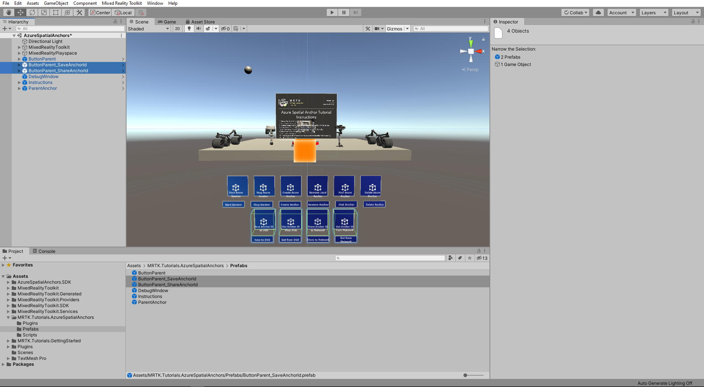
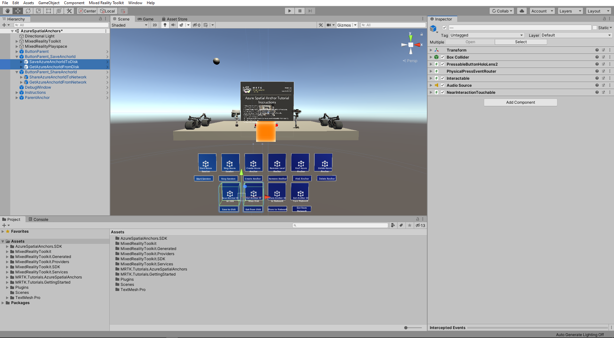
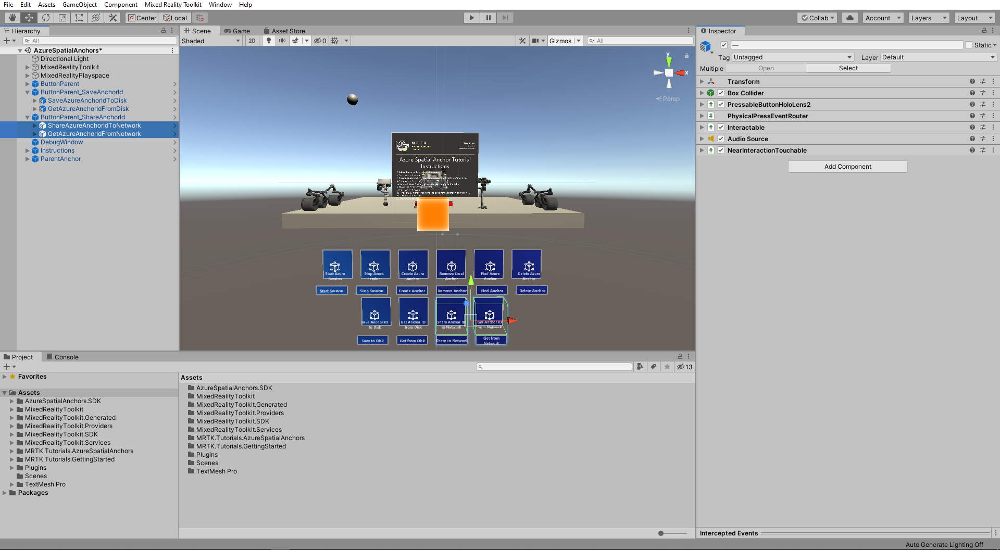

# 2. Saving, retrieving, and sharing Azure Spatial Anchors

In this tutorial, you will learn how to save Azure Spatial Anchors across multiple app sessions by saving the anchor ID to the HoloLens 2's storage. You will also learn how to share this anchor ID to other devices for a multi-device anchor alignment.

## Objectives

* Learn how to save and retrieve Azure Spatial Anchor IDs to and from the HoloLens 2 local disk, for persistence between app sessions
* Learn how to share Azure Spatial Anchor IDs between users in a multi-device scenario

## Preparing the scene

In the Project window, navigate to **Assets** > **MRTK.Tutorials.AzureSpatialAnchors** > **Prefabs** folder. While holding down the CTRL button, click on **ButtonParent_SaveAnchorId** and **ButtonParent_ShareAnchorId** to select the two prefabs, then drag them into the Hierarchy window to add them to the scene:

## Persist Azure Anchors between app sessions - Save anchor ID to disk
<!-- TODO: Consider renaming to 'Persist Azure Anchors between app sessions' -->

In this section, you will learn how to save and retrieve the Azure Anchor ID to and from the HoloLens 2 local disk. This will allow you to query Azure for the same anchor ID between different app sessions, allowing the anchored holograms to be position at the same location as in the previous app session.

In the Hierarchy window, expand the **ButtonParent_SaveAnchorId** object which contains two buttons, one button for saving the Azure Anchor ID to the HoloLens 2 storage and another for retrieving the saved ID from the disk:

Follow the same steps as in the [configuring the buttons to operate the scene](mrlearning-asa-ch1.md#configuring-the-buttons-to-operate-the-scene) instructions from the previous tutorial to configure the **Pressable Button Holo Lens 2 (Script)** component and the **Interactable (Script)** component on each of the two buttons:

* For the **SaveAzureAnchorIdToDisk** object, assign the AnchorModuleScript > **SaveAzureAnchorIdToDisk ()** function.
* For the **GetAzureAnchorIdFromDisk** object, assign the AnchorModuleScript > **GetAzureAnchorIdFromDisk ()** function.

If you build the updated application to your HoloLens, you can now persist Azure Spatial Anchors between app sessions by saving the Azure Anchor ID. To test it out, you can follow these steps:

1. Move the Rocket Launcher experience to desired location.
2. Start Azure Session.
3. Create Azure Anchor (creates anchors at the location of the Rocket Launcher experience).
4. Save Azure Anchor ID to Disk.
5. Restart the application.
6. Get Azure Anchor from Disk (loads the anchor ID you just saved).
7. Start Azure Session.
8. Find Azure Anchor (positions the Rocket Launcher experience at the location from step 3).

> [!NOTE]
> To fully restart the application, after exiting the immersive app view, the app window in the mixed reality home needs to be closed before relaunching the application from the Start menu. For additional details, you can refer to the [Using apps on HoloLens](https://docs.microsoft.com/hololens/holographic-home#using-apps-on-hololens) documentation.

## Share Azure Anchors between multiple devices

In this section, you will learn how to share the Azure Anchor ID between multiple devices. This will allow multiple devices to query Azure for the same anchor ID, allowing the anchored holograms to be spatially aligned. Spatial alignment, i.e. seeing the same holograms in the same physical location between multiple devices, is key to local shared experiences in the HoloLens 2.

There are many ways to transfer Azure Anchor IDs between devices, including methods outlined in the the [Multi-user capabilities tutorials](mrlearning-sharing(photon)-ch1.md) series. In this example, you will use a simple web service to upload and download anchor IDs between devices.

In the Hierarchy window, expand the **ButtonParent_ShareAnchorId** object which contains two buttons; one button for uploading the Azure Anchor ID to the web server, and another for downloading the ID from the web server:

Follow the same steps as in the [configuring the buttons to operate the scene](mrlearning-asa-ch1.md#configuring-the-buttons-to-operate-the-scene) instructions from the previous tutorial to configure the **Pressable Button Holo Lens 2 (Script)** component and the **Interactable (Script)** component on each of the two buttons:

* For the **ShareAzureAnchorIdToNetwork** object, assign the AnchorModuleScript > **ShareAzureAnchorIdToNetwork ()** function.
* For the **GetAzureAnchorIdFromNetwork** object, assign the AnchorModuleScript > **GetAzureAnchorIdFromNetwork ()** function.

If you build the updated application to two HoloLens devices, you can now achieve spatial alignment between them by sharing the Azure Anchor ID. To test it out, you can follow these steps:

1. On HoloLens device 1: Move the Rocket Launcher experience to desired location.
2. On HoloLens device 1: Start Azure Session.
3. On HoloLens device 1: Create Azure Anchor (creates anchors at the location of the Rocket Launcher experience).
4. On HoloLens device 1: Share Azure Anchor ID to Network.
5. On HoloLens device 2: Start the application.
6. On HoloLens device 2: Get Shared Anchor ID from Network (fetches the anchor ID just shared from HoloLens device 1).
7. On HoloLens device 2: Start Azure Session.
8. On HoloLens device 2: Find Azure Anchor (positions the Rocket Launcher experience at the location from step 3).

> [!TIP]
> If you only have one HoloLens, you can still test the functionality by restarting the application instead of using a second HoloLens device.

## Congratulations

In this tutorial you learned how to persist Azure Spatial Anchors between application sessions and application restarts by saving the Azure Spatial Anchor ID to the local disk on HoloLens. You also learned how to share Azure Spatial Anchors between multiple devices for a basic multi-user, static hologram shared experience.

In the next tutorial you will learn how to provide users with real-time feedback. This feedback will include information about Anchor creation, the quality of environment understanding, and the state of the Azure session. Without feedback, users may not know whether an anchor has successfully been uploaded to Azure, whether the quality of the environment is sufficient for anchor creation, or the current state.

[Next Lesson: 3. Displaying Azure Spatial Anchor feedback](mrlearning-asa-ch3.md)
