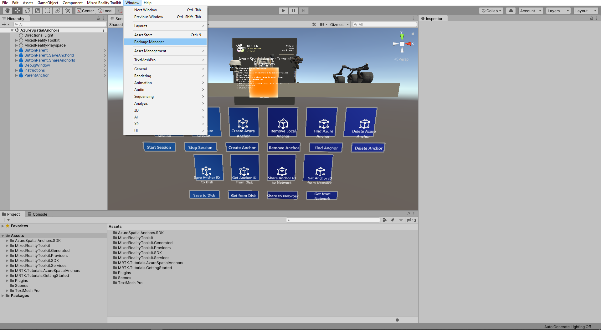
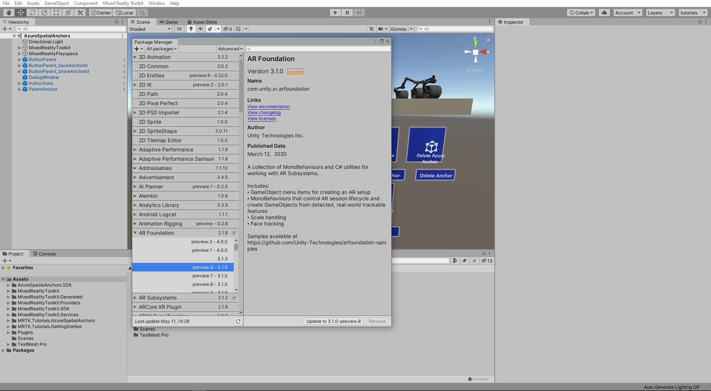
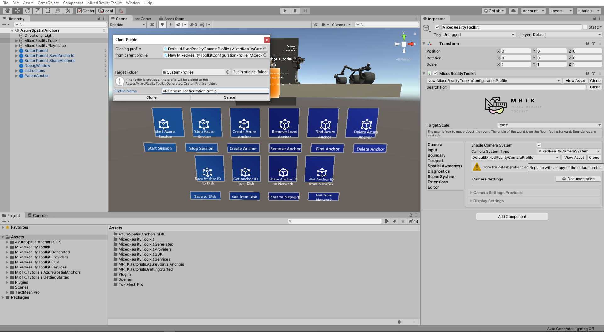
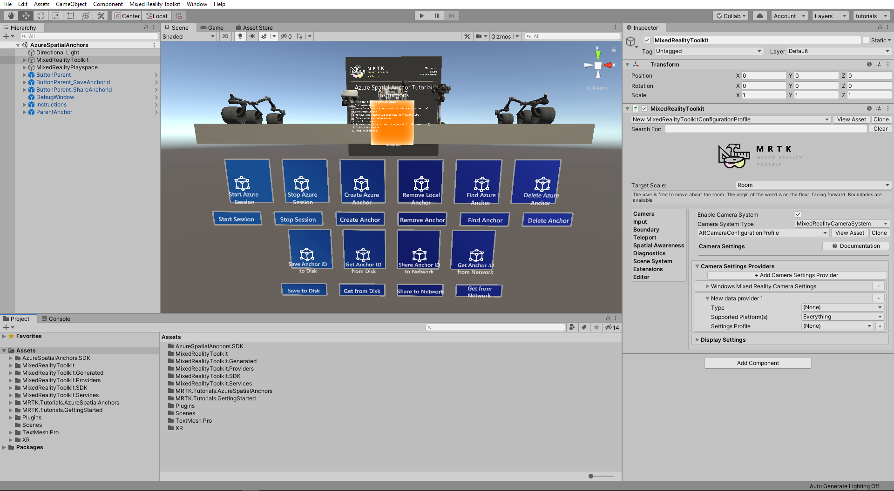
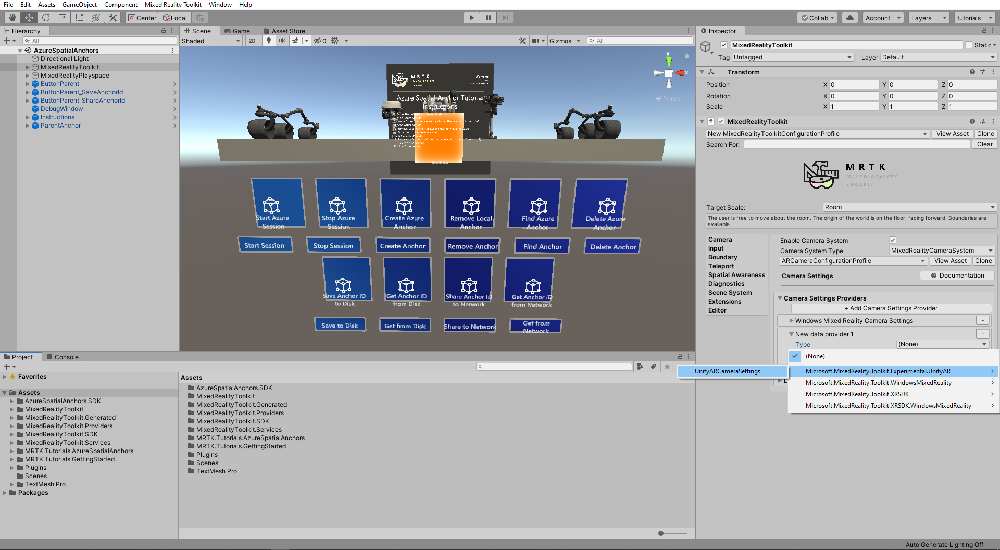
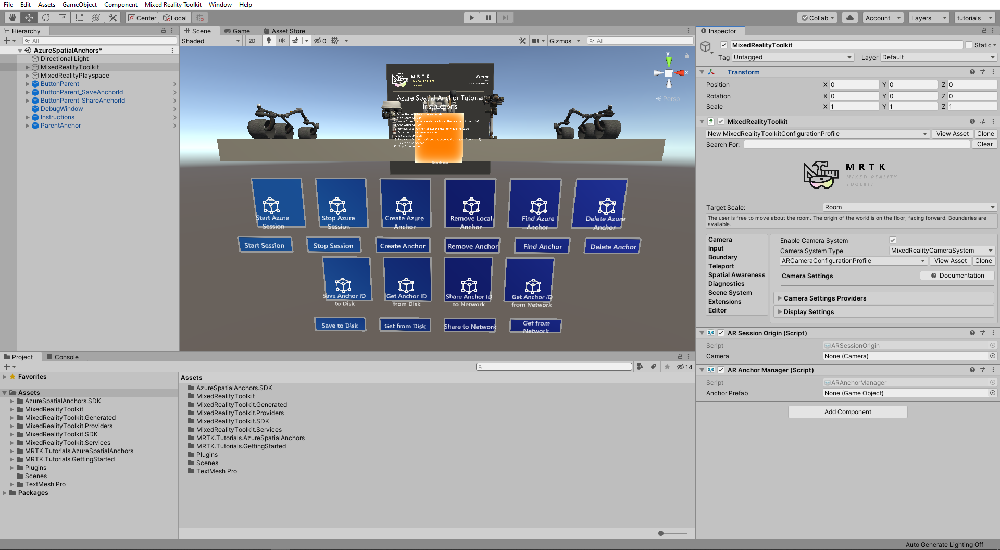
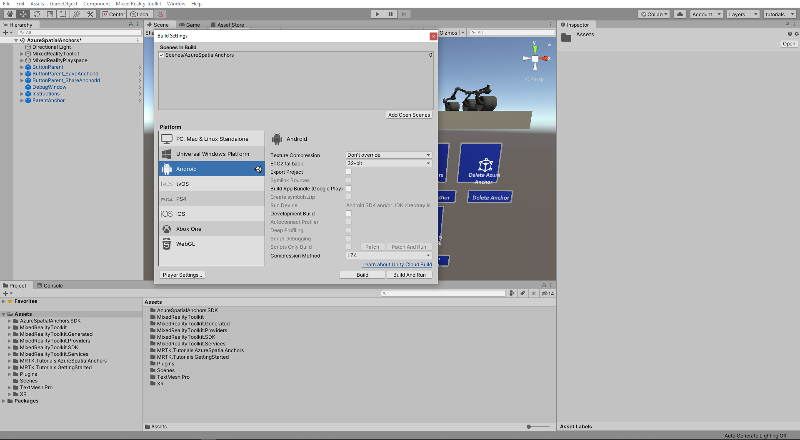
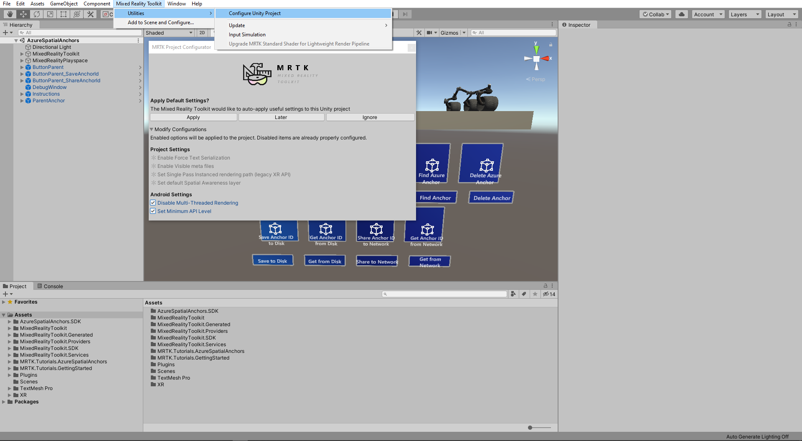
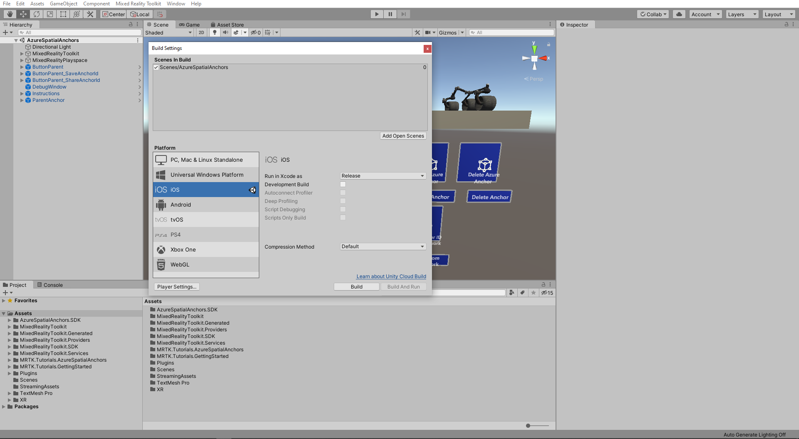
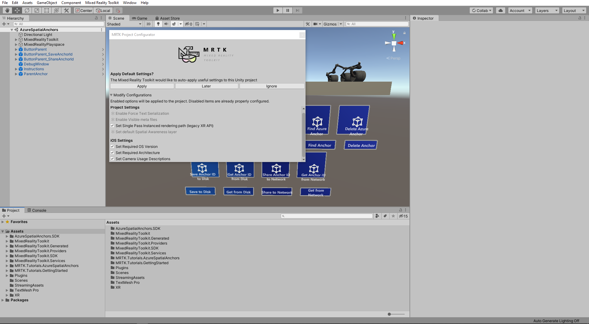

# 5. Building Azure Spatial Anchors for mobile devices

In this tutorial, you will learn how to build the your project to Android and iOS devices using AR Foundation, ARCore XR Plugin, and ARKit XR Plugin.

## Objectives

* Learn how to build your project to Android device using Unity's AR Foundation and ARCore XR Plugin.
* Learn how to build your project to iOS device using Unity's AR Foundation and ARKit XR Plugin.

> [!NOTE]
> To complete this tutorial, make sure you have completed Azure Spatial Anchors Tutorials -> [Getting started with Azure Spatial Anchors](mr-learning-asa-02.md).

## Adding inbuilt Unity packages

In this section, you will install Unity's inbuilt AR Foundation, Legacy Input Helpers, ARCore XR Plugin, and ARKit XR Plugin packages required to support Android and iOS devices.

Make sure you install correct version of these Unity packages as listed below:

In the Unity menu, select **Window** > **Package Manager**:

It might take a few seconds before all packages appear in the list. Display preview packages by clicking on Advanced option and select "**Show preview packages**".

>[!NOTE]
> You might get a pop up message telling you **Preview packages are not verified to work with Unity and might be unstable. They are not supported in production environments.** In that case just select ok.

In the Package Manager window, select the **AR Foundation** dropdown. Here you will see many versions and need to select **Version 3.1.0 preview 8** then update the package by clicking **Update to 3.1.0-preview.8**:

Follow the same process to import the following as needed:

* **Legacy Input Helpers 1.3.11** Required

* **ARCore XR Plugin 3.1.0 preview 8** To support Android devices

* **ARKit XR plugin 3.1.0 preview 8** To support iOS devices

> [!NOTE]
> If you are developing this project for Android, there is no need to install the ARKit XR Plugin package. Similarly, if you are developing this project for iOS, you do not need to install the ARCore XR Plugin.

## Configure MRTK for AR Foundation Camera

In this section, you will learn how to configure MRTK for deploying to a mobile device.

In the Hierarchy window select the **MixedRealityToolkit** object, then in the Inspector clone the camera profile and give it an suitable name, for example **ARCameraConfigurationProfile** and click on the **Clone** button:

with the **MixedRealityToolkit** object still selected, In the Inspector window, under the Camera tab, expand the **Camera Setting Providers**, then click on **+ Add Camera Setting Provider** button. Now expand **New data provider 1** that was created:

Select Type > **Microsoft.MixedReality.Toolkit.Experimental.UnityAR** > **UnityARCameraSettings**.

With the **MixedRealityToolkit** object still selected, in the Inspector window, attach supporting scripts by clicking on the **AddComponent** button and type in **AR Anchor Manager** then select the script.

Adding **AR Reference Point Manager** script will automatically add **AR session origin** along with it in the the Inspector window. After adding the supporting scripts, the Inspector window should look like this.

## Build your application to an Android device

In this section, you will learn how to configure your project to build and deploy to an Android device.

In the Build Settings window, switch the build platform to Android. If you need a reminder on how to do this you can refer back to [Configure the Unity project for Windows Mixed Reality](mr-learning-base-02.md#configure-the-unity-project-for-windows-mixed-reality).

After switching to Android platform, click on **Add Open Scenes** and make sure your current scene is the only selected scene in the **Scenes In Build** list.

Close the **Build settings** window. In the Unity menu, select **Mixed Reality Toolkit** > **Utilities** > **Configure Unity Project** and click on **Apply** to configure the Unity project for the Android platform.

In the Unity menu, select **Edit** > **Project Settings...** to open the Project Settings window. In the Project Settings window select the **Player** tab, expand the **Other Settings** section, select **Vulkan** and remove it by clicking the **-** symbol.

Close the Player Settings window and open the Build Settings window again. Then, using a USB cable, connect your Android device to your computer and select your device in the **Build and Run on** dropdown, then click **Build And Run**. You will be asked to save an `.apk` file that you can give a suitable name, for example, *ASATutorials*

>[!NOTE]
> You might need to press the refresh button next to the dropdown in order to see your device.

> [!NOTE]
If you get any error in the Unity Console window related to Android SDK, NDK, and/or JDK modules, you need to open Unity Hub and install the associated SDK, NDK, and JDK modules for the Android Build Support module.

When the build process is complete, your applications should automatically load on your Android device.

## Build your application to an iOS Device

In this section, you will learn how to configure your project to build to an iOS device.

In the Build Settings window, switch the build platform to Android. If you need a reminder on how to do this you can refer back to [Configure the Unity project for Windows Mixed Reality](mr-learning-base-02.md#configure-the-unity-project-for-windows-mixed-reality).

After switching to Android platform, click on **Add Open Scenes** and make sure your current scene is the only selected scene in the **Scenes In Build** list.

Close the **Build Settings** window. In the Unity menu select **Mixed Reality Toolkit** > **Utilities** > **Configure Unity Project** and click on **Apply** to configure the Unity project for the iOS platform.

To build the iOS XCode project, go to Build settings and click on **Build**.

Follow [this guide](https://docs.microsoft.com/azure/spatial-anchors/quickstarts/get-started-unity-ios#export-the-xcode-project) to learn how to deploy this project to your iOS device.

## Congratulations

In this tutorial you learned how to build your project for Android and iOS devices. You also learned how to use AR Foundation, ARCore XR Plugin, and ARKit XR Plugin in to make your project work for Android and iOS devices.
