# 1. Setting up Photon Unity Networking

## Overview

In this tutorial, you will learn how to prepare for creating a shared experience using Photon Unity Networking (PUN). Photon is one of several networking options available to Mixed Reality developers to create shared experiences. You will learn how to create a Photon PUN application, import Photon PUN assets into your Unity project, and connect your Unity project to the Photon PUN application.

## Objectives

* Learn how to create a Photon PUN application
* Learn how to find and import the Photon PUN assets
* Learn how to connect your Unity project to the Photon PUN application

## Prerequisites

>[!TIP]
>If you have not completed the [Getting started tutorials](mrlearning-base.md) and [Azure Spatial Anchors tutorials](mrlearning-asa-ch1.md) tutorial series yet, it's recommended that you complete those tutorials first.

* A Windows 10 PC configured with the correct [tools installed](install-the-tools.md)
* Windows 10 SDK 10.0.18362.0 or later
* Some basic C# programming ability
* A HoloLens 2 device [configured for development](using-visual-studio.md#enabling-developer-mode)
* <a href="https://docs.unity3d.com/Manual/GettingStartedInstallingHub.html" target="_blank">Unity Hub</a> with Unity 2019.2.X installed and the Universal Windows Platform Build Support module added
* Complete the [Create a Spatial Anchors resource](https://docs.microsoft.com/azure/spatial-anchors/quickstarts/get-started-unity-hololens#create-a-spatial-anchors-resource) section of the [Quickstart: Create a Unity HoloLens app that uses Azure Spatial Anchors](https://docs.microsoft.com/azure/spatial-anchors/quickstarts/get-started-unity-hololens) tutorial

> [!IMPORTANT]
> The recommended Unity version for this tutorial series is Unity 2019.2.X. This supersedes any Unity version requirements or recommendations stated in the prerequisites linked above.

## Creating and preparing the Unity project

In this section, you will create a new Unity project and get it ready for MRTK development.

For this, first follow the [Initializing your project and first application](mrlearning-base-ch1.md), excluding the [Build your application to your device](mrlearning-base-ch1.md#build-your-application-to-your-device) instructions, which includes the following steps:

1. [Create new Unity project](mrlearning-base-ch1.md#create-new-unity-project) and give it a suitable name, for example, *MRTK Tutorials*

2. [Configure the Unity project for Windows Mixed Reality](mrlearning-base-ch1.md#configure-the-unity-project-for-windows-mixed-reality)

3. [Import TextMesh Pro Essential Resources](mrlearning-base-ch1.md#import-textmesh-pro-essential-resources)

4. [Import the Mixed Reality Toolkit](mrlearning-base-ch1.md#import-the-mixed-reality-toolkit)

5. [Configure the Unity project for the Mixed Reality Toolkit](mrlearning-base-ch1.md#configure-the-unity-project-for-the-mixed-reality-toolkit)

6. [Add the Mixed Reality Toolkit to the Unity scene](mrlearning-base-ch1.md#configure-the-mixed-reality-toolkit) and give the scene a suitable name, for example, *MultiUserCapabilities*

Then follow the [How to configure the Mixed Reality Toolkit Profiles (Change Spatial Awareness Display Option)](mrlearning-base-ch2.md#how-to-configure-the-mixed-reality-toolkit-profiles-change-spatial-awareness-display-option) instructions to change the MRTK configuration profile for your scene to the **DefaultHoloLens2ConfigurationProfile** and change the display options for the spatial awareness mesh to **Occlusion**.

> [!CAUTION]
> As mentioned in the [Configure the Unity project for the Mixed Reality Toolkit](mrlearning-base-ch1.md#configure-the-unity-project-for-the-mixed-reality-toolkit) instructions linked above, it is strongly recommended to not enable MSBuild for Unity.

## Configuring the capabilities

In the Unity menu, select **Edit** > **Project Settings...** to open the Player Settings window, then locate the **Player** >  **Publishing Settings** section:

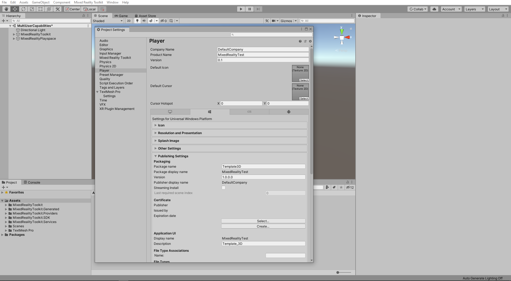

In the  **Publishing Settings**, scroll down to the **Capabilities** section and double-check that the **InternetClient**, **Microphone**, and **SpatialPerception** capabilities, which you enabled when you created the project at the beginning of the tutorial, are enabled. Then, enable the **InternetClientServer**, **PrivateNetworkClientServer**, and **RemovableStorage** capabilities:

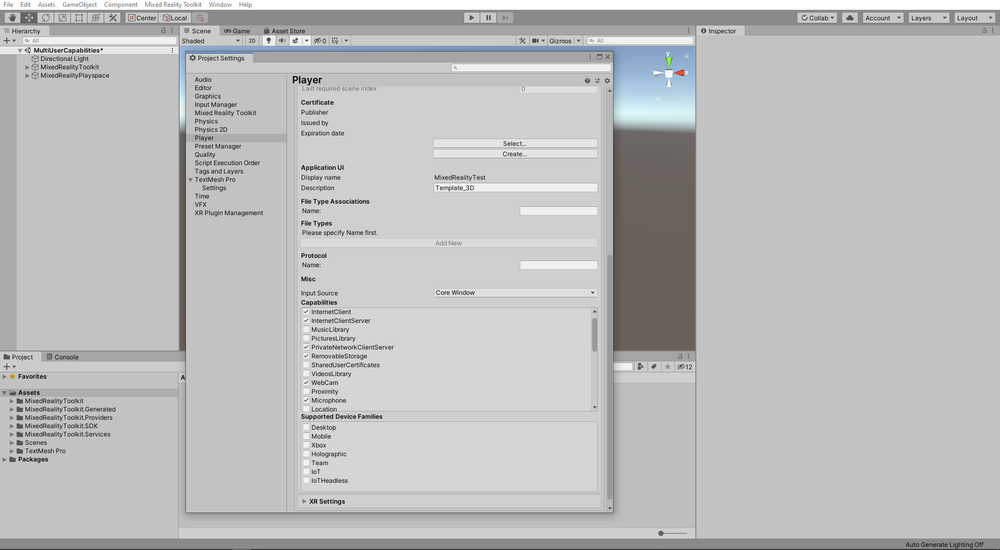

## Adding inbuilt Unity packages
<!-- TODO: Consider renaming to 'Installing AR Foundation' -->

In this section, you will install Unity's inbuilt AR Foundation package because it is required by the Azure Spatial Anchors SDK you will import in the next section.

In the Unity menu, select **Window** > **Package Manager**:

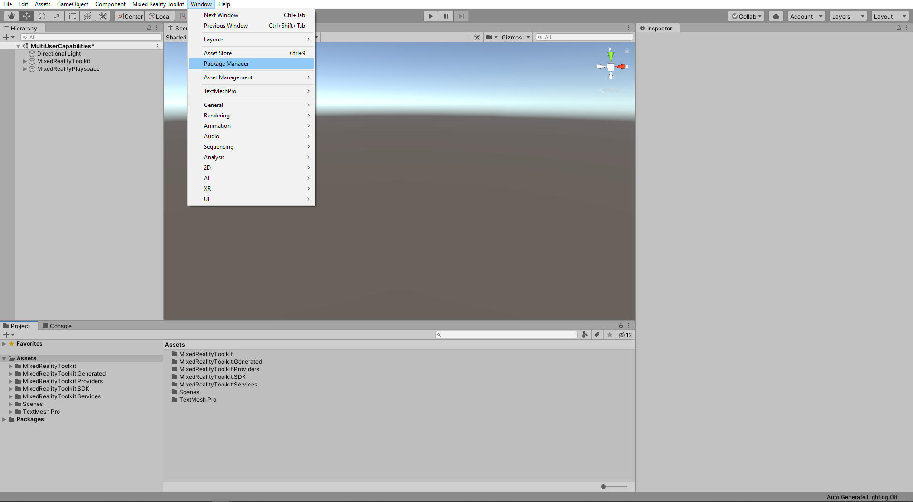

> [!NOTE]
> It might take a few seconds before the AR Foundation package appears in the list.

In the Package Manager window, select **AR Foundation** and install the package by clicking the **Install** button:

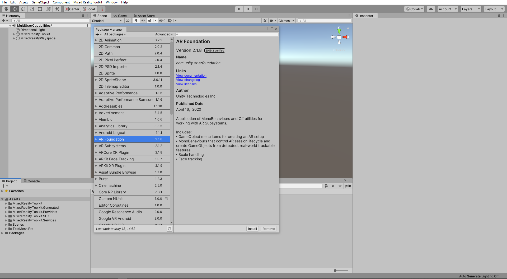

## Importing the tutorial assets

Download and **import** the following Unity custom packages **in the order they are listed**:

* [AzureSpatialAnchors.unitypackage](https://github.com/Azure/azure-spatial-anchors-samples/releases/download/v2.1.1/AzureSpatialAnchors.unitypackage) (version 2.1.1)
* [MRTK.HoloLens2.Unity.Tutorials.Assets.GettingStarted.2.3.0.3.unitypackage](https://github.com/microsoft/MixedRealityLearning/releases/download/getting-started-v2.3.0.3/MRTK.HoloLens2.Unity.Tutorials.Assets.GettingStarted.2.3.0.3.unitypackage)
* [MRTK.HoloLens2.Unity.Tutorials.Assets.AzureSpatialAnchors.2.3.0.1.unitypackage](https://github.com/microsoft/MixedRealityLearning/releases/download/azure-spatial-anchors-v2.3.0.1/MRTK.HoloLens2.Unity.Tutorials.Assets.AzureSpatialAnchors.2.3.0.1.unitypackage)
* [MRTK.HoloLens2.Unity.Tutorials.Assets.MultiUserCapabilities.2.3.0.0.unitypackage](https://github.com/microsoft/MixedRealityLearning/releases/download/multi-user-capabilities-v2.3.0.0/MRTK.HoloLens2.Unity.Tutorials.Assets.MultiUserCapabilities.2.3.0.0.unitypackage)

> [!TIP]
> For a reminder on how to import a Unity custom package, you can refer to the [Import the Mixed Reality Toolkit](mrlearning-base-ch1.md#import-the-mixed-reality-toolkit) instructions.

After you have imported the tutorial assets your Project window should look similar to this:

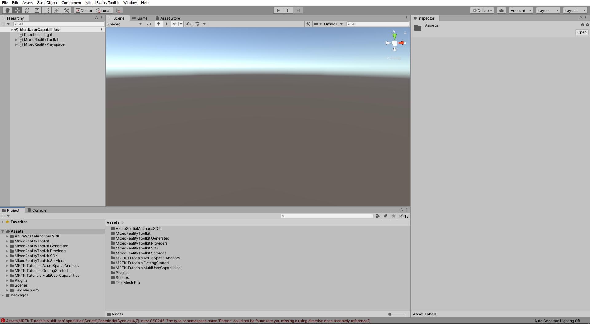

> [!NOTE]
> After importing the MultiUserCapabilities tutorial assets package, you will see several [CS0246](https://docs.microsoft.com/dotnet/csharp/language-reference/compiler-messages/cs0246) errors in the Console window stating that the type or namespace is missing. This is to be expected and will be resolved in the next section when you import the Photon assets.

## Importing the Photon assets

In this section, you will import the Photon Unity Network (PUN) assets from Unity's Asset Store.

In the Unity menu, select **Window** > **Asset Store** to open the Asset Store window, search for and select **PUN 2 - FREE** from Exit Games, and then click the **Download** button to download the asset package to your Unity account:

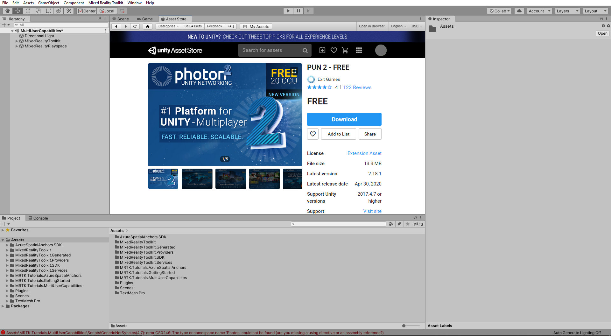

When the download is complete, click the **Import** button to open the Import Unity Package window:

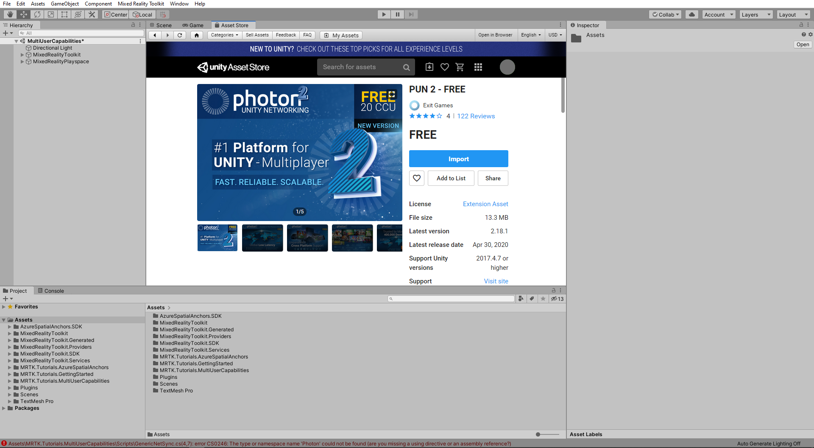

In the Import Unity Package window, click the **All** button to ensure all the assets are selected, then click the **Import** button to import the assets:

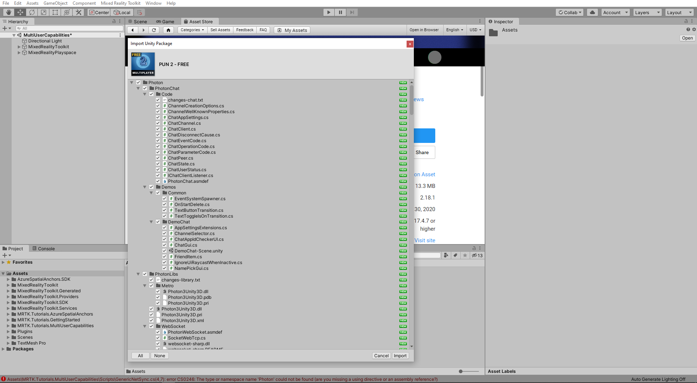

Once Unity has completed the import process, the Pun Wizard window will appear with the PUN Setup menu loaded, you can ignore or close this window for now:

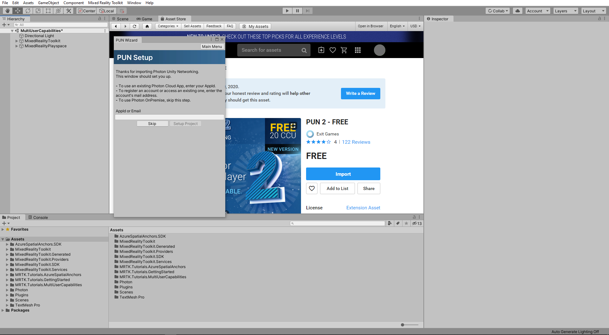

## Setting up Photon

In this section, you will create a Photon account, if you don't already have one, and create a new PUN application.

Navigate to the Photon <a href="https://dashboard.photonengine.com/account/signin" target="_blank">dashboard</a> and sign in if you already have an account you want to use, otherwise, click the **Create One** link and follow the instructions to register a new account:

Once signed in, click the **Create a New App** button:

On the Create a New Application page, enter the following values:

* For Photon Type, select Photon PUN
* For Name, enter a suitable name, for example, _MRTK Tutorials_
* For Description, optionally enter a suitable description
* For Url, leave the field empty

Then click the **Create** button to create the new application:

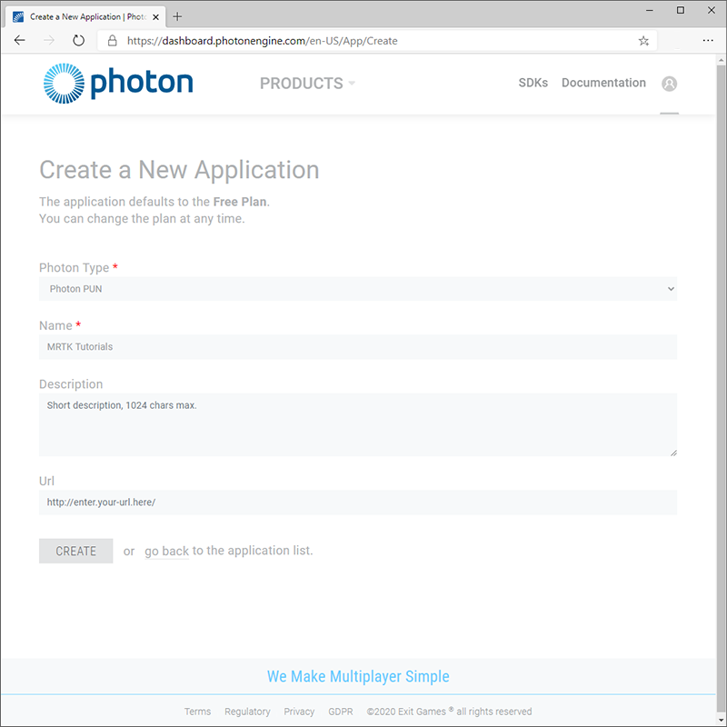

Once Photon has finished the creation process, the new PUN application will appear on your dashboard:

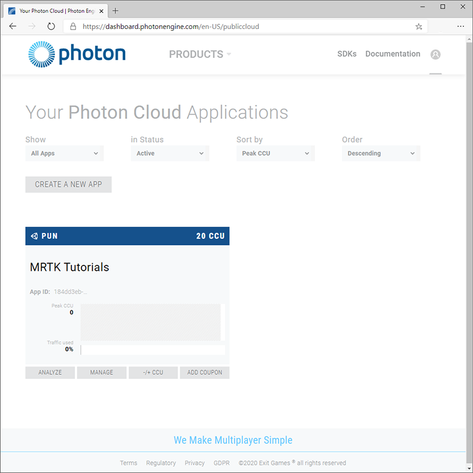

## Connecting the Unity project to the PUN application

In this section, you will connect your Unity project to the PUN application you created in the previous section.

On the Photon dashboard, click the **App ID** field to reveal the app ID, then copy it to your clipboard:

In the Unity menu, select **Window** > **Photon Unity Networking** > **PUN Wizard** to open the Pun Wizard window, click the **Setup Project** button to open the PUN Setup menu, and configure it as follows:

* In the **AppId or Email** field, paste the PUN app ID you copied in the previous step

Then click the **Setup Project** button to apply the app ID:

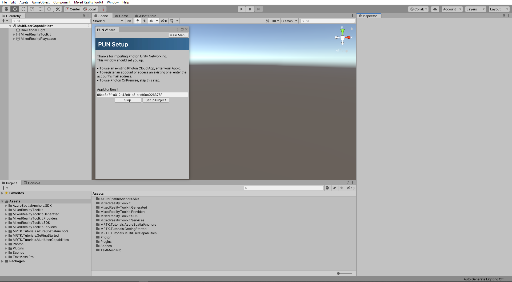

Once Unity has finished the PUN setup process, the PUN Setup menu will display the message **Done!** and automatically select the **PhotonServerSettings** asset in the Project window so its properties are displayed in the Inspector window:

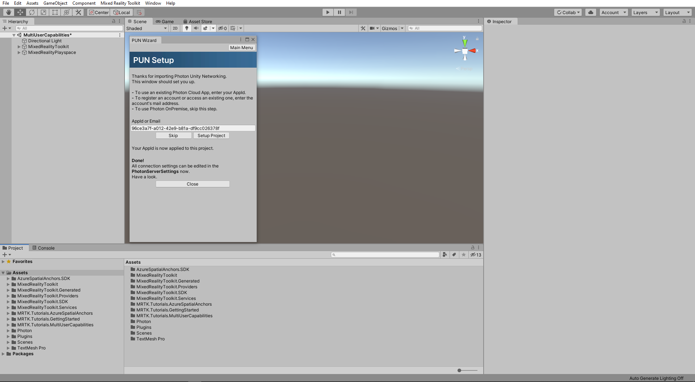

## Congratulations

You have successfully created a Photon PUN application and connected it to your Unity project. Your next step is to allow connections with other users so that multiple users can see each other.

[Next tutorial: 2. Connecting multiple users](mrlearning-sharing(photon)-ch2.md)
