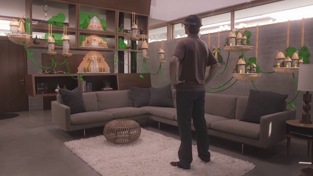

# App views

Windows apps can contain two kinds of views, **immersive views** and **2D views**. Apps can switch between their various immersive views and 2D views, showing their 2D views either on a monitor as a window or in a headset as a slate. Apps that have at least one immersive view are categorized as **mixed reality apps**. Apps that never have a immersive view are **2D apps**.

## Immersive views

An immersive view gives your app the ability to create holograms in the world around you or immerse the user in a virtual environment. When an app is drawing in the immersive view, no other app is drawing at the same time&mdash;holograms from multiple apps are not composited together. By continually adjusting the perspective from which your [app renders](rendering.md) its scene to match the user's head movements, your app can render [world-locked](coordinate-systems.md) holograms that remain at a fixed point in the real world, or it can render a virtual world that holds its position as a user moves within it.

 
*When in an immersive view, holograms can be placed in the world around you*

On [HoloLens](hololens-hardware-details.md), your app renders its holograms on top of the user's real-world surroundings. On a [Windows Mixed Reality immersive headset](immersive-headset-hardware-details.md), the user cannot see the real world, and so your app must render everything the user will see.

The [Windows Mixed Reality home](navigating-the-windows-mixed-reality-home.md) (including the Start menu and holograms you've placed around the environment) does not render while in an immersive view either. On HoloLens, any system notifications that occur while an immersive view is showing will be relayed audibly by Cortana, and the user can respond with voice input.

While in an immersive view, your app is also responsible for handling all input. Input in Windows Mixed Reality is made up of [gaze](gaze-and-commit.md), [gesture](gestures.md) (HoloLens only), [voice](voice-input.md) and [motion controllers](motion-controllers.md) (immersive headsets only).

## 2D views

 
*Multiple apps with a 2D view placed around the Windows Mixed Reality home*

An app with a 2D view appears in the [Windows Mixed Reality home](navigating-the-windows-mixed-reality-home.md) (sometimes called the "shell") as a virtual slate, rendered alongside the app launchers and other holograms the user has placed in their world. The user can adjust this slate to move and scale it, though it remains at a fixed resolution regardless of its size. If your app's first view is a 2D view, your 2D content will fill the same slate used to launch the app.

In a desktop headset, you can run any Universal Windows Platform (UWP) apps that run on your desktop monitor today. These apps are already rendering 2D views today, and their content will automatically appear on a slate in the user's world when launched. 2D UWP apps can target the **Windows.Universal** device family to run on both desktop headsets and on HoloLens as slates.

One key use of 2D views is to show a text entry form that can make use of the system keyboard. Because the shell cannot render on top of an immersive view, the app must switch to a 2D view to show the system keyboard. Apps that want to accept text input can switch to a 2D view with a text box. While that text box has focus, the system will show the system keyboard, allowing the user to enter text.

Note that on a desktop PC, an app can have 2D views on both the desktop monitor and in an attached headset. For example, you can browse Edge on your desktop monitor using its main 2D view to find a 360-degree video. When you play that video, Edge will launch a secondary immersive view inside the headset to display the immersive video content.

## See also

* [App model](app-model.md)
* [Updating 2D UWP apps for mixed reality](building-2d-apps.md)
* [Getting a HolographicSpace](getting-a-holographicspace.md)
* [Navigating the Windows Mixed Reality home](navigating-the-windows-mixed-reality-home.md)
* [Types of mixed reality apps](types-of-mixed-reality-apps.md)
