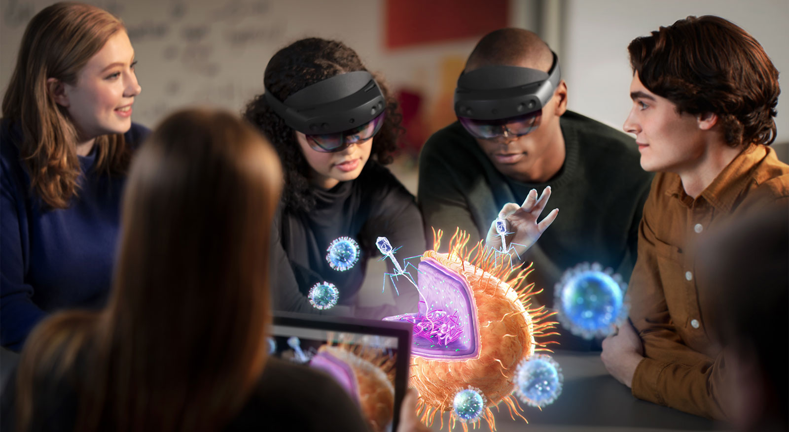
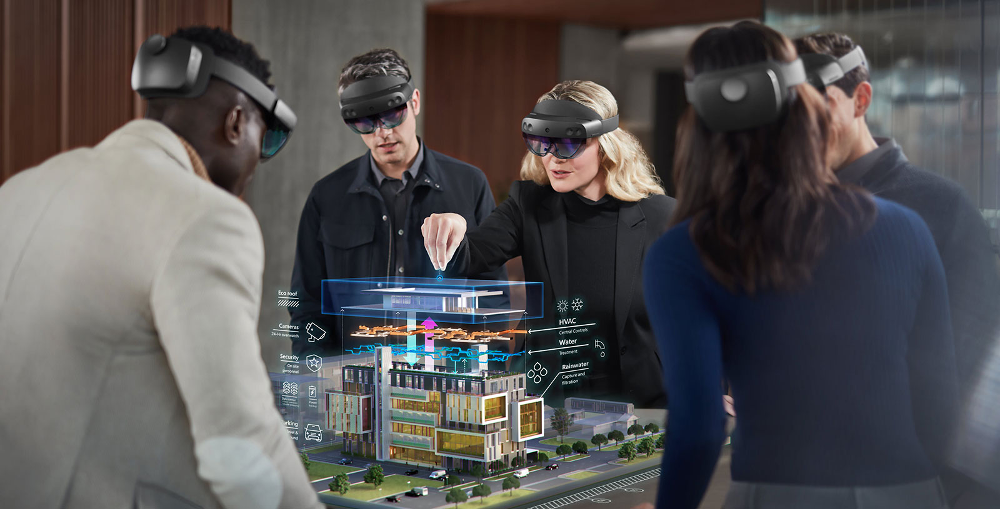

# Azure mixed reality services
Unlock what every human is an expert at—the three-dimensional, physical world around us—with Azure mixed reality services. Help people create, learn, and collaborate more effectively by capturing and surfacing digital information within the context of their work and world. Bring 3D to mobile devices, headsets, and other untethered devices. Using Azure, help ensure that your most sensitive information is protected.

## Multi-user, spatially aware applications using Spatial Anchors

Build multi-user, spatially aware mixed reality applications using Spatial Anchors. Create mixed reality apps that map, designate, and recall precise points of interest that are accessible across HoloLens, iOS, and Android devices. Enable wayfinding across spaces to help your users collaborate more efficiently.

[Try Azure Spatial Anchors](https://docs.microsoft.com/azure/spatial-anchors)

## Interactive, high-quality 3D models using Remote Rendering

In scenarios where every detail matters—industrial plant management, design review for assets like truck engines, pre-operative surgery planning, and more—3D visualization brings that detail to life. It’s what helps designers, engineers, doctors, and students better understand complex information and make the right call.

Today, to run high-quality 3D models on mobile devices and mixed reality headsets, you often need to “decimate” 3D models and simplify them enough to run on target hardware. But this simplification can result in a loss of important detail that’s needed in key business and design decisions.

Bring interactive, high-quality 3D models to untethered devices with every detail intact and no compromise on quality using Azure Remote Rendering Preview.

[Learn more about Azure Remote Rendering](https://azure.microsoft.com/en-us/services/remote-rendering)

## Cognitive Services

:::row:::
    :::column:::
       
    :::column-end:::
    :::column span="2":::
        ### [Speech](https://docs.microsoft.com/azure/cognitive-services/speech-service/)
        Discover how Speech enables the integration of speech processing capabilities into any app or service. Convert spoken language into text or produce natural sounding speech from text using standard (or customizable) voice fonts. Try any service free—and quickly build speech-enabled apps and services with the following capabilities.
    :::column-end:::
:::row-end:::

---

:::row:::
    :::column:::
       
    :::column-end:::
    :::column span="2":::
        ### [Vision](https://docs.microsoft.com/azure/cognitive-services/computer-vision/)
        Recognize, identify, caption, index, and moderate your pictures, videos, and digital ink content.Learn how Vision makes it possible for apps and services to accurately identify and analyze content within images, videos, and digital ink.
    :::column-end:::
:::row-end:::

## See also

* Azure Spatial Anchor tutorials for HoloLens 2 - [1 of 3 Getting started with Azure Spatial Anchors](mrlearning-asa-ch1.md)
* Azure Speech Services tutorials for HoloLens 2 - [1 of 4 Integrating and using speech recognition and transcription](mrlearning-speechSDK-ch1.md)