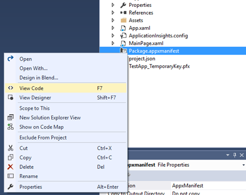
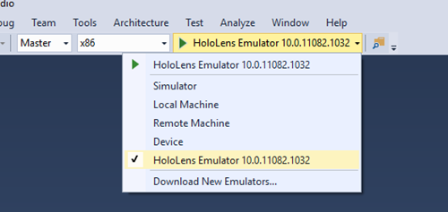
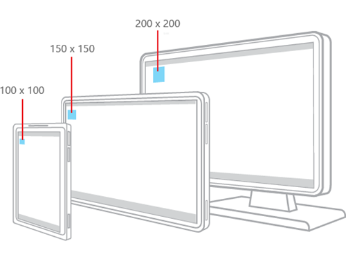

# Updating 2D UWP apps for mixed reality

Windows Mixed Reality enables a user to see holograms as if they are right around you, in your physical or digital world. At its core, both HoloLens and the Desktop PCs you attach immersive headset accessories to are Windows 10 devices; this means that you're able to run almost all of the Universal Windows Platform (UWP) apps in the Store as 2D apps.

## Creating a 2D UWP app for mixed reality

The first step to bringing a 2D app to mixed reality headsets is to get your app running as a standard 2D app on your desktop monitor.

### Building a new 2D UWP app

To build a new 2D app for mixed reality, you simply build a standard 2D Universal Windows Platform (UWP) app. No other app changes are required for that app to then run as a slate in mixed reality.

To get started building a 2D UWP app, check out the [Create your first app](https://docs.microsoft.com/windows/uwp/get-started/your-first-app) article.

### Bringing an existing 2D Store app to UWP

If you already have a 2D Windows app in the Store, you must first ensure it is targeting the Windows 10 Universal Windows Platform (UWP). Here are all the potential starting points you may have with your Store app today:
<br>

|  Starting Point  |  AppX Manifest Platform Target  |  How to make this Universal? | 
|----------|----------|----------|
|  Windows Phone (Silverlight)  |  Silverlight App Manifest |  [Migrate to WinRT](https://msdn.microsoft.com/en-us/library/windows/apps/dn642486(v=vs.105).aspx) | 
|  Windows Phone 8.1 Universal  |  8.1 AppX Manifest that Doesn't Include Platform Target  |  [Migrate your app to the Universal Windows Platform](https://msdn.microsoft.com/en-us/library/mt148501.aspx) | 
|  Windows Store 8  |  8 AppX Manifest that Doesn't Include Platform Target  |  [Migrate your app to the Universal Windows Platform](https://msdn.microsoft.com/en-us/library/mt148501.aspx) | 
|  Windows Store 8.1 Universal  |  8.1 AppX Manifest that Doesn't Include Platform Target  |  [Migrate your app to the Universal Windows Platform](https://msdn.microsoft.com/en-us/library/mt148501.aspx) | 

If you have a 2D Unity app today built as a Win32 app (the "PC, Mac & Linux Standalone" build target), you can target mixed reality by switching Unity to the "Universal Windows Platform" build target instead.

We'll talk about ways that you can restrict your app specifically to HoloLens using the Windows.Holographic device family [below](#publish-and-maintain-your-universal-app).

### Run your 2D app in a Windows Mixed Reality immersive headset

If you've deployed your 2D app to the desktop machine where you are developing and tried it out on your monitor, you're already ready to try it out in an immersive desktop headset!

Just go to the Start menu within the mixed reality headset and launch the app from there. The desktop shell and the holographic shell both share the same set of UWP apps, and so the app should already be present once you've deployed from Visual Studio.

## Targeting both immersive headsets and HoloLens

Congratulations! Your app is now using the Windows 10 Universal Windows Platform (UWP).

Your app is now capable of running on today's Windows devices like Desktop, Mobile, Xbox, Windows Mixed Reality immersive headsets, and HoloLens, as well as future Windows devices. However, to actually target all of those devices, you will need to ensure your app is targeting the Windows.Universal device family.

### Change your device family to Windows.Universal

Now let's jump into your AppX manifest to ensure your Windows 10 UWP app can run on HoloLens:
* Open your app's solution file with **Visual Studio** and navigate to the app package manifest
* Right click the **Package.appxmanifest** file in your Solution and go to **View Code**<br>
  <br>
* Ensure your Target Platform is Windows.Universal in the dependencies section
  ```
  <Dependencies>
    <TargetDeviceFamily Name="Windows.Universal" MinVersion="10.0.10240.0" MaxVersionTested="10.0.10586.0" />
  </Dependencies>
  ```
* Save!

If you do not use Visual Studio for your development environment, you can open **AppXManifest.xml** in the text editor of your choice to ensure you're targeting the **Windows.Universal** *TargetDeviceFamily*.

### Run in the HoloLens Emulator

Now that your UWP app targets "Windows.Universal", let's build your app and run it in the [HoloLens Emulator](using-the-hololens-emulator.md).
* Make sure you have [installed the HoloLens Emulator](install-the-tools.md).
* In Visual Studio, select the **x86** build configuration for your app

  <br>
* Select **HoloLens Emulator** in the deployment target drop-down menu

  <br>
* Select **Debug > Start Debugging** to deploy your app and start debugging.
* The emulator will start and run your app.
* With a keyboard, mouse, and/or an Xbox controller, place your app in the world to launch it.

  <br>

### Next steps

At this point, one of two things can happen:
1. Your app will show its splash and start running after it is placed in the Emulator! Awesome!
2. Or after you see a loading animation for a 2D hologram, loading will stop and you will just see your app at its splash screen. This means that something went wrong and it will take more investigation to understand how to bring your app to life in Mixed Reality.

To get to the bottom of what may be causing your UWP app not to start on HoloLens, you'll have to debug.

### Running your UWP app in the debugger

These steps will walk you through debugging your UWP app using the Visual Studio debugger.
* If you haven't already done so, open your solution in Visual Studio. Change the target to the **HoloLens Emulator** and the build configuration to **x86**.
* Select **Debug > Start Debugging** to deploy your app and start debugging.
* Place the app in the world with your mouse, keyboard, or Xbox controller.
* Visual Studio should now break somewhere in your app code.
  - If your app doesn't immediately crash or break into the debugger because of an unhandled error, then go through a test pass of the core features of your app to make sure everything is running and functional. You may see errors like pictured below (internal exceptions that are being handled). To ensure you don't miss internal errors that impact the experience of your app, run through your automated tests and unit tests to make sure everything behaves as expected.


## Update your UI

Now that your UWP app is running on immersive headsets and/or HoloLens as a 2D hologram, next we'll make sure it looks beautiful. Here are some things to consider:
* Windows Mixed Reality will run all 2D apps at a fixed resolution and DPI that equates to 853x480 effective pixels. Consider if your design needs refinement at this scale and review the design guidance below to improve your experience on HoloLens and immersive headsets.
* Windows Mixed Reality [does not support](app-model.md) 2D live tiles. If your core functionality is showing information on a live tile, consider moving that information back into your app or explore [3D app launchers](3d-app-launcher-design-guidance.md).

### 2D app view resolution and scale factor



Windows 10 moves all visual design from real screen pixels to **effective pixels**. That means, developers design their UI following the Windows 10 Human Interface Guidelines for effective pixels, and Windows scaling ensures those effective pixels are the right size for usability across devices, resolutions, DPI, etc. See this [great read on MSDN](https://msdn.microsoft.com/library/windows/apps/Dn958435.aspx) to learn more as well as this [BUILD presentation](http://video.ch9.ms/sessions/build/2015/2-63_Build_2015_Windows_Scaling.pptx).

Even with the unique ability to place apps in your world at a range of distances, TV-like viewing distances are recommended to produce the best readability and interaction with gaze/gesture. Because of that, a virtual slate in the Mixed Reality Home will display your flat UWP view at:

**1280x720, 150%DPI** (853x480 effective pixels)

This resolution has several advantages:
* This effective pixel layout will have about the same information density as a tablet or small desktop.
* It matches the fixed DPI and effective pixels for UWP apps running on Xbox One, enabling seamless experiences across devices.
* This size looks good when scaled across our range of operating distances for apps in the world.

### 2D app view interface design best practices

**Do:**
* Follow the [Windows 10 Human Interface Guidelines (HIG)](https://dev.windows.com/en-us/design) for styles, font sizes and button sizes. HoloLens will do the work to ensure your app will have compatible app patterns, readable text sizes, and appropriate hit target sizing.
* Ensure your UI follows best practices for [responsive design](https://msdn.microsoft.com/en-us/library/windows/apps/dn958435.aspx) to look best at HoloLen's unique resolution and DPI.
* Use the "light" color theme recommendations from Windows.

**Don't:**
* Change your UI too drastically when in mixed reality, to ensure users have a familiar experience in and out of the headset.

### Understand the app model

The [app model](app-model.md) for mixed reality is designed to use the Mixed Reality Home, where many apps live together. Think of this as the mixed reality equivalent of the desktop, where you run many 2D apps at once. This has implications on app life cycle, Tiles, and other key features of your app.

### App bar and back button

2D views are decorated with a app bar above their content. The app bar has two points of app-specific personalization:

**Title:** displays the *displayname* of the Tile associated with the app instance

**Back Button:** raises the *[BackRequested](https://msdn.microsoft.com/en-us/library/windows/apps/windows.ui.core.systemnavigationmanager.backrequested.aspx)* event when pressed. Back Button visibility is controlled by *[SystemNavigationManager.AppViewBackButtonVisibility](https://msdn.microsoft.com/en-us/library/windows/apps/windows.ui.core.systemnavigationmanager.aspx)*.

<br>
*App bar UI in 2D app view*

### Test your 2D app's design

It is important to test your app to make sure the text is readable, the buttons are targetable, and the overall app looks correct. You can [test](testing-your-app-on-hololens.md) on a desktop headset, a HoloLens, an emulator, or a touch device with resolution set to 1280x720 @150%.

## New input possibilities

HoloLens uses advanced depth sensors to see the world and see users. This enables advanced hand gestures like [bloom](gestures.md#bloom) and [air-tap](gestures.md#air-tap). Powerful microphones also enable [voice experiences](voice-input.md).

With Desktop headsets, users can use motion controllers to point at apps and take action. They can also use a gamepad, targeting objects with their gaze.

Windows takes care of all of this complexity for UWP apps, translating your [gaze](gaze.md), gestures, voice and motion controller input to [pointer events](https://msdn.microsoft.com/en-us/library/windows/apps/mt404610#pointer_events) that abstract away the input mechanism. For example, a user may have done an air-tap with their hand or pulled the Select trigger on a motion controller, but 2D applications don't need to know where the input came from - they just see a 2D touch press, as if on a touchscreen.

Here are the high level concepts/scenarios you should understand for input when bringing your UWP app to HoloLens:
* [Gaze](gaze.md) turns into hover events, which can unexpectedly trigger menus, flyouts or other user interface elements to pop up just by gazing around your app.
* Gaze is not as precise as mouse input. Use appropriately sized hit targets for HoloLens, similar to touch-friendly mobile applications. Small elements near the edges of the app are especially hard to interact with.
* Users must switch input modes to go from scrolling to dragging to two finger panning. If your app was designed for touch input, consider ensuring that no major functionality is locked behind two finger panning. If so, consider having alternative input mechanisms like buttons that can initiate two finger panning. For example, the Maps app can zoom with two finger panning but has a plus, minus, and rotate button to simulate the same zoom interactions with single clicks.

[Voice input](voice-input.md) is a critical part of the mixed reality experience. We've enabled all of the speech APIs that are in Windows 10 powering Cortana when using a headset.

## Publish and Maintain your Universal app

Once your app is up and running, package your app to [submit it to the Microsoft Store](submitting-an-app-to-the-microsoft-store.md).

## See also
* [App model](app-model.md)
* [Gaze](gaze.md)
* [Gesture](gestures.md)
* [Motion controllers](motion-controllers.md)
* [Voice](voice-input.md)
* [Submitting an app to the Microsoft Store](submitting-an-app-to-the-microsoft-store.md)
* [Using the HoloLens emulator](using-the-hololens-emulator.md)
