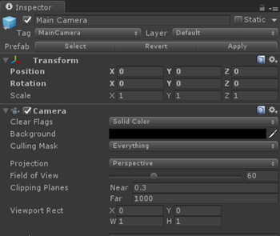

---
title: Camera in Unity
description: 
author: 
ms.author: neerajw
ms.date: 2/28/2018
ms.topic: article
keywords: 
---

# Camera in Unity

When you wear a mixed reality headset, it becomes the center of your holographic world. The Unity [Camera](http://docs.unity3d.com/Manual/class-Camera.html) component will automatically handle stereoscopic rendering and will follow your head movement and rotation when your project has "Virtual Reality Supported" selected with "Windows Mixed Reality" as the device (in the Other Settings section of the Windows Store Player Settings). This may be listed as "Windows Holographic" in some versions of Unity.

However, the following settings should be manually applied to the cameras in your app to optimize it for your holographic experience:
* Mixed Reality Rendering
* Positioning the Camera
* Clip Planes

Note: These settings need to be applied to the Camera in each scene of your app.

By default, when you create a new scene in Unity, it will contain a Main Camera GameObject in the Hierarchy which includes the Camera component but does not have the above settings properly applied.

## Holographic rendering

The default settings on the Unity Camera component are for traditional 3D applications which need a skybox-like background as they don't have a real world.
* When running on an **immersive headset**, you are rendering everything the user sees, and so you'll likely want to keep the skybox.
* However, when running on a **holographic headset** like HoloLens, the real world should appear behind everything the camera renders. To do this, set the camera background to be transparent (in HoloLens, black renders as transparent) instead of a Skybox texture:
1. Select the Main Camera in the Hierarchy panel
2. In the Inspector panel, find the Camera component and change the Clear Flags dropdown from Skybox to Solid Color
3. Select the Background color picker and change the RGBA values to (0, 0, 0, 0)

You can use script code to determine at runtime whether the headset is immersive or holographic by checking **HolographicSettings.IsDisplayOpaque**.

## Positioning the Camera

It will be easier to lay out your app if you imagine the starting position of the user as (X: 0, Y: 0, Z: 0). Since the Main Camera is tracking movement of the user's head, the starting position of the user can be set by setting the starting position of the Main Camera.
1. Select Main Camera in the Hierarchy panel
2. In the Inspector panel, find the Transform component and change the Position from (X: 0, Y: 1, Z: -10) to (X: 0, Y: 0, Z: 0)

## Clip planes

Rendering content too close to the user can be uncomfortable in mixed reality. You can adjust the [near and far clip planes](hologram-stability.md#hologram-render-distances) on the Camera component.
1. Select the Main Camera in the Hierarchy panel
2. In the Inspector panel, find the Camera component Clipping Planes and change the Near textbox from 0.3 to .85. Content rendered even closer can lead to user discomfort and should be avoided per the [render distance guidelines](hologram-stability.md#hologram-render-distances).

## Multiple Cameras

When there are multiple Camera components in the scene, Unity knows which camera to use for stereoscopic rendering and head tracking by checking which GameObject has the MainCamera tag.

## Recentering a seated experience

If you're building a [seated-scale experience](coordinate-systems.md), you can recenter Unity's world origin at the user's current head position by calling the **[VR.InputTracking.Recenter](https://docs.unity3d.com/ScriptReference/VR.InputTracking.Recenter.html)** method.

## See also
* [Hologram stability](hologram-stability.md)
* [MixedRealityToolkit Main Camera.prefab](https://github.com/Microsoft/MixedRealityToolkit-Unity/tree/master/Assets/HoloToolkit/Input/Prefabs)