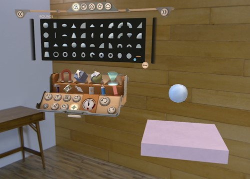
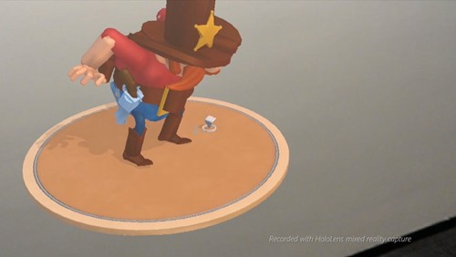
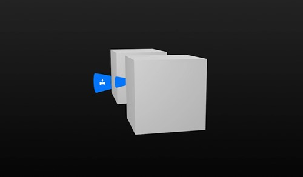

---
title: Case study - 3 HoloStudio UI and interaction design learnings
description: 
author: 
ms.author: randyw
ms.date: 2/28/2018
ms.topic: article
keywords: 
---

# Case study - 3 HoloStudio UI and interaction design learnings

[HoloStudio](https://www.microsoft.com/microsoft-hololens/en-us/apps/holostudio) was one of the first Microsoft apps for HoloLens. Because of this, we had to create new best practices for 3D UI and interaction design. We did this through a lot of user testing, prototyping, and trial and error.

We know that not everyone has the resources at their disposal to do this type of research, so we had our Sr. Holographic Designer, Marcus Ghaly, share three things we learned during the development of HoloStudio about UI and interaction design for HoloLens apps.

## Watch the video

[!VIDEO https://www.youtube.com/embed/sX6yKHmN1qM]

## Problem #1: People didn't want to move around their creations

We originally designed the workbench in HoloStudio as a rectangle, much like you'd find in the real world. The problem is that people have a lifetime of experience that tells them to stay still when they're sitting at a desk or working in front of a computer, so they weren't moving around the workbench and exploring their 3D creation from all sides.

We had the insight to make the workbench round, so that there was no "front" or clear place that you were supposed to stand. When we tested this, suddenly people started moving around and exploring their creations on their own.

**What we learned**

Always be thinking about what's comfortable for the user. Taking advantage of their physical space is a cool feature of HoloLens and something you can't do with other devices.

## Problem #2: Modal dialogs are sometimes out of the holographic frame

Sometimes, your user may be looking in a different direction from something that needs their attention in your app. On a PC, you can just pop up a dialog, but if you do this in someone's face in a 3D environment, it can feel like the dialog is getting in their way. You need them to read the message, but their instinct is to try to get away from it. This reaction is great if you're playing a game, but in a tool designed for work, it's less than ideal.

After trying a few different things, we finally settled on using a "thought bubble" system for our dialogs and added tendrils that users can follow to where their attention is needed in our application. We also made the tendrils pulse, which implied a sense of directionality so that users knew where to go.

**What we learned**

It's much harder in 3D to alert users to things they need to pay attention to. Using attention directors such as [spatial sound](spatial-sound.md), light rays, or thought bubbles, can lead users to where they need to be.

## Problem #3: Sometimes UI can get blocked by other holograms

There are times when a user wants to interact with a hologram and its associated UI controls, but they are blocked from view because another hologram is in front of them. While we were developing HoloStudio, we used trial and error to come to a solution for this.

We tried moving the UI control closer to the user so it couldn't get blocked, but found that it wasn't comfortable for the user to look at a control that was near to you while simultaneously looking at a hologram that was far away. If, however, we moved the control in front of the closest hologram to the user, they felt like it was detached from the hologram it should be affecting.

We finally ended up ghosting the UI control, and put it at the same distance from the user as the hologram it's associated with, so they both feel connected. This allows the user to interact with the control even though it's been obscured.

**What we learned**

Users need to be able to easily access UI controls even if they've been blocked, so figure out methods to ensure that users can complete their tasks no matter where their holograms are in the real world.

## About the author

<table style="border:0;width:800px">
<tr>
<td style="border:0"> </td><td style="border:0"> <b>Marcus Ghaly</b> is a Sr. Holographic Designer working on everything from holographic UI, to 3D user input, 2D design, and volumetric interactions. He received his Bachelor of Arts from the University of Washington and spent nearly a decade in the games industry working as a character artist, technical artist, and environment co-lead. He received his Master’s degree in design while in Sweden and has been a holographic designer and researcher ever since.</td>
</tr>
</table>

## See also
* [Interaction fundamentals](interaction-fundamentals.md)
* [Case studies](category/case-studies.md)

 