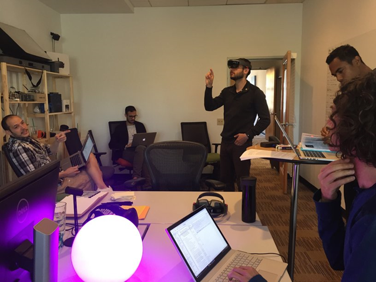
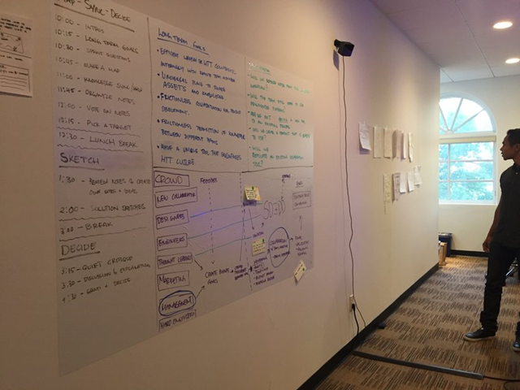
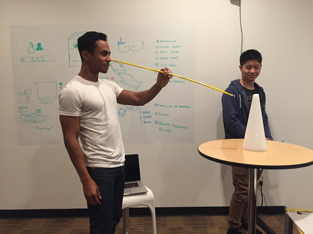

# Case study - AfterNow's process - envisioning, prototyping, building

At [AfterNow](https://www.afternow.io/), we work with you to turn your ideas and aspirations into concrete, fully operational products and experiences ready for the market. But before we write a single line of code, we create a blueprint through a process called envisioning.

## What is Envisioning?

Envisioning is an ideation process used for product design. We streamline a large pool of ideas into one -- or a few -- calculated, realistic concepts to execute.

This process will bring to light many problems and blockers that would have eventually come up in the product. Failing early and fast ultimately saves a lot of time and money.

Throughout this process, we'll provide you with notes on the group’s ideas and findings. When we're done, you'll receive a document of a script and a video of our "act it out" step, a simulation of the proposed product in action. These are concrete blueprints to your product -- a framework you can keep. Ideally, the next step is for us to build the product, which lets us test and experience the real deal.

Here's a daily play-by-play of the process, how long each step takes, and who you'll need on your team.

## Envisioning participants

It's important to select the right participants for this process. The number can vary, but we recommend keeping it under seven people for the sake of efficiency.

**Decider (critical)**- The Decider is an important person to have in the group. He or she is the one who will be making the final decision or tipping the scale if there is an indecision during the process (typically the CEO, founder, product manager, or head of design). If they aren’t able to participate for the entire process, appoint someone most fit to take on the role.

**Finance (optional)**- Someone who can explain how the project is funded.

**Marketing (optional)**- Someone who crafts the company’s messages.

**Customer (important)**- Someone who talks to customers frequently and can be their advocate.

**Tech/logistics (important)**- Someone who understands what the company can build and deliver.

**Design (important)**- Someone who designs the product your company makes.

## DAY 1 - Map

**List goals & constraints; set a long-term goal - 5 min**

If we were being completely optimistic, what is our long-term goal? Why are we building this solution in mixed reality and what problems are we trying to solve?

**List sprint questions - 5 min**

Get a bit pragmatic and list out fears in question format. How could we fail? To meet the long-term goal, what has to be true? If the project failed, what may have caused that?

**Make a flow map - Up to 1 hour**

This is a rough, functional map (not detailed). We write all of the user types on the left and the endings on the right. Then we connect them in the middle with words and arrows showing how users interact with the product. This is done in 5-15 steps.

**Interview experts & take notes**

The goal of this exercise is to enhance our collective understanding of the problem. Here we can add things to the map and fix any mistakes on it. If part of the flow can be expanded in more detail, we talk to the expert.

Our best practice for this process happens when we take individual notes in How might we (HMW) format. HMW is a technique developed by P&G in the 70s. It's a method of note taking in the form of a question which ultimately results in organized and prioritized notes. We will jot down one idea per sticky note which starts with the phrase, "How might we." For example, how might we communicate the values of [your company] in mixed reality?

**Organize HMW notes**

We take all the "How might we" notes and stick them onto a wall. We will then categorize them into noticeable themes as they emerge.

**Vote on HMW notes**

Once all the notes are in their appropriate categories, we will vote on our favorite questions. Everyone gets two votes; the Decider gets four votes.

**Pick a target**

Circle the most important customer and one target moment on the map and look over the initial questions for the sprint. The Decider has the task of making the call.

## DAY 2 - Sketch

**Existing product demos**

Everyone in the sprint group will research existing products they like that solve similar problems to the ones we’re tackling. We'll then demo our findings to the rest of the group. This gives us a good idea of the features we find interesting.

**Notes**

We spend 20 minutes silently walking around the room to gather notes.

**Ideas**

We spend 20 minutes privately jotting down some rough ideas.

**Crazy 8s**

We spend eight minutes creating eight frames. This is where we rapidly sketch a variation of one of our best ideas in each frame.

**Solution**
We spend 30 minutes sketching storyboards. We take the best variations of ideas from Crazy 8s and create a three-panel storyboard of the idea.

## DAY 3 - Decide

This day involves a lot of critiquing and voting. Here's the breakdown:

**Quiet critiquing**

We tape solutions onto the wall and take time to look at them silently. After everyone has gotten time to look at all the sketches, we will collectively create a heat map. Each person puts marks on the sketches they like. This can be the entire flow or an area of a flow.

**Discussion & explanations**

We will begin to see a heat map of ideas people find interesting, and spend three minutes on each sketch that got the most attention. People can openly discuss why they like certain sketches and the artist can correctly convey their ideas when there is a misunderstanding. This can surface new ideas at times.

In this step we also want to give people opportunities to explain ideas that didn’t get a lot of attention. Sometimes you'll find a gem in an idea people didn't really understand previously.

**Straw poll & supervote**

Each person will silently choose their favorite idea and, when ready, people will place a mark on their favorite one all at once. The Decider will then get three large dots for the idea he/she liked the most. The ones marked by the Decider are the ideas that are going to be prototyped.

## DAY 4 - Prototype

**Preparation**

In preparation for the prototyping phase, we will gather an assortment of physical tools -- much like a child’s play kit -- to construct 3D objects that will represent holograms. We will also have physical tools that represent the hardware devices people are using to access these holograms.

***Prototype!***

**Prepare a script**

Script out the entire user flow for this prototype and decide on the actors that will be playing a part in the skit.

**Act it out**

Physically act out the user flow which involves all the user parties in the order they will be using it. This gives us a good idea of how viable this product will be when we build it out. It will also bring to light some major kinks we may have overlooked when coming up with the idea.

## About the author

<table style="border:0;width:800px">
<tr>
<td style="border:0"> </td>
 <td style="border:0"><b>Rafai Eddy</b> AfterNow</td>
</tr>
</table>
