# Case study - Building HoloSketch, a spatial layout and UX sketching app for HoloLens

HoloSketch is an on-device spatial layout and UX sketching tool for HoloLens to help build holographic experiences. HoloSketch works with a paired Bluetooth keyboard and mouse as well as gesture and voice commands. The purpose of HoloSketch is to provide a simple UX layout tool for quick visualization and iteration.

 
*HoloSketch: spatial layout and UX sketching app for HoloLens*

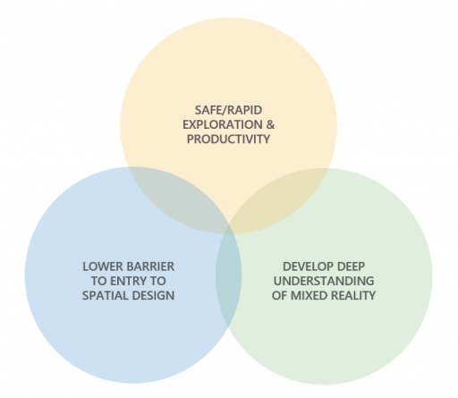 
*A simple UX layout tool for quick visualization and iteration*

## Features

### Primitives for quick studies and scale-prototyping

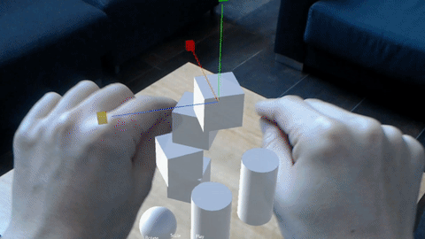

Use primitive shapes for quick massing studies and scale-prototyping.

### Import objects through OneDrive

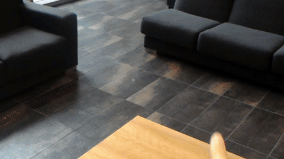

Import PNG/JPG images or 3D FBX objects(requires packaging in Unity) into the mixed reality space through OneDrive.

### Manipulate objects

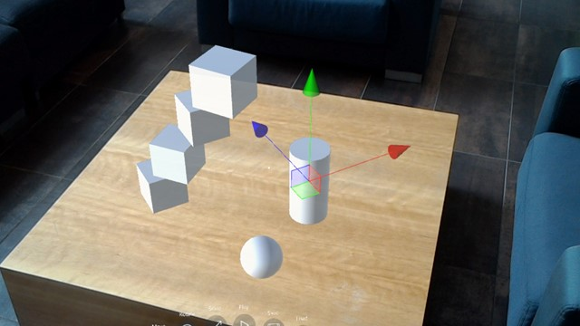

Manipulate objects (move/rotate/scale) with a familiar 3D object interface.

### Bluetooth, mouse/keyboard, gestures and voice commands

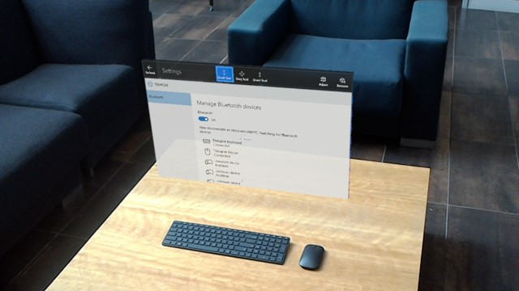

HoloSketch supports Bluetooth mouse/keyboard, gestures and voice commands.

## Background

### Importance of experiencing your design in the device

When you design something for HoloLens, it is important to experience your design in the device. One of the biggest challenges in mixed reality app design is that it is hard to get the sense of scale, position and depth, especially through traditional 2D sketches.

### Cost of 2D based communication

To effectively communicate UX flows and scenarios to others, a designer may end up spending a lot of time creating assets using traditional 2D tools such as Illustrator, Photoshop and PowerPoint. These 2D designs often require additional effort to convert them it into 3D. Some ideas are lost in this translation from 2D to 3D.

### Complex deployment process

Since mixed reality is a new canvas for us, it involves a lot of design iteration and trial and error by its nature. For designer who are not familiar with tools such as Unity and Visual Studio, it is not easy to put something together in HoloLens. Typically you have to go through the process below to see your 2D/3D artwork in the device. This was a big barrier for designers iterating on ideas and scenarios quickly.

 
*Deployment process*

### Simplified process with HoloSketch

With HoloSketch, we wanted to simplify this process without involving development tools and device portal pairing. Using OneDrive, users can easily put 2D/3D assets into HoloLens.

 
*Simplified process with HoloSketch*

### Encouraging three-dimensional design thinking and solutions

We thought this tool would give designers an opportunity to explore solutions in a truly three-dimensional space and not be stuck in 2D. They don’t have to think about creating a 3D background for their UI since the background is the real world in the case of Hololens. HoloSketch opens up a way for designers to easily explore 3D design on Hololens.

## Get Started

### How to import 2D images (JPG/PNG) into HoloSketch

* Upload JPG/PNG images to your OneDrive folder ‘Documents/HoloSketch’.
* From the OneDrive menu in HoloSketch, you will be able to select and place the image in the environment.

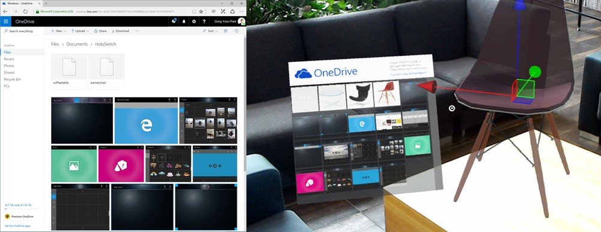 
*Importing images and 3D objects through OneDrive*

### How to import 3D objects into HoloSketch

Before uploading to your OneDrive folder, please follow the steps below to package your 3D objects into a Unity asset bundle. Using this process you can import your FBX/OBJ files from 3D software such as Maya, Cinema 4D and Microsoft Paint 3D.

>[!IMPORTANT]
>Currently, asset bundle creation is supported with Unity version 5.4.5f1.

1. Download and open the Unity project ['AssetBunlder_Unity'](https://github.com/Microsoft/MRDesignLabs/tree/master/ReleasedApps/HoloSketch/AssetBundler_Unity). This Unity project includes the script for the bundle asset generation.
2. Create a new GameObject.
3. Name the GameObject based on the contents.
4. In the Inspector panel, click ‘Add Component’ and add ‘Box Collider’. 

   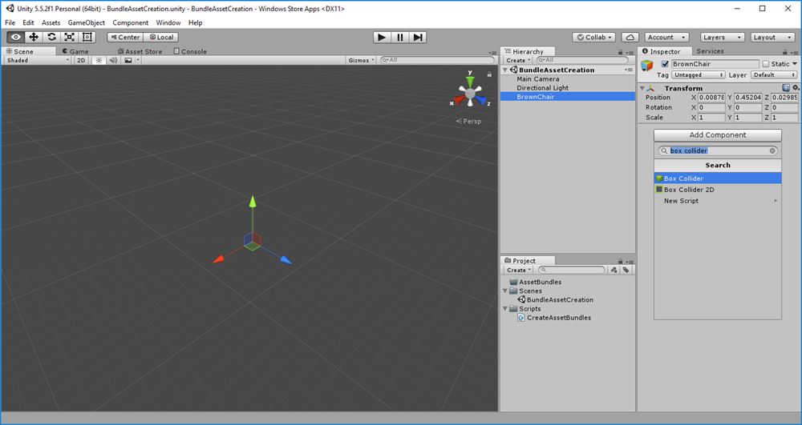
   
   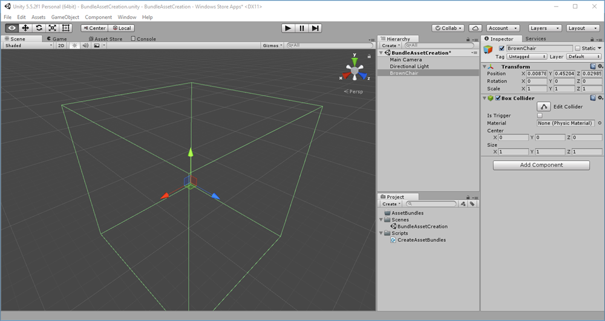

5. Import the 3D FBX file by dragging it into the project panel.
6. Drag the object into the Hierarchy panel **under your new GameObject**.

   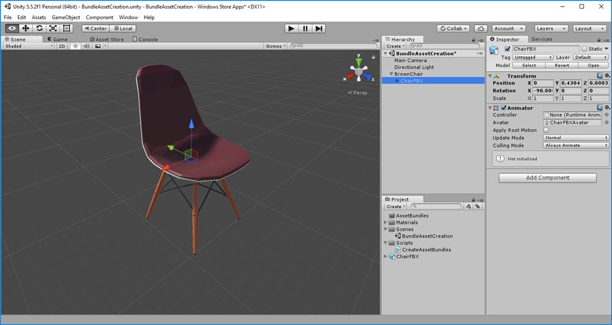

7. Adjust the collider dimension if it does not match the object. Rotate the object to face **Z-axis**.

   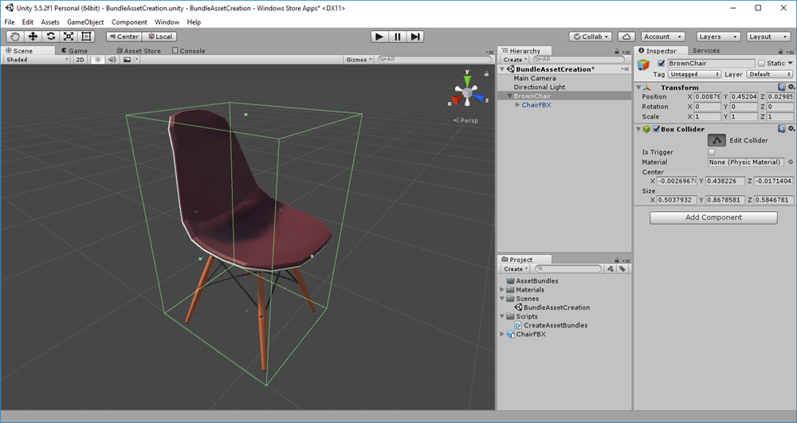

8. Drag the object from the Hierarchy panel to the Project panel to **make it prefab**.
9. On the bottom of the inspector panel, click the dropdown, create and assign a new unique name. Below example shows adding and assigning 'brownchair' for the AssetBundle Name. 

   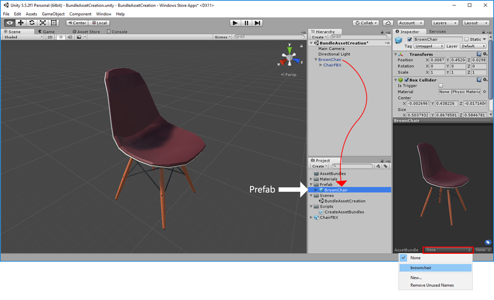

10. Prepare a thumbnail image for the model object. 
   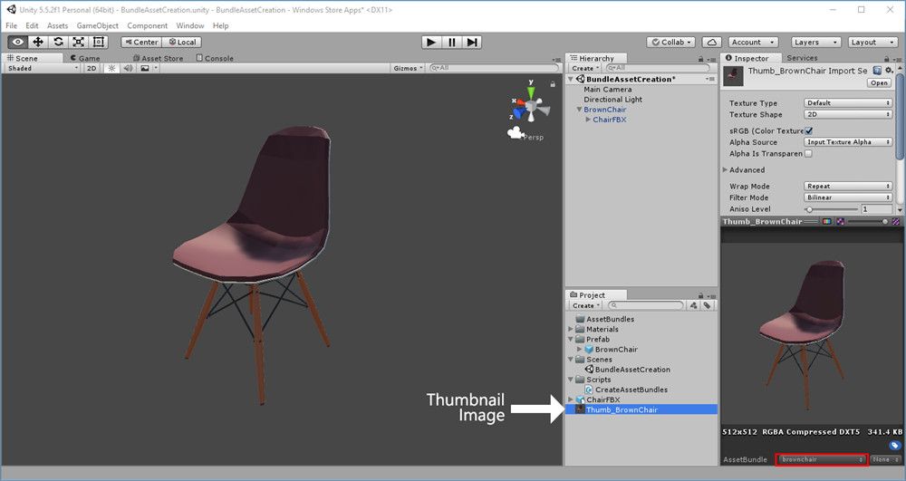

11. Create a folder named ‘Assetbundles’ under the Unity project’s ‘Asset’ folder.

12. From the Assets menu, select ‘Build AssetBundles’ to generate file. 
   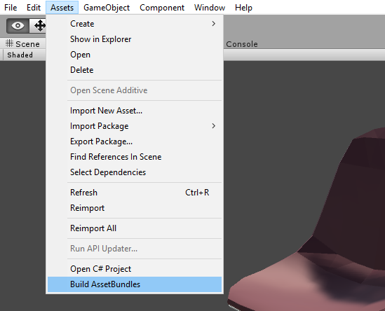

13. **Upload the generated file to the /Files/Documents/HoloSketch folder on OneDrive.** Upload the asset_unique_name file only. You don’t need to upload manifest files or AssetBundles file.  

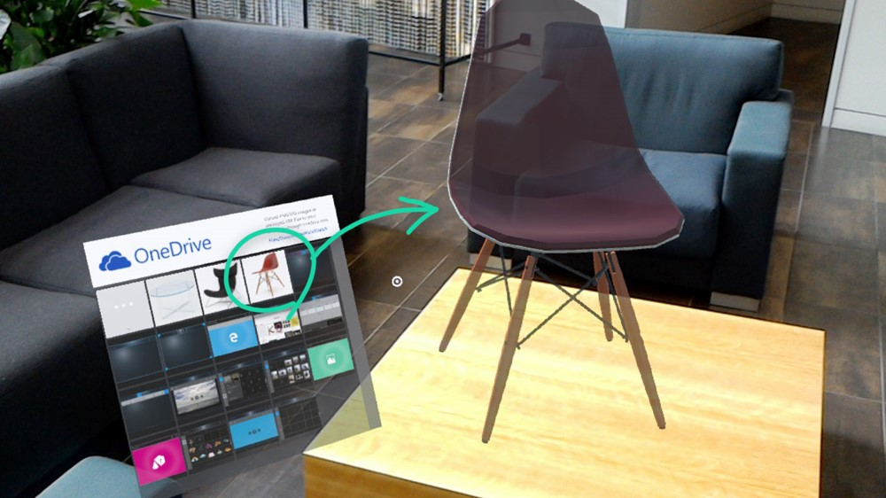

## How to manipulate the objects

HoloSketch supports the traditional interface that is widely used in 3D software. You can use move, rotate, scale the objects with gestures and a mouse. You can quickly switch between different modes with voice or keyboard.

### Object manipulation modes

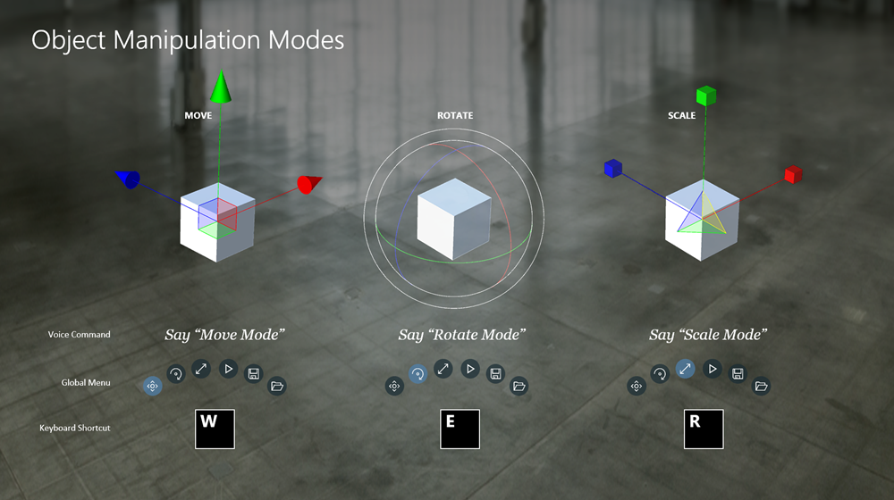 
*How to manipulate the objects*

### Contextual and Tool Belt menus

**Using the Contextual Menu**

Double air tap to open the Contextual Menu. 

Menu items:
* **Layout Surface:** This is a 3D grid system where you can layout multiple objects and manage them as a group. Double air-tap on the Layout Surface to add objects to it.
* **Primitives:** Use cubes, spheres, cylinders and cones for massing studies.
* **OneDrive:** Open the OneDrive menu to import objects.
* **Help:** Displays help screen.

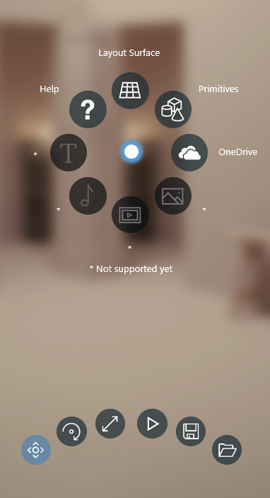 
*Contextual menu*

**Using the Tool Belt Menu**

Move, Rotate, Scale, Save, and Load Scene are available from the Tool Belt Menu. 

## Using keyboard, gestures and voice commands

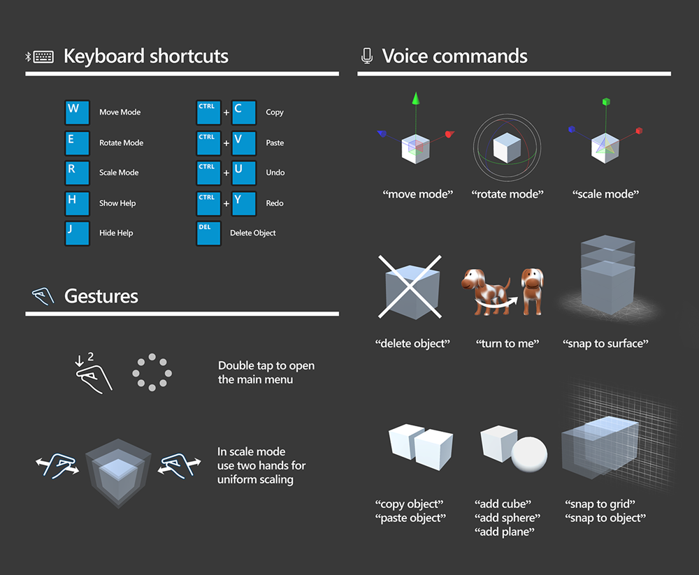 
*Keyboard, gestures, and voice commands*

## Download the app

<table style="border-collapse:collapse">
<tr>
<td style="border-style: none" width="60px">
</td>
<td style="border-style: none"><a href="https://www.microsoft.com/en-us/store/p/holosketch/9p3br4t5m4tv">Download and install the HoloSketch app for free from the Microsoft Store</a>
</td>
</tr>
</table>

## Known issues
* Currently asset bundle creation is supported with **Unity version 5.4.5f1.**
* Depending on the amount of data in your OneDrive, the app might appear as if it has stopped while loading OneDrive contents
* Currently, Save and Load feature only supports primitive objects
* Text, Sound, Video and Photo menus are disabled on the contextual menu
* The Play button on the Tool Belt menu clears the manipulation gizmos

## Sharing your sketches

You can use the video recording feature in HoloLens by saying 'Hey Cortana, Start/Stop recording'. Press the volume up/down key together to take a picture of your sketch.

## About the authors

<table style="border-collapse:collapse">
<tr>
<td style="border-style: none" width="60px"></td>
<td style="border-style: none"><b>Dong Yoon Park</b> UX Designer @Microsoft</td>
</tr>
<tr>
<td style="border-style: none" width="60px"></td>
<td style="border-style: none"><b>Patrick Sebring</b> Developer @Microsoft</td>
</tr>
</table> 
