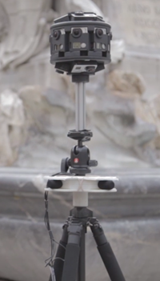
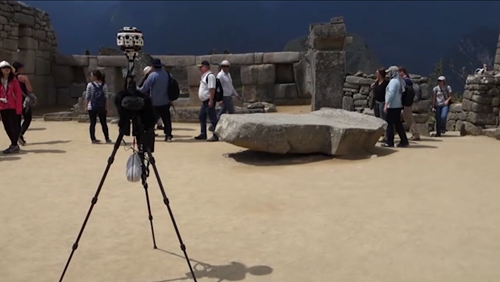
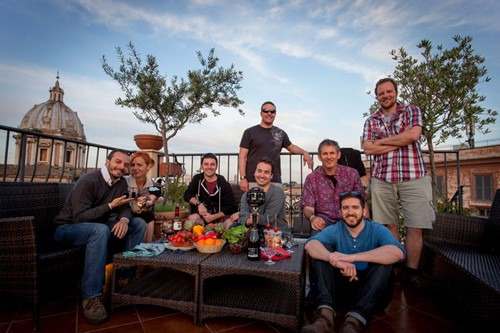
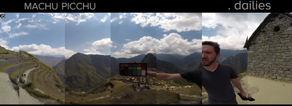
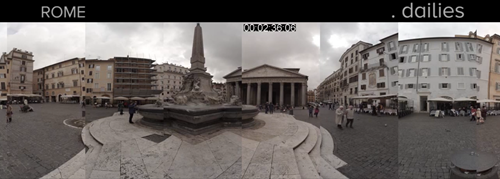
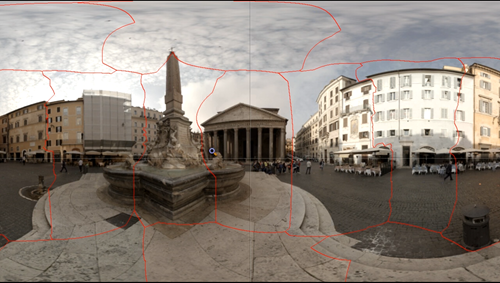
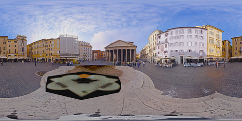
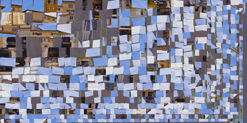
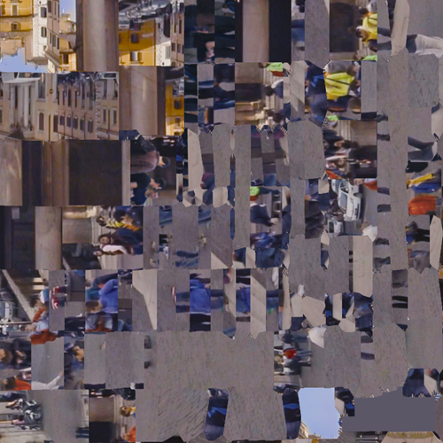
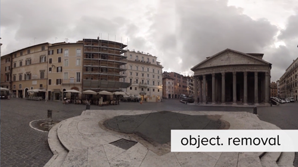

# Case study - Capturing and creating content for HoloTour

HoloTour for Microsoft HoloLens provides immersive 3D personal tours of iconic locations around the world. As the designers, artists, producers, audio designers, and developers working on this project found out, creating a convincingly real 3D rendering of a well-known location takes a unique blend of creative and technological wizardry.

## The tech

With HoloTour, we wanted to make it possible for people to visit some of the world’s most amazing destinations—like the [ruins of Machu Picchu](https://en.wikipedia.org/wiki/Machu_Picchu) in Peru or the modern day [Piazza Navona](https://en.wikipedia.org/wiki/Piazza_Navona) in Italy—right from their own living rooms. Our team made it the goal of HoloTour to “make you feel like you’re really there.” The experience needed to be more than just pictures or videos. By leveraging the unique display, tracking, and audio technology of HoloLens we believed we could virtually transport you to another place. We would need to capture the sights, sounds, and three-dimensional geometry of every location we visited and then recreate that within our app.

In order to do this, we needed a 360° camera rig with directional audio capture. It needed to capture at extremely high resolution, so that the footage would look crisp when played back on a HoloLens and the cameras would need to be positioned close together in order to minimize stitching artifacts. We wanted full spherical coverage, not just along the horizon, but above and below you as well. The rig also needed to be portable so that we could take it all over the world. We evaluated available off-the-shelf options and realized they simply weren’t good enough to realize our vision – either because of resolution, cost, or size. If we couldn’t find a camera rig that satisfied our needs, we would have to build one ourselves.

### Building the rig

The first version—made from cardboard, Velcro, duct tape, and 14 GoPro cameras—was something MacGyver would have been proud of. After reviewing everything from low-end solutions to custom manufactured rigs, GoPro cameras were ultimately the best option for us because they were small, affordable, and had easy-to-use memory storage. The small form factor was especially important because it allowed us to place cameras fairly close together—the smaller the distance between cameras, the smaller the stitching artifacts will be. Our unique camera arrangement allowed us to get full sphere coverage *plus* enough overlap to intelligently align cameras and smooth out some artifacts during the stitching process.

Taking advantage of the [spatial sound](spatial-sound.md) capabilities on the HoloLens is critical to creating a convincingly real immersive experience. We used a four-microphone array situated beneath the cameras on the tripod, which would capture sound from the location of our camera in four directions, giving us enough information to create spatial sounds in our scenes.

Our 360° camera rig set up for filming outside the Pantheon. 

We tested out our homemade rig by taking it up to Rattlesnake Ridge near Seattle, capturing the scenery at the top of the hike. The result, though significantly less polished than the locations you see in HoloTour today, gave us confidence that our rig design was good enough to make you feel like you’re really there.

We upgraded our rig from Velcro and cardboard to a 3D-printed camera housing and bought external battery packs for the GoPro cameras to simplify battery management. We then did a more extensive test, traveling down to San Francisco to create a miniature tour of the city’s coast and the iconic Golden Gate bridge. This camera rig is what we used for most of our captures of the locations you visit in HoloTour.

The 360° camera rig filming in Machu Picchu. 

## Behind the scenes

Before filming, we needed to figure out which locations we wanted to include on our virtual tour. Rome was the first location we intended to ship and we wanted to get it right, so we decided to do a scouting trip in advance. We sent a team of six people—including artists, designers, and producers—for an in-person visit to the sites we were considering. The trip took about 9 days – 2.5 for travel, the rest for filming. (For Machu Picchu we opted not to do a scout trip, researching in advance and booking a few days of buffer for filming.)

While in Rome, the team took photos of each area and noted interesting facts as well as practical considerations, such as how hard it is to travel to each spot and how difficult it would be to film because of crowds or restrictions. This may sound like a vacation, but it’s a lot of work. Days started early in the morning and would go non-stop until evening. Each night, footage was uploaded for the team back in Seattle to review. 

 

Our capture crew in Rome. 

After the scout trip was completed, a final plan was made for actual filming. This required a detailed list of where we were going to film, on what day, and at what time. Every day overseas is expensive, so these trips needed to be efficient. We booked guides and handlers in Rome to help us and fully used every day from before sunrise to after sunset. We need to get the best footage possible in order to make you feel like you’re really there.

### Capturing the video

Doing a few simple things during capture can make post-processing much easier. For example, whenever you stitch together images from multiple cameras, you end up with visual artifacts because each camera has a slightly different view. The closer objects are to the camera, the larger the difference between the views, and the larger the stitching artifacts will be. Here's an easy way to visualize the problem: hold your thumb up in front of your face and look at it with only one eye. Now switch eyes. You’ll see that your thumb appears to move relative to the background. If you hold your thumb further away from your face and repeat the experiment, your thumb will appear to move less. That apparent movement is similar to the stitching problem we faced: Your eyes, like our cameras, don’t see the exact same image because they are separated by a little distance.

Because it’s much easier to prevent the worst artifacts while filming than it is to correct them in post-processing, we tried to keep people and things far away from the camera in the hopes we could eliminate the need to stitch close-up objects. Maintaining a large clearing around our camera was probably one of the biggest challenges we had during shooting and we had to get creative to make it work. Working with local guides was a huge help in managing crowds, but we also found that using signs—and sometimes small cones or bean bags—to mark our filming space was reasonably effective, especially since we only needed to get a short amount of footage at each location. Often the best way to get a good capture was to just to arrive very early in the morning, before most people showed up.

Some other useful capture techniques come straight from traditional film practices. For example, we used a color correction card on all of our cameras and captured reference photos of textures and objects we might need later. 

A rough cut of Pantheon footage before stitching.

### Processing the video

Capturing 360° content is only the first step—a lot of processing is needed to convert the raw camera footage we captured into the final assets you see in HoloTour. Once we were back home we needed to take the video from 14 different camera feeds and turn it into a single continuous video with minimal artifacts. Our art team used a number of tools to combine and polish the captured footage and we developed a pipeline to optimize the processing as much as possible. The footage had to be stitched together, color corrected, and then composited to remove distracting elements and artifacts or to add supplemental pockets of life and motion, all with the goal to enhance that feeling of actually being there.

A rough cut of Pantheon footage before stitching. 

To stitch the videos together, we used a tool called [PTGui](http://www.ptgui.com/) and integrated it into our processing pipeline. As part of post-processing we extracted still frames from our videos and found a stitching pattern that looked good for one of those frames. We then applied that pattern to a custom plugin we wrote that allowed our video artists to fine tune and tweak the stitching pattern directly while compositing in After Effects. 

Screenshot of PTGui showing the stitched Pantheon footage. 

### Video playback

After processing of the footage is completed, we have a seamless video but it’s extraordinarily large—around 8K resolution. Decoding video is expensive and there are very few computers that can handle an 8K video so the next challenge was finding a way to play this video back on the HoloLens. We developed a number of strategies to avoid the cost of decoding while still making the user feel like they were viewing the entire video.

The easiest optimization is to avoid decoding parts of the video that don’t change much. We wrote a tool to identify areas in each scene that have little or no motion. For those regions we show a static image rather than decoding a video each frame. To make this possible, we divided up the massive video into much smaller chunks.

We also made sure that every pixel we decoded was used most effectively. We experimented with compression techniques to lower the size of the video; we split the video regions according to the polygons of the geometry it would be projected onto; we adjusted UVs and repacked the videos based on how much detail different polygons included. The result of this work is that what started as a single 8k video turned into many chunks that look almost unintelligible until they are properly re-projected into the scene. For a game developer who understands texture mapping and UV packing, this will probably look familiar. 

 

A full view of the Pantheon before optimizations. 

 

The right half of the Pantheon, processed for video playback. 

 

Example of a single video region after optimization and packing. 

Another trick we used was to avoid decoding video you aren’t actively viewing. While in HoloTour, you can only see part of the full scene at any given moment. We only decode videos within or shortly outside of your field of view (FOV). As you rotate your head, we start playing the regions of the video that are now in your FOV and stop playing ones that are no longer within it. Most people won’t even notice this is happening, but if you turn around rapidly, you’ll see the video takes a second to start— in the meantime you’ll see a static image which then fades back to video once it’s ready.

To make this strategy work we developed an extensive video playback system. We optimized the low level playback code in order to make video switching extremely efficient. Additionally, we had to encode our videos in a special way to make it possible to rapidly switch to any video at any time. This playback pipeline took a significant amount of development time so we implemented it in stages. We started with a simpler system that was less efficient, but allowed designers and artists to work on the experience, and slowly improved it to a more robust playback system that allowed us to ship at the final quality bar. This final system had custom tools we created within Unity to set up the video within the scene and monitor the playback engine.

### Recreating near-space objects in 3D

Videos make up the majority of what you see in HoloTour, but there are a number of 3D objects that appear close to you, such as the painting in Piazza Navona, the fountain outside the Pantheon, or the hot air balloon you stand in for aerial scenes. These 3D objects are important because human depth perception is very good up close, but not very good far away. We can get away with video in the distance, but to allow users to walk around their space and feel like they’re really there, nearby objects need depth. This technique is similar to the sort of thing you might see in a natural history museum—picture a diorama that has physical landscaping, plants, and animal specimens in the foreground, but recedes into a cleverly masked matte painting in the background.

Some objects are simply 3D assets we created and added to the scene to enhance the experience. The painting and the hot air balloon fall into this category because they weren’t present when we filmed. Similar to game assets, they were created by a 3D artist on our team and textured appropriately. We place these in our scenes near where you stand, and the game engine can render them to the two HoloLens displays so that they appear as a 3D object.

Other assets, like the fountain outside the Pantheon, are real objects that exist in the locations where we're shooting video, but to bring these objects out of the video and into 3D, we have to do a number of things.

First, we need additional information about each object. While on location for filming, our team captured a lot of reference footage of these objects so that we would have enough detailed images to accurately recreate the textures. The team also performed a [photogrammetry](https://en.wikipedia.org/wiki/Photogrammetry) scan, which constructs a 3D model from dozens of 2D images, giving us a rough model of the object at perfect scale.

As we process our footage, objects that will later be replaced with a 3D representation are removed from the video. The 3D asset is based on the photogrammetry model but cleaned up and simplified by our artists. For some objects, we can use parts of the video—such as the water texture on the fountain—but most of the fountain is now a 3D object, which allows users to perceive depth and walk around it in a limited space in the experience. Having near-space objects like this greatly adds to the sense of realism and helps to ground the users in the virtual location. 

Pantheon footage with the fountain removed. It will be replaced with a 3D asset.

## Final thoughts

Obviously, there was more to creating this content than what we've discussed here. There are a few scenes—we like to call them "impossible perspectives"—including the hot air balloon ride and the gladiator fight in the Colosseum, which took a more creative approach. We'll address these in a future case study.

We hope that sharing solutions to some of the bigger challenges we had during production is helpful to other developers and that you're inspired to use some of these techniques to create your own immersive experiences for HoloLens. (And if you do, please make sure to share it with us on the [HoloLens App Development forum](https://forums.hololens.com/)!)

## About the authors

<table style="border:0">
<tr>
<td style="border:0"> </td><td style="border:0"> <b>David Haley</b> is a Senior Developer who learned more about camera rigs and video playback than he thought possible from working on HoloTour.</td><td style="border:0"> </td><td style="border:0"> <b>Danny Askew</b> is a Video Artist who made sure your journey through Rome was as flawless as possible.</td>
</tr><tr>
<td style="border:0"> </td><td style="border:0"> <b>Jason Syltebo</b> is an Audio Designer who made sure you could experience the soundscape of every destination you visit, even when you go back in time.</td><td style="border:0"> </td><td style="border:0"> <b>Travis Steiner</b> is a Design Director who researched and scouted locations, created trip plans, and directed filming on site.</td>
</tr>
</table>

## See also
* [Case studies](category/case-studies.md)
* [Video: Microsoft HoloLens: HoloTour](https://www.youtube.com/watch?v=pLd9WPlaMpY)
