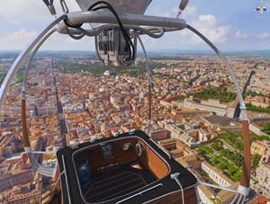
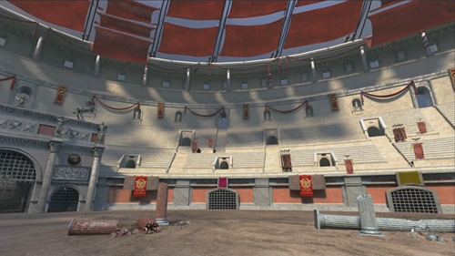
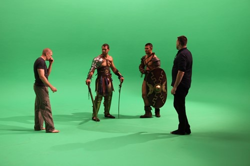
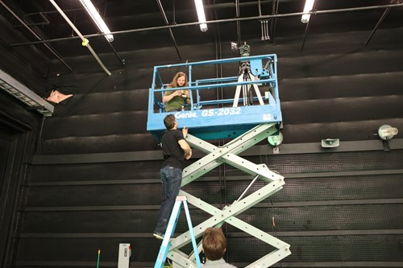

# Case study - Creating impossible perspectives for HoloTour

We wanted your experiences in HoloTour for Microsoft HoloLens to be unforgettable. In addition to the traditional tourist stops, we planned out some "impossible perspectives" – moments that would be impossible to experience on any tour but which, via the technology in HoloLens, we could bring directly to your living room. Creating the content for these experiences required some different techniques than our standard capture process.

## The content challenge

There are certain scenes in the HoloTour experience—such as the hot air balloon ride over modern-day Rome and the gladiatorial fight at the Colosseum in ancient Rome—that provide unique views you won't see anywhere else. These moments are meant to excite and amaze you, making your trip through HoloTour more than just an educational experience. They are the moments we want you to remember and get excited to tell other people about. Since we couldn't take our camera rig up into the sky and we haven't (yet) mastered time travel, each of these "impossible perspectives" called for a special approach to creating content.

## Behind the scenes

Creating these unique moments and perspectives required more than just filming and editing. It took a tremendous amount of time, people with many different skills, and a little bit of Hollywood magic.

### Viewing Rome from a hot air balloon

From our early planning days, we knew we wanted to do aerial views in HoloTour. Seeing Rome from the sky gives you a perspective that most people never get to see and a sense of how popular landmarks are spatially located. Trying to capture this ourselves with our existing camera and microphone rig would have been tremendously difficult, but luckily we didn’t have to.

First, it's important to explain that all of the locations you visit in HoloTour have movement in them. Our goal was to make you “feel like you’re really there” and since you’re surrounded by movement everywhere you go in real life, our virtual destinations needed to convey ambient movement as well. For instance, when you visit the Pantheon on your trip, you’ll see people wandering throughout the plaza and congregating on the steps. The background motion helps to make you feel like you’re really standing in the location, rather than in a staged, static environment.

To create the aerial views for the balloon ride, we worked with other teams at Microsoft to get access to aerial panoramic imagery of Rome. The quality of these images was excellent and the view was stunning, but when we used them in the scenes without modification, they felt lifeless compared to the other parts of the tour and the lack of motion was distracting. 

 
*The hot air balloon basket, floating over Rome*

To ensure the aerial locations met the same quality bar as other destinations, we decided to transform the static photographs into living, moving scenes. The first step was to edit the image and composite motion into it. We contracted a visual effects artist to help us with this. Editing was done to show clouds slowly drifting, birds flying by, and an occasional plane or helicopter traversing the skyline. On the ground, a number of cars were made to drive the streets. If you’ve been on the tour of Rome in HoloTour, it’s unlikely that you were explicitly aware of any of this movement. That’s actually great! The subtle motion isn’t meant to catch your eye, but without these little touches, people noticed immediately that it was a static image in the scene.

The second thing we did was give you a vantage point from which to view the scene. You won’t feel like you’re really there if it looks like you’re simply floating in midair, so we created a 3D model of a balloon and placed you inside of it. This allows you to walk around the balloon and look over the edge to get a better viewpoint. We found this to be a natural and fun way to experience the aerial imagery.

The hot air balloon experience presented unique challenges for our audio team, as logistics prevented us from having microphones hovering thousands of feet over Rome. Luckily, we had a large amount of ambient audio capture from all over the city that we were able to use during post-production. We placed audio emitters at their relative locations from where they were captured from the ground. The audio was then filtered to sound distant, as if you were hearing it from the perspective of someone riding in the hot air balloon, providing an authentic, directional soundscape for the scene.

### Time traveling to ancient Rome

The remnants of monuments and buildings throughout Rome are impressive even two thousand years after their construction, but we knew we had a unique opportunity to show you what it would be like to go back in time and see these structures as they appeared in ancient Rome.

Naturally, there isn’t any video footage or static imagery) of the Colosseum as it appeared when it was built, so we needed to create our own. We had to do a lot of research to learn as much about the structure as we could; understanding the materials it was made from, reviewing architectural diagrams, and reading historical descriptions to get enough information to be able to make a virtual recreation. 

 
*The modern day ruins of the Colosseum with an overlay showing the arena floor as it would have looked in ancient Rome*

The first thing we wanted to do was enhance traditional tours with educational overlays. In HoloTour when you visit the ruins of the Colosseum as it stands today, the arena floor is transformed to show you how it would have looked during use, including the elaborate underground staging areas. On a normal tour you might have this information described to you and you could try to imagine it, but in HoloTour you can actually see it.

For an overlay like this we had our artists match the viewpoint of our capture footage and create the overlay image by hand. The perspective needs to match so that when we replace the video with our image both will align properly.

### Staging the gladiator fight

While overlays are an engaging way to teach people about history, what we were most excited about was transporting you back in time. The overlay was just a still image from a particular viewpoint, but time traveling would require the entire Colosseum to be modeled, and, as discussed above, we needed to have motion in the scene to make it feel alive. Achieving that took a considerable amount of effort.

This undertaking was too large for our team to do alone, so our art team worked with Whiskytree, an external effects company that typically works on visual effects for Hollywood movies. Whiskytree helped us recreate the Colosseum in its heyday, allowing us to teach you about the structure while standing on the arena floor and to create a view of a gladiator fight from the emperor’s box. The cheering crowds and waving banners add the subtle motion necessary to make it feel like these are real places and not just images.

 
*The recreated Colosseum as seen from the arena floor. When viewed in HoloTour, the banners flutter in the breeze, giving a feeling of motion.*

The tour of Rome culminates with the gladiator fight. Whiskytree provided us with the arena and 3D crowd simulations rendered as video, but we needed to add in the gladiators on the arena floor. This part of our process looked more like a Hollywood video production than a project from an incubation game studio. Members of our team mapped out a rough fight sequence and then refined it with a choreographer. We hired actors to stage our mock battle and purchased armor so they would look the part. Finally, we filmed the whole scene against a green screen.

 
*Our gladiatiors, getting instructions between takes*

This scene places you in the Emperor’s box, which meant that all the footage needed to be from that perspective. If we filmed from where the gladiators were fighting on the arena floor, we wouldn't have been able to correctly composite the fight sequence in later, so we put our camera operator up in a very tall scissor lift, looking down on the fight sequence for filming.

 
*Getting the right perspective: filming from a scissor lift*

In post-production, the gladiators were composited onto the arena floor and the perspective was correct, but one issue remained: the shadows of the gladiators on the green screen were removed as part of the compositing process. Without shadows, it looked like the gladiators were floating in the air. Luckily, Whiskytree is great at solving just this kind of problem and they used a bit of technical wizardry to add shadows back into our scene. The result is what you see in the tour today.

## About the authors

<table style="border:0">
<tr>
<td style="border:0" width="60px"> </td>
<td style="border:0" width="408"> <b>David Haley</b> is a Senior Developer who learned more about camera rigs and video playback than he thought possible from working on HoloTour.</td>

<td style="border:0" width="60px"> </td>
<td style="border:0" width="408"> <b>Jason Syltebo</b> is an Audio Designer who made sure you could experience the soundscape of every destination you visit, even when you go back in time.</td>
</tr>
<tr>
<td style="border:0" width="60px"> </td>
<td style="border:0" width="408"> <b>Danny Askew</b> is a Video Artist who made sure your journey through Rome was as flawless as possible.</td>

<td style="border:0" width="60px"></td>
<td style="border:0" width="408"></td>
</tr>
</table>

## See also
* [Video: Microsoft HoloLens: HoloTour](https://www.youtube.com/watch?v=pLd9WPlaMpY)
