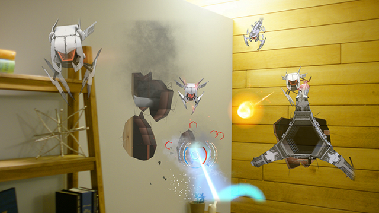
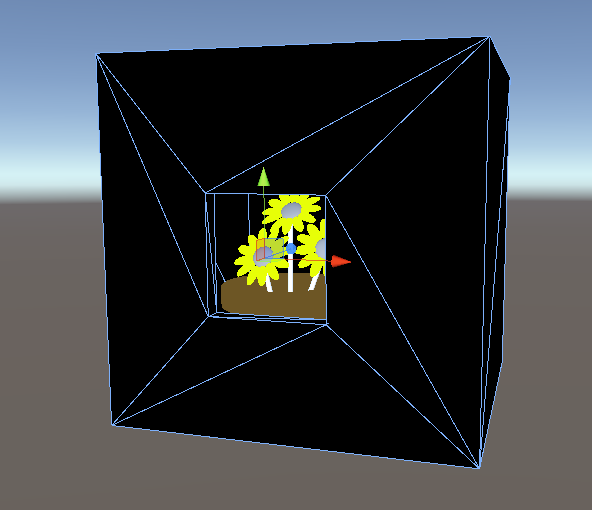

# Case study - Looking through holes in your reality

When people think about mixed reality and what they can do with Microsoft HoloLens, they usually stick to questions like "What objects can I add to my room?" or “What can I layer on top of my space?" I’d like to highlight another area you can consider—essentially a magic trick—using the same technology to look into or through real physical objects around you.

## The tech

If you've fought aliens as they break through your walls in **[RoboRaid](https://www.youtube.com/watch?v=Hf9qkURqtbM)**, unlocked a wall safe in **[Fragments](case-study-creating-an-immersive-experience-in-fragments.md)**, or were lucky enough to see the UNSC Infinity hangar in the **[Halo 5 experience at E3 in 2015](https://www.youtube.com/watch?v=QDw5QjDtFy8)**, then you've seen what I'm talking about. Depending on your imagination, this visual trick can be used to put temporary holes in your drywall or to hide worlds under a loose floorboard.



RoboRaid adds three-dimensional pipes and other structure behind your walls, visible only through holes created as the invaders break through.

Using one of these unique holograms on HoloLens, an app can provide the illusion of content behind your walls or through your floor in the same way that reality presents itself through an actual window. Move yourself left, and you can see whatever is on the right side. Get closer, and you can see a bit more of everything. The major difference is that real holes allow you through, while your floor stubbornly won't let you climb through to that magical holographic content. (I'll add a task to the backlog.)

## Behind the scenes

This trick is a combination of two effects. First, holographic content is pinned to the world using "spatial anchors." Using anchors to make that content "world-locked" means that what you're looking at doesn't visually drift away from the physical objects near it, even as you move or the underlying spatial mapping system updates its 3D model of your room.

Secondly, that holographic content is visually limited to a very specific space, so you can only see through the hole in your reality. That occlusion is necessary to require looking through a logical hole, window, or doorway, which sells the trick. Without something blocking most of the view, a crack in space to a secret Jurassic dimension might just look like a poorly placed dinosaur.


This is not an actual screenshot, but an illustration of how the secret underworld from the [MR Basics 101](holograms-101.md) looks on HoloLens. The black enclosure doesn’t show up, but you can see content through a virtual hole. (When looking through an actual device, the floor would seem to disappear even more because your eyes focus at a further distance as if it’s not even there.)

### World-locking holographic content

In Unity, causing holographic content to stay world-locked is as easy as adding a WorldAnchor component:

```
myObject.AddComponent<WorldAnchor>();
```

The WorldAnchor component will constantly adjust the position and rotation of its GameObject (and thus anything else under that object in the hierarchy) to keep it stable relative to nearby physical objects. When authoring your content, create it in such a way that the root pivot of your object is centered at this virtual hole. (If your object's pivot is deep in the wall, its slight tweaks in position and rotation will be much more noticeable, and the hole may not look very stable.)

### Occluding everything but the virtual hole

There are a variety of ways to selectively block the view to what is hidden in your walls. The simplest one takes advantage of the fact that HoloLens uses an additive display, which means that fully black objects appear invisible. You can do this in Unity without doing any special shader or material tricks— just create a black material and assign it to an object that boxes in your content. If you don't feel like doing 3D modeling, just use a handful of default Quad objects and overlap them slightly. There are a number of drawbacks to this approach, but it is the fastest way to get something working, and getting a low-fidelity proof of concept working is great, even if you suspect you might want to refactor it later.

One major drawback to the above "black box" approach is that it doesn't photograph well. While your effect might look perfect through the display of HoloLens, any screenshots you take will show a large black object instead of what remains of your wall or floor. The reason for this is that the physical hardware and screenshots composite holograms and reality differently. Let's detour for a moment into some fake math...

*Fake math alert! These numbers and formulas are meant to illustrate a point, not to be any sort of accurate metric!*

What you see through HoloLens:

```
( Reality * darkening_amount ) + Holograms
```

What you see in screenshots and video:

```
( Reality * ( 1 - hologram_alpha ) ) + Holograms * hologram_alpha
```

In English: What you see through HoloLens is a simple combination of darkened reality (like through sunglasses) and whatever holograms the app wants to show. But when you take a screenshot, the camera's image is blended with the app's holograms according to the per-pixel transparency value.

One way to get around this is to change the "black box" material to only write to the depth buffer, and sort with all the other opaque materials. For an example of this, check out the [WindowOcclusion.shader file in the MixedRealityToolkit on GitHub](https://github.com/Microsoft/MixedRealityToolkit-Unity/blob/htk_release/Assets/HoloToolkit/Common/Shaders/WindowOcclusion.shader). The relevant lines are copied here:

```
"RenderType" = "Opaque"
"Queue" = "Geometry"
ColorMask 0
```

(Note the "Offset 50, 100" line is to deal with unrelated issues, so it'd probably make sense to leave that out.)

Implementing an invisible occlusion material like that will let your app draw a box that looks correct in the display and in mixed-reality screenshots. For bonus points, you can try to improve the performance of that box even further by doing clever things to draw even fewer invisible pixels, but that can really get into the weeds and usually won't be necessary.


Here is the secret underworld from [MR Basics 101](holograms-101.md) as Unity draws it, except for the outer parts of the occluding box. Note that the pivot for the underworld is at the center of the box, which helps keep the hole as stable as possible relative to your actual floor.

## Do it yourself

Have a HoloLens and want to try out the effect for yourself? The easiest thing you can do (no coding required) is to install the free 3D Viewer app and then load the [download the.fbx file I've provided on GitHub](https://github.com/Microsoft/HolographicAcademy/tree/CaseStudy-MagicWindow/MagicWindow) to view a flower pot model in your room. Load it on HoloLens, and you can see the illusion at work. When you're in front of the model, you can only see into the small hole—everything else is invisible. Look at the model from any other side and it disappears entirely. Use the movement, rotation, and scale controls of 3D Viewer to position the virtual hole against any vertical surface you can think of to generate some ideas!



Viewing this model in your Unity editor will show a large black box around the flowerpot. On HoloLens, the box disappears, giving way to a magic window effect.

If you want to build an app that uses this technique, check out the [MR Basics 101 tutorial](holograms-101.md) in the [Mixed Reality tutorials](tutorials.md). Chapter 7 ends with an explosion in your floor that reveals a hidden underworld (as pictured above). Who said tutorials had to be boring?

Here are some ideas of where you can take this idea next:
* Think of ways to make the content inside the virtual hole interactive. Letting your users have some impact beyond their walls can really improve the sense of wonder that this trick can provide.
* Think of ways to see through objects back to known areas. For example, how can you put a holographic hole in your coffee table and see your floor beneath it?

## About the author

<table style="border-collapse:collapse">
<tr>
<td style="border-style: none" width="60px"></td>
<td style="border-style: none"><b>Eric Rehmeyer</b><br>Senior Software Engineer @Microsoft</td>
</tr>
</table>

## See also
* [MR Basics 101: Complete project with device](holograms-101.md)
* [Coordinate systems](coordinate-systems.md)
* [Spatial anchors](spatial-anchors.md)
* [Spatial mapping](spatial-mapping.md)
