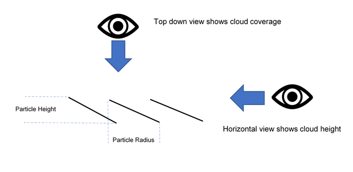
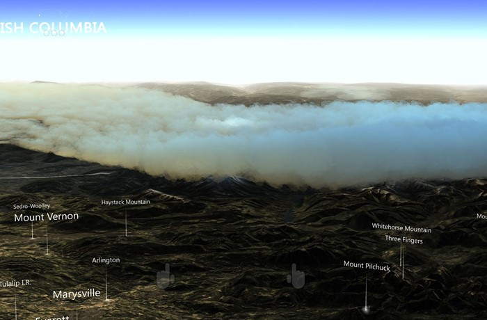
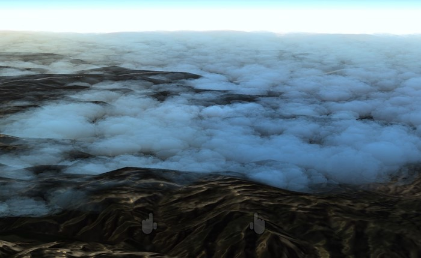
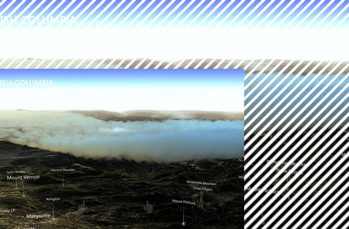

# Case study - Scaling Datascape across devices with different performance

Datascape is a Windows Mixed Reality application developed internally at Microsoft where we focused on displaying weather data on top of terrain data. The application explores the unique insights users gain from discovering data in mixed reality by surrounding the user with holographic data visualization.

For Datascape we wanted to target a variety of platforms with different hardware capabilities ranging from Microsoft HoloLens to Windows Mixed Reality immersive headsets, and from lower-powered PCs to the very latest PCs with high-end GPU. The main challenge was rendering our scene in a visually appealing matter on devices with wildly different graphics capabilities while executing at a high framerate.

This case study will walk through the process and techniques used to create some of our more GPU-intensive systems, describing the problems we encountered and how we overcame them.

## Transparency and overdraw

Our main rendering struggles dealt with transparency, since transparency can be expensive on a GPU.

Solid geometry can be rendered front to back while writing to the depth buffer, stopping any future pixels located behind that pixel from being discarded. This prevents hidden pixels from executing the pixel shader, speeding up the process significantly. If geometry is sorted optimally, each pixel on the screen will be drawn only once.

Transparent geometry needs to be sorted back to front and relies on blending the output of the pixel shader to the current pixel on the screen. This can result in each pixel on the screen being drawn to multiple times per frame, referred to as overdraw.

For HoloLens and mainstream PCs, the screen can only be filled a handful of times, making transparent rendering problematic.

## Introduction to Datascape scene components

We had three major components to our scene; **the UI, the map**, and **the weather**. We knew early on that our weather effects would require all the GPU time it could get, so we purposely designed the UI and terrain in a way that would reduce any overdraw.

We reworked the UI several times to minimize the amount of overdraw it would produce. We erred on the side of more complex geometry rather than overlaying transparent art on top of each other for components like glowing buttons and map overviews.

For the map, we used a custom shader that would strip out standard Unity features such as shadows and complex lighting, replacing them with a simple single sun lighting model and a custom fog calculation. This produced a simple pixel shader and free up GPU cycles.

We managed to get both the UI and the map to rendering at budget where we did not need any changes to them depending on the hardware; however, the weather visualization, in particular the cloud rendering, proved to be more of a challenge!

## Background on cloud data

Our cloud data was downloaded from NOAA servers (http://nomads.ncep.noaa.gov/) and came to us in three distinct 2D layers, each with the top and bottom height of the cloud, as well as the density of the cloud for each cell of the grid. The data got processed into a cloud info texture where each component was stored in the red, green, and blue component of the texture for easy access on the GPU.

## Geometry clouds

To make sure our lower-powered machines could render our clouds we decided to start with an approach that would use solid geometry to minimize overdraw.

We first tried producing clouds by generating a solid heightmap mesh for each layer using the radius of the cloud info texture per vertex to generate the shape. We used a geometry shader to produce the vertices both at the top and the bottom of the cloud generating solid cloud shapes. We used the density value from the texture to color the cloud with darker colors for more dense clouds.

**Shader for creating the vertices:**

```
v2g vert (appdata v)
{
    v2g o;
    o.height = tex2Dlod(_MainTex, float4(v.uv, 0, 0)).x;
    o.vertex = v.vertex;
    return o;
}
 
g2f GetOutput(v2g input, float heightDirection)
{
    g2f ret;
    float4 newBaseVert = input.vertex;
    newBaseVert.y += input.height * heightDirection * _HeigthScale;
    ret.vertex = UnityObjectToClipPos(newBaseVert);
    ret.height = input.height;
    return ret;
}
 
[maxvertexcount(6)]
void geo(triangle v2g p[3], inout TriangleStream<g2f> triStream)
{
    float heightTotal = p[0].height + p[1].height + p[2].height;
    if (heightTotal > 0)
    {
        triStream.Append(GetOutput(p[0], 1));
        triStream.Append(GetOutput(p[1], 1));
        triStream.Append(GetOutput(p[2], 1));
 
        triStream.RestartStrip();
 
        triStream.Append(GetOutput(p[2], -1));
        triStream.Append(GetOutput(p[1], -1));
        triStream.Append(GetOutput(p[0], -1));
    }
}
fixed4 frag (g2f i) : SV_Target
{
    clip(i.height - 0.1f);
 
    float3 finalColor = lerp(_LowColor, _HighColor, i.height);
    return float4(finalColor, 1);
}
```

We introduced a small noise pattern to get more detail on top of the real data. To produce round cloud edges, we clipped the pixels in the pixel shader when the interpolated radius value hit a threshold to discard near-zero values.


Since the clouds are solid geometry, they can be rendered before the terrain to hide any expensive map pixels underneath to further improve framerate. This solution ran well on all graphics cards from min-spec to high-end graphics cards, as well as on HoloLens, because of the solid geometry rendering approach.

## Solid particle clouds

We now had a backup solution that produced a decent representation of our cloud data, but was a bit lackluster in the “wow” factor and did not convey the volumetric feel that we wanted for our high-end machines.

Our next step was creating the clouds by representing them with approximately 100,000 particles to produce a more organic and volumetric look.

If particles stay solid and sort front-to-back, we can still benefit from depth buffer culling of the pixels behind previously rendered particles, reducing the overdraw. Also, with a particle-based solution, we can alter the amount of particles used to target different hardware. However, all pixels still need to be depth tested, which results in some additional overhead.

First, we created particle positions around the center point of the experience at startup. We distributed the particles more densely around the center and less so in the distance. We pre-sorted all particles from the center to the back so that the closest particles would render first.

A compute shader would sample the cloud info texture to position each particle at a correct height and color it based on the density.

We used *DrawProcedural* to render a quad per particle allowing the particle data to stay on the GPU at all times.

Each particle contained both a height and a radius. The height was based on the cloud data sampled from the cloud info texture, and the radius was based on the initial distribution where it would be calculated to store the horizontal distance to its closest neighbor. The quads would use this data to orient itself angled by the height so that when users look at it horizontally, the height would be shown, and when users looked at it top-down, the area between its neighbors would be covered.



**Shader code showing the distribution:**

```
ComputeBuffer cloudPointBuffer = new ComputeBuffer(6, quadPointsStride);
cloudPointBuffer.SetData(new[]
{
    new Vector2(-.5f, .5f),
    new Vector2(.5f, .5f),
    new Vector2(.5f, -.5f),
    new Vector2(.5f, -.5f),
    new Vector2(-.5f, -.5f),
    new Vector2(-.5f, .5f)
});
 
StructuredBuffer<float2> quadPoints;
StructuredBuffer<float3> particlePositions;
v2f vert(uint id : SV_VertexID, uint inst : SV_InstanceID)
{
    // Find the center of the quad, from local to world space
    float4 centerPoint = mul(unity_ObjectToWorld, float4(particlePositions[inst], 1));
 
    // Calculate y offset for each quad point
    float3 cameraForward = normalize(centerPoint - _WorldSpaceCameraPos);
    float y = dot(quadPoints[id].xy, cameraForward.xz);
 
    // Read out the particle data
    float radius = ...;
    float height = ...;
 
    // Set the position of the vert
    float4 finalPos = centerPoint + float4(quadPoints[id].x, y * height, quadPoints[id].y, 0) * radius;
    o.pos = mul(UNITY_MATRIX_VP, float4(finalPos.xyz, 1));
    o.uv = quadPoints[id].xy + 0.5;
 
    return o;
}
```

Since we sort the particles front-to-back and we still used a solid style shader to clip (not blend) transparent pixels, this technique handles a surprising amount of particles, avoiding costly over-draw even on the lower-powered machines.

## Transparent particle clouds

The solid particles provided a good organic feel to the shape of the clouds but still needed something to sell the fluffiness of clouds. We decided to try a custom solution for the high-end graphics cards where we can introduce transparency.

To do this we simply switched the initial sorting order of the particles and changed the shader to use the textures alpha.



It looked great but proved to be too heavy for even the toughest machines since it would result in rendering each pixel on the screen hundreds of times!

## Render off-screen with lower resolution

To reduce the number of pixels rendered by the clouds, we started rendering them in a quarter resolution buffer (compared to the screen) and stretching the end result back up onto the screen after all the particles had been drawn. This gave us roughly a 4x speedup, but came with a couple of caveats.

**Code for rendering off-screen:**

```
cloudBlendingCommand = new CommandBuffer();
Camera.main.AddCommandBuffer(whenToComposite, cloudBlendingCommand);
 
cloudCamera.CopyFrom(Camera.main);
cloudCamera.rect = new Rect(0, 0, 1, 1);    //Adaptive rendering can set the main camera to a smaller rect
cloudCamera.clearFlags = CameraClearFlags.Color;
cloudCamera.backgroundColor = new Color(0, 0, 0, 1);
 
currentCloudTexture = RenderTexture.GetTemporary(Camera.main.pixelWidth / 2, Camera.main.pixelHeight / 2, 0);
cloudCamera.targetTexture = currentCloudTexture;
 
// Render clouds to the offscreen buffer
cloudCamera.Render();
cloudCamera.targetTexture = null;
 
// Blend low-res clouds to the main target
cloudBlendingCommand.Blit(currentCloudTexture, new RenderTargetIdentifier(BuiltinRenderTextureType.CurrentActive), blitMaterial);
```

First, when rendering into an off-screen buffer, we lost all depth information from our main scene, resulting in particles behind mountains rendering on top of the mountain.

Second, stretching the buffer also introduced artifacts on the edges of our clouds where the resolution change was noticeable. The next two sections talk about how we resolved these issues.

## Particle depth buffer

To make the particles co-exist with the world geometry where a mountain or object could cover particles behind it, we populated the off-screen buffer with a depth buffer containing the geometry of the main scene. To produce such depth buffer, we created a second camera, rendering only the solid geometry and depth of the scene.

We then used the new texture in the pixel shader of the clouds to occlude pixels. We used the same texture to calculate the distance to the geometry behind a cloud pixel. By using that distance and applying it to the alpha of the pixel, we now had the effect of clouds fading out as they get close to terrain, removing any hard cuts where particles and terrain meet.



## Sharpening the edges

The stretched-up clouds looked almost identical to the normal size clouds at the center of the particles or where they overlapped, but showed some artifacts at the cloud edges. Otherwise sharp edges would appear blurry and alias effects were introduced when the camera moved.

We solved this by running a simple shader on the off-screen buffer to determine where big changes in contrast occurred (1). We put the pixels with big changes into a new stencil buffer (2). We then used the stencil buffer to mask out these high contrast areas when applying the off-screen buffer back to the screen, resulting in holes in and around the clouds (3).

We then rendered all the particles again in full-screen mode, but this time used the stencil buffer to mask out everything but the edges, resulting in a minimal set of pixels touched (4). Since the command buffer was already created for the particles, we simply had to render it again to the new camera.


The end result was sharp edges with cheap center sections of the clouds.

While this was much faster than rendering all particles in full screen, there is still a cost associated with testing a pixel against the stencil buffer, so a massive amount of overdraw still came with a cost.

## Culling particles

For our wind effect, we generated long triangle strips in a compute shader, creating many wisps of wind in the world. While the wind effect was not heavy on fill rate due to skinny strips generated, it produced many hundreds of thousands of vertices resulting in a heavy load for the vertex shader.

We introduced append buffers on the compute shader to feed a subset of the wind strips to be drawn. With some simple view frustum culling logic in the compute shader, we could determine if a strip was outside of camera view and prevent it from being added to the push buffer. This reduced the amount of strips significantly, freeing up some needed cycles on the GPU.

**Code demonstrating an append buffer:**

*Compute shader:*

```
AppendStructuredBuffer<int> culledParticleIdx;
 
if (show)
    culledParticleIdx.Append(id.x);
```

*C# code:*

```
protected void Awake() 
{
    // Create an append buffer, setting the maximum size and the contents stride length
    culledParticlesIdxBuffer = new ComputeBuffer(ParticleCount, sizeof(int), ComputeBufferType.Append);
 
    // Set up Args Buffer for Draw Procedural Indirect
    argsBuffer = new ComputeBuffer(4, sizeof(int), ComputeBufferType.IndirectArguments);
    argsBuffer.SetData(new int[] { DataVertCount, 0, 0, 0 });
}
 
protected void Update()
{
    // Reset the append buffer, and dispatch the compute shader normally
    culledParticlesIdxBuffer.SetCounterValue(0);
 
    computer.Dispatch(...)
 
    // Copy the append buffer count into the args buffer used by the Draw Procedural Indirect call
    ComputeBuffer.CopyCount(culledParticlesIdxBuffer, argsBuffer, dstOffset: 1);
    ribbonRenderCommand.DrawProceduralIndirect(Matrix4x4.identity, renderMaterial, 0, MeshTopology.Triangles, dataBuffer);
}
```

We tried using the same technique on the cloud particles, where we would cull them on the compute shader and only push the visible particles to be rendered. This technique actually did not save us much on the GPU since the biggest bottleneck was the amount pixels rendered on the screen, and not the cost of calculating the vertices.

The other problem with this technique was that the append buffer populated in random order due to its parallelized nature of computing the particles, causing the sorted particles to be un-sorted, resulting in flickering cloud particles.

There are techniques to sort the push buffer, but the limited amount of performance gain we got out of culling particles would likely be offset with an additional sort, so we decided to not pursue this optimization.

## Adaptive rendering

To ensure a steady framerate on an app with varying rendering conditions like a cloudy vs a clear view, we introduced adaptive rendering to our app.

The first step of adaptive rendering is to measure GPU. We did this by inserting custom code into the GPU command buffer at the beginning and the end of a rendered frame, capturing both the left and right eye screen time.

By measuring the time spent rendering and comparing it to our desired refresh-rate we got a sense of how close we were to dropping frames.

When close to dropping frames, we adapt our rendering to make it faster. One simple way of adapting is changing the viewport size of the screen, requiring less pixels to get rendered.

By using *UnityEngine.XR.XRSettings.renderViewportScale* the system shrinks the targeted viewport and automatically stretches the result back up to fit the screen. A small change in scale is barely noticeable on world geometry, and a scale factor of 0.7 requires half the amount of pixels to be rendered.



When we detect that we are about to drop frames we lower the scale by a fixed number, and increase it back when we are running fast enough again.

While we decided what cloud technique to use based on graphics capabilities of the hardware at startup, it is possible to base it on data from the GPU measurement to prevent the system from staying at low resolution for a long time, but this is something we did not have time to explore in Datascape.

## Final thoughts

Targeting a variety of hardware is challenging and requires some planning.

We recommend that you start targeting lower-powered machines to get familiar with the problem space and develop a backup solution that will run on all your machines. Design your solution with fill rate in mind, since pixels will be your most precious resource. Target solid geometry over transparency.

With a backup solution, you can then start layering in more complexity for high end machines or maybe just enhance resolution of your backup solution.

Design for worst case scenarios, and maybe consider using adaptive rendering for heavy situations.

## About the authors

<table style="border:0">
<tr>
<td style="border:0" width="60px"></td>
<td style="border:0"><b>Robert Ferrese</b><br>Software engineer @Microsoft</td>
</tr>
<tr>
<td style="border:0" width="60px"></td>
<td style="border:0"><b>Dan Andersson</b><br>Software engineer @Microsoft</td>
</tr>
</table>


## See also
* [Understanding Performance for Mixed Reality](understanding-performance-for-mixed-reality.md)
* [Performance Recommendations for Unity](performance-recommendations-for-unity.md)

 
