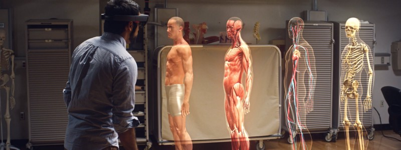
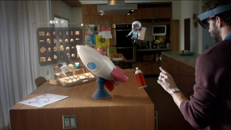
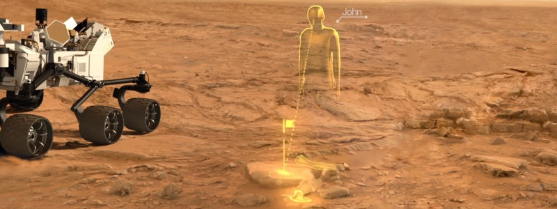
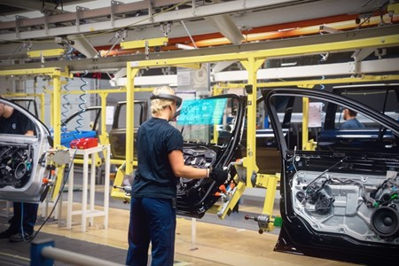

# Case study - The pursuit of more personal computing

Tomorrow’s opportunities are uncovered by building products today. The solutions these products provide reveal what’s necessary to advance the future. With mixed reality this is especially true: Meaningful insight comes from getting hands-on with real work — real devices, real customers, real problems.

At Microsoft, I’m part of the design team helping enterprise partners build experiences for their business using Windows Mixed Reality. Over the past year, our team has focused on HoloLens and understanding how Microsoft’s flagship holographic device can deliver value to customers today. Working closely with designers and developers from these companies, our team focuses on uncovering solutions that would be technically unfeasible, financially impractical, or otherwise impossible without HoloLens.

 
*HoloAnatomy from Case Western Reserve University*

Building these solutions helps Microsoft’s internal teams prepare for the next generation of computing. Learning how individuals and businesses interact with core technologies like mixed reality, voice, and AI, helps Microsoft build better devices, platforms, and tools for developers. If you are a designer or a developer exploring this space, understanding what our teams are learning from partners today is critical to preparing for tomorrow’s mixed reality opportunities.

## Microsoft's ambition for mixed reality

We live our lives among two worlds: the physical and the digital. Both have fundamental strengths that we leverage to augment and extend our abilities. We can talk in-person with a friend, using our physical senses to understand things like body language, or we can augment our ability to talk by video-chatting with a friend from miles away. Until now these two worlds, and their respective strengths, have been fundamentally separated.

**The physical world is one of atoms and physics.** We use our senses to make decisions, leveraging years of learned behavior to interact with objects and people in our environments. Despite the ease of these interactions, we are limited by our physical abilities and the laws of nature.

**The digital world is one of bits and logic.** Computations are made instantly while information can be distributed effortlessly. Despite the speed and flow of information, interactions are too often limited to small screens, abstract inputs, and noisy feeds.

 
*HoloStudio*

What if we could combine the advantages of the physical and digital worlds? This is the cornerstone of experiences across the spectrum of mixed reality: a medium where the physical and digital co-exist and seamlessly interact. Combining these worlds builds a new foundation for interacting more naturally with technology — an evolution in personal computing.

The spectrum of mixed reality has exploded as developers have begun exploring the opportunities of immersion and presence. Bringing users into the digital world with immersive (virtual reality) experiences and creating digital objects in the physical world with holographic (augmented reality) experiences. But what are the benefits of mapping the physical world to the digital world? What happens when we give computers eyes to see?

The fundamental camera vision technology behind holograms acts like a pair of eyes for the computer to see the environment around you: Objects in the world, people around you, changes as they happen. A digital understanding of your context in the physical world. This leads to an enormous amount of information, the implications of which we are only beginning to understand.

### Culminating core technologies

Computing is too often a tangible thing. Grabbing our devices to tell them who we are and what we want. Contorting our thinking and aligning what we say to match what we believe the computer needs to hear.

The promise of mixed reality, especially in the real world with holographic experiences, is to lessen the burden of interacting with technology. Reducing cognitive load as users navigate the layers of abstraction inherent to computing today. How can we design experiences that not only take advantage of contextual understanding, but make it easier to draw insight and take action? Two contributing technologies are also attempting to solve this problem:
* **Voice**, in terms of speech and conversation, is enabling users to communicate with computers through more natural means — answering bots through text or issuing commands to conversational hardware.
* **AI** is powering experiences that distill insights from increasingly complex datasets. While AI is an enormous topic, recent progress has provided the groundwork for devices that rely on computer vision, more natural digital assistants, and recommending actions to users.

Mixed reality provides a medium to combine these technologies into a single user experience. Voice becomes a powerful, natural method for input when wearing a holographic headset. AI acts as a critical cipher to contextualize the enormous amounts of information connecting the physical and digital worlds. This is why Sataya Nadella refers to the HoloLens as ‘the ultimate computer’, it’s a culminating device device for three core technologies. A platform to empower humans to more easily interact with the growing complexity of devices and services.

### Less interface in your face

A culminating device that connects the physical world to the digital world allows us to design experiences that fit more naturally, without cumbersome abstractions. Consider the experiences you’ve created: When the barriers of abstraction are removed, how much of your interface is left? Which parts of your app flow change when you know the user and their context? How many menus and buttons remain?

For example, think about shared experiences in mixed reality like the OnSight tool NASA’s Jet Propulsion Laboratory built for scientists. Instead of building a system to look at Martian data (abstracting the data onto screens or displays), they brought scientists inside the data, effectively putting them on the surface of Mars as they collaborated.

 
*NASA/JPL OnSight*

Instead of finding the button to draw attention to some Martian geology, scientists can point to it directly. No menus, no pens, no learning curve to using the tool effectively. By leveraging our known abilities from the physical world, more natural interactions in mixed reality can circumvent deep technical literacy in even the most advanced industry tools.

Likewise, voice and AI can extend natural interaction in experience like this. When digital assistants can ‘see’ into the world around us, conversations will feel less cumbersome. A bot in NASA’s tool might extract context from the scientists conferring over Martian geology, acting as a ready (and conversational) source of information when scientists gesture and ask about ‘this’ or ‘that’. A computer that knows your context is ready to jump in with information appropriate to you, through a method of interaction most appropriate to your context.

### Building on a foundation

In this world of contextual experiences, catering to the mobility of the user is key. Moving fluidly between devices and services, with highly personalized contexts, users will travel about the physical world seamlessly — creating a *massive* platform challenge. When the physical world becomes a digital end-point, interoperability reigns supreme.

> *“Bringing together the digital universe and the physical world will unlock human potential… enabling every person and organization on the planet to achieve more.” — Satya Nadella*

Windows Mixed Reality is an effort to create a platform for an ecosystem of devices, enabling developers to create immersive, affordable, and compatible experiences for the largest possible audience. The future will not be limited to a single manufacturer, let alone a single device. Headsets, mobile devices, PCs, accessories… all these physical things must interoperate (as well as digital things like graphs and services) through an underlying platform to successfully deliver on the promise of mixed reality.

## Designing for tomorrow's experiences today

 
 
Each one of the core technologies behind this new class of experiences are enabling designers and developers to create compelling and successful experiences today. By reducing abstraction, we can interact more directly with the digital world, allowing us to design in ways that augment and amplify human abilities. Voice technology (through bots and digital assistants like Cortana) is allowing users to carry out increasingly complex conversations and scenarios, while AI technology (through tools like Microsoft Cognitive Services) is causing companies to rethink how users will interact with everything from social media to supply chain management.

These types of interactions will rely on both a new class of design tools as well fundamental support from the platform. Creating these tools and building this platform for devices and services relies on understanding how tomorrow's experiences will solve real, tangible problems. We've identified five areas of opportunity where our enterprise partners have delivered valuable solutions and where we believe continued investment will help us prepare for this new class of computing. 

## Areas of opportunity

The past year of developer partnerships has uncovered areas of opportunity that resonate with customers and create successful enterprise solutions. From scientists and technicians to designers and clients, five areas of opportunity have emerged where Microsoft partners are find value with mixed reality. These areas are already providing massive insight into the future needs of platforms like Windows Mixed Reality and can help you understand how these new experiences will impact the ways we learn, collaborate, communicate, and create.

### 1. Creation and design

One of the chief opportunities of mixed reality is the ability to see and manipulate 3D designs in real time, in a real-world setting, at true size and scale. Design and prototyping tools have escaped the confines of screens, returning to a realm of design usually reserved for tangible, physical materials like wood and clay.

 

>[!VIDEO https://www.youtube.com/embed/Hx6biWE2VsM]

[Autodesk](https://www.youtube.com/watch?v=Hx6biWE2VsM) created a mixed reality experience aimed at improving collaboration across the entire product development process. The ability for engineers and designers to survey and critique 3D models in their environment allowed them to iterate on a design in real-time. This not only enabled faster prototyping but gave way to more confident decisions in the process.

Experiences like this highlight the need for core collaboration experiences, the ability for users to see and communicate with shared objects. Autodesk's goal is to expand the product from design professional and engineers to digital artists, students, and hobbyists. As the level of 3D expertise of users decreases, the ability to interact with objects naturally becomes crucial.

### 2. Assembly and manufacturing

From the increasing amount of specialization on factory floors to the rapid advancements of supply chain management, seamless access to relevant information is key. Mixed reality offers the ability to synthesize extensive data sets and provide visual displays that aid in areas like navigation and operations. These are often highly technical, niche fields where integration with custom datasets and services are crucial to reducing complexity and providing a successful experience.

 

>[!VIDEO https://www.youtube.com/embed/8OWhGiyR4Ns]

Elevator manufacturer [ThyssenKrupp](https://www.youtube.com/watch?v=8OWhGiyR4Ns) created an experience for elevator service technicians, allowing them to visualize and identify problems in preparation for a job. With a team spanning over 24,000 technicians, devices like HoloLens allow these technicians to have remote, hands-free access to technical and expert information.

ThyssenKrupp highlights a powerful concept here that critical, contextually-relevant information can be delivered quickly to users. As we look ahead to a new class of experiences, distilling vast amounts of possible information to content that is relevant to the user will be key.

### 3. Training and development

Representing objects and information in three dimensions offer new ways to explain scenarios visually and with spatial understanding. Training becomes a key area of opportunity, leveraging the ability to digitally represent enormous, complex objects (like jet engines) to create training simulations for a fraction of the cost of a physical solution.

 

>[!VIDEO https://www.youtube.com/embed/GjZgI2oDcwM]

[Japan Airlines](https://www.youtube.com/watch?v=GjZgI2oDcwM&t=158s) has been experimenting with concept programs to provide supplemental training for engine mechanics and flight crews. The massive jet engines (in both size and complexity) can be represented in 3D, ignoring the limitations of the physical world to move and rotate virtual objects around trainees, allowing them to see how airline components work in real-time.

Training with virtual components (and reducing the need for expensive, physical training simulators) is a key way to deliver value in enterprise scenarios today. As this scenario expands (as we've seen in areas like medicine), computer vision becomes especially important to recognize unique objects in the environment, understand the context of the user, and deliver relevant instructions.

### 4. Communication and understanding

Interactions between two people (whether both participants are in mixed reality devices or one is on a traditional PC or phone) can provide both a sense of immersion within a new environment or a sense of presence when communicating virtually with others. In enterprise scenarios this sense of presence is a boon to mobile teams, helping to increase understanding of projects and lessen the need for travel.

 

>[!VIDEO https://www.youtube.com/embed/kXVW4sUsh3A]

Commercial tech manufacturer [Trimble](https://www.youtube.com/watch?v=kXVW4sUsh3A) developed a solution for architecture and construction industry professionals to collaborate and review work during building development. Professionals can remotely immerse themselves into a project to discuss progress or be on location and review plans as they would look (in their final form) in the environment around them.

Shared experiences are a major area of investment for Microsoft, with apps like Skype exploring new ways to represent humans in digital space. Teams are exploring volumetric video recordings, avatars, and recreations of a participant's physical space.

### 5. Entertainment and engagement

The nature of immersion in mixed reality can have a tremendous impact on the way customers engage with entertainment and marketing. Artists and entertainment studios have explored mixed reality as a compelling medium for storytelling, while companies are exploring the implications for brand marketing. From product demos in private showrooms to vision pieces told at trade expos, content can be delivered in more immersive and tailored ways.

 

>[!VIDEO https://www.youtube.com/embed/DilzwF90vec]

Volvo created an experience for showcasing their latest car models (immersing users in different colors and configurations) while highlighting how advanced sensors work to create a better, safer driving experience. Taking customers through a guided showroom experience allows Volvo to tell the story behind cutting-edge car feature while delivering a memorable portrayal of their brand story.

Entertainment is in many ways pushing the bounds of mixed reality (especially virtual reality) and perhaps most compelling in this space is how it will interact combine with the previous area of opportunity: communication and understanding. With multiple users, each with their own variant of devices and interface methods, you can imagine a vast future of personalization in the realm of entertainment.

## Start building today

It's hard to say what the far future of mixed reality will look like for consumers, but focusing on unique problems, getting hands-on with real hardware, and **experimenting *today* with the intersection between mixed reality, voice, and AI is key**. Microsoft is just getting started with mixed reality but learning from the successes realized by businesses today will help you create the experiences of tomorrow.

## About the author

<table style="border-collapse:collapse">
<tr>
<td style="border-style: none" width="60" padding-left="0px"></td>
<td style="border-style: none"><b>Mark Vitazko</b> UX Designer @Microsoft</td>
</tr>
</table>
 
