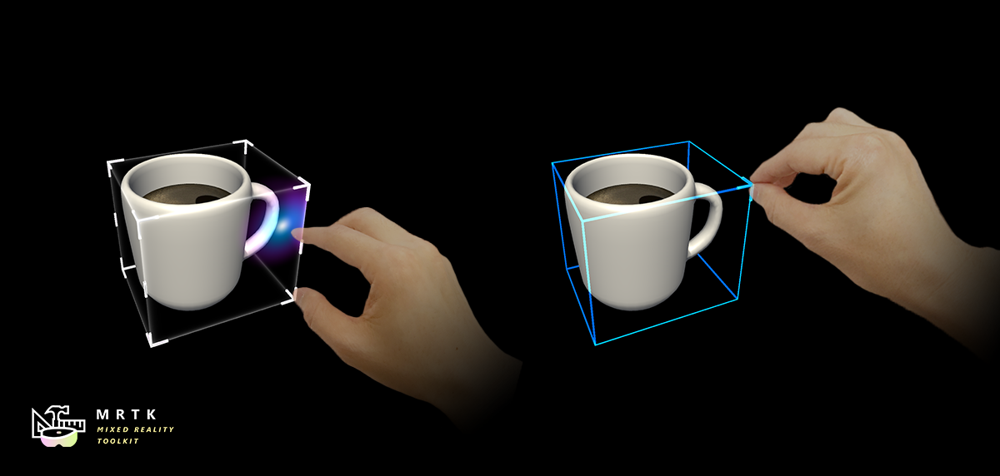

# Start designing and prototyping

## What are the core concepts of an experience?

### [Keep the user comfortable - (Comfort)](comfort.md)
To ensure maximum comfort on head-mounted displays, it’s important for designers and developers to create and present content in a way that mimics how these cues operate in the natural world.

 

### [Consider how the user sees the world - (Holographic frame)](holographic-frame.md)
Users see the world of mixed reality through a rectangular viewport powered by their headset. On the HoloLens, this rectangular area is called the holographic frame and allows users to see digital content overlaid onto the real world around them.

 

### [Making holographic objects feel real - (Spatial mapping)](spatial-mapping.md)
Spatial mapping makes it possible to place objects on real surfaces. This helps anchor objects in the user's world and takes advantage of real world depth cues.

 

### [Suggesting the scale of an object - (Scale)](scale.md)
A key to displaying content that looks realistic in holographic form is to mimic the visual statistics of the real world as closely as possible. This means incorporating as many of the visual cues as we can that help us (in the real world) understand where objects are, how big they are, and what they’re made of.

 

### [Clear and readable typography](typography.md)
Just like typography on 2D screens, the goal is to be clear and readable. With the three-dimensional aspect of mixed reality, there is an opportunity to affect the text and the overall user experience in an even greater way.

 

### [Color, light and materials](color,-light-and-materials.md)
Designing content for mixed reality requires careful consideration of color, lighting, and materials for each of the visual assets used in your experience.

 

---

## Interaction design factors to consider

### [Expanding the design process for mixed reality](case-study-expanding-the-design-process-for-mixed-reality.md)
As Microsoft launched the HoloLens to an audience of eager developers in 2016, the team had already partnered with studios inside and outside of Microsoft to build the device’s launch experiences. These teams learned by doing, finding both opportunities and challenges in the new field of mixed reality design.

 

### [Types of mixed reality apps](types-of-mixed-reality-apps.md)
One of the advantages of developing apps for Windows Mixed Reality is that there is a spectrum of experiences that the platform can support. From fully immersive, virtual environments, to light information layering over a user’s current environment, Windows Mixed Reality provides a robust set of tools to bring any experience to life.

 

### [Choose an interaction model for your customer](interaction-fundamentals.md)
The philosophy of simple, instinctual interactions is interwoven throughout the Mixed Reality platform. We've taken three steps to ensure that application designers and developers can provide their customers with easy and intuitive interactions.

 

### [Hands and motion controllers](hands-and-tools.md)
Just like typography on 2D screens, the goal is to be clear and readable. With the three-dimensional aspect of mixed reality, there is an opportunity to affect the text and the overall user experience in an even greater way.

 

### [Voice commanding](voice-design.md)
When using voice commands, gaze is typically used as the targeting mechaninism, whether as a pointer ("select") or to direct your command to an application ("see it, say it").

 

### [Leveraging the user's eye-gaze](eye-tracking.md)
HoloLens 2 allows for a new level of context and human understanding within the holographic experience by providing developers with the ability of using information about what users are looking at.

 

---

## Choose a prototyping option  

*TBD Need help here – What’s the best way to transition into prototyping? Describe the options? Install the tools? What and why?*

:::row:::
    :::column:::
        
         ### [Learn Unity](https://learn.unity.com/)
        Learn how to create interactive experiences with Unity
    :::column-end:::
        :::column:::
       
        ### [Mixed Reality Toolkit](https://github.com/Microsoft/MixedRealityToolkit-Unity)
        With Mixed Reality Toolkit's spatial interaction and UI building blocks, you can jumpstart your mixed reality design and development with Unity
    :::column-end:::
    :::column:::
        
         ### [Mixed Reality Design Labs](https://github.com/Microsoft/MRDL_Unity_PeriodicTable)
        Mixed Reality Design Lab's sample apps shows how to use MRTK's building blocks to create beautiful mixed reality experiences.
    :::column-end:::
    :::column:::
        
         ### [Microsoft Maquette](https://www.maquette.ms/)
        Design for VR. Microsoft Maquette makes spatial prototyping easy, quick, and immersive.
    :::column-end:::
:::row-end:::

 

---

## What would you like to do next?

:::row:::
    :::column:::
       
        ### [Understand the basics](index.md#understand-the-basics)
        Get a better understanding of what defines mixed reality and how it’s being used.
    :::column-end:::
    :::column:::
        
         ### [Install the tools](quick-start-creating.md)
        Use the installation checklist to get the tools you need to build applications for Microsoft HoloLens and Windows Mixed Reality.
    :::column-end:::
    :::column:::
        
         ### [Come to an event](sf-academy-events.md)
        See the hardware and get a hands-on tutorial to make your first HoloLens 2 application.
    :::column-end:::
    :::column:::
        
         ### [Start developing](development.md)
        Choose a development path based on your skill level, work style. or platform interest.
    :::column-end:::
:::row-end:::

