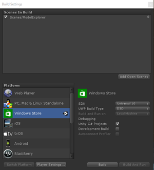

# Exporting and building a Unity Visual Studio solution

If you don't intend on using the system keyboard in your application, our recommendation is to use *D3D* as your application will use slightly less memory and have a slightly faster launch time. If you are using the TouchScreenKeyboard API in your project to use the system keyboard, you need to export as *XAML*.

## How to export from Unity

1.  When you are ready to export your project from Unity, open the **File** menu and select **Build Settings...**
2.  Click **Add Open Scenes** to add your scene to the build
3.  In the **Build Settings** dialog, choose the following options to export for HoloLens:
* **Platform:** *Windows Store* and be sure to select **Switch Platform** for your selection to take effect
* **SDK:** *Universal 10*
* **UWP Build Type:** *D3D* or *XAML*
4.  **Optional**: **Unity C# Projects:** Checked. NOTE: Checking this box allows you to 1.) debug your app in the Visual Studio remote debugger, and 2.) edit scripts in the Unity C# project while using IntelliSense for WinRT APIs.
5.  From the **Build Settings...** window, open **Player Settings...**
6.  Select the **Settings for Windows Store** tab
7.  Expand the **Other Settings** group
8.  In the **Rendering** section, check the **Virtual Reality Supported** checkbox to add a new **Virtual Reality Devices** list and confirm **"Windows Mixed Reality"** is listed as a supported device.
9.  Return to the **Build Settings** dialog
10. Select **Build**
11. In the Windows Explorer dialog that appears, create a new folder to hold Unity's build output. Generally, we name the folder "*App*".
12. Select the newly created folder and click **Select Folder**.
13. Once Unity has finished building, a Windows Explorer window will open to the project root directory. Navigate into the newly created folder.
14. Open the generated Visual Studio solution file located inside this folder.

## When to re-export from Unity

Checking the "C# Projects" checkbox when exporting your app from Unity creates a Visual Studio solution that includes all your Unity script files. This allows you to iterate on your scripts without re-exporting from Unity. However, if you want to make changes to your project that aren't just changing the contents of scripts, you will need to re-export from Unity. Some examples of times you need to re-export from Unity are:
* You add or remove assets in the Project tab.
* You change any value in the Inspector tab.
* You add or remove objects from the Hierarchy tab.
* You change any Unity project settings

## Building and deploying a Unity Visual Studio solution

The remainder of building and deploying apps happens in [Visual Studio](using-visual-studio.md). You will need to specify a Unity build configuration. Unity's naming conventions may differ from what you're usually used to in Visual Studio:

|  Configuration  |  Explanation | 
|----------|----------|
|  Debug  |  All optimizations off and the profiler is enabled. Used to debug scripts. | 
|  Master  |  All optimizations are turned on and the profiler is disabled. Used to submit apps to the Store. | 
|  Release  |  All optimizations are turned on and the profiler is enabled. Used to evaluate app performance. | 

Note, the above list is a subset of the common triggers that will cause the Visual Studio project to need to be generated. In general, editing .cs files from within Visual Studio will not require the project to be regenerated from within Unity.

## Troubleshooting

If you find that edits to your .cs files are not being recognized in your Visual Studio project, ensure that "Unity C# Projects" is checked when you generate the VS project from Unity's Build menu.
