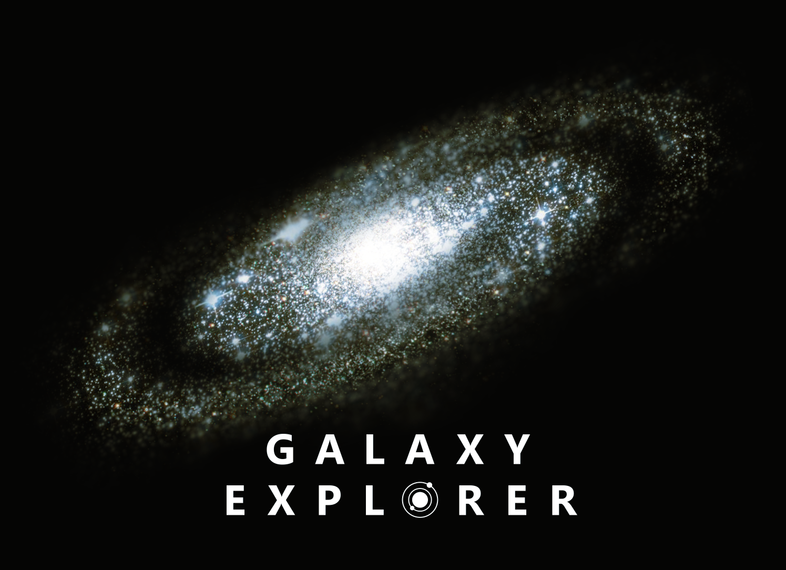

# The Making of Galaxy Explorer for HoloLens 2

Welcome to the journey of how we are updating Galaxy Explorer for HoloLens 2. [Galaxy Explorer](https://docs.microsoft.com/windows/mixed-reality/galaxy-explorer "Galaxy Explorer") was originally developed as an open source application for HoloLens (1st gen) through the Share Your Idea program, and is one of the first mixed reality experiences many people had. Now we are updating it for the [new and exciting capabilities of HoloLens 2](https://www.microsoft.com/hololens/hardware).

As one of the [Microsoft Mixed Reality Studios](###Mixed-Reality-Studios), we usually develop commercial grade solutions and are developing & testing on target platforms throughout the creative and development process. We now have the unique situation where don’t yet have access to HoloLens 2 devices, but are excited to start the updates to Galaxy Explorer. We're embarking on this project utilizing the frameworks and tools (like [MRTK v2](https://microsoft.github.io/MixedRealityToolkit-Unity/Documentation/GettingStartedWithTheMRTK.html)) as they become available to us and the community - and we want to bring you along for the ride.

Just like the original Galaxy Explorer, [our team](##Meet-the-team) will be [open sourcing the project on GitHub](https://github.com/Microsoft/GalaxyExplorer) to ensure that the community has full access. We will also be documenting our journey here in complete transparency about the ways in which we undertook porting from MRTK v1 to MRTK v2, how we enhanced the experience based on the new features available in HoloLens 2, and how we ensured that Galaxy Explorer remained a multi-platform experience. So whether you're viewing Galaxy Explorer on HoloLens (1st gen), HoloLens 2, a Windows Mixed Reality headset or on your Windows 10 desktop, we want to ensure that you're having an immersive experience and enjoy the journey as much as we are!

This page will expand as we progress through the project, and we'll link out to more detailed articles, code, design artefacts, additional MRTK v2 documentation, etc. to provide you with an insider's look at the project.

## Unveiling the new logo

We're excited to kick off with a preview of the new Galaxy Explorer logo! While paying homage to the original logo by featuring the Milky Way, we've designed a realistic visualization and updated the typography to provide a more sleek and modern feel. Included in the logo is a sneak peek at one of the new icons.

The design and typography of the logo will set the tone for the overall look and feel of UI elements throughout the experience. 

## Meet the team 

Our Mixed Reality studio team is made up of designers, 3D artists, UX specialists, developers, a program manager and a studio head. We hail from all over the world: Germany, Canada, Israel, the United States, Belgium, the United Kingdom and Japan. We are a multidisciplinary team that comes from a diverse background: gaming - both traditional and indie, digital marketing, health care and science.

We are excited to create Galaxy Explorer for HoloLens 2, and to update the HoloLens (1st gen), VR and desktop versions. 

On top from left to right: Artemis Tsouflidou (Developer), Angie Teickner (Visual Designer), David Janer (UX Designer), Laura Garrett (Delivery & Production Lead), Yasushi Zonno (Creative Lead), Eline Ledent (Developer), Ben Turner (Sr. Developer).
Bottom from left to right: Amit Rojtblat (Technical Artist), Martin Wettig (3D Artist), Dirk Songuer (Studio Head).
Not featured: Tim Gerken (Tech Lead), Oscar Salandin (Visual Designer).

## Additional information

### Mixed Reality Studios

Microsoft Mixed Reality Studio teams - located in the Americas, Europe and Asia-Pacific - are experts in user experience design, holographic computing, AR/VR technologies, and 3D development; including 3D asset creation, DirectX, Unity and Unreal. We help envision desired futures, design, build and deliver solutions, while enabling customers to create measurable impact across their organization. The studios work closely with over 22,000 Microsoft Services professionals for enterprise application integration, adoption, operations and support.
