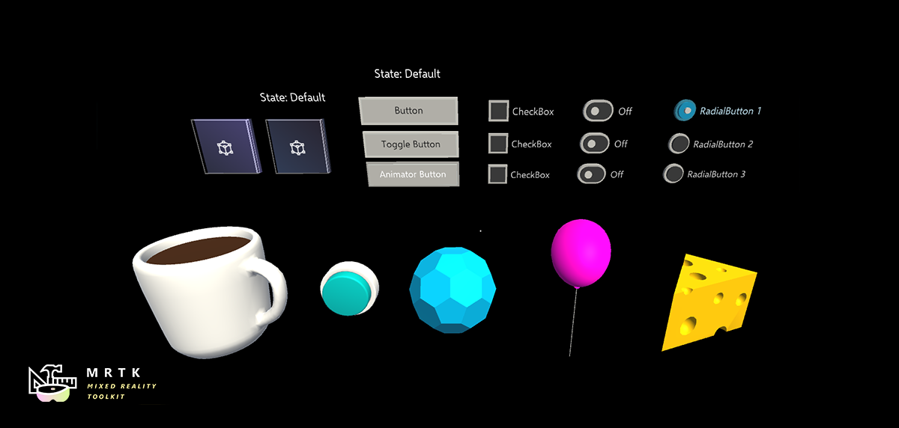
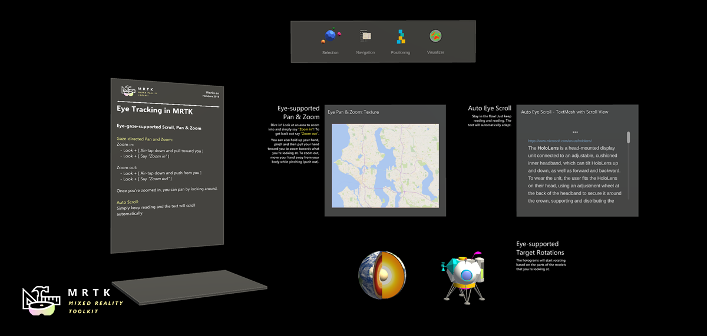

# Articulated hand and eye tracking in Unity

HoloLens 2 has introduced instinctual interactions using articulated hand and eye tracking input. The easiest way to leverage the new capability in Unity is through MRTK. 

* [Get started with articulated hand input in MRTK](https://microsoft.github.io/MixedRealityToolkit-Unity/Documentation/Input/HandTracking.html)
* [Get started with eye tracking input in MRTK](https://microsoft.github.io/MixedRealityToolkit-Unity/Documentation/EyeTracking/EyeTracking_Main.html)

## Building blocks supporting hands and eye tracking input in MRTK

MRTK provides a set of UI controls and building blocks to help you accelerate your development.
:::row:::
    :::column:::
 [**Button**](https://microsoft.github.io/MixedRealityToolkit-Unity/Documentation/README_Button.html)
A button control which supports various input methods including HoloLens2's articulated hand
    :::column-end:::
    :::column:::
 [**Bounding Box**](https://microsoft.github.io/MixedRealityToolkit-Unity/Documentation/README_BoundingBox.html)
Standard UI for manipulating objects in 3D space
    :::column-end:::
    :::column:::
 [**Manipulation Handler**](https://microsoft.github.io/MixedRealityToolkit-Unity/Documentation/README_ManipulationHandler.html) 
Script for manipulating objects with one or two hands
    :::column-end:::
:::row-end:::

:::row:::
    :::column:::
  [**Slate**](https://microsoft.github.io/MixedRealityToolkit-Unity/Documentation/README_Slate.html) 
2D style plane which supports scrolling with articulated hand input
    :::column-end:::
    :::column:::
 [**System Keyboard**](https://microsoft.github.io/MixedRealityToolkit-Unity/Documentation/README_SystemKeyboard.html)
Example script of using the system keyboard in Unity
    :::column-end:::
    :::column:::
 [**Interactable**](https://microsoft.github.io/MixedRealityToolkit-Unity/Documentation/README_Interactable.html)
A script for making objects interactable with visual states and theme support
    :::column-end:::
:::row-end:::

:::row:::
    :::column:::
 [**Solver**](https://microsoft.github.io/MixedRealityToolkit-Unity/Documentation/README_Solver.html)
Various object positioning behaviors such as tag-along, body-lock, constant view size and surface magnetism
    :::column-end:::
    :::column:::
 [**Object Collection**](https://microsoft.github.io/MixedRealityToolkit-Unity/Documentation/README_ManipulationHandler.html) 
Script for laying out an array of objects in a three-dimensional shape
    :::column-end:::
    :::column:::
 [**Tooltip**](https://microsoft.github.io/MixedRealityToolkit-Unity/Documentation/README_Tooltip.html)
Annotation UI with flexible anchor/pivot system, which can be used for labeling motion controllers and object
    :::column-end:::
:::row-end:::

:::row:::
    :::column:::
  [**App Bar**](https://microsoft.github.io/MixedRealityToolkit-Unity/Documentation/README_AppBar.html)
UI for Bounding Box's manual activation
    :::column-end:::
    :::column:::
 [**Pointers**](https://microsoft.github.io/MixedRealityToolkit-Unity/Documentation/Input/Pointers.html)
Learn about various types of pointers
    :::column-end:::
    :::column:::
 [**Fingertip Visualization**](https://microsoft.github.io/MixedRealityToolkit-Unity/Documentation/README_FingertipVisualization.html)
Visual affordance on the fingertip, which improves the confidence for the direct interaction
    :::column-end:::
:::row-end:::

:::row:::
    :::column:::
  [**Eye Tracking: Target Selection**](https://microsoft.github.io/MixedRealityToolkit-Unity/Documentation/EyeTracking/EyeTracking_TargetSelection.html) 
Combine eyes, voice and hand input to quickly and effortlessly select holograms across your scene
    :::column-end:::
    :::column:::
 [**Eye Tracking: Navigation**](https://microsoft.github.io/MixedRealityToolkit-Unity/Documentation/EyeTracking/EyeTracking_Navigation.html)
Learn how to auto scroll text or fluently zoom into focused content based on what you are looking at
    :::column-end:::
    :::column:::
  [**Eye Tracking: Heat Map**](https://microsoft.github.io/MixedRealityToolkit-Unity/Documentation/EyeTracking/EyeTracking_Visualization.html)
Examples for logging, loading and visualizing what users have been looking at in your app
    :::column-end:::
:::row-end:::

## Example scenes

Explore MRTK's various types of interactions and UI controls in [HandInteractionExamples.unity scene](https://microsoft.github.io/MixedRealityToolkit-Unity/Documentation/README_HandInteractionExamples.html).

## Next Development Checkpoint

If you're following the Unity development checkpoint journey we've laid out, you're in the midst of exploring the MRTK core building blocks. From here, you can proceed to the next building block: 

> [!div class="nextstepaction"]
> [Spatial mapping](spatial-mapping-in-unity.md)

Or jump to Mixed Reality platform capabilities and APIs:

> [!div class="nextstepaction"]
> [Shared experiences](shared-experiences-in-unity.md)

You can always go back to the [Unity development checkpoints](unity-development-overview.md#2-core-building-blocks) at any time.

## See also

* [Eye-based interaction](eye-gaze-interaction.md)
* [Eye tracking on HoloLens 2](eye-tracking.md)
* [Gaze and commit](gaze-and-commit.md)
* [Hands - Direct manipulation](direct-manipulation.md)
* [Hands - Gestures](gaze-and-commit.md#composite-gestures)
* [Hands - Point and commit](point-and-commit.md)
* [Instinctual interactions](interaction-fundamentals.md)
* [Motion controllers](motion-controllers.md)
* [UnityEngine.XR.WSA.Input](https://docs.unity3d.com/ScriptReference/XR.WSA.Input.InteractionManager.html)
* [UnityEngine.XR.InputTracking](https://docs.unity3d.com/ScriptReference/XR.InputTracking.html)
