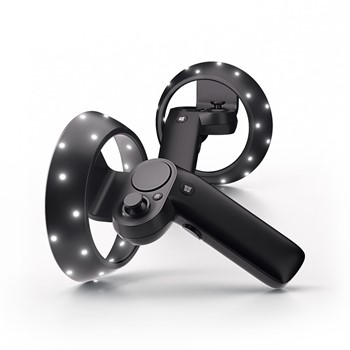

# Hardware accessories

Windows Mixed Reality devices support accessories. You'll pair supported accessories to HoloLens using Bluetooth, while you can use Bluetooth or USB to pair supported accessories to an immersive headset via the PC to which it is connected.

Two common scenarios for using accessories with HoloLens are as substitutes for the air tap gesture and the virtual keyboard. For this, the two most common accessories are the **HoloLens Clicker** and **Bluetooth keyboards**. Microsoft HoloLens includes a Bluetooth 4.1 radio and supports [Bluetooth HID](https://en.wikipedia.org/wiki/List_of_Bluetooth_profiles#Human_Interface_Device_Profile_.28HID.29) and [Bluetooth GATT](https://en.wikipedia.org/wiki/List_of_Bluetooth_profiles#Generic_Attribute_Profile_.28GATT.29) profiles.

Windows Mixed Reality immersive headsets require accessories for input beyond [gaze](gaze.md) and [voice](voice-input.md). Supported accessories include **keyboard and mouse**, **gamepad**, and **[motion controllers](motion-controllers.md)**.

## Pairing Bluetooth accessories

Pairing a Bluetooth peripheral with Microsoft HoloLens is similar to pairing a Bluetooth peripheral with a Windows 10 desktop or mobile device:
1. From the Start Menu, open the **Settings** app
2. Go to **Devices**
3. Turn on the Bluetooth radio if it is off using the slider switch
4. Place your Bluetooth device in pairing mode. This varies from device to device. On most Bluetooth devices this is done by pressing and holding one or more buttons.
5. Wait for the name of the device to show up in the list of Bluetooth devices. When it does, select the device then select the **Pair** button. If you have many Bluetooth devices nearby you may need to scroll to the bottom of the Bluetooth device list to see the device you are trying to pair.
6. When pairing Bluetooth peripherals with input capability (e.g.: Bluetooth keyboards), a 6-digit or an 8-digit pin may be displayed. Be sure to type that pin on the peripheral and then press enter to complete pairing with Microsoft HoloLens.

## Motion controllers

Windows Mixed Reality [motion controllers](motion-controllers.md) are supported by immersive headsets, but not HoloLens. These controllers offer precise and responsive tracking of movement in your field of view using the sensors in the immersive headset, meaning there is no need to install hardware on the walls in your space. Each controller features several methods of input.

## HoloLens Clicker

The HoloLens Clicker is the first peripheral device built specifically for HoloLens and is included with the HoloLens Development Edition. The HoloLens Clicker allows a user to click and scroll with minimal hand motion as a replacement for the air-tap gesture. It is not a replacement for all [gestures](gestures.md). For instance, [bloom](gestures.md#bloom) and [resize or move](gestures.md#composite-gestures) gestures use hand motions. The HoloLens clicker is an orientation sensor device with a simple button. It connects to the HoloLens using Bluetooth Low Energy (BTLE).

To select a [hologram](hologram.md), gaze at it, and then click. Orientation of the clicker does not matter for this operation. To scroll or pan, click and hold, then rotate the Clicker up/down or left/right. While scrolling, you’ll reach the fastest speed with as little as +/- 15° of wrist rotation. Moving more will not scroll any faster.

There are two LEDs inside the Clicker:
* The white LED indicates whether the device is pairing (blinking) or charging (solid)
* The amber LED indicates that the device has low battery (blinking) or has suffered a failure (solid)

You can expect 2 weeks or more of regular use on a full charge (i.e., 2-3 hours on a wall charger). When the battery is low, the amber LED will blink 10 times over a 5-second period if you press the button or wake it from sleep. The amber LED will blink more rapidly over a 5-second period if your Clicker is in critically low battery mode.

## Bluetooth keyboards

English language Qwerty Bluetooth keyboards can be paired and used anywhere you can use the holographic keyboard. Getting a quality keyboard makes a difference, so we recommend the [Microsoft Universal Foldable Keyboard](https://www.microsoft.com/accessories/en-us/products/keyboards/universal-foldable-keyboard/gu5-00001) or the [Microsoft Designer Bluetooth Desktop](https://www.microsoft.com/accessories/en-us/products/keyboards/designer-bluetooth-desktop/7n9-00001).

## Bluetooth gamepads

You can use a controller with apps and games that specifically enable gamepad support. Gamepads cannot be used to control the HoloLens user interface.

Xbox Wireless Controllers that come with the Xbox One S or sold as accessories for the Xbox One S feature Bluetooth connectivity that enable them to be used with HoloLens and immersive headsets. The Xbox Wireless Controller [must be updated](http://support.xbox.com/en-US/xbox-one/accessories/update-controller-for-stereo-headset-adapter) before it can be used with HoloLens.

Other brands of Bluetooth gamepads may work with Windows Mixed Reality devices, but support will vary by application.

## Other Bluetooth accessories

As long as the peripheral supports either the Bluetooth HID or GATT profiles, it will be able to pair with HoloLens. Other Bluetooth HID and GATT devices besides keyboard, mice, and the HoloLens Clicker may require a companion application on Microsoft HoloLens to be fully functional.

Unsupported peripherals include:
* Peripherals in the Bluetooth audio profiles are not supported.
* Bluetooth audio devices such as speakers and headsets may appear as available in the Settings app, but are not supported to be used with Microsoft HoloLens as an audio endpoint.
* Bluetooth-enabled phones and PCs are not supported to be paired and used for file transfer.

## Unpairing a Bluetooth peripheral
1. From the Start Menu, open the **Settings** app
2. Go to **Devices**
3. Turn on the Bluetooth radio if it is off
4. Find your device in the list of available Bluetooth devices
5. Select your device from the list and then select the **Remove** button

## Disabling Bluetooth on Microsoft HoloLens

This will turn off the RF components of the Bluetooth radio and disable all Bluetooth functionality on Microsoft HoloLens.
1. From the Start Menu, open the **Settings** app
2. Go to **Devices**
3. Move the slider switch for Bluetooth to the OFF position
