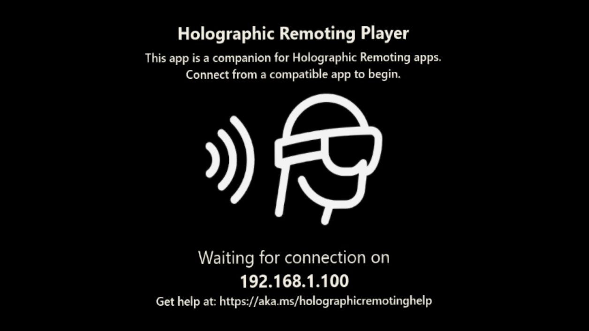

# Holographic Remoting Player

The Holographic Remoting Player is a companion app that connects to PC apps and games that support Holographic Remoting. Holographic Remoting streams holographic content from a PC to your Microsoft HoloLens in real-time, using a Wi-Fi connection.

The Holographic Remoting Player can only be used with PC apps that are specifically designed to support Holographic Remoting.

## Connecting to the Holographic Remoting Player

Follow your app's instructions to connect to the Holographic Remoting Player. You will need to enter the IP address of your HoloLens device, which you can see on the Remoting Player's main screen as follows:

Whenever you see the main screen, you will know that you do not have an app connected.

Note that the holographic remoting connection is **not encrypted**. You should always use Holographic Remoting over a secure Wi-Fi connection that you trust.

## Quality and Performance

The quality and performance of your experience will vary based on three factors:
* **The holographic experience you're running** - Apps that render high-resolution or highly-detailed content may require a faster PC or faster wireless connection.
* **Your PC's hardware** - Your PC needs to be able to run and encode your holographic experience at 60 frames per second. For a graphics card, we generally recommend a GeForce GTX 970 or AMD Radeon R9 290 or better. Again, your particular experience may require a higher or lower-end card.
* **Your Wi-Fi connection** - Your holographic experience is streamed over Wi-Fi. Use a fast network with low congestion to maximize quality. Using a PC that is connected over an Ethernet cable, rather than Wi-Fi, may also improve quality.

## Diagnostics

To measure the quality of your connection, say **"enable diagnostics"** while on the main screen of the Holographic Remoting Player. When diagnostics are enabled, the app will show you:
* **FPS** - The average number of rendered frames the remoting player is receiving and rendering per second. The ideal is 60 FPS.
* **Latency** - The average amount of time it takes for a frame to go from your PC to the HoloLens. The lower the better. This is largely dependent on your Wi-Fi network.

While on the main screen, you can say **"disable diagnostics"** to turn off diagnostics.

## PC System Requirements
* Your PC **must** be running the Windows 10 Anniversary Update.
* We recommend a GeForce GTX 970 or AMD Radeon R9 290 or better graphics card.
* We recommend you connect your PC to your network via ethernet to reduce the number of Wireless hops.

## See Also
* [Holographic remoting software license terms](microsoft-holographic-remoting-software-license-terms.md)
* [Microsoft Privacy Statement](https://go.microsoft.com/fwlink/?LinkId=521839)
