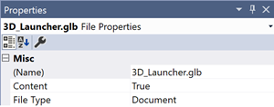

# Implementing 3D app launchers

The [Windows Mixed Reality home](navigating-the-windows-mixed-reality-home.md) is the starting point where users land before launching applications. When creating an application for Windows Mixed Reality, by default apps are launched as 2D slates with their app's logo. When developing experiences for Windows Mixed Reality **immersive headsets**, a 3D launcher can optionally be defined to override the default 2D launcher for your application. In general, 3D launchers are recommended for launching exclusive applications that take users out of the Windows Mixed Reality home whereas the default 2D launcher is preferred when the app is activated in place.

**Note:** 3D app launchers are not currently available for use on HoloLens.

>[!VIDEO https://www.youtube.com/embed/TxIslHsEXno]

## 3D app launcher creation process

There are 3 steps to creating a 3D app launcher.
1. [Designing and concepting](3d-app-launcher-design-guidance.md)
2. [Modeling and exporting](implementing-3d-deep-links-for-your-app-in-the-windows-mixed-reality-home.md)
3. Integrating it into your application (You are here.)

## Configuring the 3D launcher

When you create a new project in Visual Studio, it creates a simple default tile that displays your app's name and logo. To replace this 2D representation with a custom 3D model edit the app manifest of your application to include the “MixedRealityModel” element as part of your default tile definition. To revert to the 2D launcher just remove the MixedRealityModel definition from the manifest.

## XML
> [!NOTE]
> This feature was added as part of the Fall Creators updated. Make sure your application is targeting a version of the Windows SDK greater than or equal to 10.0.16299.91 which can be downloaded [here](https://developer.microsoft.com/en-US/windows/downloads/windows-10-sdk)

 First, at the top of the app manifest add the uap5 schema and include it as an ignorable namespace:

```xml
<Package xmlns:mp="http://schemas.microsoft.com/appx/2014/phone/manifest" 
         xmlns:uap="http://schemas.microsoft.com/appx/manifest/uap/windows10" 
         xmlns:uap2="http://schemas.microsoft.com/appx/manifest/uap/windows10/2" 
         xmlns:uap5="http://schemas.microsoft.com/appx/manifest/uap/windows10/5"
         IgnorableNamespaces="uap uap2 uap5 mp"
         xmlns="http://schemas.microsoft.com/appx/manifest/foundation/windows10">
```

Next specify the "MixedRealityModel" in the default tile for your application:

```xml
<Applications>
    <Application Id="App"
      Executable="$targetnametoken$.exe"
      EntryPoint="ExampleApp.App">
      <uap:VisualElements
        DisplayName="ExampleApp"
        Square150x150Logo="Assets\Logo.png"
        Square44x44Logo="Assets\SmallLogo.png"
        Description="ExampleApp"
        BackgroundColor="#464646">
        <uap:DefaultTile Wide310x150Logo="Assets\WideLogo.png" >
          <uap5:MixedRealityModel Path="Assets\My3DTile.glb" />
        </uap:DefaultTile>
        <uap:SplashScreen Image="Assets\SplashScreen.png" />
      </uap:VisualElements>
    </Application>
</Applications>
```

The MixedRealityModel elements accepts a file path pointing to a 3D asset stored in your app package. Currently only 3D models delivered using the .glb file format and authored against the [Windows Mixed Reality 3D asset authoring instructions](creating-3d-models-for-use-in-the-windows-mixed-reality-home.md) are supported. Assets must be stored in the app package and animation is not currently supported. If the “Path” parameter is left blank Windows will show the 2D slate instead of the 3D launcher. **Note:** the .glb asset must be marked as "Content" in your build settings before building and running your app 

## Using Unity

When working with Unity the project must be built and opened in Visual Studio before the App Manifest can be edited. **Note:** The 3D launcher must be redefined in the manifest when building and deploying a new Visual Studio solution from Unity.

## Creating 3D app launcher assets

3D assets to be used as launchers for your application must be authored using the [Windows Mixed Reality authoring guidelines](creating-3d-models-for-use-in-the-windows-mixed-reality-home.md) to ensure compatibility. Assets that fail to meet this authoring specification will not render successfully in the Windows Mixed Reality home.

## See also
* [Mixed Reality Model Sample](https://github.com/Microsoft/Windows-universal-samples/tree/master/Samples/MixedRealityModel) containing a 3D app launcher.
* [3D app launcher design guidance](3d-app-launcher-design-guidance.md)
* [Implementing 3D deep links for your app in the Windows Mixed Reality home](implementing-3d-deep-links-for-your-app-in-the-windows-mixed-reality-home.md)
* [Creating 3D models for use in the Windows Mixed Reality home](creating-3d-models-for-use-in-the-windows-mixed-reality-home.md)
* [Navigating the Windows Mixed Reality home](navigating-the-windows-mixed-reality-home.md)
