# MR and Azure 302: Computer vision

In this course, you will learn how to add Computer Vision API capabilities to a mixed reality application using Azure Cognitive Services, with the Microsoft Computer Vision API.


The Microsoft Computer Vision is a set of APIs designed to provide developers with image processing and analysis (with return information), using advanced algorithms, all from the cloud. Developers upload an image or image URL, and the Microsoft Computer Vision API algorithms analyze the visual content, based upon inputs chosen the user, which then can return information, including, identifying the type and quality of an image, detect human faces (returning their coordinates), and tagging, or categorizing images. For more information, visit the [Microsoft Computer Vision API page](https://azure.microsoft.com/en-gb/services/cognitive-services/computer-vision/).

Having completed this lab, you will have a mixed reality HoloLens application, which will be able to do the following:

1.	Using the Tap gesture, the camera of the HoloLens will capture an image.
2.	The image will be sent to the Azure Computer Vision API Service. 
3.	The objects recognized will be listed in a simple UI group positioned in the Unity Scene.

In your application, it is up to you as to how you will integrate the results with your design. This Lab is designed to teach you how to integrate an Azure Service with your Unity Project. It is your job to use the knowledge you gain from this Lab to enhance your mixed reality Application.

This Lab is a self-contained tutorial, which doesn’t directly involve any other mixed reality Labs.

## Device support

<table>
<tr>
<th>Course</th><th style="width:150px"> <a href="hololens-hardware-details.md">HoloLens</a></th><th style="width:150px"> <a href="immersive-headset-hardware-details.md">Immersive headsets</a></th>
</tr><tr>
<td> MR and Azure 302: Computer vision</td><td style="text-align: center;"> ✔️</td><td style="text-align: center;"> ✔️</td>
</tr>
</table>

## Prerequisites
For the most up-to-date prerequisites for developing with mixed reality, including with the Microsoft HoloLens and immersive headsets, visit the [Install the tools](https://docs.microsoft.com/en-us/windows/mixed-reality/install-the-tools) article. 

> [!NOTE] 
> This tutorial is designed for developers who have basic experience with Unity and C#.
Please also be aware that the prerequisites, and written instructions, within this document represent what has been tested and verified at the time of writing. You are free to use the latest tools, as mentioned within the *Install the tools* article, though it should not be assumed that the documents information will continue to be valid, should you use a different version of any of the below prerequisites.

The following hardware and software is required:

-	Windows 10 Fall Creators Update, Developer Mode enabled
-	Windows 10 SDK (latest version)
-	[Unity 2017.4.1f1](https://unity3d.com/unity/qa/lts-releases?version=2017.4)
-	A HoloLens, **Developer Mode enabled**
-	Visual Studio 2017.15.4 or higher
-	A PC compatible with Windows mixed reality 
-	A subscription to Azure Computer Vision API Service, with the Auth Key
-	Internet Access for Azure, and for Computer Vision API retrieval. For more information, please follow this [LINK](https://azure.microsoft.com/en-us/services/cognitive-services/computer-vision/).

> [!NOTE] 
> It is also possible to develop this lab for immersive headsets. Follow the document as is, and throughout you will be provided with information for any specific section which might need to be different, so to work with immersive headsets.  
> Please also be aware, that you will need a **camera** available for use with capture (either internal within your computer or external USB) as current immersive headsets do not have cameras.

### Before you start

1.	To avoid encountering issues building this project, it is strongly suggested that you create the project mentioned in this tutorial in a root or near-root folder (long folder paths can cause issues at build-time).
2.	Set up and test your HoloLens. If you need support setting up your HoloLens, please click [HERE](https://docs.microsoft.com/en-us/hololens/hololens-setup). 
3.	It is a good idea to perform Calibration and Sensor Tuning when beginning developing a new HoloLens App (sometimes it can help to perform those tasks for each user). 

For help on Calibration, please follow this [LINK](https://developer.microsoft.com/en-us/windows/mixed-reality/calibration).

For help on Sensor Tuning, please follow this [LINK](https://developer.microsoft.com/en-us/windows/mixed-reality/sensor_tuning).

## Chapter 1 – The Azure Portal: Create the Computer Vision API Service

To use the Computer Vision API service in Azure, you will need to configure an instance of the service to be made available to your application.

1.	First, log in to the [Azure Portal](https://portal.azure.com). 

> [!NOTE]
> If you do not already have an Azure account, you will need to create one. If you are following this tutorial in a classroom or lab situation, ask your instructor or one of the proctors for help setting up your new account.

2.	Once you are logged in, click on ***New*** in the top left corner, and search for ***Computer Vision API***, and click ***Enter***.

    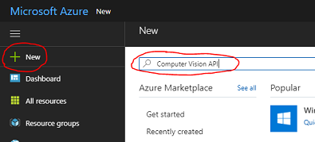

> [!NOTE]
> The word ***New*** may have been replaced with ***Create a resource***, in newer portals.
 
3.	The new page will provide a description of the **Computer Vision API** service. At the bottom left of this page, select the ***Create*** button, to create an association with this service.

    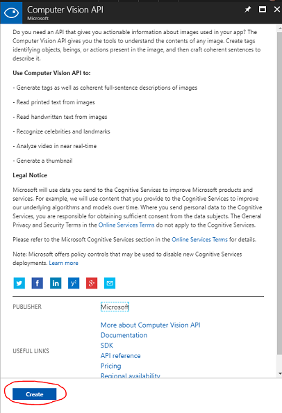
 
4.	Once you have clicked on ***Create***:
    1. Insert your desired **Name** for this service instance.
    2. Select a **Subscription**.
    3. Select the **Pricing Tier** appropriate for you, if this is the first time creating a **Computer Vision API** Service, a free tier (named F0) should be available to you.
    4. Choose a **Resource Group** or create a new one. A resource group provides a way to monitor, control access, provision and manage billing for a collection of Azure assets. It is recommended to keep all the Azure services associated with a single project (e.g. such as these labs) under a common resource group). 
    
        > If you wish to read more about Azure Resource Groups, please follow this [LINK](
    https://docs.microsoft.com/en-us/azure/azure-resource-manager/resource-group-portal).

    5. Determine the Location for your resource group (if you are creating a new Resource Group). The location would ideally be in the region where the application would run. Some Azure assets are only available in certain regions.

    6. You will also need to confirm that you have understood the Terms and Conditions applied to this Service.
    7. Click Create.
 
        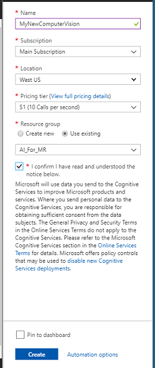

5.	Once you have clicked on ***Create***, you will have to wait for the service to be created, this might take a minute.
6.	A notification will appear in the portal once the Service instance is created.

     
 
7.	Click on the notification to explore your new Service instance. 

    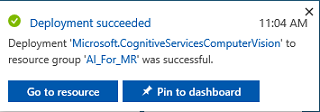
 
8. Click the ***Go to resource*** button in the notification to explore your new Service instance. You will be taken to your new Computer Vision API service instance. 

    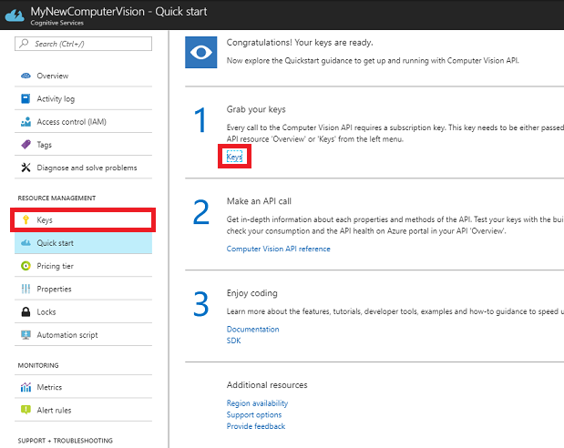
 
9.	Within this tutorial, your application will need to make calls to your service, which is done through using your service’s Subscription Key.
10.	From the **Quick start** page, of your **Computer Vision API** service, navigate to the first step, ***Grab your keys***, and click ***Keys*** (you can also achieve this by clicking the blue hyperlink Keys, located in the services navigation menu, denoted by the key icon). This will reveal your service **Keys**.
11.	Take a copy of one of the displayed keys, as you will need this later in your project. 

12. Go back to the **Quick start** page, and from there, fetch your endpoint. Be aware yours may be different, depending on your region (which if it is, you will need to make a change to your code later). Take a copy of this endpoint for use later:

    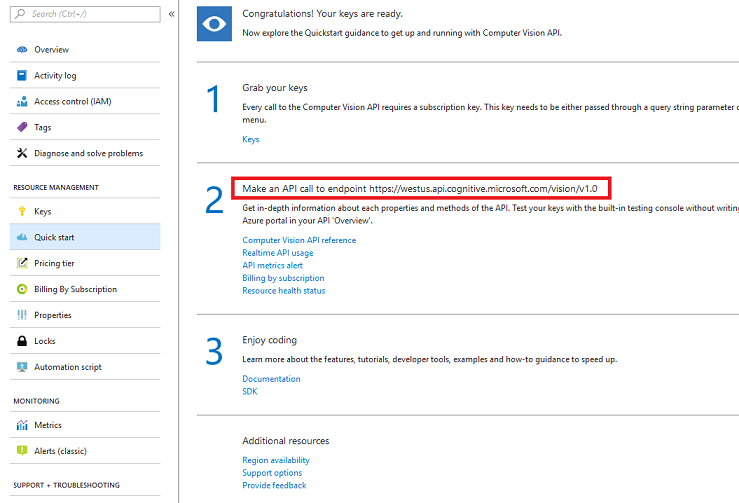

> [!TIP]
> You can check what the various endpoints are [HERE](https://westus.dev.cognitive.microsoft.com/docs/services/56f91f2d778daf23d8ec6739/operations/56f91f2e778daf14a499e1fa). 

## Chapter 2 – Set up the Unity Project

The following is a typical set up for developing with mixed reality, and as such, is a good template for other projects.

1.	Open **Unity** and click **New**. 

    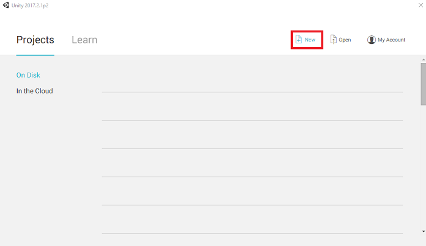

2.	You will now need to provide a Unity Project name. Insert **MR_ComputerVision**. Make sure the project type is set to **3D**. Set the **Location** to somewhere appropriate for you (remember, closer to root directories is better). Then, click **Create project**.

    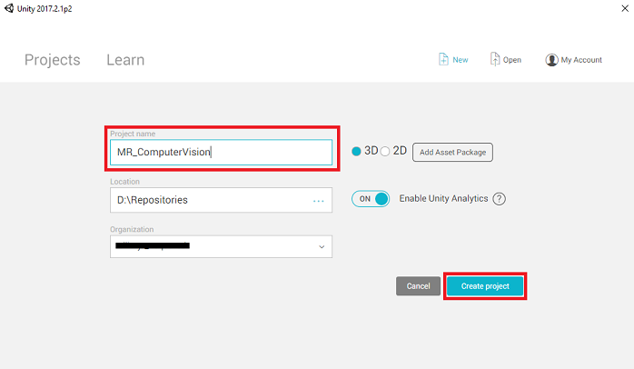

3.	With Unity open, it is worth checking the default **Script Editor** is set to **Visual Studio**. Go to ***Edit > Preferences*** and then from the new window, navigate to **External Tools**. Change **External Script Editor** to **Visual Studio 2017**. Close the **Preferences** window.

    

4.	Next, go to ***File > Build Settings*** and select **Universal Windows Platform**, then click on the ***Switch Platform*** button to apply your selection.

    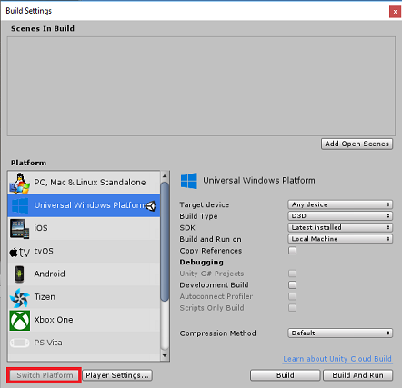

5.	While still in ***File > Build Settings*** and make sure that:
    1. **Target Device** is set to **HoloLens**
        > For the immersive headsets, set **Target Device** to *Any Device*.
    2. **Build Type** is set to **D3D**
    3. **SDK** is set to **Latest installed**
    4. **Visual Studio Version** is set to **Latest installed**
    5. **Build and Run** is set to **Local Machine**
    6. Save the scene and add it to the build.

        1. Do this by selecting **Add Open Scenes**. A save window will appear.
        
            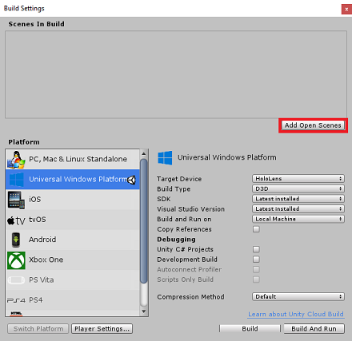

        2. Create a new folder for this, and any future, scene, then select the **New folder** button, to create a new folder, name it **Scenes**.

            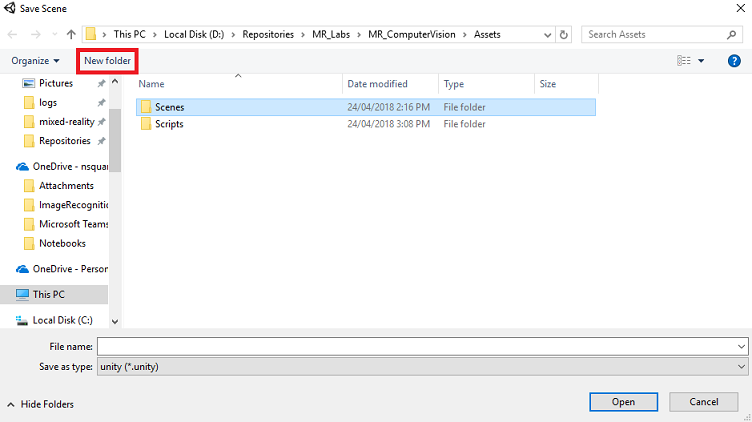

        3. Open your newly created **Scenes** folder, and then in the **File name**: text field, type **MR_ComputerVisionScene**, then press **Save**.

            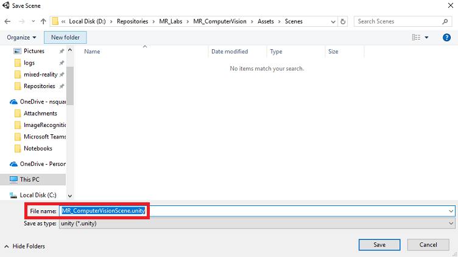

            > Be aware, you must save your Unity scenes within the *Assets* folder, as they must be associated with the Unity Project. Creating the scenes folder (and other similar folders) is a typical way of structuring a Unity project.

    7. The remaining settings, in **Build Settings**, should be left as default for now.

6. In the ***Build Settings*** window, click on the **Player Settings** button, this will open the related panel in the space where the **Inspector** is located. 

    

7. In this panel, a few settings need to be verified:

    1. In the **Other Settings** tab:

        1. **Scripting Runtime Version** should be ***Stable*** (.NET 3.5 Equivalent).
        2. **Scripting Backend** should be ***.NET***
        3. **API Compatibility Level** should be ***.NET 4.6***

            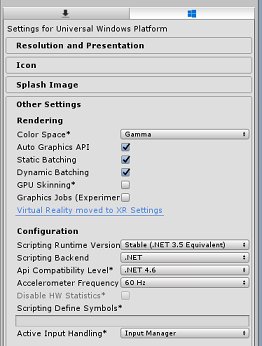
      
    2. Within the **Publishing Settings** tab, under **Capabilities**, check:
        1. ***InternetClient***
        2. ***Webcam***

            

    3. Further down the panel, in **XR Settings** (found below **Publish Settings**), tick ***Virtual Reality Supported***, make sure the ***Windows Mixed Reality SDK*** is added.

        

8.	Back in **Build Settings** _Unity C#_ Projects is no longer greyed out; tick the checkbox next to this. 
9.	Close the Build Settings window.
10.	Save your Scene and Project (**FILE > SAVE SCENE / FILE > SAVE PROJECT**).

## Chapter 3 – Camera Setup

> [!IMPORTANT]
> If you wish to skip the *Unity Set up* component of this lab, and continue straight into code, feel free to download this [.unitypackage](https://github.com/Microsoft/HolographicAcademy/raw/Azure-MixedReality-Labs/Azure%20Mixed%20Reality%20Labs/Lab%202%20-%20Computer%20Vision%20API/Azure-MR-Lab-2.unitypackage), import it into your project as a [**Custom Package**](https://docs.unity3d.com/Manual/AssetPackages.html), and then continue from **Chapter 5**.

1.	In the **Hierarchy Panel**, select the ***Main Camera***. 
2.	Once selected, you will be able to see all the components of the **Main Camera** in the **Inspector Panel**.
    1. The **Camera object** must be named ***Main Camera*** (note the spelling!)
    2. The Main Camera **Tag** must be set to ***MainCamera*** (note the spelling!)
    3. Make sure the **Transform Position** is set to ***0, 0, 0***
    4. Set **Clear Flags** to ***Solid Color*** (ignore this for immersive headset).
    5. Set the **Background** Color of the Camera Component to **Black, Alpha 0 (Hex Code: #00000000)** (ignore this for immersive headset).

        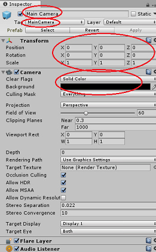
 
3.	Next, you will have to create a simple “Cursor” object attached to the **Main Camera**, which will help you position the image analysis output when the application is running. 
This Cursor will determine the center point of the camera focus.

To create the Cursor:
1.	In the **Hierarchy Panel**, right-click on the **Main Camera**. Under **3D Object**, click on **Sphere**.

    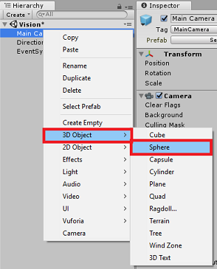
 
2.	Rename the **Sphere** to ***Cursor*** (double click the Cursor object or press the ‘F2’ keyboard button with the object selected), and make sure it is located as child of the **Main Camera**.

3.	In the **Hierarchy Panel**, left click on the ***Cursor***. With the Cursor selected, adjust the following variables in the **Inspector Panel**:

    1. Set the **Transform Position** to ***0, 0, 5***
    2. Set the **Scale** to ***0.02, 0.02, 0.02***

        
  
## Chapter 4 – Setup the Label System

Once you have captured an image with the HoloLens’ camera, that image will be sent to your **Azure Computer Vision API** Service instance for analysis. 

The results of that analysis will be a list of recognized objects called **Tags**. 

You will use Labels (as a 3D text in world space) to display these Tags at the location the photo was taken.

The following steps will show how to setup the **Label** object.

1.	Right-click anywhere in the Hierarchy Panel (the location does not matter at this point), under **3D Object**, add a ***3D Text***. Name it ***LabelText***.

    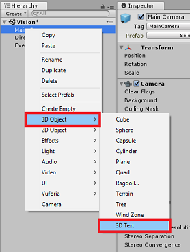
 
2.	In the **Hierarchy Panel**, left click on the ***LabelText***. With the ***LabelText*** selected, adjust the following variables in the **Inspector Panel**:
    1. Set the **Position** to ***0,0,0***
    2. Set the **Scale** to ***0.01, 0.01, 0.01***
    3. In the component **Text Mesh**:
    4. Replace all the text within ***Text***, with "..."        
    5. Set the **Anchor** to ***Middle Center***
    6. Set the **Alignment** to ***Center***
    7. Set the **Tab Size** to ***4***
    8. Set the **Font Size** to ***50***
    9. Set the **Color** to ***#FFFFFFFF***

    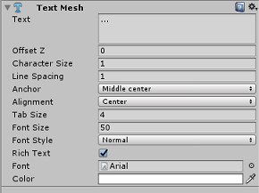

3.	Drag the **LabelText** from the **Hierarchy Panel**, into the **Asset Folder**, within in the **Project Panel**. This will make the **LabelText** a Prefab, so that it can be instantiated in code.

    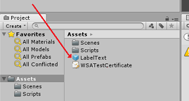
 
4.	You should delete the ***LabelText*** from the **Hierarchy Panel**, so that it will not be displayed in the opening scene. As it is now a prefab, which you will call on for individual instances from your Assets folder, there is no need to keep it within the scene. 
5.	The final object structure in the **Hierarchy Panel** should be like the one shown in the image below:

    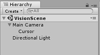

## Chapter 5 – Create the ***ResultsLabel*** class

The first script you need to create is the ***ResultsLabel*** class, which is responsible for the following: 
- Creating the Labels in the appropriate world space, relative to the position of the Camera.
- Displaying the Tags from the Image Anaysis.

To create this class: 

1.	Right-click in the **Project Panel**, then ***Create > Folder***. Name the folder **Scripts**. 

    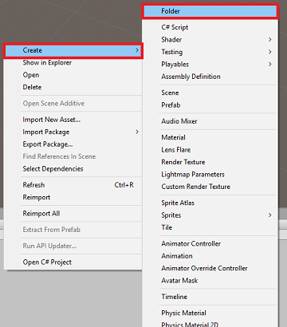

2.	With the **Scripts** folder create, double click it to open. Then within that folder, right-click, and select ***Create >*** then **C# Script**. Name the script ***ResultsLabel***. 

3.	Double click on the new ***ResultsLabel*** script to open it with **Visual Studio**.

4.	Inside the Class insert the following code in the ***ResultsLabel*** class:

```csharp
    using System.Collections.Generic;
    using UnityEngine;

    public class ResultsLabel : MonoBehaviour
    {	
        public static ResultsLabel instance;

        public GameObject cursor;

        public Transform labelPrefab;

        [HideInInspector]
        public Transform lastLabelPlaced;

        [HideInInspector]
        public TextMesh lastLabelPlacedText;

        private void Awake()
        {
            // allows this instance to behave like a singleton
            instance = this;
        }

        /// <summary>
        /// Instantiate a Label in the appropriate location relative to the Main Camera.
        /// </summary>
        public void CreateLabel()
        {
            lastLabelPlaced = Instantiate(labelPrefab, cursor.transform.position, transform.rotation);

            lastLabelPlacedText = lastLabelPlaced.GetComponent<TextMesh>();

            // Change the text of the label to show that has been placed
            // The final text will be set at a later stage
            lastLabelPlacedText.text = "Analysing...";
        }

        /// <summary>
        /// Set the Tags as Text of the last Label created. 
        /// </summary>
        public void SetTagsToLastLabel(Dictionary<string, float> tagsDictionary)
        {
            lastLabelPlacedText = lastLabelPlaced.GetComponent<TextMesh>();

            // At this point we go through all the tags received and set them as text of the label
            lastLabelPlacedText.text = "I see: \n";

            foreach (KeyValuePair<string, float> tag in tagsDictionary)
            {
                lastLabelPlacedText.text +=
                    tag.Key + ", Confidence: " + tag.Value.ToString("0.00 \n");
            }    
        }
    }
```

6.	Be sure to save your changes in **Visual Studio** before returning to **Unity**.
7.	Back in the **Unity Editor**, click and drag the ***ResultsLabel*** class from the **Scripts** folder to the **Main Camera** object in the **Hierarchy Panel**.
8.	Click on the ***Main Camera*** and look at the **Inspector Panel**.

You will notice that from the script you just dragged into the Camera, there are two fields: ***Cursor*** and ***Label Prefab***.

9.	Drag the object called **Cursor** from the **Hierarchy Panel** to the slot named **Cursor**, as shown in the image below.
10.	Drag the object called ***LabelText*** from the **Assets Folder** in the **Project Panel** to the slot named **Label Prefab**, as shown in the image below. 

    

## Chapter 6 – Create the ***ImageCapture*** class

The next class you are going to create is the ***ImageCapture*** class. 
This class is responsible for:

-	Capturing an Image using the HoloLens Camera and storing it in the App Folder.
-	Capturing Tap gestures from the user.

To create this Class: 
1.	Go to the **Scripts** folder you created previously. 
2.	Right-click inside the folder, ***Create > C# Script***. Call the script ***ImageCapture***. 
3.	Double click on the new ***ImageCapture*** script to open it with **Visual Studio**.
4.	Add the following namespaces to the top of the file:

```csharp
    using System.IO;
    using System.Linq;
    using UnityEngine;
    using UnityEngine.XR.WSA.Input;
    using UnityEngine.XR.WSA.WebCam;
```

5.	Then add the following variables inside the ***ImageCapture*** class, above the **Start()** method:

```csharp
    public static ImageCapture instance; 
    public int tapsCount;
    private PhotoCapture photoCaptureObject = null;
    private GestureRecognizer recognizer;
    private bool currentlyCapturing = false;
```
 
The **tapsCount** variable will store the number of tap gestures captured from the user. This number is used in the naming of the images captured.

6.	Code for **Awake()** and **Start()** methods now needs to be added. These will be called when the class initializes:

```csharp
    private void Awake()
    {
	    // Allows this instance to behave like a singleton
        instance = this;
    }

    void Start()
    {
        // subscribing to the Hololens API gesture recognizer to track user gestures
        recognizer = new GestureRecognizer();
        recognizer.SetRecognizableGestures(GestureSettings.Tap);
        recognizer.Tapped += TapHandler;
        recognizer.StartCapturingGestures();
    }
```

7.	Implement a handler that will be called when a Tap gesture occurs. 

```csharp
    /// <summary>
    /// Respond to Tap Input.
    /// </summary>
    private void TapHandler(TappedEventArgs obj)
    {
        // Only allow capturing, if not currently processing a request.
        if(currentlyCapturing == false)
        {
            currentlyCapturing = true;
            
            // increment taps count, used to name images when saving
            tapsCount++;

            // Create a label in world space using the ResultsLabel class
            ResultsLabel.instance.CreateLabel();

            // Begins the image capture and analysis procedure
            ExecuteImageCaptureAndAnalysis();
        }
    }
```
 
The **TapHandler** method increments the number of taps captured from the user and uses the current Cursor position to determine where to position a new Label.

This method then calls the **ExecuteImageCaptureAndAnalysis** method to begin the core functionality of this application.

8.	Once an Image has been captured and stored, the following handlers will be called. If the process is successful, the result is passed to the **VisionManager** (which you are yet to create) for analysis.

```csharp
    /// <summary>
    /// Register the full execution of the Photo Capture. If successful, it will begin 
    /// the Image Analysis process.
    /// </summary>
    void OnCapturedPhotoToDisk(PhotoCapture.PhotoCaptureResult result)
    {
        // Call StopPhotoMode once the image has successfully captured
        photoCaptureObject.StopPhotoModeAsync(OnStoppedPhotoMode);
    }

    void OnStoppedPhotoMode(PhotoCapture.PhotoCaptureResult result)
    {
        // Dispose from the object in memory and request the image analysis 
        // to the VisionManager class
        photoCaptureObject.Dispose();
        photoCaptureObject = null;
        StartCoroutine(VisionManager.instance.AnalyseLastImageCaptured()); 
    }
```
 
9.	Then add the method that the application uses to start the Image capture process and store the image.

```csharp    
    /// <summary>    
    /// Begin process of Image Capturing and send To Azure     
    /// Computer Vision service.   
    /// </summary>    
    private void ExecuteImageCaptureAndAnalysis()  
    {    
        // Set the camera resolution to be the highest possible    
        Resolution cameraResolution = PhotoCapture.SupportedResolutions.OrderByDescending((res) => res.width * res.height).First();    

        Texture2D targetTexture = new Texture2D(cameraResolution.width, cameraResolution.height);
    
        // Begin capture process, set the image format    
        PhotoCapture.CreateAsync(false, delegate (PhotoCapture captureObject)    
        {    
            photoCaptureObject = captureObject;    
            CameraParameters camParameters = new CameraParameters();    
            camParameters.hologramOpacity = 0.0f;    
            camParameters.cameraResolutionWidth = targetTexture.width;    
            camParameters.cameraResolutionHeight = targetTexture.height;    
            camParameters.pixelFormat = CapturePixelFormat.BGRA32;
    
            // Capture the image from the camera and save it in the App internal folder    
            captureObject.StartPhotoModeAsync(camParameters, delegate (PhotoCapture.PhotoCaptureResult result)
            {    
                string filename = string.Format(@"CapturedImage{0}.jpg", tapsCount);
    
                string filePath = Path.Combine(Application.persistentDataPath, filename);

                VisionManager.instance.imagePath = filePath;
    
                photoCaptureObject.TakePhotoAsync(filePath, PhotoCaptureFileOutputFormat.JPG, OnCapturedPhotoToDisk);

                currentlyCapturing = false;
            });   
        });    
    }
```
 
> [!WARNING] 
> At this point you will notice an error appearing in the **Unity Editor Console Panel**. This is because the code references the ***VisionManager*** class which you will create in the next Chapter.

## Chapter 7 – Call to Azure and Image Analysis

The last script you need to create is the ***VisionManager*** class. 

This class is responsible for:

-	Loading the latest image captured as an array of bytes.
-	Sending the byte array to your **Azure Computer Vision API** Service instance for analysis.
-	Receiving the response as a JSON string.
-	Deserializing the response and passing the resulting Tags to the ***ResultsLabel*** Class.
 
To create this class: 
1.	Double click on the **Scripts** folder, to open it. 
2.	Right-click inside the **Scripts** folder, click **Create > C# Script**. Name the script ***VisionManager***. 
3.	Double click on the new script to open it with Visual Studio.
4.	Update the namespaces to be the same as the following, at the top of the ***VisionManager*** class:

```csharp
    using System;
    using System.Collections;
    using System.Collections.Generic;
    using System.IO;
    using UnityEngine;
    using UnityEngine.Networking;
```
 
5.	At the top of your script, *inside* the ***VisionManager*** class (above the **Start()** method), you now need to create two *Classes* that will represent the deserialized JSON response from Azure:

```csharp
    [System.Serializable]
    public class TagData
    {
        public string name;
        public float confidence;
    }

    [System.Serializable]
    public class AnalysedObject
    {
        public TagData[] tags;
        public string requestId;
        public object metadata;
    }
```

> [!NOTE] 
> The ***TagData*** and ***AnalysedObject*** classes need to have the **[System.Serializable]** attribute added before the declaration to be able to be deserialized with the Unity libraries.

6.	In the VisionManager class, you should add the following variables:

```csharp
    public static VisionManager instance;

    // you must insert your service key here!    
    private string authorizationKey = "- Insert your key here -";    
    private const string ocpApimSubscriptionKeyHeader = "Ocp-Apim-Subscription-Key";    
    private string visionAnalysisEndpoint = "https://westus.api.cognitive.microsoft.com/vision/v1.0/analyze?visualFeatures=Tags";   // This is where you need to update your endpoint, if you set your location to something other than west-us.
  
    internal byte[] imageBytes;

    internal string imagePath;
```

> [!WARNING] 
> Make sure you insert your **Auth Key** into the **authorizationKey** variable. You will have noted your **Auth Key** at the beginning of this Lab, **Chapter 1**.

> [!WARNING] 
> The **visionAnalysisEndpoint** variable might differ from the one specified in this example. The **west-us** strictly refers to Service instances created for the West US region. Update this with your [endpoint URL](https://westus.dev.cognitive.microsoft.com/docs/services/56f91f2d778daf23d8ec6739/operations/56f91f2e778daf14a499e1fa); here are some examples of what that might look like:
> - West Europe: `https://westeurope.api.cognitive.microsoft.com/vision/v1.0/analyze?visualFeatures=Tags`
> - Southeast Asia: `https://southeastasia.api.cognitive.microsoft.com/vision/v1.0/analyze?visualFeatures=Tags`
> - Australia East: `https://australiaeast.api.cognitive.microsoft.com/vision/v1.0/analyze?visualFeatures=Tags`

7.	Code for Awake now needs to be added. 

```csharp
    private void Awake()
    {
        // allows this instance to behave like a singleton
        instance = this;
    }
```

8.	Next, add the coroutine (with the static stream method below it), which will obtain the results of the analysis of the image captured by the ***ImageCapture*** Class. 

```csharp
    /// <summary>
    /// Call the Computer Vision Service to submit the image.
    /// </summary>
    public IEnumerator AnalyseLastImageCaptured()
    {
        WWWForm webForm = new WWWForm();
        using (UnityWebRequest unityWebRequest = UnityWebRequest.Post(visionAnalysisEndpoint, webForm))
        {
            // gets a byte array out of the saved image
            imageBytes = GetImageAsByteArray(imagePath);
            unityWebRequest.SetRequestHeader("Content-Type", "application/octet-stream");
            unityWebRequest.SetRequestHeader(ocpApimSubscriptionKeyHeader, authorizationKey);

            // the download handler will help receiving the analysis from Azure
            unityWebRequest.downloadHandler = new DownloadHandlerBuffer();

            // the upload handler will help uploading the byte array with the request
            unityWebRequest.uploadHandler = new UploadHandlerRaw(imageBytes);
            unityWebRequest.uploadHandler.contentType = "application/octet-stream";

            yield return unityWebRequest.SendWebRequest();

            long responseCode = unityWebRequest.responseCode;     

            try
            {
                string jsonResponse = null;
                jsonResponse = unityWebRequest.downloadHandler.text;

                // The response will be in Json format
                // therefore it needs to be deserialized into the classes AnalysedObject and TagData
                AnalysedObject analysedObject = new AnalysedObject();
                analysedObject = JsonUtility.FromJson<AnalysedObject>(jsonResponse);

                if (analysedObject.tags == null)
                {
                    Debug.Log("analysedObject.tagData is null");
                }
                else
                {
                    Dictionary<string, float> tagsDictionary = new Dictionary<string, float>();

                    foreach (TagData td in analysedObject.tags)
                    {
                        TagData tag = td as TagData;
                        tagsDictionary.Add(tag.name, tag.confidence);                            
                    }

                    ResultsLabel.instance.SetTagsToLastLabel(tagsDictionary);
                }
            }
            catch (Exception exception)
            {
                Debug.Log("Json exception.Message: " + exception.Message);
            }

            yield return null;
        }
    }
```

```csharp
    /// <summary>
    /// Returns the contents of the specified file as a byte array.
    /// </summary>
    private static byte[] GetImageAsByteArray(string imageFilePath)
    {
        FileStream fileStream = new FileStream(imageFilePath, FileMode.Open, FileAccess.Read);
        BinaryReader binaryReader = new BinaryReader(fileStream);
        return binaryReader.ReadBytes((int)fileStream.Length);
    }  
```

9.	Be sure to save your changes in **Visual Studio** before returning to **Unity**.
10.	Back in the Unity Editor, click and drag the ***VisionManager*** and ***ImageCapture*** classes from the **Scripts** folder to the **Main Camera** object in the **Hierarchy Panel**. 

## Chapter 8 – Before Building

To perform a thorough test of your application you will need to sideload it onto your HoloLens.
Before you do, ensure that:

-	All the settings mentioned in the **Chapter 2** are set correctly. 
-	All the scripts are attached to the **Main Camera** object. 
-	All the fields in the **Main Camera Inspector Panel** are assigned properly.
-	Make sure you insert your **Auth Key** into the **authorizationKey** variable.
-   Ensure that you have also checked your endpoint in your ***VisionManager*** script, and that it aligns to *your* region (this document uses *west-us* by default).

## Chapter 9 – Build the UWP Solution and Sideload the Application
Everything needed for the Unity section of this project has now been completed, so it is time to build it from Unity.

1.	Navigate to **Build Settings** - ***File > Build Settings…***
2.	From the **Build Settings** window, click ***Build***.

    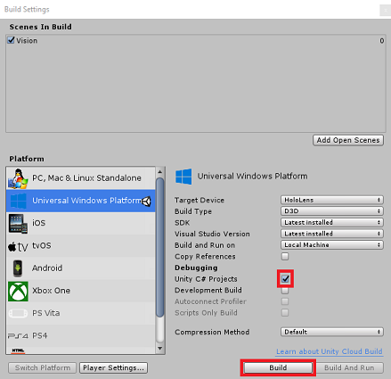

3.	If not already, tick ***Unity C# Projects***.
4.	Click ***Build***. Unity will launch a **File Explorer** window, where you need to create and then select a folder to build the app into. Create that folder now, and name it ***App***. Then with the ***App*** folder selected, press ***Select Folder***. 
5.	Unity will begin building your project to the ***App*** folder. 
6.	Once Unity has finished building (it might take some time), it will open a **File Explorer** window at the location of your build (check your task bar, as it may not always appear above your windows, but will notify you of the addition of a new window).

## Chapter 10 – Deploy to HoloLens

To deploy on HoloLens:

1.	You will need the IP Address of your HoloLens (for Remote Deploy), and to ensure your HoloLens is in **Developer Mode**. To do this:
    1. Whilst wearing your HoloLens, open the ***Settings***.
    2. Go to ***Network & Internet > Wi-Fi > Advanced Options***
    3. Note the **IPv4** address.
    4. Next, navigate back to ***Settings***, and then to ***Update & Security > For Developers*** 
    5. Set Developer Mode On.

2.	Navigate to your new Unity build (the ***App*** folder) and open the solution file with **Visual Studio**.
3.	In the Solution Configuration select ***Debug***.
4.	In the Solution Platform, select ***x86***, ***Remote Machine***. 

    
 
5.	Go to the **Build menu** and click on **Deploy Solution**, to sideload the application to your HoloLens.
6.	Your App should now appear in the list of installed apps on your HoloLens, ready to be launched!

> [!NOTE]
> To deploy to immersive headset, set the **Solution Platform** to *Local Machine*, and set the **Configuration** to *Debug*, with *x86* as the **Platform**. Then deploy to the local machine, using the **Build menu**, selecting *Deploy Solution*. 

## Exercise:

**Exercise 1**

Just as you have used the *Tags* parameter (as evidenced within the *endpoint* used within the **VisionManager**), extend the app to detect other information; have a look at what other parameters you have access to [HERE](https://westus.dev.cognitive.microsoft.com/docs/services/56f91f2d778daf23d8ec6739/operations/56f91f2e778daf14a499e1fa).

**Exercise 2**

Display the returned Azure data, in a more conversational, and readable way, perhaps hiding the numbers. As though a bot might be speaking to the user.

## Computer Vision API Application

