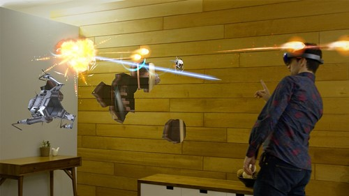
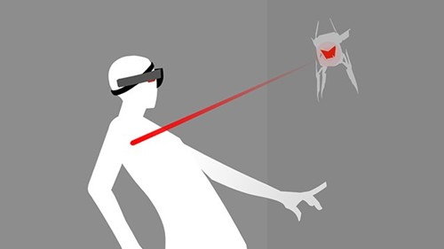

# Case study - Using spatial sound in RoboRaid

This article describes the unique challenges that the Microsoft HoloLens Experience Team encountered when creating audio for [RoboRaid](https://www.microsoft.com/p/roboraid/9nblggh5fv3j), a mixed-reality first-person shooter.

## The tech

[Spatial sound](spatial-sound.md) is one of the most exciting features of Microsoft HoloLens, providing a way for users to perceive what's going on around them when objects are out of the line of sight.

In RoboRaid, the most obvious and effective use of spatial sound is to alert the player to something happening outside of the user's peripheral vision. For example, the Breacher can enter from any of the scanned walls in the room, but if you're not facing the location where it's entering, you might miss it. To alert you to this invasion, you'll hear a distinct bit of audio coming from where the Breacher is entering, which lets you know that you need to act quickly to stop it.

## Behind the scenes

The process of creating spatial sound for HoloLens apps is so new and unique and the lack of past projects to use for reference can lead to a lot of head scratching when you run into a problem. Hopefully, these examples of the audio challenges we faced while making RoboRaid will help you as you create audio for your own apps.

### Be mindful of taxing the CPU

Spatial sound can be demanding on the CPU. For a busy experience like RoboRaid it was crucial to keep the instances of spatial sound to under eight at any given time. For the most part, it was as easy as setting the limit of instances of different audio events so that any instances that happen after the limit is reached are killed. For example, when drones spawn, their screams are limited to three instances at any given time. Considering only about four drones can spawn at once, three screams are plenty since there’s no way your brain can keep track of that many similar-sounding audio events. This freed up resources for other spatial sound events, like enemy explosions or enemies preparing to shoot.

### Rewarding a successful dodge

The dodging mechanic is one of the most important aspects of gameplay in RoboRaid, and also something that we felt was truly unique to the HoloLens experience. As such, we wanted to make successful dodges very rewarding to the player. We got the Doppler "whizz-by" to sound compelling fairly early on in the development. Initially, my plan was to use a loop and manipulate it in real-time using volume, pitch, and filter. The implementation for this was going to be very elaborate, so before committing resources to actually build this we created a cheap prototype using an asset with the Doppler effect baked in just to find out how it felt*. Our talented dev made it so that this whizz-by asset would play back exactly 0.7 seconds before the projectile will have passed by the player’s ear and the results felt really amazing! Needless to say, we ditched the more complex solution and implemented the prototype.

*(For more information about creating an audio asset with the Doppler effect built in, see [100 Whooshes in 2 Minutes](http://designingsound.org/2010/02/26/charles-deenen-special-100-whooshes-in-2-minutes/).)* 
 

### Ditching ineffective sounds

Originally, we had wanted to play an explosion sound behind the player once they’ve successfully dodged the enemy projectile, but we decided to ditch this for several reasons. First, it didn’t feel as effective as the whizz-by SFX we used for the dodge. By the time the projectile hits a wall behind you, something else would have happened in the game that would pretty much mask that sound. Secondly, we didn’t have collision on the floor, so we couldn’t get the explosion to play when the projectile hit the floor instead of the walls. And finally, there was the CPU cost of spatial sound. The Elite Scorpion enemy (one that can crawl inside the wall) has a special attack that shoots about eight projectiles. Not only did that make a huge mess in the mix, it also introduced awful crackling because it was hitting the CPU too hard.

### Communicating a hit

An interesting issue we ran into, which we felt was unique to the HoloLens experience, was the difficulty of effectively communicating to the players that they have been hit. What makes a mixed reality experience successful is the feeling that the story is happening to you. That means that you have to believe that YOU are fighting an alien robot invasion in your own living room.

Players obviously won't feel anything when they get hit, so we had to find a way to really convince the player that something bad had happed to them. In conventional games you might see an animation that lets you know your character has taken a hit, or the screen might flash red and your character might grunt a little. Since these types of cues don't work in a mixed reality experience, we decided to combine the visual cue with a really exaggerated sound that indicates you've taken damage. I created a big sound, and made it so prominent in the mix that it ducked everything down. Then, to make it stand out even more, we added a short warning sound as if a nuclear sub was sinking. 
 

### Getting big sound from small speakers

HoloLens speakers are small and light to suit the needs of the device, so you can’t expect to hear too much low-end. Similar to developing for smart phones or handheld gaming devices, sound designers and composers have to be mindful of the frequency content of their audio. I always design sounds or write music with full frequency range because wearing headphones is an option for the users. However, to ensure compatibility with HoloLens speakers, I run a test occasionally by putting an EQ in the master of any DAW I happen to be working in. The EQ setting consists of a high-pass filter around 600 to 700 Hz (not too steep) and low-pass filter at around 10K (very steep). That should give you a ballpark idea of how your sounds will playback on the device.

If you are relying on bass to give the sense of chord changing in your music, you may find that your music completely loses the sense of root when you apply this EQ setting. To remedy this, I added another layer to the bass that is one octave higher (with some rich harmonics) and mixed it to get the sense of root back. Sometimes using distortion to amp up the harmonics will give enough frequency content in the upper range to make our brain think that there’s something underneath it. This is true for SFX like impacts, explosions, or sounds for special moments, such as a boss' super attacks. You really can’t rely on the low-end to give the player a sense of impact or weight. As with music, using distortion to give a little bit of crunch definitely helped.

### Making your audio cues stand out

Naturally, everyone on the team wanted bombastic music, loud guns, and crazy explosions; but they also wanted to be able to hear voiceover or any other game-critical audio cues.

On a console game with full range of frequency you have more options to divide frequencies up depending on the importance of the sound. For RoboRaid, however, I was limited in the number of ranges of frequencies I could curve out from sounds. For instance, if you use low-pass filter and curve out too much from the higher end of the spectrum, you won’t have anything left on the sound because there’s not much low-end.

In order to make RoboRaid sound as big as it can on the device, we had to lower the dynamic range of the whole experience and made extensive use of ducking by creating a clear hierarchy of importance for different types of sounds. I set the ducking from -2 to -6 dB depending on the importance. I personally don’t like obvious ducking in games, so I spent a lot of time tuning the fade in/out timing and the amount of volume attenuation. We set up separate busses for spatial sound, non-spatial sound, VO, and dry bus without reverb for music, then created very high priority, critical, and non-critical busses. The assets were then set up to go to their appropriate busses.

I hope audio professionals out there will have as much fun and excitement working on their own apps as I did working on RoboRaid. I can’t wait to see (and hear!) what the talented folks outside Microsoft will come up with for HoloLens.

## Do it yourself

One trick I discovered to make certain events (such as explosions) sound "bigger"—like they're filling up the room—was to create a mono asset for the spatial sound and mix it with a 2D stereo asset, to be played back in 3D. It does take some tuning, since having too much information in the stereo content will lessen the directionality of the mono assets. However, getting the balance right will result in huge sounds that will get players to turn their heads in the right direction.

You can try this yourself using the audio assets below:

**Scenario 1**
1. Download [roboraid_enemy_explo_mono.wav](images/roboraid-enemy-explo-mono.wav) and set to playback through spatial sound and assign it to an event.
2. Download [roboraid_enemy_explo_stereo.wav](images/roboraid-enemy-explo-stereo.wav) and set to playback in 2D stereo and assign to the same event as above. Because these assets are normalized to Unity, attenuate volume of both assets so that it doesn’t clip.
3. Play both sounds together. Move your head around to feel how spatial it sounds.

**Scenario 2**
1. Download [roboraid_enemy_explo_summed.wav](images/roboraid-enemy-explo-summed.wav) and set to playback through spatial sound and assign to an event.
2. Play this asset by itself then compare it to the event from Scenario 1.
3. Try different balance of mono and stereo files.

## See also
* [Spatial sound](spatial-sound.md)
* [RoboRaid for Microsoft HoloLens](https://www.microsoft.com/p/roboraid/9nblggh5fv3j)
