# Hand coach
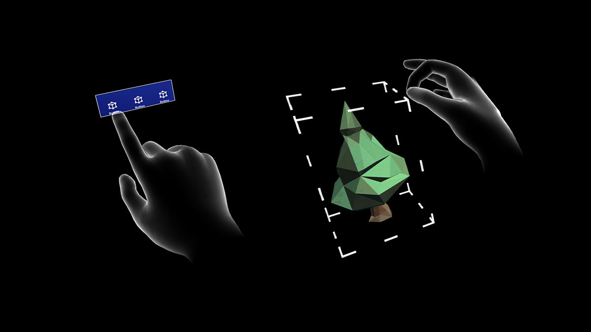 

Hand coach is 3D modeled hands that are triggered when the system does not detect the user’s hands. This is implemented as a “teaching” component that helps guide the user when the gesture has not been taught. If users have not done the specified gesture for a period, the hands will loop with a delay. The Hand coach could be used to represent pressing a button or picking up a hologram.  

## Hand coach provided

The current interaction model represents a wide variety of gesture controls such as scrolling, far select, and near tap. Below is a full list of existing hand gestures provided in<a href="https://github.com/microsoft/MixedRealityToolkit-Unity/tree/mrtk_release/Assets"> MRTK</a>:

:::row:::
    :::column:::
       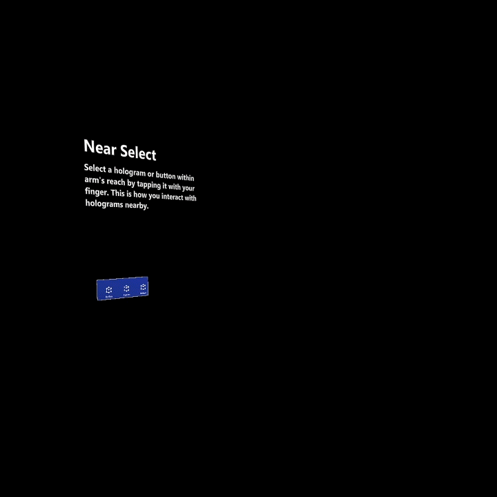 
       **Example of Near Select - Used show how to select buttons or close interactable objects** 
    :::column-end:::
    :::column:::
        
        **Example of Air Tap - Used to show how to select objects that are far away** 
    :::column-end:::
    :::column:::
       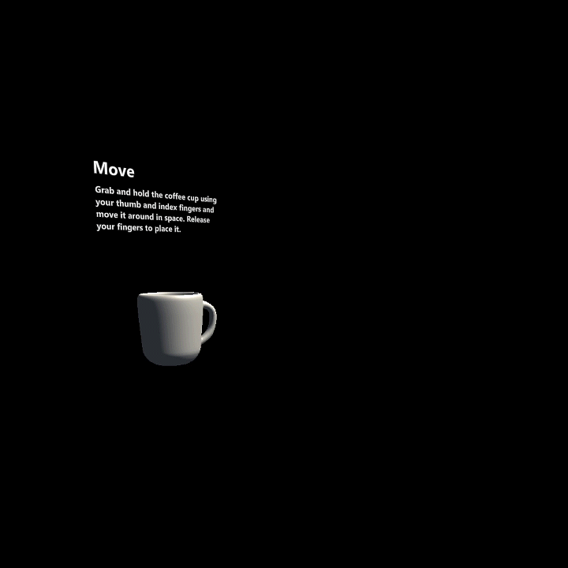 
       **Example of Moving an object in space-Used to show how to move a hologram in space** 
    :::column-end:::
    :::column:::
       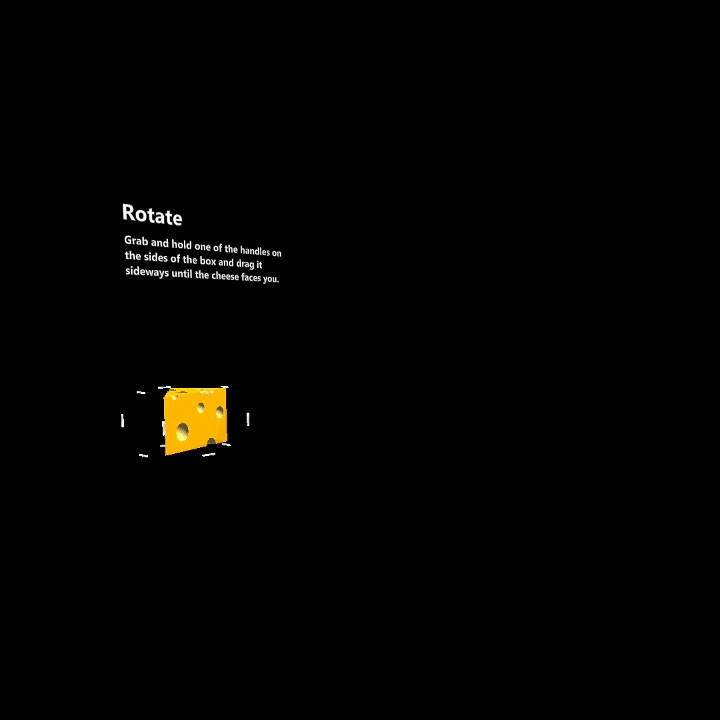 
       **Example of Rotate-Used to show how to rotate holograms or objects** 
    :::column-end:::
:::row-end:::

:::row:::
    :::column:::
       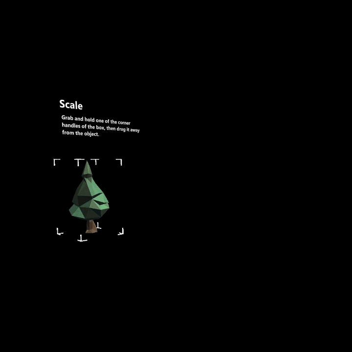 
       **Example of Scale- Used to show how to manipulate holograms to be bigger or smaller** 
    :::column-end:::
    :::column:::
       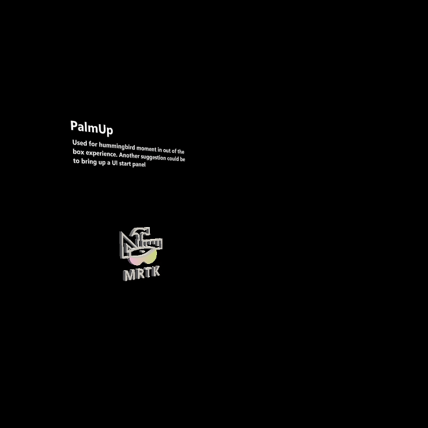 
        **Example of Palm up – Suggested use, to bring up hand menus** 
    :::column-end:::
    :::column:::
       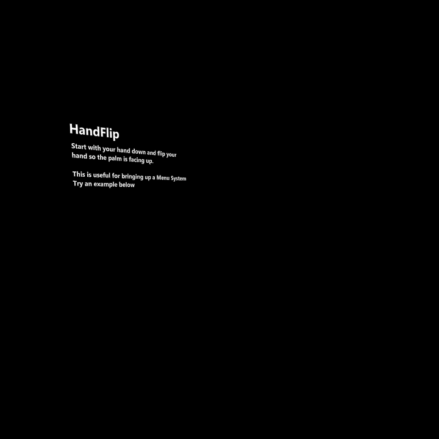 
       **Exmaple of Hand Flip – Another way to bring up Hand Menus** 
    :::column-end:::
    :::column:::
       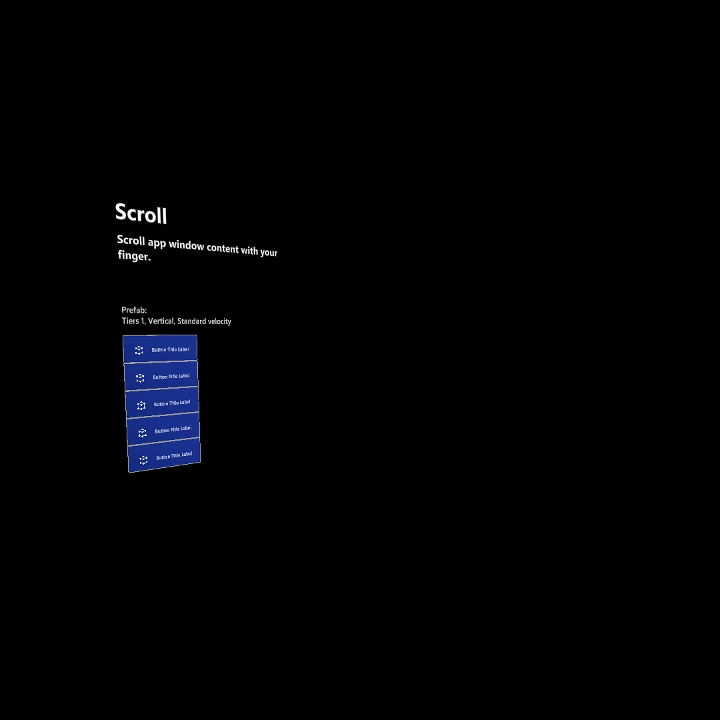 
       **Example of Scroll – Used for scrolling a list or a long document** 
    :::column-end:::
:::row-end:::

## Design concepts

For Hololens2, we designed out hand interactions based on instinctual and natural hand gestures. We believe these to be intuitive to most users and thus did not create dedicated gesture learning moments. Instead, we created the hand coach to help users who might get stuck or are unfamiliar with interacting with holograms learn about these gestures. Without a learning moment, we felt that showing users how to perform an action by demonstrating it would be the best option. In our studies, we found that users were able to figure out the gesture but needed a little guidance. If we detect that a user does not interact with an object for a period, a Hand coach would be triggered demonstrating the correct hand and finger placement. 

### Intuitive

When animating hands, it should be obvious and shouldn't cause any confusion. The animation of the hands is a representation of the gesture your trying to evoke to the user to understand it's purpose. 

For example, if you wish a user to press a button, a hand pressing a button would be triggered.

 
*Hand Coach demonstrating Near Tapping a Gem*  

### Hand scale

We tested various hand sizes with the UI menus and felt that if the hands were true to size, it gave a menacing feeling but if they were too small then it was hard to see and understand the gesture. 

**Voice over and hands**

Don’t expect users can listen to one set of instructions via voice over and watch different instructions via Hand coach. Sequence your instructions to help users focus versus compete for their attention to reduce sensory overload.

## Can I create my own?

Yes! We encourage you to create your own unique gesture for your game and contribute back to the community!
We have provided a Maya file of a Rigged hand that can be used for your app which can be downloaded here: <a href="files/HandCoach_MRTK.zip"> Download HandCoach_MRTK.zip </a>

 
*Example of animated Hand Poking a box in Maya*

**Recommended authoring tool**

Among 3D artists, many choose to use [Autodesk’s Maya which itself is able to use HoloLens](https://www.youtube.com/watch?v=q0K3n0Gf8mA) to transform the way assets are created. The hands file provided is a Maya Binary File, so it is recommended to use Maya to animate and export the hands. If you prefer to use another 3D program, here is a <b>.FBX</b>: <a href="files/HandCoachMRTK_FBX.zip"> Download HandCoachMRTK_FBX.zip </a> to create your own controller setup. 

If using the downloadable maya Hand File provided, it is suggested to scale down the hands in unity to 0.6.

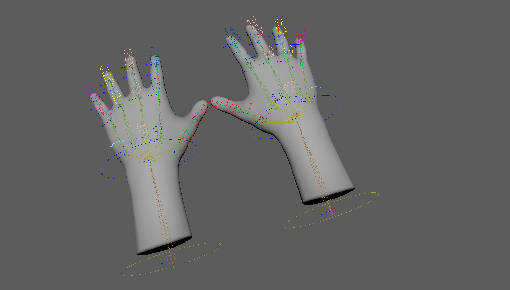 
*Rigged Hands*

### Technical Specs

*   Two handed File is available in Maya Ascii format
*    Right and Left Hand is available in Maya Binary format
*   Set your Maya file to 24 FPS
*   Within the file, there is a left and right hand which can be used for two handed or single-handed gestures. The right hand will only be visible by default.
*   It is suggested to leave a buffer of about 10 frames at the beginning and end for fades
*   If animating a object with a specified target, its best practice to animate to a Default box or Null.
*   If the hand is animating a physical object such as a box, its best practice to not animate the translation in Maya but wait to animate it in Unity or in Code.
*   Visible Animation should be 1.5 secs for any meaningful information to be conveyed
*   When you feel satisfied with your animation:
	*   Select all joints and bake key frames
	*   Delete the Controllers, Select the joints and mesh and export as an FBX
	*  If there are Multiple Animations, you can use Maya’s built in Game Exporter: https://knowledge.autodesk.com/support/maya/learn-explore/caas/CloudHelp/cloudhelp/2015/ENU/Maya/files/Game-Exporter-htm.html

## Exporting from Maya

After you are satisfied with your animation
* Select all joints: Select > Hierarchy

     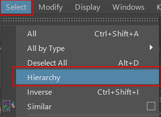 
* Bake out your animation: Switch to Animation > Key > Bake Animation

     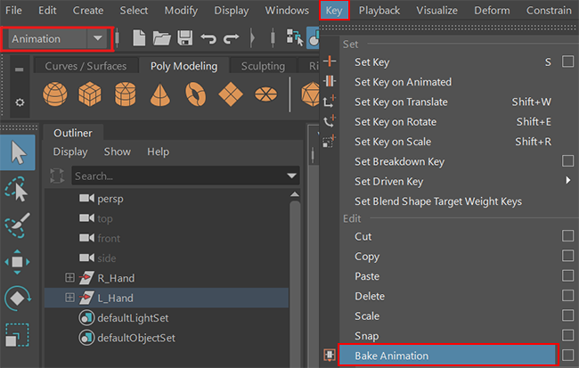 
* Delete the Controller Rig: Outliner > MainR_Grp or MainL_Grp

     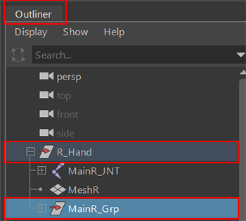 

* Export as FBX: Select JNT + Mesh: File > Export Selection (option box) > Export Selection

     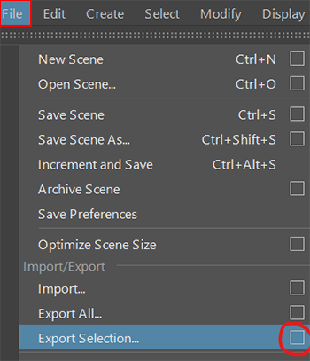 

      

     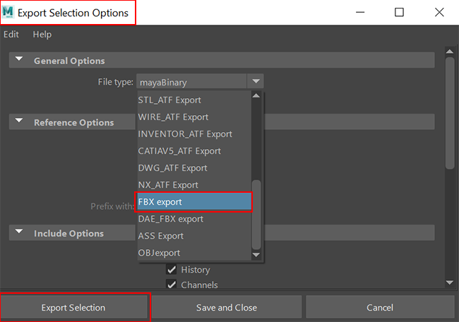 

 When exporting as a FBX and brought into Unity, scale the hands down to 0.6. We found that this was perfect balance for displaying the hands. 

 
*Unity Settings for HandCoach_R prefab found in MRTK*

## Implementing Hands into your Unity project

### Best practices
*    It is suggested to scale down the hands in unity to 0.6
*   Hands should be played twice and if not completed then continuously looped until gesture is completed. The hands should be looped twice to ensure the user had time to register and see the gesture. The hands should fade in and out between loops. 
 *	If user’s hands are visible by HL2 cameras but users are not doing the interaction needed of them the hands will appear after 10 seconds.
*	If user’s hands are NOT visible by HL2 cameras, the hands will appear after 5 seconds.	
*	If user’s hands are visibly tracked by HL2 cameras in the middle of the animation, the animation will complete and fade out.
*	If you are including voice over, we suggest that it corresponds to the gesture of the hand.
*	If you have taught the hands at least once, only repeat the gesture if its detected that the user is stuck.
*  	If specific finger/hand positions are critical, ensure users can clearly see these nuances in the animation. Try angling the hands so the most important parts are clearly visible. 
* If you notice distortion on the hands, you need to go to Unity's Quality settings increase the amount of bones. 
 Go to Unity's Edit > Project Settings > Quality > Other > Blend Weights. Make sure "4 bones" are selected to see Smooth Joints. 

   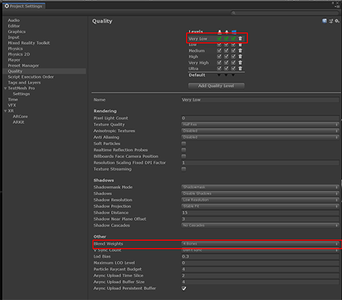 

### What to avoid
* Scaling the Hands too large
* placing the Hands too close to the user
* Hands should only be taught once. Over teaching can cause confusion and messiness
*	Bringing it into Unity, please download the latest MRTK  here: https://github.com/microsoft/MixedRealityToolkit-Unity
    *	Material: Teaching_Hand2
    *	Scripts: Refer to MRTK guidelines for <a href= "https://github.com/MixedRealityToolkit-Unity/blob/'HandCoachUX'/Documentation/README_HandCoach.md"> MRTK hand coach </a>
    *	Per- project setting
        *	Scene set to UWP: Instruction can be found on the [Configure Unity Project](../develop/unity/Configure-Unity-Project.md) for Windows Mixed Reality

## See also
* [Interaction-fundamentals](interaction-fundamentals.md)
* [Asset Creation Process](asset-creation-process.md)
* [Gestures](../gestures.md)
* [Install the Tools](../develop/install-the-tools.md)
* [Configure Unity Project](../develop/unity/Configure-Unity-Project.md)
* [Unity development overview](../develop/unity/unity-development-overview.md)
* [MRTK 101](../develop/unity/mrtk-101.md)
