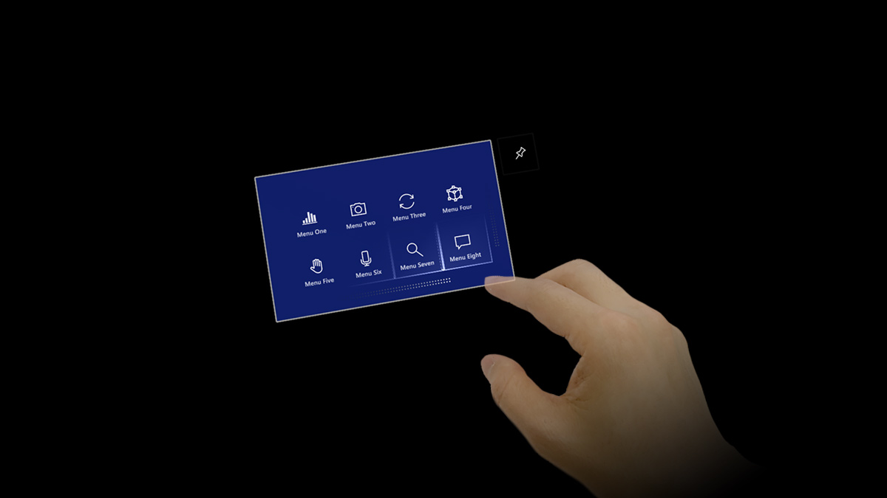

# Near menu

A near menu is a collection of buttons on a panel that follow you with [tag-along behavior](billboarding-and-tag-along.md#what-is-a-tag-along). It stays in a certain range of distance and angle to allow you to interact with content. You can use the pin button or grab and place the menu to make it world-locked and disable the tag-along behavior. This allows you to focus on the target content without being disturbed by the floating menu.

You can re-enable the tag-along by pressing the pin button and make the menu follow you again.

 

---

## Near menu in MRTK (Mixed Reality Toolkit) for Unity
**[MRTK](https://github.com/Microsoft/MixedRealityToolkit-Unity)** provides various near menu prefab examples.

* [MRTK - Near menu](https://microsoft.github.io/MixedRealityToolkit-Unity/Documentation/README_NearMenu.html)

 

---

## See also

* [Cursors](cursors.md)
* [Hand ray](point-and-commit.md)
* [Button](button.md)
* [Interactable object](interactable-object.md)
* [Bounding box and App bar](app-bar-and-bounding-box.md)
* [Manipulation](direct-manipulation.md)
* [Hand menu](hand-menu.md)
* [Near menu](near-menu.md)
* [Object collection](object-collection.md)
* [Voice command](voice-input.md)
* [Keyboard](keyboard.md)
* [Tooltip](tooltip.md)
* [Slate](slate.md)
* [Slider](slider.md)
* [Shader](shader.md)
* [Billboarding and tag-along](billboarding-and-tag-along.md)
* [Displaying progress](progress.md)
* [Surface magnetism](surface-magnetism.md)
