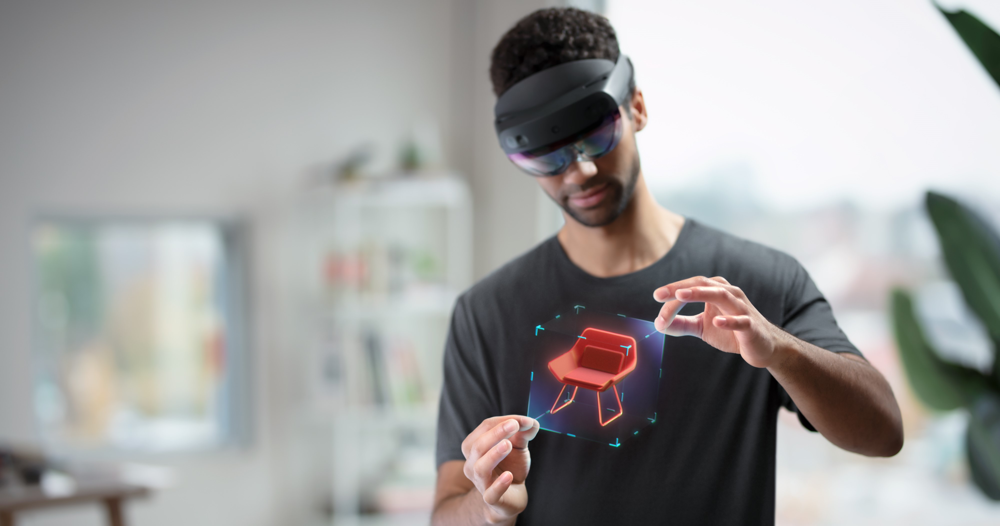

# Samples and feature apps

Every development journey starts with a look back at what other developers have successfully built - mixed reality is no different. Currently, all of our tutorials and sample apps are built in Unity or Unreal. As we develop content for other engines and platforms, you'll find them under the relevant heading in the Table of Contents.

## Sample apps

[!INCLUDE]

## Feature samples

The feature samples listed below correspond to specific implementations that are covered in our documentation and covers a range of development platforms and hardware devices.

### OpenXR

For developers targeting Unity 2020 to build HoloLens 2 or Mixed Reality applications, OpenXR plugin can be used instead of WindowsXR plugin for better cross platform compatibilities. The Mixed Reality OpenXR Plugin also works well with latest Mixed Reality Toolkit 2.7.

 

| Reference article | Sample |
| --- | --- |
| [Using the OpenXR plugin](./unity/xr-project-setup.md) | [Mixed Reality OpenXR with Unity samples](https://github.com/microsoft/OpenXR-Unity-MixedReality-Samples) |
| N/A | [OpenXR MRTK Base Unity project](https://github.com/microsoft/UnityOpenXRMRTKBase) |

### Research Mode

Research Mode was introduced in the 1st Generation HoloLens to give access to key sensors on the device, specifically for research applications that are not intended for deployment. The sample applications below are examples for accessing and recording Research Mode streams and using the [intrinsics and extrinsics](/windows/mixed-reality/locatable-camera#locating-the-device-camera-in-the-world).

 

| Reference article | Sample application |
| --- | --- |
| [Research Mode](platform-capabilities-and-apis/research-mode.md) | [HoloLens (1st gen)](https://github.com/microsoft/HoloLensForCV/tree/master/Samples) |
| [Research Mode](platform-capabilities-and-apis/research-mode.md) | [HoloLens 2](https://github.com/microsoft/HoloLens2ForCV/tree/main/Samples) |

### QR codes

HoloLens 2 can detect QR codes in the environment around the headset, establishing a coordinate system at each code's real-world location.

 

| Reference article | Sample |
| --- | --- |
| [QR codes](platform-capabilities-and-apis/qr-code-tracking.md) | [QR code tracking in Unity](https://github.com/microsoft/MixedReality-QRCode-Sample) |

### Scene understanding

Scene understanding provides Mixed Reality developers with a structured, high-level environment representation designed to make developing for environmentally aware applications intuitive. Scene understanding does this by combining the power of existing mixed reality runtimes, like the highly accurate but less structured spatial mapping and new AI driven runtimes.

 

| Reference article | Sample |
| --- | --- |
| [Scene understanding](../design/scene-understanding.md) | [Mixed Reality Scene Understanding samples](https://github.com/microsoft/MixedReality-SceneUnderstanding-Samples) |

### WebRTC

The MixedReality-WebRTC project is a collection of components to help mixed reality app developers to integrate peer-to-peer audio, video, and data real-time communication into their applications WebRTC components are based on the WebRTC protocol for Real-Time Communication (RTC), which is supported by most modern web browsers.

 

| Reference article | Sample |
| --- | --- |
| [WebRTC](https://microsoft.github.io/MixedReality-WebRTC) | [WebRTC sample apps](https://github.com/microsoft/MixedReality-WebRTC/tree/master/examples) |

### Holographic Mixed Reality Capture

Mixed reality capture (MRC) captures the first-person experience of mixing real and digital worlds as a photo or video, sharing what you see with others in real-time.

 

| Reference article | Sample |
| --- | --- |
| [Mixed Reality Capture](platform-capabilities-and-apis/mixed-reality-capture-for-developers.md) | [Mixed Reality Capture samples](/samples/microsoft/windows-universal-samples/holographicmixedrealitycapture/) |

### Holographic Remoting

The Holographic Remoting Player is a companion app that connects to PC apps and games that support Holographic Remoting. Holographic Remoting streams holographic content from a PC to your Microsoft HoloLens in real-time, using a Wi-Fi connection, and is supported on HoloLens (1st gen) and HoloLens 2.

 

| Reference article | Sample |
| --- | --- |
| [Holographic Remoting](platform-capabilities-and-apis/holographic-remoting-player.md) | [Holographic Remoting samples](https://github.com/microsoft/MixedReality-HolographicRemoting-Samples) |