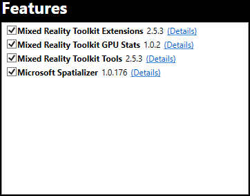

# Importing features

Once the desired features have been downloaded, they can be reviewed and imported into the Unity project.

## Features list

The `Features` list contains the collection of packages that were selected during discovery.

Each feature can be selected or deselected prior to importing. Package details can be viewed using the `Details` link.

## Required dependencies list

The `Required dependencies` list contains the packages that one or more of the selected features requires in order to function. This list will also contain dependencies of dependencies.

Each dependency can be selected or deselected prior to importing.Package details can be viewed using the `Details` link.

> [!NOTE]
> Deselecting required dependencies will result in one or more missing dependency errors when loading the project in Unity and the inability to use the features in the project.

## Specifying the Unity project path

Before features can be imported into the project, the path must be registered with the Mixed Reality Feature Tool.

## Validating selections

It is highly recommended to validate feature selections before importing. This step will raise issues that are likely to impede successful project development.

The Mixed Reality Feature Tool provides two automatic issue resolutions (described in the following sections) as well as the option to cancel and resolve issues manually.

> [!IMPORTANT]
> The Mixed Reality Feature Tool cannot automatically resolve issues related to required versions of Unity. These issues must be handled manually by; upgrading the version of Unity used by the project or disabling the feature(s) requiring a newer version.
>
> A future release of the Mixed Reality Feature Tool will provide better filtering of features based upon the version of Unity being used by the project.

### Enable dependencies

The `Enable dependencies` button will automatically reselect the missing dependencies. This is true for dependencies that were explicitly selected (appear in the `Features` list) and those that were implicitly selected based on the requirements of the selected features.

### Disable features

Selecting `Disable features` will automatically deselect any feature that depends upon one or more of the dependencies that have been unchecked. This is true for implicitly selected dependency packages as well as explicitly selected features.

## Importing

The next step to import the selected features is to click the `Import` button. This will move to the step where [final review and approval](reviewing-changes.md) to update the project is performed.

> [!IMPORTANT]
> If a validation issue remains when importing, a warning message will be displayed. It is recommended to select No, click `Validate` and resolve any issues presented.
>
> 

## Going back to the previous step

From `Import features`, the Mixed Reality Feature Tool allows for navigating back to [discovery](discovering-features.md). Click the `Go back` button to download additional feature packages.

## See also

- [Welcome to the Mixed Reality Feature Tool](welcome-to-mr-feature-tool.md)
- [Discovery and acquisition](discovering-features.md)
- [Viewing feature package details](viewing-package-details.md)
- [Reviewing and approving project modifications](reviewing-changes.md)