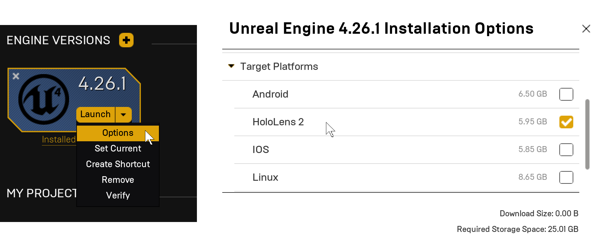

# [Unity](#tab/unity)

 

### 1. Download the recommended Unity version 

The current recommended version for Mixed Reality development is **Unity 2019.4 LTS (Long Term Support)**. The best way to install and manage Unity is through the **Unity Hub**. 

> [!NOTE]
>  If you’re using Unity 2020 LTS, Mixed Reality support is available for HoloLens 2 development. However, there are currently some known issues. This will become the recommended Unity version later this year. 

See [Choosing a Unity version and XR plugin](../unity/choosing-unity-version.md) to learn what Mixed Reality support is available in different Unity engine and XR plugin versions.

> [!div class="nextstepaction"]
> [Download Unity Hub](https://unity3d.com/get-unity/download)

When installing Unity, please make sure to check following components under **'Platforms'**.
* **Universal Windows Platform Build Support** 
* **Windows Build Support (IL2CPP)**

If you installed Unity without these options, you can add them through **'Add Modules'** menu in Unity Hub.

### 2. Install the Mixed Reality Feature Tool

The [Mixed Reality Feature Tool](../unity/welcome-to-mr-feature-tool.md) is a new way for developers to discover and add Mixed Reality feature packages into Unity projects. 

You can search packages by name or category, see their dependencies, and even view proposed changes to your projects manifest file before importing. Once you've validated the packages you want, the Mixed Reality Feature tool will download them into the project of your choice.

#### Importing the Mixed Reality Toolkit

[Mixed Reality Toolkit](../unity/mrtk-getting-started.md) (MRTK) is an open-source, cross-platform development kit for mixed reality applications. 

* Install the Mixed Reality Toolkit package by following the [installation and usage instructions](../unity/welcome-to-mr-feature-tool.md#system-requirements) and selecting the **Mixed Reality Toolkit Foundation** package.

We recommend completing the getting started section in our curated [HoloLens](../unity/unity-development-overview.md#1-getting-started) or [VR](../unity/unity-development-wmr-overview.md#1-getting-started) development journeys. If you're already following the Unity development for HoloLens journey, finish up the rest of the setup steps listed below and continue on to the [HoloLens 2 Getting Started tutorials](../unity/tutorials/mr-learning-base-01.md).

> [!IMPORTANT]
> Note that installation instructions are targeted for the latest stable combination of MRTK and Unity releases, which are **MRTK 2.6.1** and **Unity 2019.4 LTS**.

> [!NOTE]
> If you don't want to use MRTK for Unity, you'll need to [script all interactions and behaviors yourself](../unity/configure-unity-project.md).

:::row:::
    :::column:::
        <a href="https://github.com/Microsoft/MixedRealityToolkit-Unity" target="_blank"> **Mixed Reality Toolkit-Unity (GitHub)**</a> 
    :::column-end:::
:::row-end:::

#### Other tools [optional]
* <a href="https://github.com/Microsoft/MixedRealityCompanionKit" target="_blank">Mixed Reality Companion Kit (GitHub)</a> - code bits and components that might not run directly on HoloLens or immersive (VR) headsets, but instead pair with them to build experiences targeting Windows Mixed Reality.
* <a href="https://github.com/Microsoft/MixedRealityToolkit" target="_blank">Mixed Reality Toolkit - Common (GitHub)</a> - a collection of shared scripts and components.

# [Unreal](#tab/unreal)

### 1. Download the latest version

We recommend installing [Unreal Engine version 4.25](https://docs.unrealengine.com//GettingStarted/Installation/index.html) or later to take full advantage of built-in HoloLens support.

Go to the **Library** tab in the Epic Games Launcher, select the dropdown arrow next to **Launch** and click **Options**. Under **Target Platforms**, select **HoloLens 2** and click **Apply**.

### 2. Import Mixed Reality Toolkit (MRTK)

Mixed Reality Toolkit (MRTK) is an open-source, cross-platform development kit for mixed reality applications. MRTK provides a cross-platform input system, foundational components, and common building blocks for spatial interactions. The toolkit is intended to accelerate the development of applications targeting Microsoft HoloLens, Windows Mixed Reality immersive (VR) headsets, and the OpenVR platform.

For installation, we recommend completing the [Getting Started section](../unreal/unreal-development-overview.md#1-getting-started) of our curated [Unreal development journey](../unreal/unreal-development-overview.md). If you're already following the Unreal development journey, finish up the rest of the setup steps listed below and continue on to the [HoloLens 2 Getting Started tutorials](../unreal/tutorials/unreal-uxt-ch1.md).

:::row:::
    :::column:::
        <a href="https://github.com/Microsoft/MixedRealityToolkit-Unreal" target="_blank"> **Mixed Reality Toolkit-Unreal (GitHub)**</a> 
    :::column-end:::
:::row-end:::

> [!NOTE]
> If you don't want to use MRTK for Unreal, you'll need to script all interactions and behaviors yourself.

#### Other tools [optional]
* <a href="https://github.com/Microsoft/MixedRealityCompanionKit" target="_blank">Mixed Reality Companion Kit (GitHub)</a> - code bits and components that might not run directly on HoloLens or immersive (VR) headsets, but instead pair with them to build experiences targeting Windows Mixed Reality.
* <a href="https://github.com/Microsoft/MixedRealityToolkit" target="_blank">Mixed Reality Toolkit - Co mmon (GitHub)</a> - a collection of shared scripts and components.

# [Native (OpenXR)](#tab/native)

Native OpenXR development doesn't have an engine for you to download. You can find everything you need to begin development in the [Getting started with OpenXR](../native/openxr-getting-started.md) document.

### 1. Set up your PC for mixed reality development

The Windows 10 SDK works best on the Windows 10 operating system. This SDK is also supported on Windows 8.1, Windows 8, Windows 7, Windows Server 2012, Windows Server 2008 R2. Note that not all tools are supported on older operating systems.