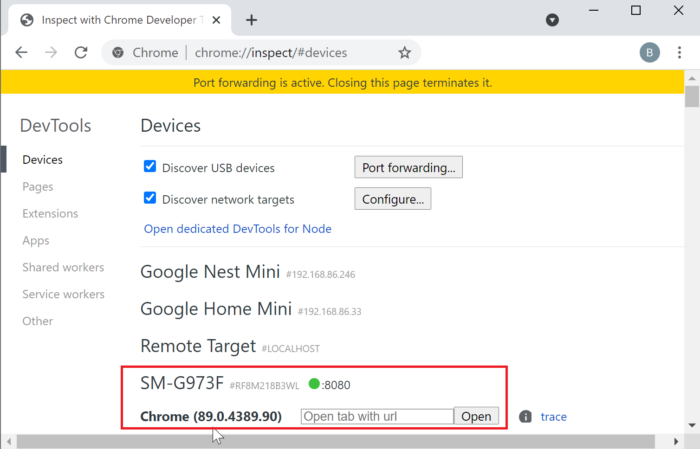
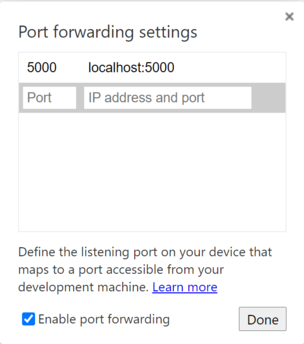
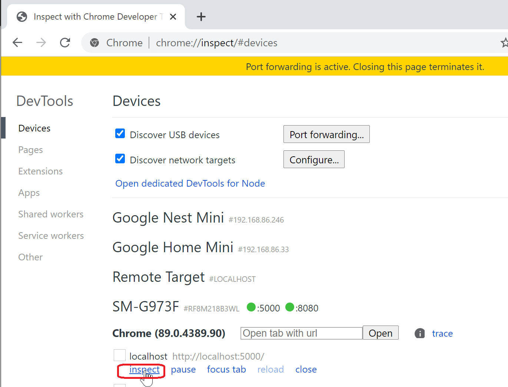
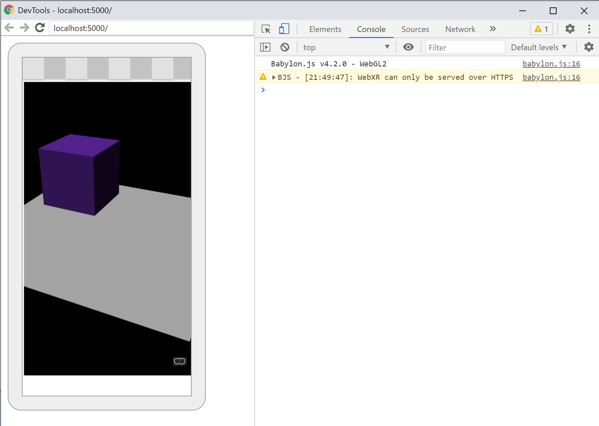

# Tutorial: Interact with 3D object

Learn how to create 3D objects and interactions for a Mixed Reality experience using babylon.js. In this section, you'll start with something simple, like painting the faces of a cube when you select the object.

This tutorial covers the following topics:

> [!div class="checklist"]
> * How to add interactions
> * Enable WebXR immersive mode
> * Run the app on Windows Mixed Reality Simulator
> * Run and debug the app on Android Chrome

## Before you begin

In previous tutorial step a basic web page with a scene was created. Have the hosting web page open for editing.

```html
<html>
<head>
    <script src="https://cdn.babylonjs.com/babylon.js"></script>
    <style>
        body,#renderCanvas { width: 100%; height: 100%;}
    </style>
</head>
<body>
    <canvas id="renderCanvas"></canvas>
    <script>
        const canvas = document.getElementById("renderCanvas");
        const engine = new BABYLON.Engine(canvas, true);
        
        const createScene = function() {
            const scene = new BABYLON.Scene(engine);
            scene.clearColor = new BABYLON.Color3.Black;
            
            const alpha =  Math.PI;
            const beta = Math.PI;
            const radius = 5;
            
            const camera = new BABYLON.ArcRotateCamera("Camera", 0, 0, 0);
            camera.setPosition(new BABYLON.Vector3(alpha, beta, radius));
            camera.attachControl(canvas, true);
            
            const light = new BABYLON.HemisphericLight("light", new BABYLON.Vector3(1, 1, 0));
            
            const box = BABYLON.MeshBuilder.CreateBox("box", {});
            box.position.x = 0.5;
            box.position.y = 1;
            
            return scene;
        };
        
        const sceneToRender = createScene();
        engine.runRenderLoop(function(){
            sceneToRender.render();
        });
    </script>
</body>
</html>
```

## Add interaction

1. First, let's update our code that creates the cube, so that the cube is painted with a random color. To do that, we will add [material](https://doc.babylonjs.com/divingDeeper/materials/using/materials_introduction) to our cube. Material allows us to specify color and textures and can be used to cover other objects. How a material appears depends on the light or lights used in the scene and how it is set to react. For example, the diffuseColor spreads the color all over the mesh to which it is attached. Add the following code:

    ```javascript
    const boxMaterial = new BABYLON.StandardMaterial("material", scene);
    boxMaterial.diffuseColor = BABYLON.Color3.Random();
    box.material = boxMaterial;
    ```

1. Now that the cube is painted with a random color, let's add an interaction to:

    * Change the color when the cube is clicked
    * Move the cube after the color is changed

    To add interactions we should be using [actions](https://doc.babylonjs.com/divingDeeper/events/actions). An action is launched in response to the event trigger. For example, when the user clicks on the cube. All we need to do is instantiate BABYLON.ActionManager and register an action for certain trigger. The [BABYLON.ExecuteCodeAction](https://doc.babylonjs.com/typedoc/classes/babylon.executecodeaction) will run our JavaScript function when someone clicks on the cube:

    ```javascript
    box.actionManager = new BABYLON.ActionManager(scene);
    box.actionManager.registerAction(new BABYLON.ExecuteCodeAction(
        BABYLON.ActionManager.OnPickTrigger, 
        function (evt) {
            const sourceBox = evt.meshUnderPointer;
            
            //move the box upright
            sourceBox.position.x += 0.1;
            sourceBox.position.y += 0.1;

            //update the color
            boxMaterial.diffuseColor = BABYLON.Color3.Random();
        }));
    ```

1. The final code of the web page will look as follows:

    ```html
    <html>
    <head>
        <script src="https://cdn.babylonjs.com/babylon.js"></script>
        <style>
            body,#renderCanvas { width: 100%; height: 100%;}
        </style>
    </head>
    <body>
        <canvas id="renderCanvas"></canvas>
        <script>
            const canvas = document.getElementById("renderCanvas");
            const engine = new BABYLON.Engine(canvas, true);
            
            const createScene = function() {
                const scene = new BABYLON.Scene(engine);
                scene.clearColor = new BABYLON.Color3.Black;
                
                const alpha =  Math.PI;
                const beta = Math.PI;
                const radius = 5;
                
                const camera = new BABYLON.ArcRotateCamera("Camera", 0, 0, 0);
                camera.setPosition(new BABYLON.Vector3(alpha, beta, radius));
                camera.attachControl(canvas, true);
                
                const light = new BABYLON.HemisphericLight("light", new BABYLON.Vector3(1, 1, 0));
                
                const box = BABYLON.MeshBuilder.CreateBox("box", {});
                box.position.x = 0.5;
                box.position.y = 1;

                const boxMaterial = new BABYLON.StandardMaterial("material", scene);
                boxMaterial.diffuseColor = BABYLON.Color3.Random();
                box.material = boxMaterial;
 
                box.actionManager = new BABYLON.ActionManager(scene);
                box.actionManager.registerAction(
                    new BABYLON.ExecuteCodeAction(BABYLON.ActionManager.OnPickTrigger, 
                    function (evt) {
                        const sourceBox = evt.meshUnderPointer;
                        sourceBox.position.x += 0.1;
                        sourceBox.position.y += 0.1;

                        boxMaterial.diffuseColor = BABYLON.Color3.Random();
                    }));

                return scene;
            };
            
            const sceneToRender = createScene();
            engine.runRenderLoop(function(){
                sceneToRender.render();
            });
        </script>
    </body>
    </html>
    ```

## Enable WebXR immersive experience

Now that our cube is changing colors, we're ready to try the immersive experience.

1. In this step we're going to introduce a [ground](https://doc.babylonjs.com/divingDeeper/mesh/creation/set/ground). The cube will be hanging in the air and we will see a floor at the bottom. Add the ground as follows:

    ```javascript
    const ground = BABYLON.MeshBuilder.CreateGround("ground", {width: 4, height: 4});
    ```

    This creates a simple 4x4-meter floor.

1. In order to add WebXR support, we need to call *createDefaultXRExperienceAsync*, which has a *Promise* result. Add this code at the end of *createScene* function instead of *return scene;*:

    ```javascript
    const xrPromise = scene.createDefaultXRExperienceAsync({
        floorMeshes: [ground]
    });
    return xrPromise.then((xrExperience) => {
        console.log("Done, WebXR is enabled.");
        return scene;
    });
    ```

1. The final code of the web page will look as follows:

    ```html
    <html>
    <head>
        <script src="https://cdn.babylonjs.com/babylon.js"></script>
        <style>
            body,#renderCanvas { width: 100%; height: 100%;}
        </style>
    </head>
    <body>
        <canvas id="renderCanvas"></canvas>
        <script>
            const canvas = document.getElementById("renderCanvas");
            const engine = new BABYLON.Engine(canvas, true);
            
            const createScene = function() {
                const scene = new BABYLON.Scene(engine);
                scene.clearColor = new BABYLON.Color3.Black;
                
                const alpha =  Math.PI;
                const beta = Math.PI;
                const radius = 5;
                
                const camera = new BABYLON.ArcRotateCamera("Camera", 0, 0, 0);
                camera.setPosition(new BABYLON.Vector3(alpha, beta, radius));
                camera.attachControl(canvas, true);
                
                const light = new BABYLON.HemisphericLight("light", new BABYLON.Vector3(1, 1, 0));
                
                const box = BABYLON.MeshBuilder.CreateBox("box", {});
                box.position.x = 0.5;
                box.position.y = 1;

                const boxMaterial = new BABYLON.StandardMaterial("material", scene);
                boxMaterial.diffuseColor = BABYLON.Color3.Random();
                box.material = boxMaterial;
 
                box.actionManager = new BABYLON.ActionManager(scene);
                box.actionManager.registerAction(
                    new BABYLON.ExecuteCodeAction(BABYLON.ActionManager.OnPickTrigger, 
                    function (evt) {
                        const sourceBox = evt.meshUnderPointer;
                        sourceBox.position.x += 0.1;
                        sourceBox.position.y += 0.1;

                        boxMaterial.diffuseColor = BABYLON.Color3.Random();
                    }));
                    
                const ground = BABYLON.MeshBuilder.CreateGround("ground", {width: 4, height: 4});
                
                const xrPromise = scene.createDefaultXRExperienceAsync({
                    floorMeshes: [ground]
                });
                
                return xrPromise.then((xrExperience) => {
                    console.log("Done, WebXR is enabled.");
                    return scene;
                });
            };
            
            createScene().then(sceneToRender => {
                engine.runRenderLoop(() => sceneToRender.render());
            });
        </script>
    </body>
    </html>
    ```

1. The above code generates the following output in the browser window:


## Run on a Windows Mixed Reality Simulator

1. Enable the Windows Mixed Reality Simulator by following the steps in this [guide](https://docs.microsoft.com/en-us/windows/mixed-reality/develop/platform-capabilities-and-apis/using-the-windows-mixed-reality-simulator#enabling-the-windows-mixed-reality-simulator) if you have not done so.

1. Select the Immersive-VR button on the bottom right corner:


1. This action will launch the Windows Mixed Reality Simulator window as shown below:


1. Use the W,A,S, and D keys on your keyboard to walk forward, back left and right accordingly. Use simulated hand to target the cube and press the Enter key on your keyboard to perform the click action. The cube will change its color and move to a new position.

> [!NOTE]
> When targeting the cube, make sure that the end of hand ray (white circle) intersects with the cube as shown on the picture above. Learn more about [Point and commit with hands](https://docs.microsoft.com/windows/mixed-reality/design/point-and-commit).

## Run and debug on Android device

Perform the following steps to enable debugging on your Android device:

### Prerequisites

* A web server that serves static html page in secure context (https:// or via Port forwarding on localhost) on development machine. For example leverage *serve* npm package as simple lightweight web server that serves static html files, check more [npm serve](https://github.com/vercel/serve#readme)
* The device originally shipped with the Google Play Store and must be running Android 7.0 or newer
* The latest version of [Google Chrome](https://support.google.com/chrome/answer/95346) on both the development workstation and on the device
* To verify that the device is correctly configured to run WebXR, browse to a [sample WebXR page](https://immersive-web.github.io/webxr-samples/) on the device. You should see the message, such as:

    > Your browser supports WebXR and can run Virtual Reality and Augmented Reality experiences if you have the appropriate hardware.

1. Enable developer mode and USB debugging on an Android device. See how to do this for your version of Android at the official documentation page [Configure on-device developer options](https://developer.android.com/studio/debug/dev-options)
1. Next, connect Android device to your development machine or laptop via USB cable
1. Ensure that the web server on the development machine is running. For example, navigate to the root folder containing your web hosting page (index.html) and execute the following code (assuming you use serve npm package):

    ```bash
    serve
    ```

1. Open Google Chrome on your development machine and enter in the address bar the following text:
    > chrome://inspect#devices
    
1. Ensure that the *Discover USB devices* checkbox is enabled
1. Click the button *Port forwarding* and ensure that *Port forwarding* is enabled and contains an entry *localhost:5000* as shown below:
    
1. In your connected Android device open a Google Chrome window and browse to *http://localhost:5000* and you should see the cube
1. On your development machine, in Chrome, you will see your device and a list of web pages currently opened in there:
    
1. Click the button *Inspect* next to an entry *http://localhost:5000*:
    
1. Use the [Chrome DevTools](https://developers.google.com/web/tools/chrome-devtools) to debug the page

## Takeaways

The following are the most important takeaways from this tutorial:
* Babylon.js makes it easy to create immersive experiences using JavaScript
* To create virtual scenes you don't need to write low-level code or learn a new technology
* You can build Mixed Reality applications with WebXR-supported browser without need to buy a headset

## Next steps

Congratulations! You've completed our series of babylon.js tutorials and learned how to:
> [!div class="checklist"]
> * Set up a development environment
> * Create a new web page to display results
> * The babylon.js API to create and interact with basic 3D elements
> * Run and test the application in a Windows Mixed Reality Simulator

For more information on Mixed Reality JavaScript development see [JavaScript development overview](/javascript-development-overview.md).
