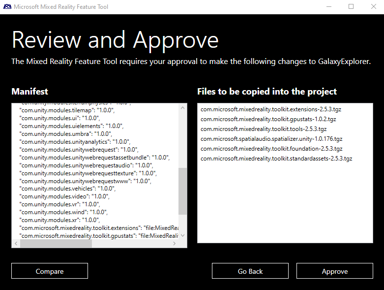

# Authorizing project changes

Before modifying the Unity project, changes need to be reviewed and approved.

## Manifest

The proposed manifest changes can be viewed in the `Manifest` column (on the left). The contents are exactly what will be written to the project manifest (`Packages/manifest.json`)

## Files to be copied into the project

The `Files to be copied into the project` (on the right), lists the specific feature package files that will be copied into the Unity project.

## Compare manifests

By clicking the `Compare` button, the contents of the current and proposed manifests can be viewed side-by-side, allowing for a detailed look at the proposed changes.

## Approving changes

When the proposed changes are approved, the listed files will be copied into the Unity project and the manifest will be updated to contain references to these files.

> [!NOTE]
> The feature package (*.tgz) files should be added to source control. They are referenced using a relative path to enable development teams to easily share features and manifest changes.

 As part of the modifications, the current `manifest.json` file will be backed up.

> [!IMPORTANT]
> When viewing the manifest backups, the oldest will be called `manifest.json.backup`. Newer backups will be annotated with a numeric value, beginning with zero (0).

## Going back to the previous step

From `Review and Approve`, the Mixed Reality Feature Tool allows for navigating back to the [import](ImportingFeatures.md) step. Click the `Go back` button to make changes to the selection of features to be imported.

## See also

- [Welcome to the Mixed Reality Feature Tool](WelcomeToTheMixedRealityFeatureTool.md)
- [Importing selected packages](ImportingFeatures.md)
