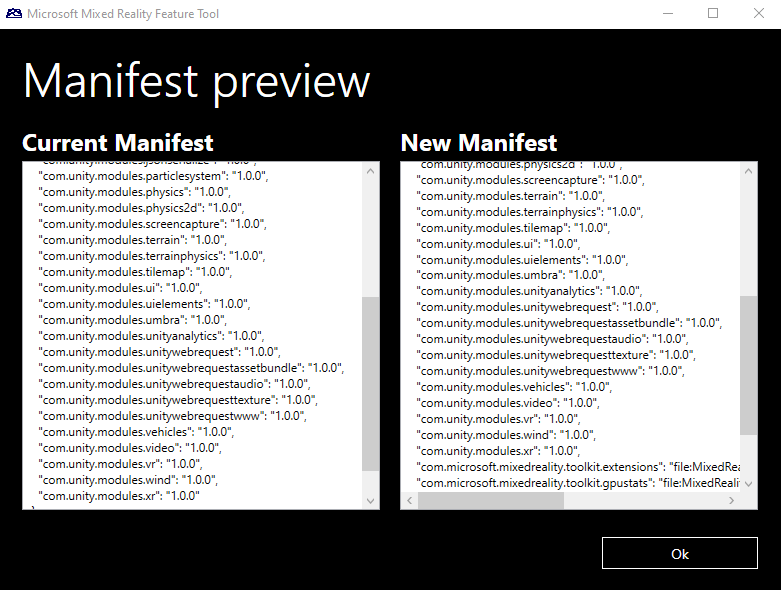

# Authorizing project changes

Before modifying the Unity project, changes to the manifest and project files need to be reviewed and approved:

## Manifest

The proposed manifest changes can be viewed in the **Manifest** column on the left. The contents are exactly what will be written to the project manifest (`Packages/manifest.json`):

## Files to be copied into the project

The **Files to be copied into the project** section on the right lists the specific feature package files that will be copied into the Unity project:

## Compare manifests

You can see a detailed side-by-side comparison of all proposed changes by selecting  **Compare**:

## Approving changes

When the proposed changes are approved, the listed files will be copied into the Unity project and the manifest will be updated with references to these files.

> [!NOTE]
> The feature package (*.tgz) files should be added to source control. They are referenced using a relative path to enable development teams to easily share features and manifest changes.

 As part of the modifications, the current **manifest.json** file will be backed up.

> [!IMPORTANT]
> When viewing the manifest backups, the oldest will be called **manifest.json.backup**. Newer backups will be annotated with a numeric value, beginning with zero (0).

## Going back to the previous step

If you need to make changes to your feature selections, use **Go Back** to return to the [import](importing-features.md) step.

## See also

- [Welcome to the Mixed Reality Feature Tool](welcome-to-mr-feature-tool.md)
- [Importing selected packages](importing-features.md)
