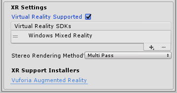
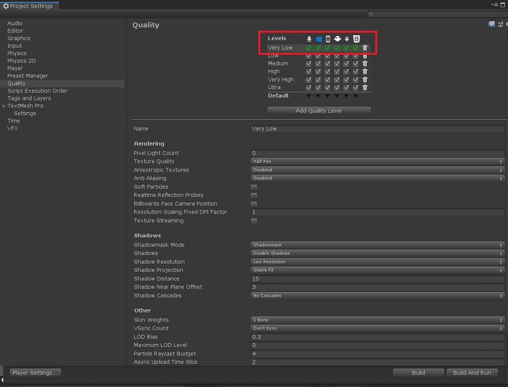
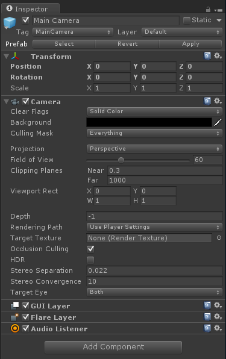

# Configure a New Unity project for Windows Mixed Reality 

## Overview

Windows Mixed Reality (WMR) is a Microsoft platform introduced as part of the Windows 10 operating system. The WMR platform lets you build applications that render digital content on holographic and VR display devices.

When setting up for WMR, there are two paths you can take. Your first option is to install the [Mixed Reality Toolkit (MRTK)](https://microsoft.github.io/MixedRealityToolkit-Unity/Documentation/Installation.html), which will automatically set up the WMR environment. The second option is to manually change a few Unity settings to get rolling with WMR. 

> [!NOTE]
> You can always import MRTK later on, so there's no penalty for going the manual route first.

If you choose the WMR manual setup, the settings you need to change are broken-down into two categories: per-project and per-scene.

## Per-project settings

The first setting you need to change for WMR is the project platform: 
1. Select **File > Build Settings...**
2. Select **Universal Windows Platform** in the Platform list and click **Switch Platform**
3. Set **SDK** to **Universal 10**
4. Set **Target device** to **Any Device** to support immersive headsets or switch to **HoloLens**
5. Set **Build Type** to **D3D**
6. Set **UWP SDK** to **Latest installed**

*Unity XR settings*

After the platform is configured correctly, you need to let Unity know that your app should create an [immersive view](../../design/app-views.md) instead of a 2D view when exported:
1. From the **Build Settings...** window, open **Player Settings...**
2. Select the **Settings for Universal Windows Platform** tab and expand the **XR Settings** group
3. In the **XR Settings** section, check the **Virtual Reality Supported** checkbox to add the **Virtual Reality Devices** list.
4. In the **XR Settings** group, confirm that **"Windows Mixed Reality"** is listed as a supported device. (this option may appear as **Windows Holographic** in older versions of Unity)

 
*Unity XR settings*

### Updating the manifest

Your app can now handle holographic rendering and spatial input. However, your app needs to declare the appropriate capabilities in its manifest to take advantage of certain functionality. You can find your projects capabilities by going to **Player Settings > Settings for Universal Windows Platform > Publishing Settings > Capabilities**. 

It's recommended that you make the manifest declarations in Unity to include them in all future projects that you export. The applicable capabilities for enabling commonly used Unity APIs for Mixed Reality are:

|  Capability  |  APIs requiring capability | 
|----------|----------|
|  SpatialPerception  |  SurfaceObserver (access to [spatial mapping](../../design/spatial-mapping.md) meshes on HoloLens)&mdash;*No capability needed for general spatial tracking of the headset* | 
|  WebCam  |  PhotoCapture and VideoCapture | 
|  PicturesLibrary / VideosLibrary  |  PhotoCapture or VideoCapture, respectively (when storing the captured content) | 
|  Microphone  |  VideoCapture (when capturing audio), DictationRecognizer, GrammarRecognizer, and KeywordRecognizer | 
|  InternetClient  |  DictationRecognizer (and to use the Unity Profiler) | 

### Quality settings

HoloLens has a mobile-class GPU. If your app is targeting HoloLens, you'll want the quality settings in your app tuned for fastest performance to ensure it maintains full frame-rate:
1. Select **Edit > Project Settings > Quality**
2. Select the **dropdown** under the **Windows Store** logo and select **Very Low**. You'll know the setting is applied correctly when the box in the Windows Store column and **Very Low** row is green.

 
*Unity quality settings*

## Per-scene settings

### Unity camera settings

With **Virtual Reality Supported** checked, the [Unity Camera](camera-in-unity.md) component handles [head tracking and stereoscopic rendering](../platform-capabilities-and-apis/rendering.md). That means there's no need for you to replace the Main Camera object with a custom camera.

If your app is targeting HoloLens specifically, you need to change a few settings to optimize for the device's transparent displays. These settings allow your holographic content to show through to the physical world:
1. In the **Hierarchy**, select the **Main Camera**
2. In the **Inspector** panel, set the transform **position** to **0, 0, 0** so the location of the user's head starts at the Unity world origin.
3. Change **Clear Flags** to **Solid Color**.
4. Change the **Background** color to **RGBA 0,0,0,0**. Black renders as transparent in HoloLens.
5. Change **Clipping Planes - Near** to the [HoloLens recommended](camera-in-unity.md#clip-planes) 0.85 (meters).

 
*Unity camera settings*

> [!IMPORTANT]
> If you delete and create a new camera, make sure your new camera is tagged as **MainCamera**.

## See also
* [MRTK - Installation guide (GitHub)](https://microsoft.github.io/MixedRealityToolkit-Unity/Documentation/Installation.html)
* [MRTK - Documentation home (GitHub)](https://microsoft.github.io/MixedRealityToolkit-Unity/README.html)
* [Install the tools](../install-the-tools.md)
* [Unity Development Overview](unity-development-overview.md)
