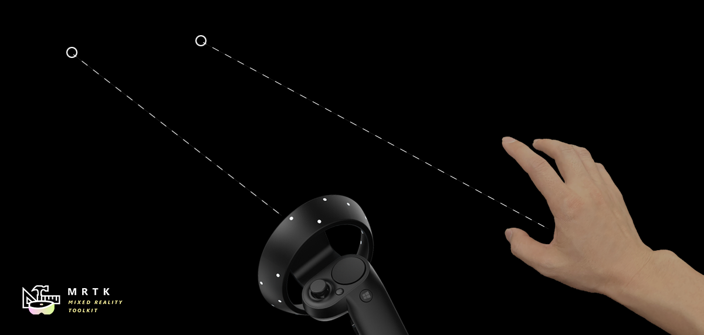
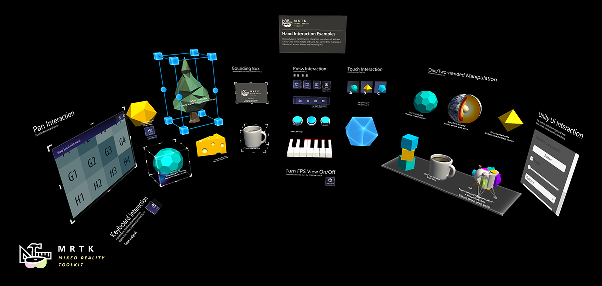

# Articulated Hand and Eye Tracking in Unity

HoloLens 2 has introduced some new and exciting capabilities, such as Articulated Hand and Eye Tracking.

The easiest way to leverage the new capability in Unity is through MRTK. There are also some example scenes to help you get started.

* [Get started with Articulated Hand  in MRTK](https://docs.microsoft.com/windows/mixed-reality/mrtk-docs/features/input/hand-tracking.md)
* [Get started with Eye Tracking in MRTK](https://docs.microsoft.com/windows/mixed-reality/mrtk-docs/features/eye-tracking/eye-tracking-main.md)

## Building Blocks supporting Hands, eyes and others in MRTK 

MRTK v2 provides a set of UI Controls and building blocks to help you accelerate your development.

|   [Button](https://docs.microsoft.com/windows/mixed-reality/mrtk-docs/features/ux-building-blocks/button.md) |  [Bounding Box](https://docs.microsoft.com/windows/mixed-reality/mrtk-docs/features/ux-building-blocks/bounding-box.md) |  [Manipulation Handler](https://docs.microsoft.com/windows/mixed-reality/mrtk-docs/features/ux-building-blocks/manipulation-handler.md) |
|:--- | :--- | :--- |
| A button control, which supports various input methods including HoloLens2's articulated hand | Standard UI for manipulating objects in 3D space | Script for manipulating objects with one or two hands |
|   [Slate](https://docs.microsoft.com/windows/mixed-reality/mrtk-docs/features/ux-building-blocks/slate.md) |  [System Keyboard](https://docs.microsoft.com/windows/mixed-reality/mrtk-docs/features/ux-building-blocks/system-keyboard.md) |  [Interactable](https://docs.microsoft.com/windows/mixed-reality/mrtk-docs/features/ux-building-blocks/interactable.md) |
| 2D style plane, which supports scrolling with articulated hand input | Example script of using the system keyboard in Unity  | A script for making objects interactable with visual states and theme support |
|   [Solver](https://docs.microsoft.com/windows/mixed-reality/mrtk-docs/features/ux-building-blocks/solvers/solver.md) |  [Object Collection](https://docs.microsoft.com/windows/mixed-reality/mrtk-docs/features/ux-building-blocks/object-collection.md) |  [Tooltip](https://docs.microsoft.com/windows/mixed-reality/mrtk-docs/features/ux-building-blocks/tooltip.md) |
| Various object positioning behaviors such as tag-along, body-lock, constant view size, and surface magnetism | Script for lay out an array of objects in a three-dimensional shape | Annotation UI with flexible anchor/pivot system, which can be used for labeling motion controllers and object. |
|   [App Bar](https://docs.microsoft.com/windows/mixed-reality/mrtk-docs/features/ux-building-blocks/app-bar.md) |  [Pointers](https://docs.microsoft.com/windows/mixed-reality/mrtk-docs/features/input/pointers.md) |  [Fingertip Visualization](https://docs.microsoft.com/windows/mixed-reality/mrtk-docs/features/ux-building-blocks/fingertip-visualization.md) |
| UI for Bounding Box's manual activation | Learn about various types of pointers | Visual affordance on the fingertip, which improves the confidence for the direct interaction |
|   [Eye Tracking: Target Selection](https://docs.microsoft.com/windows/mixed-reality/mrtk-docs/features/eye-tracking/eye-tracking-target-selection.md) |  [Eye Tracking: Navigation](https://docs.microsoft.com/windows/mixed-reality/mrtk-docs/features/eye-tracking/eye-tracking-navigation.md) |  [Eye Tracking: Heat Map](https://microsoft.github.io/MixedRealityToolkit-Unity/Documentation/EyeTracking/EyeTracking_Visualization.html) |
| Combine eyes, voice, and hand input to quickly and effortlessly select holograms across your scene | Learn how to auto scroll text or zoom into focused content based on what you're looking at| Examples for logging, loading, and visualizing what users have been looking at in your app |

## Example Scenes

Explore MRTK's various types of interactions and UI controls in [this example scene](https://microsoft.github.io/MixedRealityToolkit-Unity/Documentation/README_HandInteractionExamples.html).

You can find  other example scenes in [Mixed Reality Toolkit GitHub](https://github.com/Microsoft/MixedRealityToolkit-Unity) under **Assets/MixedRealityToolkit.Examples/Demos**folder.

## Next Development Checkpoint

If you're following the Unity development journey we've laid out, you're in the midst of exploring the MRTK core building blocks. From here, you can continue to the next building block:

> [!div class="nextstepaction"]
> [Spatial Mapping](spatial-mapping-in-unity.md)

Or jump to Mixed Reality platform capabilities and APIs:

> [!div class="nextstepaction"]
> [Shared experiences](shared-experiences-in-unity.md)

You can always go back to the [Unity development checkpoints](unity-development-overview.md#2-core-building-blocks) at any time.

## See also

* [Eye-based interaction](../../design/eye-gaze-interaction.md)
* [Eye tracking on HoloLens 2](../../design/eye-tracking.md)
* [Gaze and commit](../../design/gaze-and-commit.md)
* [Hands - Direct manipulation](../../design/direct-manipulation.md)
* [Hands - Gestures](../../design/gaze-and-commit.md#composite-gestures)
* [Hands - Point and commit](../../design/point-and-commit.md)
* [Instinctual interactions](../../design/interaction-fundamentals.md)
* [Motion controllers](../../design/motion-controllers.md)
* [UnityEngine.XR.WSA.Input](https://docs.unity3d.com/ScriptReference/XR.WSA.Input.InteractionManager.html)
* [UnityEngine.XR.InputTracking](https://docs.unity3d.com/ScriptReference/XR.InputTracking.html)
