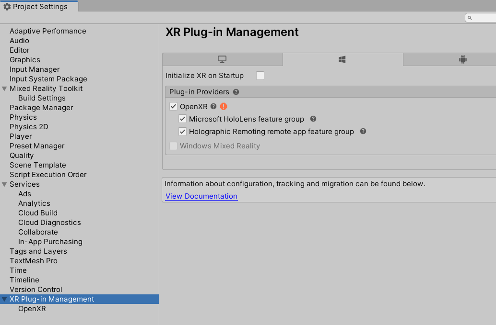

# Holographic Remoting in Unity

> [!NOTE]
> Windows Standalone app remoting support was added in the 0.1.3 package release.
> As of version 0.1.3, this feature doesn’t support UWP builds.

[Learn the basics of Holographic Remoting.](../platform-capabilities-and-apis/holographic-remoting-overview.md)

You can use Holographic Remoting to stream holographic content to your HoloLens 2 in real time. This is a great way to quickly debug your app without building and deploying a full project. 

Before getting started, it's important to understand your two main options in Unity:
* **Holographic Remoting in Unity Play mode**: Run your app locally in the Unity editor on your PC in Play Mode to provide a fast way to preview your content on a HoloLens 2. Play Mode can also be used with a Windows Mixed Reality headset attached to your development PC.
* **Holographic Remoting from a Unity build file**: Run your app from a Unity Holographic Remoting remote application that you've exported to your desktop to your HoloLens 2. This can be helpful if your app has high-resolution assets or models; your desktop GPU handles the rendering before it gets to the HoloLens 2.

## Holographic Remoting setup

Whichever route you're taking with Holographic Remoting, you need to [install the Holographic Remoting Player app](https://www.microsoft.com/store/productId/9NBLGGH4SV40) from the Microsoft Store on your HoloLens 2.

Once it's downloaded, run the Holographic Remoting Player app on your HoloLens 2 and you'll see the version number and IP address to connect to. **You'll need v2.4 or later in order to work with the OpenXR plugin**.


## Unity Play Mode with Holographic Remoting

[!INCLUDE[](includes/unity-play-mode.md)]

Holographic Remoting requires a fast PC and Wi-Fi connection. You can find more details in the [Holographic Remoting Player](../platform-capabilities-and-apis/holographic-remoting-player.md) documentation.

For best results, make sure your app properly sets the [focus point](focus-point-in-unity.md). This helps Holographic Remoting to adapt your scene to the latency of your wireless connection.

## Holographic Remoting from a Unity Holographic Remoting remote application

1. On the menu bar, select **Edit > Project Settings**.
1. In the left-side column, select **XR plug-in Management**.
1. In the **XR Plug-in Management** section, select **Microsoft HoloLens feature group** and **Holographic Remoting remote app feature group**.
1. Unselect **Initialize XR on Startup**:

    

1. Write some code to set the remoting configuration and trigger XR initialization. The sample app distributed with the [Mixed Reality OpenXR Plugin](./xr-project-setup.md#unity-sample-projects-for-openxr-and-hololens-2) contains AppRemoting.cs, which shows an example scenario for connecting to a specific IP address at runtime. Deploying the sample app to a local machine at this point will display an IP address input field with a connect button. Typing an IP address and clicking Connect will initialize XR and attempt to connect to the target device:

    

1. To write custom connection code, call `Microsoft.MixedReality.OpenXR.Remoting.AppRemoting.Connect` with a filled-in `RemotingConfiguration`. The sample app exposes this in the inspector and shows how to fill in the IP address from a text field. Calling `Connect` will set the configuration and automatically initialize XR, which is why it must be called as a coroutine:

    ``` cs
    StartCoroutine(Remoting.AppRemoting.Connect(remotingConfiguration));
    ```

1. While running, you can obtain the current connection state with the `AppRemoting.TryGetConnectionState` API, and optionally disconnect and de-initialize XR using `AppRemoting.Disconnect()`. This could be used to disconnect and reconnect to a different device within the same app session. The sample app provides a tappable cube which will disconnect the remoting session if tapped.

### Migration from previous APIs

#### UnityEngine.XR.WSA.HolographicRemoting

From the sample code on [Unity's docs](https://docs.unity3d.com/2018.4/Documentation/ScriptReference/XR.WSA.HolographicRemoting.html):

| XR.WSA.HolographicRemoting | OpenXR.Remoting.AppRemoting |
| ---- | ---- |
| `HolographicRemoting.Connect(String)` | `AppRemoting.Connect(RemotingConfiguration)` |
| `HolographicRemoting.ConnectionState` | `AppRemoting.TryGetConnectionState(out ConnectionState, out DisconnectReason)`|
| `StartCoroutine(LoadDevice("WindowsMR"))`| [N/A: Automatically happens when calling `AppRemoting.Connect`]  |

#### Unity​Engine.​XR.​Windows​MR.WindowsMRRemoting

| XR.​Windows​MR.WindowsMRRemoting | OpenXR.Remoting.AppRemoting |
| ---- | ---- |
| `WindowsMRRemoting.Connect()` | `AppRemoting.Connect(RemotingConfiguration)` |
| `WindowsMRRemoting.Disconnect()` | `AppRemoting.Disconnect()` |
| `WindowsMRRemoting.TryGetConnectionState(out ConnectionState)` and `WindowsMRRemoting.TryGetConnectionFailureReason(out ConnectionFailureReason)`| `AppRemoting.TryGetConnectionState(out ConnectionState, out DisconnectReason)`|
| `WindowsMRRemoting.isAudioEnabled`, `WindowsMRRemoting.maxBitRateKbps`, `WindowsMRRemoting.remoteMachineName` | Passed into `AppRemoting.Connect` via the `RemotingConfiguration` struct |
| `WindowsMRRemoting.isConnected` | `AppRemoting.TryGetConnectionState(out ConnectionState state, out _) && state == ConnectionState.Connected`

## See also

* [Holographic Remoting Player](../platform-capabilities-and-apis/holographic-remoting-player.md)
* [Tutorial: Getting started with PC Holographic Remoting](../unity/tutorials/mr-learning-pc-holographic-remoting-01.md)
* [Tutorial: Creating a Holographic Remoting PC application](../unity/tutorials/mr-learning-pc-holographic-remoting-02.md)