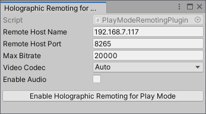

# [Unity 2020 + OpenXR](#tab/openxr)

1. On your HoloLens, go to the **Microsoft Store** and install the **[Holographic Remoting Player](https://www.microsoft.com/store/p/holographic-remoting-player/9nblggh4sv40)** app.
1. On your HoloLens, start the **Holographic Remoting Player** app.
1. In Unity, go to the **Edit** menu and select **Project Settings**.
1. Select **XR Plug-in Management**.
1. Ensure the **Windows Standalone** tab is selected, find **OpenXR** and **Windows Mixed Reality feature set** in the list, and check their checkboxes.
1. Next, go to the **Window** menu, expand the **XR** submenu, and select **OpenXR Editor Remoting**.

    

1. Click **Enable Editor Remoting**.

    

1. If the **Enable Missing Dependencies** button appears, click that as well. The error box above the button describes the features it's enabling and why.
1. For **Remote Host Name**, enter the IP address of your HoloLens.
   1. Change other settings as needed.
   1. The editor will attempt to connect once Play Mode is started.
1. Select the **Play** button to start Play Mode and experience the app on your HoloLens. To debug C# scripts in play mode, [attach Visual Studio to Unity](/visualstudio/gamedev/unity/get-started/using-visual-studio-tools-for-unity?pivots=windows).

> [!NOTE]
> As of version 0.1.0, the Holographic Remoting runtime doesn’t support Anchors, and ARAnchorManager functionalities will not work through remoting.  This feature is coming in future releases.

# [Unity 2019/2020 + Windows XR Plugin](#tab/winxr)

1. On your HoloLens, go to the **Microsoft Store** and install the **[Holographic Remoting Player](https://www.microsoft.com/store/p/holographic-remoting-player/9nblggh4sv40)** app.
1. On your HoloLens, start the **Holographic Remoting Player** app.
1. In Unity, go to the **Edit** menu and select **Project Settings**.
1. Select **XR Plug-in Management**.
1. Ensure the **PC, Mac & Linux Standalone** tab is selected, find **Windows Mixed Reality** in the list, and check its checkbox.
1. Next, go to the **Window** menu, expand the **XR** submenu, and select **Windows XR Plugin Remoting**.
1. Set **Emulation Mode** to **Remote to Device**.
1. For **Remote Machine**, enter the IP address of your HoloLens.
1. To connect, either:
   1. To manually connect, uncheck **Connect on Play**, and select **Connect**. You should see **Connection Status** change to **Connected** and see the screen go blank in the HoloLens.
   1. To automatically connect, check **Connect on Play**. The editor will attempt to connect once Play Mode is started.
1. Select the **Play** button to start Play Mode and experience the app on your HoloLens. To debug C# scripts in play mode, [attach Visual Studio to Unity](/visualstudio/gamedev/unity/get-started/using-visual-studio-tools-for-unity?pivots=windows).

# [Legacy WSA](#tab/wsa)

1. On your HoloLens, go to the **Microsoft Store** and install the **[Holographic Remoting Player](https://www.microsoft.com/store/p/holographic-remoting-player/9nblggh4sv40)** app.
1. On your HoloLens, start the **Holographic Remoting Player** app.
1. In Unity, go to the **Window** menu, expand the **XR** submenu, and select **Holographic Emulation** (marked as deprecated in Unity 2019).
1. Set **Emulation Mode** to **Remote to Device**.
1. Set **Device Version** according to if you're using a first generation HoloLens or a HoloLens 2.
1. For **Remote Machine**, enter the IP address of your HoloLens.
1. Select **Connect**. You should see **Connection Status** change to **Connected** and see the screen go blank in the HoloLens.
1. Select the **Play** button to start Play Mode and experience the app on your HoloLens. To debug C# scripts in play mode, [attach Visual Studio to Unity](/visualstudio/gamedev/unity/get-started/using-visual-studio-tools-for-unity?pivots=windows).
