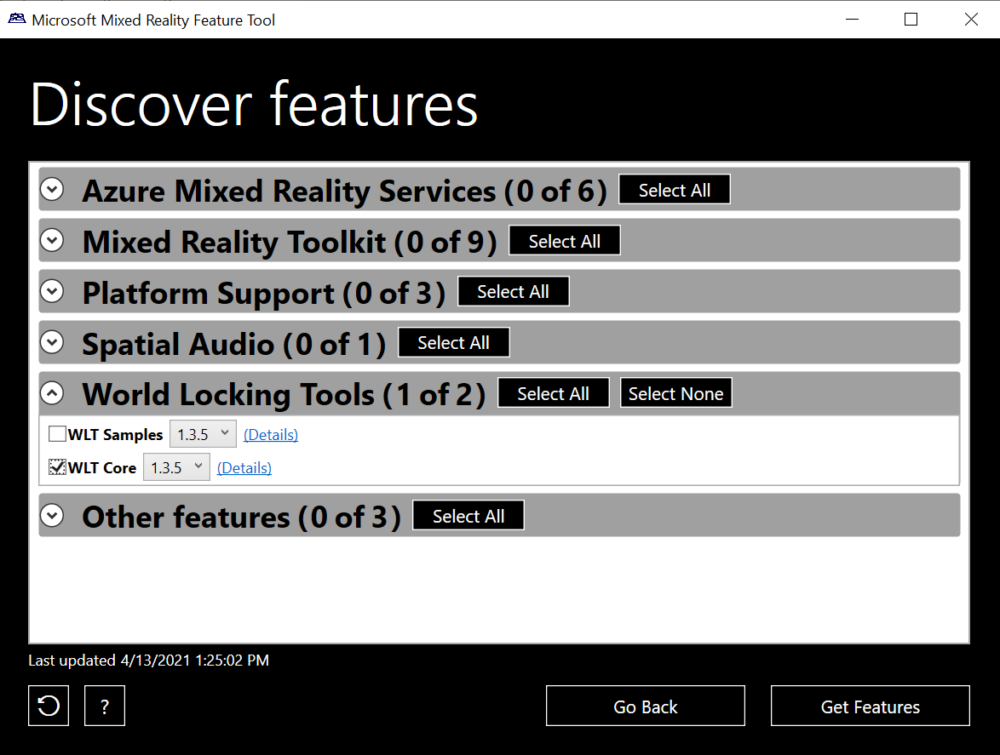
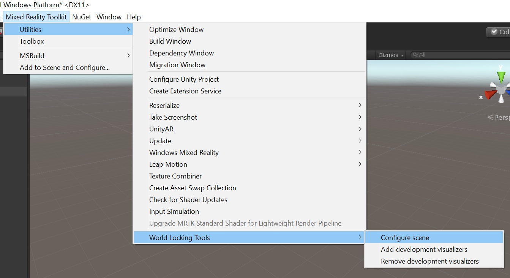

# [World Locking Tools (Recommended)](#tab/wlt)

We recommend installing World Locking Tools using the new Mixed Reality Feature Tool. Once you've downloaded the Mixed Reality Feature Tool from the link below, select the latest version of **WLT Core** from the **World Locking Tools** section:



> [!div class="nextstepaction"]
> [Install World Locking Tools with the MR Feature Tool](welcome-to-mr-feature-tool.md)

### Automated setup

When your project is ready to go, run the configure scene utility from **Mixed Reality Toolkit > Utilities > World Locking Tools**:



> [!IMPORTANT]
> The Configure scene utility can be rerun at any time. For example, it should be rerun if the AR target has been changed from Legacy to XR SDK. If the scene is already properly configured, running the utility has no effect.

### Visualizers

During early development, adding visualizers can be helpful to ensure WLT is setup and working properly. They can be removed for production performance, or if for any reason are no longer needed, using the Remove visualizers utility. More details on the visualizers can be found in the [Tools documentation](https://microsoft.github.io/MixedReality-WorldLockingTools-Unity/DocGen/Documentation/HowTos/Tools.html#visualizers).

# [Manual](#tab/manual)

The Mixed Reality OpenXR Plugin supplies basic anchor functionality through an implementation of Unity’s ARFoundation **ARAnchorManager**. To learn the basics on ARAnchors in ARFoundation, visit the [ARFoundation Manual for AR Anchor Manager](https://docs.unity3d.com/Packages/com.unity.xr.arfoundation@4.1/manual/anchor-manager.html). 

# [Legacy WSA](#tab/wsa)

## Building a world-scale experience

**Namespace:** *UnityEngine.XR.WSA*<br>
**Type:** *WorldAnchor*

For true **world-scale experiences** on HoloLens that let users wander beyond 5 meters, you'll need new techniques beyond those used for room-scale experiences. One key technique you'll use is to create a [spatial anchor](../../../../design/coordinate-systems.md#spatial-anchors) to lock a cluster of holograms precisely in place in the physical world, no matter how far the user has roamed, and then [find those holograms again in later sessions](../../../../design/coordinate-systems.md#spatial-anchor-persistence).

In Unity, you create a spatial anchor by adding the **WorldAnchor** Unity component to a GameObject.

### Adding a World Anchor

To add a world anchor, call `AddComponent<WorldAnchor>()` on the game object with the transform you want to anchor in the real world.

```cs
WorldAnchor anchor = gameObject.AddComponent<WorldAnchor>();
```

That's it! This game object will now be anchored to its current location in the physical world - you may see its Unity world coordinates adjust slightly over time to ensure that physical alignment. Refer to [loading a world anchor](#loading-a-worldanchor) to find this anchored location again in a future app session.

### Removing a World Anchor

If you no longer want the GameObject locked to a physical world location and don't intend on moving it this frame, then you can just call Destroy on the World Anchor component.

```cs
Destroy(gameObject.GetComponent<WorldAnchor>());
```

If you want to move the GameObject this frame, you need to call DestroyImmediate instead.

```cs
DestroyImmediate(gameObject.GetComponent<WorldAnchor>());
```

### Moving a World Anchored GameObject

GameObject's cannot be moved while a World Anchor is on it. If you need to move the GameObject this frame, you need to:

1. DestroyImmediate the World Anchor component
2. Move the GameObject
3. Add a new World Anchor component to the GameObject.

```cs
DestroyImmediate(gameObject.GetComponent<WorldAnchor>());
gameObject.transform.position = new Vector3(0, 0, 2);
WorldAnchor anchor = gameObject.AddComponent<WorldAnchor>();
```

### Handling Locatability Changes

A WorldAnchor may not be locatable in the physical world at a point in time. If that occurs, Unity won't be updating the transform of the anchored object. This also can change while an app is running. Failure to handle the change in locatability will cause the object to not appear in the correct physical location in the world.

To be notified about locatability changes:

1. Subscribe to the OnTrackingChanged event
2. Handle the event

The **OnTrackingChanged** event will be called whenever the underlying spatial anchor changes between a state of being locatable vs. not being locatable.

```cs
anchor.OnTrackingChanged += Anchor_OnTrackingChanged;
```

Then handle the event:

```cs
private void Anchor_OnTrackingChanged(WorldAnchor self, bool located)
{
    // This simply activates/deactivates this object and all children when tracking changes
    self.gameObject.SetActiveRecursively(located);
}
```

Sometimes anchors are located immediately. In this case, this isLocated property of the anchor will be set to true when AddComponent<WorldAnchor>() returns. As a result, the OnTrackingChanged event won't be triggered. A clean pattern would be to call your OnTrackingChanged handler with the initial IsLocated state after attaching an anchor.

```cs
Anchor_OnTrackingChanged(anchor, anchor.isLocated);
```