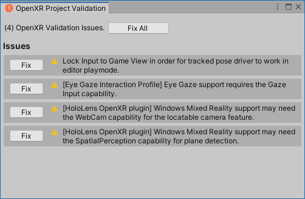
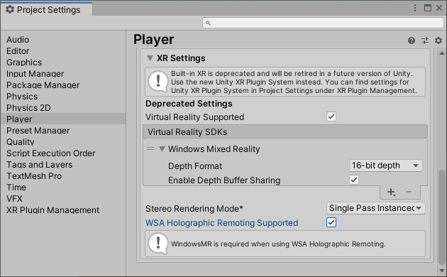

# [OpenXR](#tab/openxr)

Install the OpenXR plugin with the new Mixed Reality Feature Tool application. Follow the [installation and usage instructions](../../welcome-to-mr-feature-tool.md) and select the **Mixed Reality OpenXR Plugin** package in the Mixed Reality Toolkit category:

### Setting your build target

If you're targeting Desktop VR, we suggest using the PC Standalone Platform selected by default on a new Unity project:

If you're targeting HoloLens 2, you need to switch to the Universal Windows Platform:

1. Select **File > Build Settings...**
2. Select **Universal Windows Platform** in the Platform list and select **Switch Platform**
3. Set **Architecture** to **ARM 64**
4. Set **Target device** to **HoloLens**
5. Set **Build Type** to **D3D**
6. Set **UWP SDK** to **Latest installed**

### Configuring XR Plugin Management for OpenXR

To set OpenXR as the the runtime in Unity:

1. In the Unity Editor, navigate to **Edit > Project Settings**
2. In the list of Settings, select **XR Plugin Management**
3. Check the **Initialize XR on Startup** and **OpenXR** boxes
4. If targeting HoloLens 2, make sure you're on the UWP platform and select **Microsoft HoloLens Feature Set**

### Optimization

If you're developing for HoloLens 2, navigate to **Mixed Reality> OpenXR > Apply recommended project settings for HoloLens 2** to get better app performance.

> [!IMPORTANT]
> If you see a red warning icon next to **OpenXR Plugin**, click the icon and select **Fix all** before continuing. The Unity Editor may need to restart itself for the changes to take effect.

You're now ready to begin developing with OpenXR in Unity!  Continue on to the next section to learn how to use the OpenXR samples.

### Unity sample projects for OpenXR and HoloLens 2

Check out the [OpenXR Mixed Reality samples repo](https://github.com/microsoft/OpenXR-Unity-MixedReality-Samples) for sample unity projects showcasing how to build Unity applications for HoloLens 2 or Mixed Reality headsets using the Mixed Reality OpenXR plugin.

# [Windows XR](#tab/windowsxr)

If you're targeting Desktop VR, we suggest using the PC Standalone Platform selected by default on a new Unity project:

If you're targeting HoloLens 2, you need to switch to the Universal Windows Platform:

1.	Select **File > Build Settings...**
2.	Select **Universal Windows Platform** in the Platform list and select **Switch Platform**
3.	Set **Architecture** to **ARM 64**
4.	Set **Target device** to **HoloLens**
5.	Set **Build Type** to **D3D**
6.	Set **UWP SDK** to **Latest installed**
7.	Set **Build configuration** to **Release** because there are known performance issues with Debug

After setting your platform, you need to let Unity know to create an [immersive view](../../../../design/app-views.md) instead of a 2D view when exported:

1. In the Unity Editor, navigate to **Edit > Project settings** and select **XR Plugin Management**

2. Select **Install XR Plugin Management**

3. Select **Initialize XR on Startup** and **Windows Mixed Reality**

4. Expand the **XR Plug-in Management** section and select **Univeral Windows Platform Settings** tab
5. If you're using Unity 2020 or later, you'll see the options to check **OpenXR** or **Windows Mixed Reality**. 
    * You can choose either runtime.  If you're specifically developing for the HoloLens 2 or the HP Reverb G2 and decide to try the **OpenXR**, select the OpenXR box and review our guide to [Using the Mixed Reality OpenXR Plugin for Unity](../../openxr-getting-started.md) to get yourself set up correctly for these devices before returning to this tutorial

> [!NOTE]
> Starting in Unity 2020 LTS, Microsoft is embracing development with OpenXR.  As we migrate to this path, in Unity 2021.1 the Windows XR plugin will be deprecated and removed in 2021.2 making OpenXR the only supported path. You can find more information in [Using the Mixed Reality OpenXR plugin](../../openxr-getting-started.md).

6. If you decide to choose the **Windows Mixed Reality** plugin, check all boxes and set **Depth Submission Mode** to **Depth 16 Bit**

# [Legacy XR](#tab/legacy)

If you're targeting Desktop VR, we suggest using the PC Standalone Platform selected by default on a new Unity project:

If you're targeting HoloLens 2, you need to switch to the Universal Windows Platform:

1.	Select **File > Build Settings...**
2.	Select **Universal Windows Platform** in the Platform list and select **Switch Platform**
3.	Set **Architecture** to **ARM 64**
4.	Set **Target device** to **HoloLens**
5.	Set **Build Type** to **D3D**
6.	Set **UWP SDK** to **Latest installed**
7.	Set **Build configuration** to **Release** because there are known performance issues with Debug

After setting your platform, you need to let Unity know to create an [immersive view](../../../../design/app-views.md) instead of a 2D view when exported.

> [!CAUTION]
> Legacy XR is deprecated in Unity 2019 and removed in Unity 2020.

1. Open **Player Settings...** from the **Build Settings... window** and expand the **XR Settings** group
2. In the **XR Settings** section, select **Virtual Reality Supported** to add the Virtual Reality Devices list
3. Set **Depth Format** to **16-bit Depth** and enable **Depth Buffer Sharing**
4. Set **Stereo Rendering Mode** to **Single Pass Instance**
5. Select **WSA Holographic Remoting Supported** if you'd like to use Holographic remoting 

