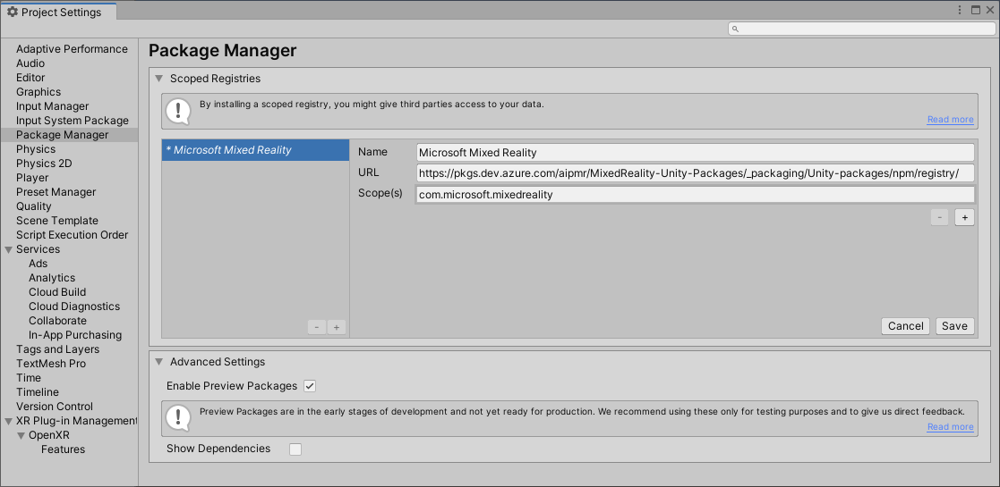
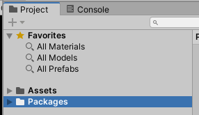

# Using the Mixed Reality OpenXR Plugin for Unity

Starting with Unity version 2020.2, Microsoft’s Mixed Reality OpenXR Plugin package is available using the Unity Package Manager (UPM).

## Prerequisites

* Unity 2020.2 or later
* Unity OpenXR plugin 0.1.1 or later
* Visual Studio 2019 or later
* Install **UWP** platform support in Unity for HoloLens 2 apps

> [!NOTE]
> If you're building VR applications on Windows PC, the Mixed Reality OpenXR plugin is not necessarily required. However, you'll want to install the plugin if you're customizing controller mapping for HP Reverb G2 controllers or building apps that work on both HoloLens 2 and VR headsets.

## Installing the Mixed Reality OpenXR plugin

Your project needs to install the **OpenXR Plugin** and **XR Plugin Management** packages before using the Mixed Reality OpenXR Plugin. If you've already installed them, great! If not, installing the Mixed Reality OpenXR plugin will automatically install them as dependencies:

1. In the Unity Editor, navigate to **Edit > Project Settings > Package Manager**
2. Expand the **Scoped Registries** section, enter the following information, and select **Save**:
    * Set **Name** to **Microsoft Mixed Reality**
    * Set **URL** to **https://pkgs.dev.azure.com/aipmr/MixedReality-Unity-Packages/_packaging/Unity-packages/npm/registry/**
    * Set **Scope(s)** to **com.microsoft.mixedreality**

3. Under **Advanced Settings**, select **Enable Preview Packages**



The Unity Package Manager uses a manifest file named *manifest.json* to determine which packages to install and the registries they can be installed from.

> [!IMPORTANT]
> OpenXR is still experimental in Unity and this process may change over time as we work to optimize the developer experience.

### Registering the Mixed Reality dependency

Once the Microsoft Mixed Reality scoped registry has been added to the manifest, the OpenXR package can be specified.

To add the OpenXR package:

1. Open **[projectRoot]/Packages/manifest.json** in a text editor like Visual Studio Code
    1. To get here, right click on **Packages** in the left panel of the Project window. Then, click **Show in Explorer**.
    
1. Modify the dependencies section of the *Packages/manifest.json* file as follows:

    > [!IMPORTANT]
    > There may be more dependencies in your manifest file than shown here. Don't delete any of them, just add the OpenXR dependency to the list.

    ``` json
      "dependencies": {
        "com.microsoft.mixedreality.openxr": "0.1.1",
      }
    ```

1. Save the file, switch back to the Unity Editor, and open the **Package Manager** to confirm the plugin is installed:

    

    > [!Note]
    > If the OpenXR package is removed using the Unity Package Manager, you'll have to re-add it using the previously described steps.

## Configuring XR Plugin Management for OpenXR

To set OpenXR as the the runtime in Unity:

1. In the Unity Editor, navigate to **Edit > Project Settings**
2. In the list of Settings, select **XR Plugin Management**
3. Check the **Initialize XR on Startup** and **OpenXR (Preview)** boxes
4. If targeting HoloLens 2, make sure you're on the UWP platform and select **Microsoft HoloLens Feature Set**


> [!IMPORTANT]
> If you see a red warning icon next to **OpenXR Plugin (Preview)**, click the icon and select **Fix all** before continuing. The Unity Editor may need to restart itself for the changes to take effect.


You're now ready to begin developing with OpenXR in Unity!  Continue on to the next section to learn how to use the OpenXR samples.

## Optimization

If you're developing for HoloLens 2, navigate to **Mixed Reality> OpenXR > Apply recommended project settings for HoloLens 2** to get better app performance.


## Try out the Unity sample scenes

To utilize one or more of the examples, install [ARFoundation 4.0+](https://docs.unity3d.com/Packages/com.unity.xr.arfoundation@4.1/manual/index.html#installing-ar-foundation) from the **Package Manager**:


### HoloLens 2 samples

1. In the Unity Editor, navigate to **Window > Package Manager**
2. In the list of packages, select **Mixed Reality OpenXR Plugin**
3. Locate the sample in the **Samples** list and select **Import**


<!-- ### For all other OpenXR samples

1. In the Unity Editor, navigate to **Window > Package Manager**
2. In the list of packages, select **OpenXR Plugin**
3. Locate the sample in the **Samples** list and select **Import**

 -->

> [!NOTE]
> When a package is updated, Unity provides the option to update imported samples.  Updating an imported sample will overwrite any changes that have been made to the sample and associated assets.

## Next steps

Now that you have your project configured for OpenXR and have access to samples, check out what [features](openxr-supported-features.md) are currently supported in our OpenXR plugin.

## Have Feedback?

OpenXR is still experimental, so we’d appreciate any feedback you can give us to help make it better. You'll find us on the [Unity Forums](https://forum.unity.com/forums/ar-vr-xr-discussion.80/) by tagging your forum post with **Microsoft** + **OpenXR** and either **HoloLens 2** or **WMR**.

## See also

* [Configuring your project without MRTK](configure-unity-project.md)
* [Recommended settings for Unity](recommended-settings-for-unity.md)
* [Performance recommendations for Unity](performance-recommendations-for-unity.md#how-to-profile-with-unity)
