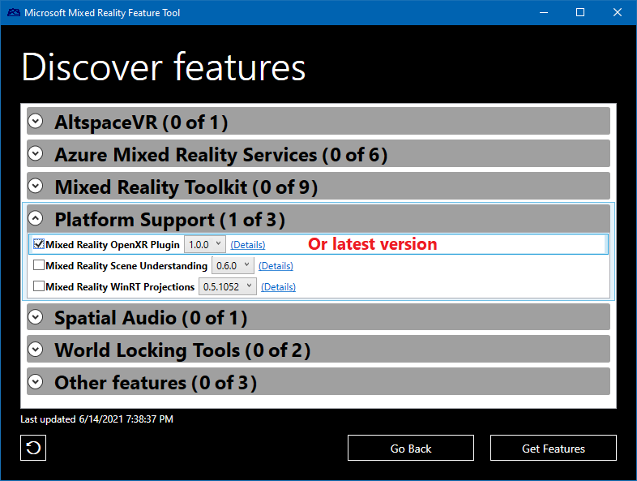

# Using the Mixed Reality OpenXR Plugin

For developers targeting Unity 2020 to build HoloLens 2 or Mixed Reality applications, OpenXR plugin can be used instead of WindowsXR plugin for better cross platform compatibilities.  The Mixed Reality OpenXR Plugin also works well with latest [Mixed Reality Feature Tool](welcome-to-mr-feature-tool.md).

## Prerequisites

* Latest Unity 2020.3 LTS, recommend 2020.3.6f1 or above.
* Latest Unity OpenXR plugin, recommend 1.2 or later
* Latest [tools for HoloLens 2 development](https://docs.microsoft.com/en-us/windows/mixed-reality/develop/install-the-tools?tabs=unity#installation-checklist)
* Latest MRTK (optional), recommend version 2.6 or later
* Latest Mixed Reality OpenXR Plugin, recommend version 0.9.5 or later

> [!NOTE]
> If you're building VR applications on Windows PC, the Mixed Reality OpenXR plugin is not necessarily required. However, you'll want to install the plugin if you're customizing controller mapping for HP Reverb G2 controllers or building apps that work on both HoloLens 2 and VR headsets.

## Setting up your project with MRTK

MRTK for Unity provides a cross-platform input system, foundational components, and common building blocks for spatial interactions. MRTK version 2 intends to speed up application development for Microsoft HoloLens, Windows Mixed Reality immersive (VR) headsets, and OpenVR platform. The project is aimed at reducing barriers to entry, creating mixed reality applications, and contributing back to the community as we all grow.

> [!div class="nextstepaction"]
> [Set up your project using MRTK](https://docs.microsoft.com/windows/mixed-reality/develop/unity/tutorials/mr-learning-base-02?tabs=openxr)

Take a look at [MRTK's documentation](/windows/mixed-reality/mrtk-unity) for more feature details.

## Manual setup without MRTK

Install the OpenXR plugin with the new Mixed Reality Feature Tool application. Follow the [installation and usage instructions](welcome-to-mr-feature-tool.md) and select the **Mixed Reality OpenXR Plugin** package in the Mixed Reality Toolkit category:



## Setting your build target

If you're targeting Desktop VR, we suggest using the PC Standalone Platform selected by default on a new Unity project:


If you're targeting HoloLens 2, you need to switch to the Universal Windows Platform:

1. Select **File > Build Settings...**
2. Select **Universal Windows Platform** in the Platform list and select **Switch Platform**
3. Set **Architecture** to **ARM 64**
4. Set **Target device** to **HoloLens**
5. Set **Build Type** to **D3D**
6. Set **UWP SDK** to **Latest installed**


## Configuring XR Plugin Management for OpenXR

To set OpenXR as the the runtime in Unity:

1. In the Unity Editor, navigate to **Edit > Project Settings**
2. In the list of Settings, select **XR Plugin Management**
3. Check the **Initialize XR on Startup** and **OpenXR** boxes
4. If targeting HoloLens 2, make sure you're on the UWP platform and select **Microsoft HoloLens Feature Set**


## Optimization

If you're developing for HoloLens 2, navigate to **Mixed Reality> OpenXR > Apply recommended project settings for HoloLens 2** to get better app performance.


> [!IMPORTANT]
> If you see a red warning icon next to **OpenXR Plugin**, click the icon and select **Fix all** before continuing. The Unity Editor may need to restart itself for the changes to take effect.


You're now ready to begin developing with OpenXR in Unity!  Continue on to the next section to learn how to use the OpenXR samples.

## Unity sample projects for OpenXR and HoloLens 2

Check out the [OpenXR Mixed Reality samples repo](https://github.com/microsoft/OpenXR-Unity-MixedReality-Samples) for sample unity projects showcasing how to build Unity applications for HoloLens 2 or Mixed Reality headsets using the Mixed Reality OpenXR plugin.

## Using MRTK with OpenXR support

MRTK-Unity supports the Mixed Reality OpenXR plugin starting with the 2.5.3 release.

1. Open the [Mixed Reality Feature Tool](welcome-to-mr-feature-tool.md) again to install the Mixed Reality Toolkit, if you haven't already. OpenXR support is in the **Foundation** package.
2. Go to the MixedReality Toolkit component script in the Inspector and switch to the **DefaultOpenXRConfigurationProfile** profile:

    

    1. See the MRTK documentation for [more in-depth information on migrating to OpenXR](/windows/mixed-reality/mrtk-unity/configuration/getting-started-with-mrtk-and-xrsdk#configuring-mrtk-for-the-xr-sdk-pipeline).

> [!NOTE]
> When upgrading from a previous version of MRTK, ensure the following line is in the **Assets/MixedRealityToolkit.Generated/link.xml** file:
>
> ```xml
> <assembly fullname = "Microsoft.MixedReality.Toolkit.Providers.OpenXR" preserve="all"/>
> ```
>
> This line will be added by default if you started with MRTK 2.5.4 or newer.

## Next steps

Now that you have your project configured for OpenXR and have access to samples, check out what [features](openxr-supported-features.md) are currently supported in our OpenXR plugin.

## Have Feedback?

OpenXR is still experimental, so we’d appreciate any feedback you can give us to help make it better. You'll find us on the [Unity Forums](https://aka.ms/unityforums) by tagging your forum post with **Microsoft** + **OpenXR** and either **HoloLens 2** or **Windows Mixed Reality**.

## See also

* [Configuring your project without MRTK](configure-unity-project.md)
* [Recommended settings for Unity](recommended-settings-for-unity.md)
* [Performance recommendations for Unity](performance-recommendations-for-unity.md#how-to-profile-with-unity)
