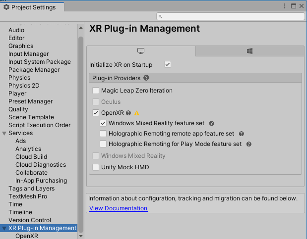
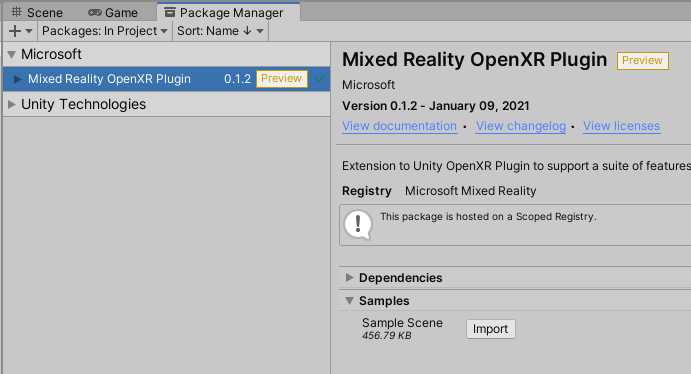

# Using the Mixed Reality OpenXR Plugin for Unity

Starting with Unity version 2020.2, Microsoft’s Mixed Reality OpenXR Plugin package is available using the Unity Package Manager (UPM).

## Prerequisites

* Unity 2020.2 or later
* Unity OpenXR plugin 0.1.2 or later
* Visual Studio 2019 or later
* Install **UWP** platform support in Unity for HoloLens 2 apps

> [!NOTE]
> If you're building VR applications on Windows PC, the Mixed Reality OpenXR plugin is not necessarily required. However, you'll want to install the plugin if you're customizing controller mapping for HP Reverb G2 controllers or building apps that work on both HoloLens 2 and VR headsets.

## Installing OpenXR with the Mixed Reality Feature Tool

Install the OpenXR plugin with the new Mixed Reality Feature Tool application. Follow the [installation and usage instructions](welcome-to-mr-feature-tool.md) and select the **Mixed Reality OpenXR Plugin** package in the Mixed Reality Toolkit category:


## Configuring XR Plugin Management for OpenXR

To set OpenXR as the the runtime in Unity:

1. In the Unity Editor, navigate to **Edit > Project Settings**
2. In the list of Settings, select **XR Plugin Management**
3. Check the **Initialize XR on Startup** and **OpenXR (Preview)** boxes
4. If targeting HoloLens 2, make sure you're on the UWP platform and select **Microsoft HoloLens Feature Set**



> [!IMPORTANT]
> If you see a red warning icon next to **OpenXR Plugin (Preview)**, click the icon and select **Fix all** before continuing. The Unity Editor may need to restart itself for the changes to take effect.


You're now ready to begin developing with OpenXR in Unity!  Continue on to the next section to learn how to use the OpenXR samples.

## Optimization

If you're developing for HoloLens 2, navigate to **Mixed Reality> OpenXR > Apply recommended project settings for HoloLens 2** to get better app performance.


## Try out the Unity sample scenes

To utilize one or more of the examples, install [ARFoundation 4.0+](https://docs.unity3d.com/Packages/com.unity.xr.arfoundation@4.1/manual/index.html#installing-ar-foundation) from the **Package Manager**:


### HoloLens 2 samples

1. In the Unity Editor, navigate to **Window > Package Manager**
2. In the list of packages, select **Mixed Reality OpenXR Plugin**
3. Locate the sample in the **Samples** list and select **Import**


<!-- ### For all other OpenXR samples

1. In the Unity Editor, navigate to **Window > Package Manager**
2. In the list of packages, select **OpenXR Plugin**
3. Locate the sample in the **Samples** list and select **Import**

 -->

> [!NOTE]
> When a package is updated, Unity provides the option to update imported samples.  Updating an imported sample will overwrite any changes that have been made to the sample and associated assets.

## Using MRTK with OpenXR support

MRTK Unity supports the Mixed Reality OpenXR plugin starting with the 2.5.3 release.  

1. Open the [Mixed Reality Feature Tool](welcome-to-mr-feature-tool.md) again and select the **Mixed Reality OpenXR Plugin** package in the Platform Support category

<!-- MRTK plugins can be installed from the same scoped registries as you set up when [installing the Mixed Reality OpenXR plugin](#installing-the-mixed-reality-openxr-plugin). You can find more detailed information in the [MRTK documentation](https://microsoft.github.io/MixedRealityToolkit-Unity/Documentation/usingupm.html#registering-the-mixed-reality-component-server).

1. Add following packages in your **[projectRoot]/Packages/manifest.json** file:

```json
"dependencies": {
    "com.microsoft.mixedreality.toolkit.foundation": "2.5.3",
    "com.microsoft.mixedreality.toolkit.tools": "2.5.3",
    "com.microsoft.mixedreality.toolkit.examples": "2.5.3",
	…
}
``` -->

2. Go to the MixedReality Toolkit component script in the Inspector and switch to the **DefaultOpenXRConfigurationProfile** profile:


### Known issues 

When using the Hand Tracking feature, add following line in the **Assets/MixedRealityToolkit.Generated/link.xml** file:

```
<assembly fullname = "Microsoft.MixedReality.Toolkit.Providers.OpenXR" preserve="all"/>
```

## Next steps

Now that you have your project configured for OpenXR and have access to samples, check out what [features](openxr-supported-features.md) are currently supported in our OpenXR plugin.

## Have Feedback?

OpenXR is still experimental, so we’d appreciate any feedback you can give us to help make it better. You'll find us on the [Unity Forums](https://aka.ms/unityforums) by tagging your forum post with **Microsoft** + **OpenXR** and either **HoloLens 2** or **Windows Mixed Reality**.

## See also

* [Configuring your project without MRTK](configure-unity-project.md)
* [Recommended settings for Unity](recommended-settings-for-unity.md)
* [Performance recommendations for Unity](performance-recommendations-for-unity.md#how-to-profile-with-unity)
