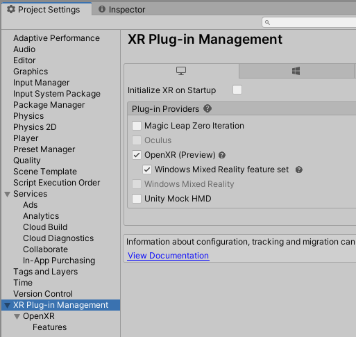
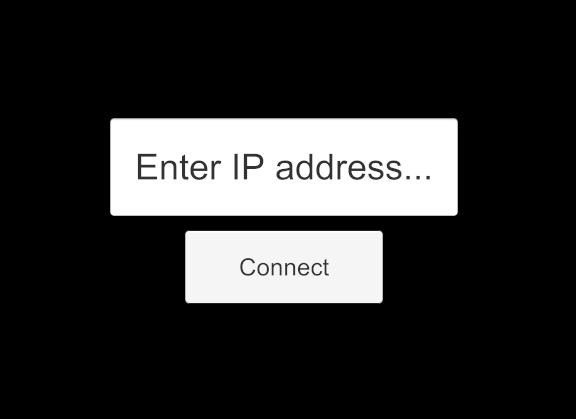

# Mixed Reality OpenXR supported features in Unity

The **Mixed Reality OpenXR Plugin** package is an extension of Unity's **OpenXR Plugin** and supports a suite of features for HoloLens 2 and Windows Mixed Reality headsets. Before continuing, make sure that you've installed **Unity 2020.2** or later, **OpenXR Plugin version 0.1.2** or later, and your Unity project is [configured for OpenXR](openxr-getting-started.md).

## What's supported

The following features are currently supported:

* Supports UWP applications for HoloLens 2, and optimize for HoloLens 2 application model.
* Supports Win32 VR applications for Windows Mixed Reality headset with latest controller profiles and holographic app remoting.
* World scale tracking using Anchors and Unbounded space.
* [Anchor storage API to persist anchors](#anchors-and-anchor-persistence) to HoloLens 2 local storage.
* [Motion controller and hand interactions](#motion-controller-and-hand-interactions), including the new HP Reverb G2 controller.
* Articulated hand tracking using 26 joints and joint radius inputs.
* Eye gaze interaction on HoloLens 2.
* Locating photo/video (PV) camera on HoloLens 2.
* Mixed Reality Capture using 3rd eye rendering through PV camera.
* Supports ["Play" to HoloLens 2 with the Holographic Remoting app](#holographic-remoting-in-unity-editor-play-mode), allowing developers to debug scripts without building and deploying to the device.
* Compatible with MRTK Unity 2.5.3 and newer through [MRTK OpenXR provider support](openxr-getting-started.md#using-mrtk-with-openxr-support).
* Compatible with Unity [ARFoundation 4.0](https://docs.unity3d.com/Packages/com.unity.xr.arfoundation@4.1/manual/index.html) or later.
* (Added in 0.1.3) Supports [desktop app Holographic Remoting](#holographic-remoting-in-desktop-app) from a built and deployed Windows Standalone app.

## Holographic Remoting setup

1. First, you need to [install the Holographic Remoting Player app](https://www.microsoft.com/store/productId/9NBLGGH4SV40) from the Microsoft Store on your HoloLens 2
2. Run the Holographic Remoting Player app on HoloLens 2 and you'll see the version number and IP address to connect to
    * You'll need v2.4 or later to work with the OpenXR plugin

    

## Holographic Remoting in Unity Editor play mode

Building a UWP Unity project in Visual Studio project and then packaging and deploying it to a HoloLens 2 device can take some time. One solution is to enable the Holographic Editor Remoting feature, which lets you debug your C# script using “Play” mode directly to a HoloLens 2 device over your network. This scenario avoids the overhead of building and deploying a UWP package to remote device.

1. Follow the steps in [Holographic Remoting setup](#holographic-remoting-setup)
2. Open **Edit -> Project Settings**, navigate to **XR plug-in Management**, and check the **Windows Mixed Reality feature set** box:

    

3. Expand the **Features** section under **OpenXR** and select **Show All**
4. Check the **Holographic Editor Remoting** checkbox and input the IP address you get from the Holographic Remoting app:

    

Now you can click the “Play” button to play your Unity app into the Holographic Remoting app on your HoloLens. You can also [attach Visual Studio to Unity](/visualstudio/gamedev/unity/get-started/using-visual-studio-tools-for-unity?pivots=windows) to debug C# scripts in the play mode.

> [!NOTE]
> As of version 0.1.0, the Holographic Remoting runtime doesn’t support Anchors, and ARAnchorManager functionalities will not work through remoting.  This feature is coming in future releases.

## Holographic Remoting in desktop app

> [!NOTE]
> Windows Standalone app remoting support was added in the 0.1.3 package release.
> As of version 0.1.3, this feature doesn’t support UWP builds.

1. Follow the steps in [Holographic Remoting setup](#holographic-remoting-setup)
2. Open **Edit -> Project Settings**, navigate to **XR plug-in Management**, and check the **Windows Mixed Reality feature set** box. Also, uncheck **Initialize XR on Startup**:

    

3. Expand the **Features** section under **OpenXR** and select **Show All**
4. Check the **Holographic App Remoting** checkbox:

    

5. Next, write some code to set the remoting configuration and trigger XR initialization. The sample app distributed with the [Mixed Reality OpenXR Plugin](openxr-getting-started.md#hololens-2-samples) contains AppRemoting.cs, which shows an example scenario for connecting to a specific IP address at runtime. Deploying the sample app to a local machine at this point will display an IP address input field with a connect button. Typing an IP address and clicking Connect will initialize XR and attempt to connect to the target device:

    

6. To write custom connection code, call `Microsoft.MixedReality.OpenXR.Remoting.AppRemoting.Connect` with a filled-in `RemotingConfiguration`. The sample app exposes this in the inspector and shows how to fill in the IP address from a text field. Calling `Connect` will set the configuration and automatically initialize XR, which is why it must be called as a coroutine:

    ``` cs
    StartCoroutine(Remoting.AppRemoting.Connect(remotingConfiguration));
    ```

7. While running, you can obtain the current connection state with the `AppRemoting.TryGetConnectionState` API, and optionally disconnect and de-initialize XR using `AppRemoting.Disconnect()`. This could be used to disconnect and reconnect to a different device within the same app session. The sample app provides a tappable cube which will disconnect the remoting session if tapped.

### Migration from previous APIs

#### UnityEngine.XR.WSA.HolographicRemoting

From the sample code on [Unity's docs](https://docs.unity3d.com/2018.4/Documentation/ScriptReference/XR.WSA.HolographicRemoting.html):

| XR.WSA.HolographicRemoting | OpenXR.Remoting.AppRemoting |
| ---- | ---- |
| `HolographicRemoting.Connect(String)` | `AppRemoting.Connect(RemotingConfiguration)` |
| `HolographicRemoting.ConnectionState` | `AppRemoting.TryGetConnectionState(out ConnectionState, out DisconnectReason)`|
| `StartCoroutine(LoadDevice("WindowsMR"))`| [N/A: Automatically happens when calling `AppRemoting.Connect`]  |

#### Unity​Engine.​XR.​Windows​MR.WindowsMRRemoting

| XR.​Windows​MR.WindowsMRRemoting | OpenXR.Remoting.AppRemoting |
| ---- | ---- |
| `WindowsMRRemoting.Connect()` | `AppRemoting.Connect(RemotingConfiguration)` |
| `WindowsMRRemoting.Disconnect()` | `AppRemoting.Disconnect()` |
| `WindowsMRRemoting.TryGetConnectionState(out ConnectionState)` and `WindowsMRRemoting.TryGetConnectionFailureReason(out ConnectionFailureReason)`| `AppRemoting.TryGetConnectionState(out ConnectionState, out DisconnectReason)`|
| `WindowsMRRemoting.isAudioEnabled`, `WindowsMRRemoting.maxBitRateKbps`, `WindowsMRRemoting.remoteMachineName` | Passed into `AppRemoting.Connect` via the `RemotingConfiguration` struct |
| `WindowsMRRemoting.isConnected` | `AppRemoting.TryGetConnectionState(out ConnectionState state, out _) && state == ConnectionState.Connected`

## Anchors and Anchor Persistence

The Mixed Reality OpenXR Plugin supplies basic anchor functionality through an implementation of Unity’s ARFoundation **ARAnchorManager**. To learn the basics on **ARAnchor**s in ARFoundation, visit the [ARFoundation Manual for AR Anchor Manager](https://docs.unity3d.com/Packages/com.unity.xr.arfoundation@4.1/manual/anchor-manager.html). As of version 0.1.0, this plugin supports all ARAnchorManager functionality except creating anchors attached to a plane, which is coming in a future release.

### Anchor Persistence and the XRAnchorStore

An additional API called the **XRAnchorStore** enables anchors to be persisted between sessions. The XRAnchorStore is a representation of the saved anchors on your device. Anchors can be persisted from **ARAnchors** in the Unity scene, loaded from storage into new **ARAnchors**, or deleted from storage.

> [!NOTE]
> These anchors are to be saved and loaded on the same device. Cross-device anchor storage will be supported through Azure Spatial Anchors in a future release.

``` cs
public class Microsoft.MixedReality.ARSubsystems.XRAnchorStore
{
    // A list of all persisted anchors, which can be loaded.
    public IReadOnlyList<string> PersistedAnchorNames { get; }

    // Clear all persisted anchors
    public void Clear();

    // Load a single persisted anchor by name. The ARAnchorManager will create this new anchor and report it in
    // the ARAnchorManager.anchorsChanged event. The TrackableId returned here is the same TrackableId the
    // ARAnchor will have when it is instantiated.
    public TrackableId LoadAnchor(string name);

    // Attempts to persist an existing ARAnchor with the given TrackableId to the local store. Returns true if
    // the storage is successful, false otherwise.
    public bool TryPersistAnchor(string name, TrackableId trackableId);

    // Removes a single persisted anchor from the anchor store. This will not affect any ARAnchors in the Unity
    // scene, only the anchors in storage.
    public void UnpersistAnchor(string name);
}
```

To load the XRAnchorStore, the plugin provides an extension method on the XRAnchorSubsystem, the subsystem of an ARAnchorManager:

``` cs
public static Task<XRAnchorStore> LoadAnchorStoreAsync(this XRAnchorSubsystem anchorSubsystem)
```

To use this extension method, access it from an ARAnchorManager's subsystem as follows:

``` cs
ARAnchorManager arAnchorManager = GetComponent<ARAnchorManager>();
XRAnchorStore anchorStore = await arAnchorManager.subsystem.LoadAnchorStoreAsync();
```

To see a full example of persisting / unpersisting anchors, check out the Anchors -> Anchors Sample GameObject and AnchorsSample.cs script in the [Mixed Reality OpenXR Plugin Sample Scene](openxr-getting-started.md#hololens-2-samples):


## Motion controller and hand interactions

To learn the basics about mixed reality interactions in Unity, visit the [Unity Manual for Unity XR Input](https://docs.unity3d.com/2020.2/Documentation/Manual/xr_input.html). This Unity documentation covers the mappings from controller-specific inputs to more generalizable **InputFeatureUsage**s, how available XR inputs can be identified and categorized, how to read data from these inputs, and more.

The Mixed Reality OpenXR Plugin provides additional input interaction profiles, mapped to standard **InputFeatureUsage**s as detailed below:

| InputFeatureUsage | HP Reverb G2 Controller (OpenXR) | HoloLens Hand (OpenXR) |
| ---- | ---- | ---- |
| primary2DAxis | Joystick | |
| primary2DAxisClick | Joystick - Click | |
| trigger | Trigger  | |
| grip | Grip | Air tap or squeeze |
| primaryButton | [X/A] - Press | Air tap |
| secondaryButton | [Y/B] - Press | |
| gripButton | Grip - Press | |
| triggerButton | Trigger - Press | |
| menuButton | Menu | |

### Aim and Grip Poses

You have access to two sets of poses through OpenXR input interactions:

* The grip poses for rendering objects in the hand
* The aim poses for pointing into the world.

More information on this design and the differences between the two poses can be found in the [OpenXR Specification - Input Subpaths](https://www.khronos.org/registry/OpenXR/specs/1.0/html/xrspec.html#semantic-path-input).

Poses supplied by the InputFeatureUsages **DevicePosition**, **DeviceRotation**, **DeviceVelocity**, and **DeviceAngularVelocity** all represent the OpenXR **grip** pose. InputFeatureUsages related to grip poses are defined in Unity’s [CommonUsages](https://docs.unity3d.com/2020.2/Documentation/ScriptReference/XR.CommonUsages.html).

Poses supplied by the InputFeatureUsages **PointerPosition**, **PointerRotation**, **PointerVelocity**, and **PointerAngularVelocity** all represent the OpenXR **aim** pose. These InputFeatureUsages aren't defined in any included C# files, so you'll need to define your own InputFeatureUsages as follows:

``` cs
public static readonly InputFeatureUsage<Vector3> PointerPosition = new InputFeatureUsage<Vector3>("PointerPosition");
```

### Haptics

For information on using haptics in Unity’s XR Input system, documentation can be found at the [Unity Manual for Unity XR Input - Haptics](https://docs.unity3d.com/2020.2/Documentation/Manual/xr_input.html#Haptics).

## What's coming soon

The following issues and missing features are known with Mixed Reality OpenXR plugin **version 0.1.0**. We're working on these and will release fixes and new features in upcoming releases.

* **ARPlaneSubsystem** is not supported yet. **ARPlaneManager**, **ARRaycastManager**, and related API like **ARAnchorManager.AttachAnchor** are also not supported on HoloLens 2.
* **Anchor** isn't supported by Holographic Remoting yet, but it's coming in the near future.
* **Hand Mesh** tracking, **QR Codes**, and **XRMeshSubsystem** aren't supported yet.
* **Azure Spatial Anchors** support is coming in a future release.
* **ARM64** is the only supported platform for HoloLens 2 apps. The **ARM** platform is coming in a future release.

## Troubleshooting

When you suspend and resume a Unity app on HoloLens 2, the app can't correctly resume, which leads to 4 spinning dots in the HoloLens view.

* Set **Depth submission Mode** to **None** in the OpenXR project settings as a workaround
