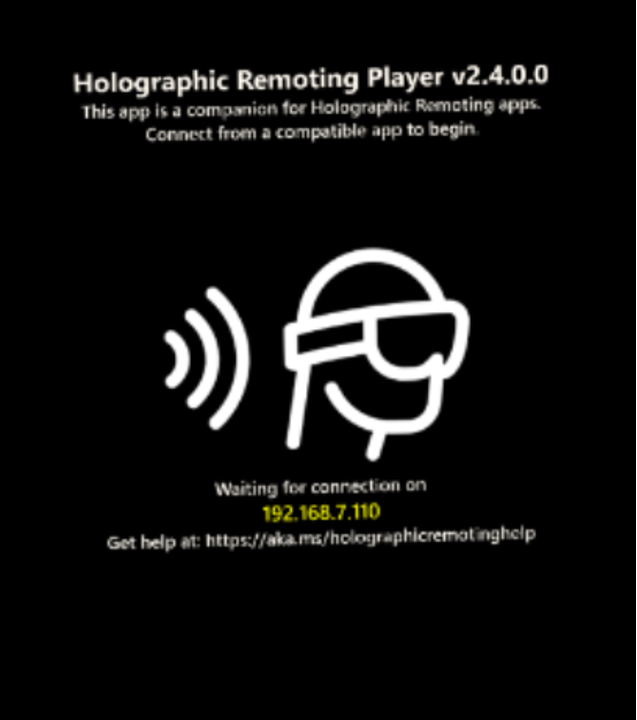

# Mixed Reality OpenXR supported features in Unity

The **Mixed Reality OpenXR Plugin** package is an extension of Unity's **OpenXR Plugin** and supports a suite of features for HoloLens 2 and Windows Mixed Reality headsets. Before continuing, make sure that you've installed **Unity 2020.2** or later, **OpenXR Plugin version 0.1.1** or later, and your Unity project is [configured for OpenXR](openxr-getting-started.md).

## What's supported

The following features are currently supported:

* Supports both UWP applications for HoloLens 2 and Win32 VR applications for Windows Mixed Reality headsets.
* Optimizes UWP package and CoreWindow interaction for HoloLens 2 applications.
* World scale tracking using Anchors and Unbounded space.
* Anchor storage API to persist anchors to HoloLens 2 local storage.
* [Motion controller and hand interactions](#motion-controller-and-hand-interactions), including the new HP Reverb G2 controller.
* Articulated hand tracking using 26 joints and joint radius inputs.
* Eye gaze interaction on HoloLens 2.
* Locating photo/video (PV) camera on HoloLens 2.
* Mixed Reality Capture using 3rd eye rendering through PV camera.
* Supports ["Play" to HoloLens 2 with the Holographic Remoting app](#holographic-remoting-in-unity-editor-play-mode), allowing developers to debug scripts without building and deploying to the device.
* Compatible with MRTK Unity 2.5.2 through MRTK OpenXR adapter package. <missing link>
* Compatible with Unity [ARFoundation 4.0](https://docs.unity3d.com/Packages/com.unity.xr.arfoundation@4.1/manual/index.html) or later

## Holographic Remoting in Unity Editor play mode

Building a UWP Unity project in Visual Studio project and then packaging and deploying it to a HoloLens 2 device can take some time. One solution is to enable the Holographic Editor Remoting, which lets you debug your C# script using “Play” mode directly to a HoloLens 2 device over your network. This scenario avoids the overhead of building and deploying a UWP package to remote device.

1. First, you need to [install the Holographic Remoting Player app](https://www.microsoft.com/store/productId/9NBLGGH4SV40) from Store on your HoloLens 2  
2. Run the Holographic Remoting Player app on HoloLens 2 and you'll see the version number and IP address to connect to
    * You'll need v2.4 or later to work with the OpenXR plugin

3. Open **Edit -> Project Settings**, navigate to **XR plug-in Management**, and check the **Windows Mixed Reality feature set** box:

4. Expand the **Features** section under **OpenXR** and select **Show All**
5. Check the **Holographic Editor Remoting** checkbox and input the IP address you get from the Holographic Remoting app:

Now you can click the “Play” button to play your Unity app into the Holographic Remoting app on your HoloLens. You can also [attach Visual Studio to Unity](https://docs.microsoft.com/visualstudio/gamedev/unity/get-started/using-visual-studio-tools-for-unity?pivots=windows) to debug C# scripts in the play mode.

> [!NOTE]
> As of version 0.1.0 the Holographic Remoting, runtime doesn’t support Anchor feature, and ARAnchorManager functionalities will not work through remoting.  This feature is coming in future releases.

## Motion controller and hand interactions
To learn the basics about mixed reality interactions in Unity, visit the [Unity Manual for Unity XR Input](https://docs.unity3d.com/2020.2/Documentation/Manual/xr_input.html). This Unity documentation covers the mappings from controller-specific inputs to more generalizable `InputFeatureUsage`s, how available XR inputs can be identified and categorized, how to read data from these inputs, and more. 
 
The Mixed Reality OpenXR Plugin provides additional input interaction profiles, mapped to standard `InputFeatureUsage`s as detailed below: 
 
| `InputFeatureUsage` | HP Reverb G2 Controller (OpenXR) | HoloLens Hand (OpenXR) |
| ---- | ---- | ---- |
| primary2DAxis | Joystick | |
| primary2DAxisClick | Joystick - Click | |
| trigger | Trigger  | |
| grip | Grip | Air tap or squeeze |
| primaryButton | [X/A] - Press | Air tap |
| secondaryButton | [Y/B] - Press | |
| gripButton | Grip - Press | |
| triggerButton | Trigger - Press | |
| menuButton | Menu | |

#### Haptics
For information on using haptics in Unity’s XR Input system, documentation can be found at the [Unity Manual for Unity XR Input - Haptics](https://docs.unity3d.com/2020.2/Documentation/Manual/xr_input.html#Haptics). 

## What's coming soon

The following issues and missing features are known with Mixed Reality OpenXR plugin **version 0.1.0**. We're working on these and will release fixes and new features in upcoming releases.

* **ARPlaneSubsystem** is not supported yet. **ARPlaneManager**, **ARRaycastManager**, and related API like **ARAnchorManager.AttachAnchor** are also not supported on HoloLens 2.
* **Anchor** isn't supported by Holographic Remoting yet, but it's coming in the near future.
* **Hand Mesh** tracking, **QR Codes**, and **XRMeshSubsystem** aren't supported yet.
* **Azure Spatial Anchors** support is coming in a future release.
* **ARM64** is the only supported platform for HoloLens 2 apps. The **ARM** platform is coming in a future release.

## Troubleshooting 

When you suspend and resume a Unity app on HoloLens 2, the app can't correctly resume, which leads to 4 spinning dots in the HoloLens view. 
* Set **Depth submission Mode** to **None** in the OpenXR project settings as a workaround
