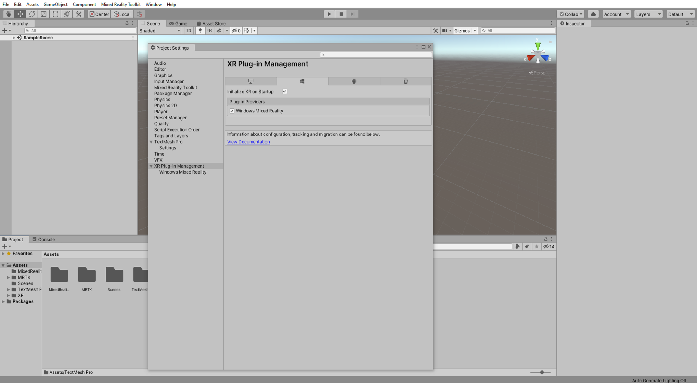
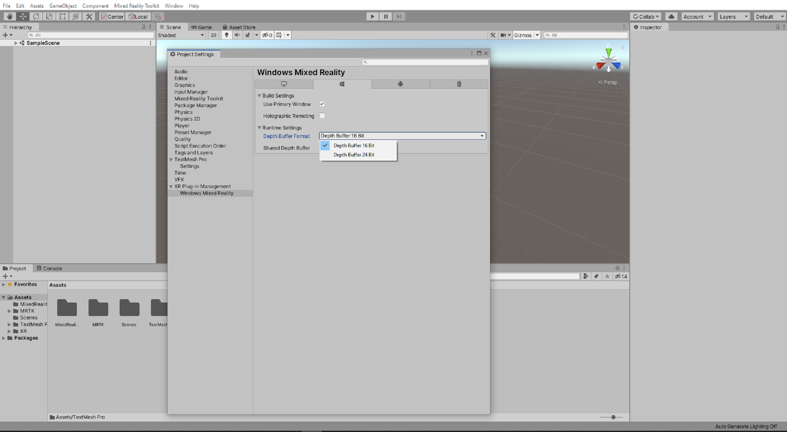
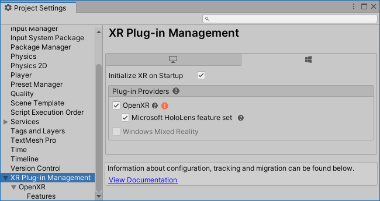

# [Unity 2019/2020 + Windows XR Plugin](#tab/winxr)

In the Unity menu, select **Edit** > **Project Settings...** to open the Project Settings window:

In the Project Settings window, select **XR Plug-in Management** > **Install XR Plug-in Management**, to install XR Plug-in Management:

After Unity has finished installing the XR Plug-in Management. Ensure that you are in Universal Windows Platform settings and Check the **Initialize XR on Startup** and **Windows Mixed Reality** checkbox.

After Unity has finished importing the Windows Mixed Reality SDK, the MRTK Project Configurator window should appear again. If it doesn't, use the Unity menu to open it.

In the MRTK Project Configurator window, use the **Audio spatializer** dropdown to select the **MS HRTF Spatializer**, then click the **Apply** button to apply the setting:

> [!TIP]
>Setting the Audio spatializer property is optional but may improve the audio experience in your project. If you set it to MS HRTF Spatializer, this spatializer plugin will be used when Unity's AudioSource.spatialize property is enabled. To learn more about this topic, you can refer to the  <a href="https://docs.microsoft.com/windows/mixed-reality/develop/unity/tutorials/unity-spatial-audio-ch1" target="_blank"> Spatial audio tutorials</a>.

In the Project Settings window, select **XR Plug-in Management** > **Windows Mixed Reality** > **Runtime Settings**, then use the **Depth Buffer Format** dropdown to select **16-bit depth:**

> [!TIP]
> Reducing the Depth Format to 16-bit is optional but my help improve graphics performance in your project. To learn more about this topic, you can refer to the   <a href="https://docs.microsoft.com/windows/mixed-reality/mrtk-unity/performance/perf-getting-started#depth-buffer-sharing-hololens" target="_blank">  Depth buffer sharing (HoloLens) </a> section of MRTK's  <a href="https://docs.microsoft.com/windows/mixed-reality/mrtk-unity/performance/perf-getting-started" target="_blank"> Performance </a> documentation.

In the Project Settings window, select **Player** > **Publishing Settings**, then in the **Package name** field, enter a suitable name, for example, _MRTKTutorials-GettingStarted_:

> [!NOTE]
> The 'Package name' is the unique identifier for the app. You should change this identifier before deploying the app to avoid overwriting previously installed apps.

> [!TIP]
> The 'Product Name' is the name displayed in the HoloLens Start menu. To make the app easier to locate during development, add an underscore in front of the name to sort it to the top.

# [Unity 2020 + OpenXR](#tab/openxr)

In the Unity menu, select **Edit** > **Project Settings...** to open the Project Settings window:

In the Project Settings window, select **XR Plug-in Management** > **Install XR Plug-in Management**, to install XR Plug-in Management:

After Unity has finished installing the XR Plug-in Management. Ensure that you are in Universal Windows Platform settings and Check the **Initialize XR on Startup**, **OpenXR** and **Microsoft HoloLens feature set** checkboxes.

In the menu bar at the top of the screen, navigate to **Mixed Reality> OpenXR > Apply recommended project settings for HoloLens 2** to get better app performance.

>[!Important]
>If you see a red warning icon next to OpenXR Plugin (Preview), click the icon and select Fix all before continuing. The Unity Editor may need to restart itself for the changes to take effect.
>

After Unity has finished importing necessary files, the MRTK Project Configurator window should appear again. If it doesn't, use the Unity menu to open it.

In the MRTK Project Configurator window, use the **Audio spatializer** dropdown to select the **MS HRTF Spatializer**, then click the **Apply** button to apply the setting:

> [!TIP]
>Setting the Audio spatializer property is optional but may improve the audio experience in your project. If you set it to MS HRTF Spatializer, this spatializer plugin will be used when Unity's AudioSource.spatialize property is enabled. To learn more about this topic, you can refer to the  <a href="https://docs.microsoft.com/windows/mixed-reality/develop/unity/tutorials/unity-spatial-audio-ch1" target="_blank"> Spatial audio tutorials</a>.

In the Project Settings window, select **Player** > **Publishing Settings**, then in the **Package name** field, enter a suitable name, for example, _MRTKTutorials-GettingStarted_:

> [!NOTE]
> The 'Package name' is the unique identifier for the app. You should change this identifier before deploying the app to avoid overwriting previously installed apps.

> [!TIP]
> The 'Product Name' is the name displayed in the HoloLens Start menu. To make the app easier to locate during development, add an underscore in front of the name to sort it to the top.

# [Legacy WSA](#tab/wsa)

In the Unity menu, select **Edit** > **Project Settings...** to open the Project Settings window:

In the Project Settings window, select **Player** > **XR Settings** and check the **Virual Reality Supported** checkbox then click the **+** icon, and select Windows Mixed Reality to add the Windows Mixed Reality SDK:

After Unity has finished importing the Windows Mixed Reality SDK, the MRTK Project Configurator window should appear again. If it doesn't, you can manually open it from the Unity menu by going to **Mixed Reality Toolkit** > **Utilities** > **Configure Unity Project**

In the MRTK Project Configurator window, use the **Audio spatializer** dropdown to select the **MS HRTF Spatializer**, then click the **Apply** button to apply the setting:

> [!TIP]
>Setting the Audio spatializer property is optional but may improve the audio experience in your project. If you set it to MS HRTF Spatializer, this spatializer plugin will be used when Unity's AudioSource.spatialize property is enabled. To learn more about this topic, you can refer to the  <a href="//windows/mixed-reality/develop/unity/tutorials/unity-spatial-audio-ch1" target="_blank"> Spatial audio tutorials</a>.

In the Project Settings window, select **Player** > **XR Settings**, then use the **Depth Format** dropdown to select **16-bit depth**:

> [!TIP]
> Reducing the Depth Format to 16-bit is optional but my help improve graphics performance in your project. To learn more about this topic, you can refer to the   <a href="/windows/mixed-reality/mrtk-docs/performance/perf-getting-started.md#single-pass-instanced-rendering" target="_blank">  Depth buffer sharing (HoloLens) </a> section of MRTK's  <a href="/windows/mixed-reality/mrtk-docs/performance/perf-getting-started.md#single-pass-instanced-rendering" target="_blank"> Performance </a> documentation.

In the Project Settings window, select **Player** > **Publishing Settings**, then in the **Package name** field, enter a suitable name, for example, _MRTKTutorials-GettingStarted_:

> [!NOTE]
> The 'Package name' is the unique identifier for the app. You should change this identifier before deploying the app to avoid overwriting previously installed apps.

> [!TIP]
> The 'Product Name' is the name displayed in the HoloLens Start menu. To make the app easier to locate during development, add an underscore in front of the name to sort it to the top.