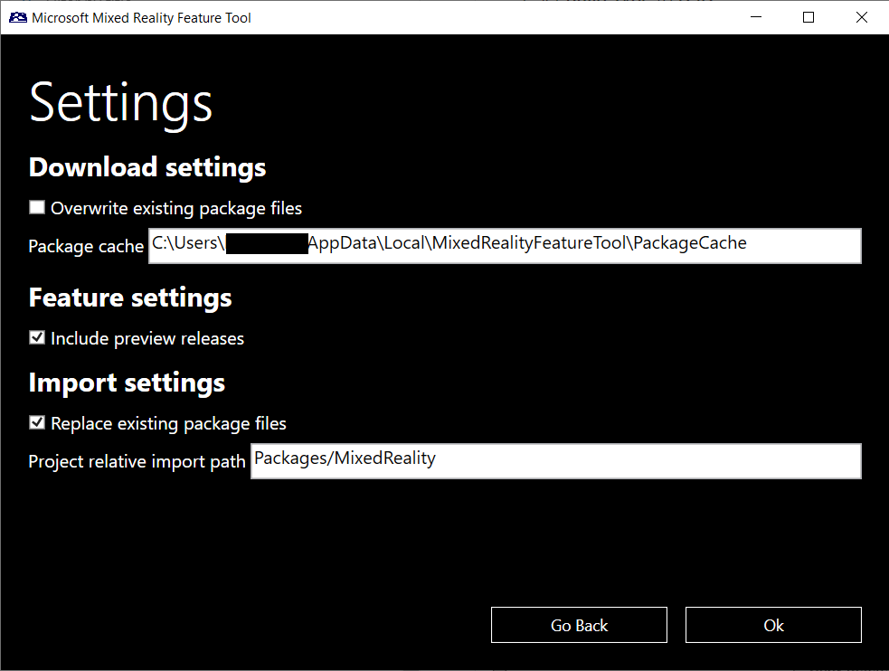
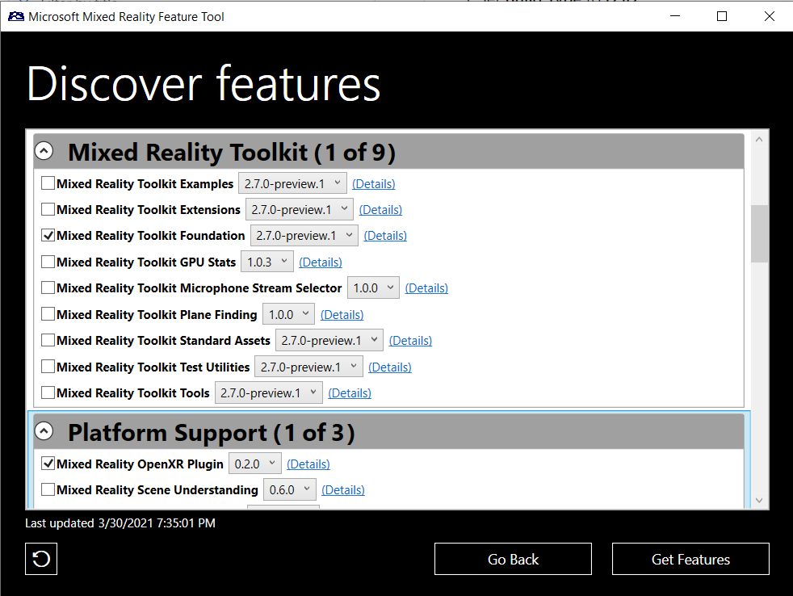
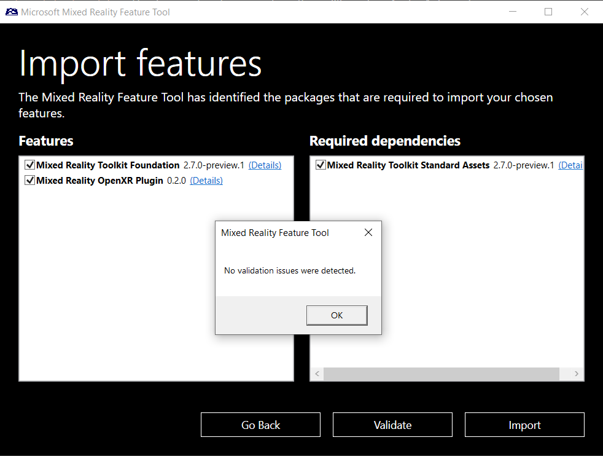
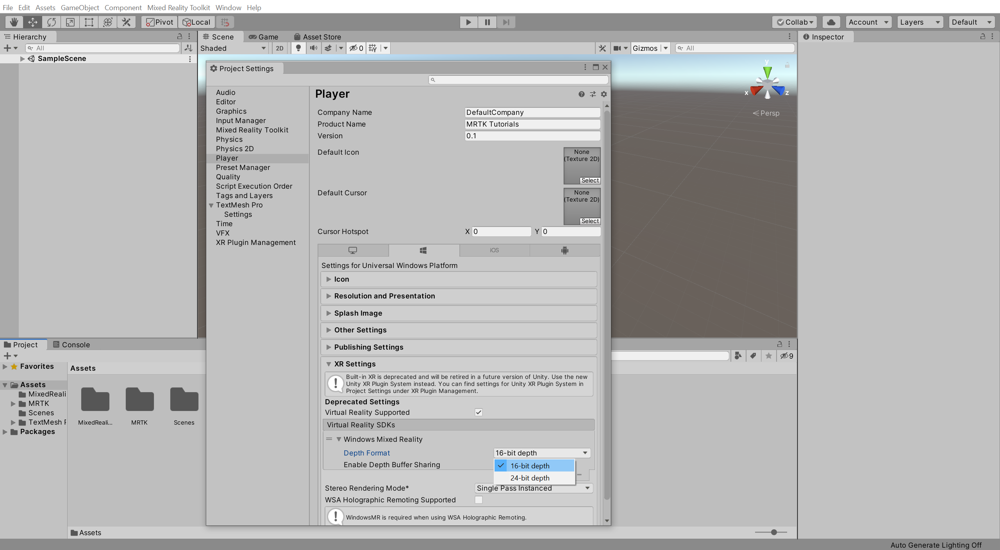

# [Unity 2019/2020 + Windows XR Plugin](#tab/winxr)

Once **MixedRealityFeatureTool** is opened click on start to get started with Mixed Reality Feature Tool.

Features are grouped by category to make things easier to find, click on **Mixed Reality Toolkit** dropdown to find packages relating to the Mixed Reality Toolkit.

check the **Mixed Reality Toolkit Foundation**, and click on the dropdown next to it to select the latest MRTK version, then click on **Get features** button to download the selected packages.

You also need to set the location of the target unity project to provide the **Project path**, click on the **Three dots** next to the Project path and browse to your project folder in the explorer for example _D:\MixedRealityLearning\MRTK Tutorials_.

> [!NOTE]
> The dialog that's displayed when browsing for the Unity project folder contains '_' as the file name. There must be a value for the file name to enable the folder to be selected.

Next click on the **Validate** button to validate the selected package, you will get a popup with message **No validation issues were detected** click on **OK** to close the popup and click on **Import** button.

Click on **Approve** Button to add the **Mixed Reality Toolkit** into the project.

# [Unity 2020 + OpenXR](#tab/openxr)
In the bottom left hand of the window, click on the gear symbol to open the settings menu.

Under **Feature Settings**, check the **Include preview releases** box and then click the **OK** button.

> [!NOTE]
>If you do not see an option to include preview releases, make sure you're using the latest version of the MR Feature Tool.

Now that your settings are configured, click on **Start** to get started with Mixed Reality Feature Tool.

Features are grouped by category to make things easier to find, click on **Mixed Reality Toolkit** dropdown to find packages relating to the Mixed Reality Toolkit.
Check the **Mixed Reality Toolkit Foundation**, and click on the dropdown next to it to select the required MRTK version, for this tutorial series please select the latest **2.7 preview package**.

Under the **Platform Support** dropdown, select **Mixed Reality OpenXR Plugin**. Make sure the latest version is selected in the dropdown.

Click on the **Get features** button to download the selected packages.

You also need to set the location of the target unity project to provide the **Project path**, click on the **Three dots** next to the Project path and browse to your project folder in the explorer for example _D:\MixedRealityLearning\MRTK Tutorials_.

> [!NOTE]
> The dialog that's displayed when browsing for the Unity project folder contains '_' as the file name. There must be a value for the file name to enable the folder to be selected.

Next click on the **Validate** button to validate the selected package, you will get a popup with message **No validation issues were detected** click on **OK** to close the popup and click on **Import** button.

Click on the **Approve** button to add the **Mixed Reality Toolkit** into the project.

# [Legacy WSA](#tab/wsa)
Once **MixedRealityFeatureTool** is opened click on start to get started with Mixed Reality Feature Tool.

You also need to set the location of the target unity project to provide the **Project path**, click on the **Three dots** next to the Project path and browse to your project folder in the explorer for example _D:\MixedRealityLearning\MRTK Tutorials_.

> [!NOTE]
> The dialog that's displayed when browsing for the Unity project folder contains '_' as the file name. There must be a value for the file name to enable the folder to be selected.

Features are grouped by category to make things easier to find, click on **Mixed Reality Toolkit** dropdown to find packages relating to the Mixed Reality Toolkit.

check the **Mixed Reality Toolkit Foundation**, and click on the dropdown next to it to select the latest MRTK version, then click on **Get features** button to download the selected packages.

Next click on the **Validate** button to validate the selected package, you will get a popup with message **No validation issues were detected** click on **OK** to close the popup and click on **Import** button.

Click on **Approve** Button to add the **Mixed Reality Toolkit** into the project.

## Configuring the Unity project

After Unity has finished importing the package from the previous section, the MRTK Project Configurator window should appear. If it doesn't, you can manually open it by going to **Mixed Reality Toolkit** > **Toolkit** > **Utilities** > **Configure Unity Project**:

Click on Legacy XR(recommended) to enable Legacy XR to your project and now you can see importing window.

Click on next button to enable XR pipeline setting.

In the MRTK Project Configurator window, ensure all options are checked and also use the **Audio spatializer** dropdown to select the **MS HRTF Spatializer**, then click the **Apply** button to apply the setting:

> [!TIP]
> Applying the MRTK Default Settings is optional but strongly recommended as it will help configure some recommended Unity settings:

> * Set Single Pass Instanced rendering path: Improves graphics performance by executing the render pipeline for both eyes in the same draw call. To learn more about this topic, you can refer to the [Single-Pass Instanced rendering](https://docs.microsoft.com/windows/mixed-reality/mrtk-unity/performance/perf-getting-started#single-pass-instanced-rendering) section of MRTK's [Performance](https://docs.microsoft.com/windows/mixed-reality/mrtk-unity/performance/perf-getting-started#single-pass-instanced-rendering) documentation.
> * Set default Spatial Awareness layer: Creates a Unity Layer named Spatial Awareness and configures MRTK to use this layer for the spatial awareness mesh. To learn more about Unity Layers, you can refer to Unity's <a href="https://docs.unity3d.com/Manual/Layers.html" target="_blank">Customizing Your Workspace</a> documentation.

> [!TIP]
>Setting the Audio spatializer property is optional but may improve the audio experience in your project. If you set it to MS HRTF Spatializer, this spatializer plugin will be used when Unity's AudioSource.spatialize property is enabled. To learn more about this topic, you can refer to the  <a href="//windows/mixed-reality/develop/unity/tutorials/unity-spatial-audio-ch1" target="_blank"> Spatial audio tutorials</a>.

Click on Next and Done button to finish the Unity project configuration.

### Configure additional project settings

In the Unity menu, select Edit > Project Settings... to open the Project Settings window:

In the Project Settings window, select **Player** > **XR Settings**, then use the **Depth Format** dropdown to select **16-bit depth**:

> [!TIP]
> Reducing the Depth Format to 16-bit is optional but my help improve graphics performance in your project. To learn more about this topic, you can refer to the <a href="/windows/mixed-reality/mrtk-unity/performance/perf-getting-started#single-pass-instanced-rendering" target="_blank">Depth buffer sharing (HoloLens)</a> section of MRTK's Performance documentation.

In the Project Settings window, select **Player** > **Publishing Settings**, then in the **Package name** field, enter a suitable name, for example, _MRTKTutorials-GettingStarted_:

> [!NOTE]
> The 'Package name' is the unique identifier for the app. You should change this identifier before deploying the app to avoid overwriting previously installed apps.

> [!TIP]
> The 'Product Name' is the name displayed in the HoloLens Start menu. To make the app easier to locate during development, add an underscore in front of the name to sort it to the top.
