# 2. Initializing your project and deploying your first application

In this tutorial, you'll learn how to create a new Unity project, configure it for Mixed Reality Toolkit (MRTK) development, and import MRTK. You'll also walk through configuring, building, and deploying a basic Unity scene from Visual Studio to your HoloLens 2. Once you have deployed it to your HoloLens 2, you should see a spatial mapping mesh covering the surfaces that are perceived by the HoloLens. Additionally, you should see indicators on your hands and fingers for hand tracking and a frame rate counter for keeping an eye on app performance.

## Objectives

* Learn how to configure Unity for HoloLens development
* Learn how to build and deploy your app to HoloLens
* Experience the spatial mapping mesh, hand meshes, and the framerate counter on HoloLens 2 device

## Steps overview
:::row:::
    :::column:::
       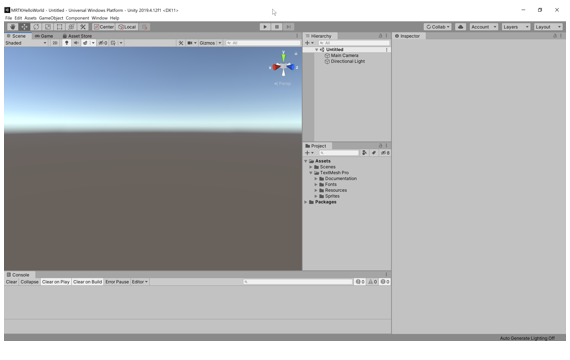
        **1. Create a new Unity project**
    :::column-end:::
    :::column:::
       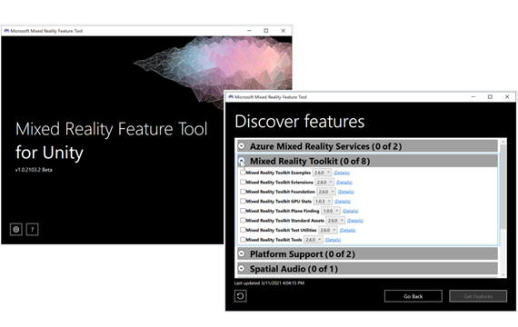
        **2. Import MRTK into the project**
    :::column-end:::
    :::column:::
       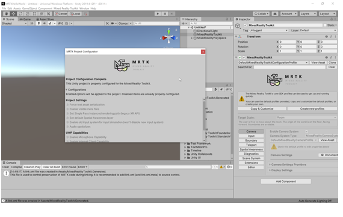
        **3. Configure a new scene with MRTK**
    :::column-end:::
:::row-end:::
:::row:::
    :::column:::
       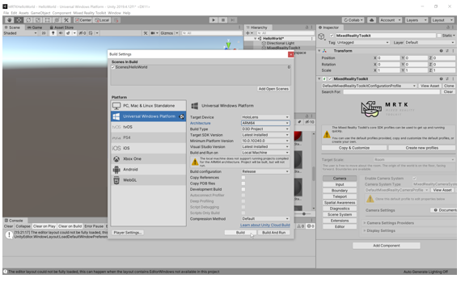
        **4. Build Unity Project**
    :::column-end:::
    :::column:::
       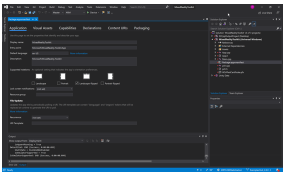
        **5. Build UWP Project**
    :::column-end:::
    :::column:::
       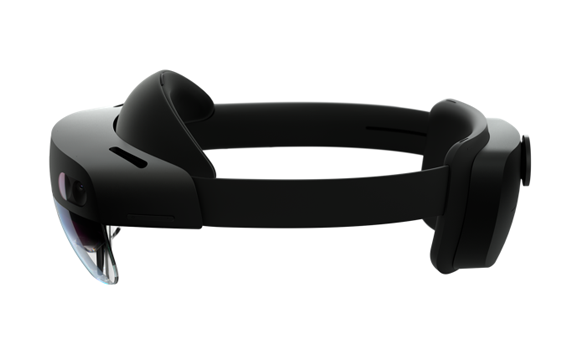
        **6. Run Project on the Device**
    :::column-end:::
:::row-end:::

## Creating the Unity project

Launch **Unity Hub**, select the **Projects** tab, and click the **down arrow** next to the **New** button:

In the dropdown, select the Unity **version** specified in the [Prerequisites](mr-learning-base-01.md#prerequisites):

> [!TIP]
> If the particular Unity version is not available in Unity Hub, you can initiate the installation from Unity's <a href="https://unity3d.com/get-unity/download/archive" target="_blank">Download Archive</a>.

In the Create a new project window:

* Ensure **Templates** is set to **3D**
* Enter a suitable **Project Name**, for example, _MRTK Tutorials_
* Choose a suitable **Location** to store your project, for example, _D:\MixedRealityLearning_
* Click the **Create** button to create and launch your new Unity project

> [!CAUTION]
> When working on Windows, there is a MAX_PATH limit of 255 characters. Consequently, you should save the Unity project close to the root of the drive.

Wait for Unity to create the project:

## Switching the build platform

In the Unity menu, select **File** > **Build Settings...** to open the Build Settings window:

In the Build Settings window, select **Universal Windows Platform** and:

1. Set **Target device** to **HoloLens**
2. Set **Architecture** to **ARM 64** (HoloLens 2 + OpenXR should use ARM64. XRSDK and legacy pipeline can use ARM)

3. Set **Build Type** to **D3D Project**
4. Set **Target SDK Version** to **Latest Installed**
5. Set **Minimum Platform Version** to **10.0.1024.0**
6. Set **Visual Studio Version** to **Latest installed**
7. Set **Build and Run on** to **USB Device**
8. Set **Build configuration** to **Release** because there are known performance issues with Debug
9. Click the Switch Platform button

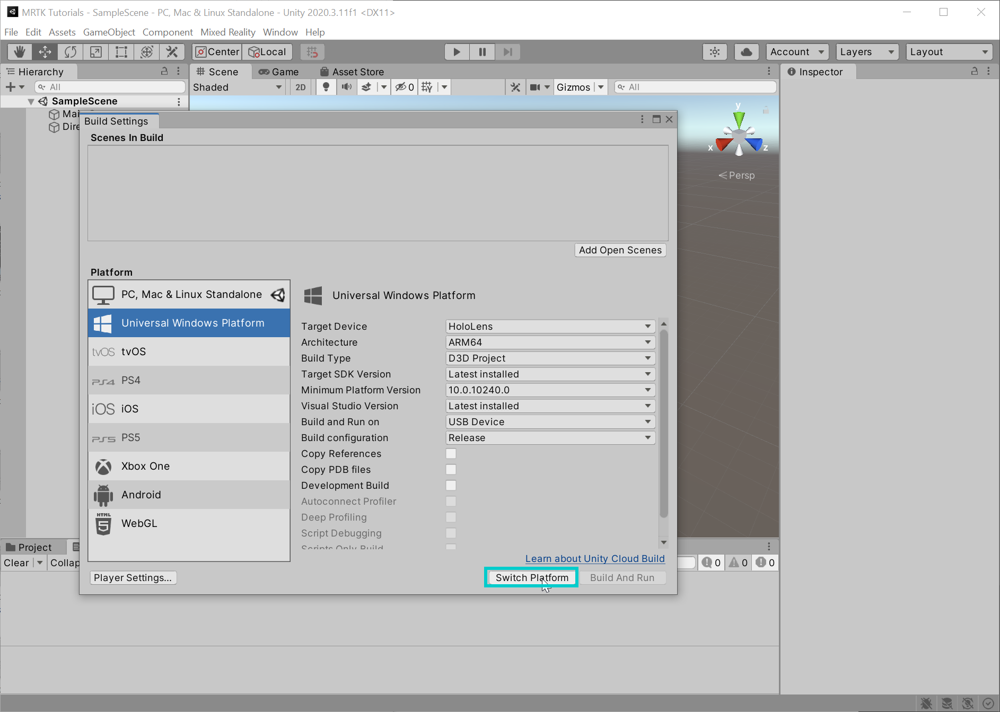

Wait for Unity to finish switching the platform:

When Unity has finished switching the platform, click the  **x** icon to close the Build Settings window.

## Importing the Mixed Reality Toolkit and Configuring the Unity project

To Import Mixed Reality Toolkit into the Unity Project you will have to use [Mixed Reality Feature Tool](../welcome-to-mr-feature-tool.md) which allows  developers to discover, update, and add Mixed Reality feature packages into Unity projects. You can search packages by name or category, see their dependencies, and even view proposed changes to your projects manifest file before importing.

Download the latest version of the Mixed Reality Feature Tool from the [Microsoft Download Center](https://aka.ms/MRFeatureTool), When the download is complete, unzip the file and save it to your desktop.

> [!NOTE]
> Before you can run the Mixed Reality Feature Tool please install [.NET 5.0 runtime](https://dotnet.microsoft.com/download/dotnet/5.0)

Open the executable file **MixedRealityFeatureTool** from the downloaded folder to launch the Mixed Reality Feature Tool.  

[!INCLUDE]

## Creating the scene and configuring MRTK

In the Unity menu, select **File** > **New Scene**:

In the **New Scene** window select **Basic (Built-in)** and click on **create** to create a new scene:

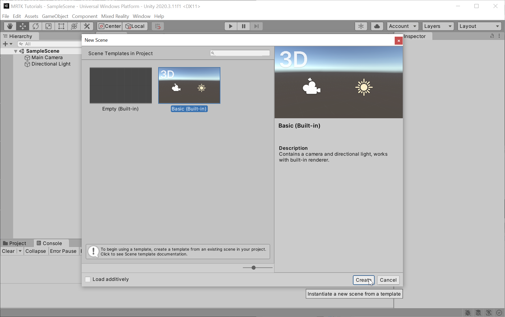

> [!NOTE]
> Above screenshot is from Unity Version 2020, if you are using Unity 2019 when you click on **create** a new empty scene will be created.

In the Unity menu, select **Mixed Reality** > **Toolkit** > **Add to Scene and Configure...** to add the MRTK to your current scene:

With the **MixedRealityToolkit** object still selected in the Hierarchy window, in the Inspector window, verify that the **MixedRealityToolkit** configuration profile is set to **DefaultMixedRealityToolkitConfigurationProfile**:

In the Unity menu, select **File** > **Save As...** to open the Save Scene window:

Save the scene in you project under **Asset** > **Scenes**.

## Adding hand interaction to an object

In the Unity menu, select **GameObject** > **3D Object** > **Cube** to add a cube object to the scene.

Click the **Cube** object in the Hierarchy window, then in the Inspector window configure its **Transform** component as follows

* **Position**: X = 0, Y = -0.1, Z = 0.5
* **Rotation**: X = 0, Y = 0, Z = 0
* **Scale**: X = 0.1, Y = 0.1, Z = 0.1

1 Unity unit is 1 meter. We have updated cube's size to 10x10x10 cm, placed at 50cm from the headset position (0,0,0). 10cm below the eye level for comfortable interaction. 

If you use the default scale (1,1,1), the cube will be too big. If you use the default position (0,0,0), the cube will be placed at the same position as your headset and you won't be able to see it until you move backward.

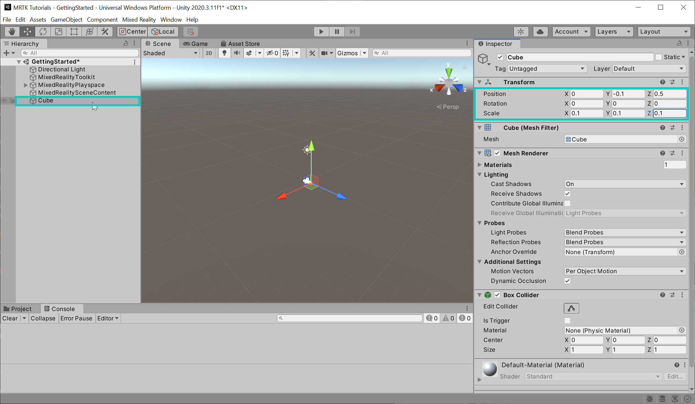

To focus in on the objects in the scene, you can double-click on the **Cube** object, and then zoom slightly in again. Or you can use F key to zoom and focus on the object.

To interact and grab an object with tracked hands, the object must have:
 * Collider component such as **Box Collider** (Unity's cube already has a Box Collider by default)
 * **Object Manipulator (Script)** component
 * **NearInteractionGrabbable(Script)** component

MRTK's **ObjectManipulator** script makes an object movable, scalable, and rotatable using one or two hands. This script supports the direct manipulation input model as the script enables the user to touch holograms directly with their hands.

With the **Cube** still selected in the Hierarchy window, in the Inspector window ,click on **Add Component** button, then search and select **Object Manipulator** script to add the Object Manipulator script to the cube object.

Repeat the same to add **Near Interaction Grabbable script** to the cube

> [!NOTE]
> When you add a Object Manipulator (Script), in this case, the Constraint Manager (Script) is automatically added because Object Manipulator (Script) depends on it.

## Testing your application in Unity editor with MRTK input simulation

With MRTK's input simulation, you can test various types of interactions in the Unity editor without building and deploying to a device. This allows you quickly iterate your ideas in the design and development process. Use keyboard and mouse combinations to control simulated inputs.

Click the play button and enter the play mode. Hold the **Left Shift** or **Space** key to bring up the controller (simulated hands), Mouse movement will move the controller and also it can be moved further or closer to the camera using the mouse wheel. Once the pointer is on the Cube press and hold **Left Mouse Button** to grab the Cube object.

* Press **W, A, S, D, Q, E** keys to move the camera.
* Hold the **Right mouse button** and move the mouse to look around.
* To bring up the simulated hands, press **Space bar(Right hand)** or **Left Shift key(Left hand)**
* To keep simulated hands in the view, press **T** or **Y** key
* To rotate simulated hands, press and hold **Ctrl** key and move mouse

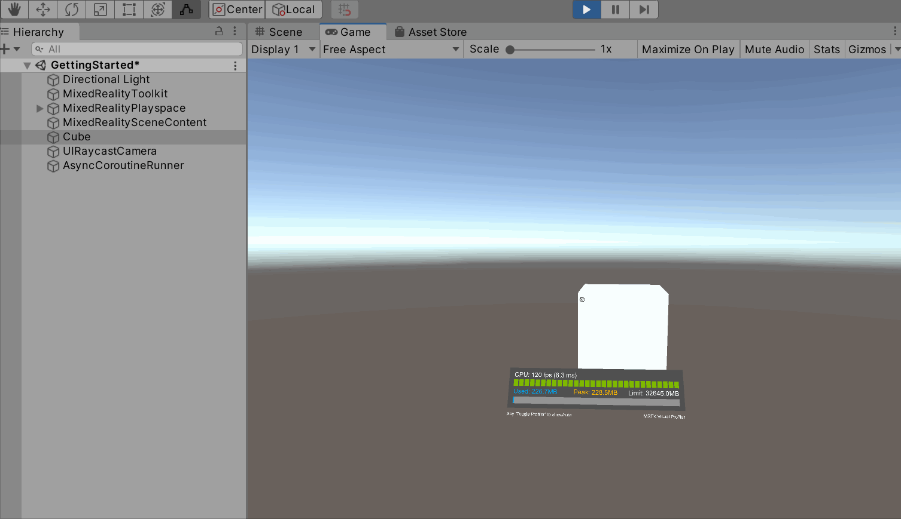

## Building your application to your HoloLens 2

### 1. Build the Unity project

In the Unity menu, select **File** > **Build Settings...** to open the Build Settings window.

In the Build Settings window, click the **Add Open Scenes** button to add your current scene to the **Scenes In Build** list, then click the **Build** button to open the Build Universal Windows Platform window:

In the Build Universal Windows Platform window, choose a suitable location to store your build, for example, _D:\MixedRealityLearning\Builds_, create a new folder and give it a suitable name, for example, _GettingStarted_, and then click the **Select Folder** button to start the build process:

Wait for Unity to finish the build process:

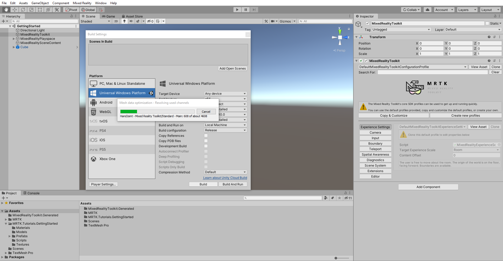

### 2. Build and deploy the application

When the build process has completed, Unity will prompt Windows File Explorer to open the location you stored the build. Navigate inside the folder, and double-click the solution file to open it in Visual Studio:

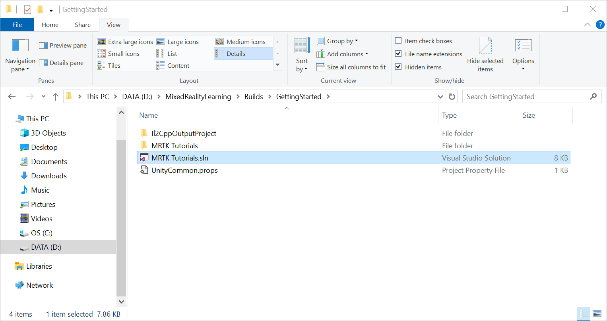

> [!NOTE]
> If Visual Studio asks you to install new components, take a moment to check that you have all the prerequisite components in the **[Install the Tools](../../install-the-tools.md)** documentation.

Configure Visual Studio for HoloLens by selecting the **Master** or **Release** configuration, the **ARM64** architecture, and **Device** as target:

> [!TIP]
> If you're deploying to HoloLens (1st generation), select the **x86** architecture.

> [!NOTE]
> For HoloLens, you will typically build for the ARM architecture. However, there is a  <a href="https://github.com/microsoft/MixedRealityToolkit-Unity" target="_blank"><strong>known issue</strong></a> in Unity 2019.3 that causes errors when selecting ARM as the build architecture in Visual Studio. The recommended workaround is to build for ARM64. If that is not an option, go to **Edit > Project Settings > Player > Other Settings** and disable **Graphics Jobs**.

> [!NOTE]
> If you don't see Device as a target option, you may need to change the startup project for the Visual Studio solution from the IL2CPP project to the UWP project. To do this, in the Solution Explorer, right-click on YourProjectName (Universal Windows) and select **Set as StartUp Project**.

Connect your HoloLens to your computer, then select **Debug** > **Start Without Debugging** to build and deploy to your device:

> [!IMPORTANT]
> Before building to your device, the device must be in Developer Mode and paired with your development computer. Both of these steps can be completed by following [these instructions](../../platform-capabilities-and-apis/using-visual-studio.md).

> [!TIP]
> You can also deploy to the [HoloLens Emulator](../../platform-capabilities-and-apis/using-the-hololens-emulator.md) or create an [App Package](/windows/uwp/packaging/packaging-uwp-apps) for sideloading.

Using Start Without Debugging automatically starts the app on your device without the Visual Studio debugger attached.

Select **Build > Deploy Solution** to deploy to your device without having the app start automatically.

> [!NOTE]
>You may notice the Diagnostics profiler in the app, which you can toggle on or off by using the speech command **"Toggle Diagnostics"**. It's recommended that you keep the profiler visible most of the time during development to understand when changes to the app may impact performance. For example, HoloLens apps should [continuously run at 60 FPS](../../platform-capabilities-and-apis/understanding-performance-for-mixed-reality.md).

## Congratulations

You've now deployed your first HoloLens app. Once the app is opened you should see a Cube object in front of you and should be able to interact with the cube by moving it and also as you walk around, you should see a spatial mapping mesh covering the surfaces that are perceived by the HoloLens. Additionally, you should see indicators on your hands and fingers for hand tracking and a frame rate counter for keeping an eye on app performance. These features are just a few foundational pieces included with MRTK. In the upcoming tutorials, you'll add content to your scene to explore the capabilities of HoloLens and the MRTK.

> [!div class="nextstepaction"]
> [Next Tutorial: 3. Configuring the MRTK profiles](mr-learning-base-03.md)
