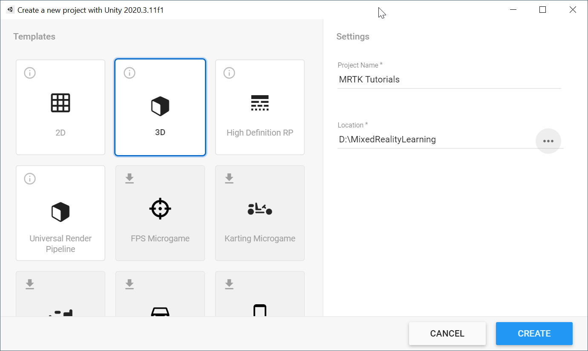
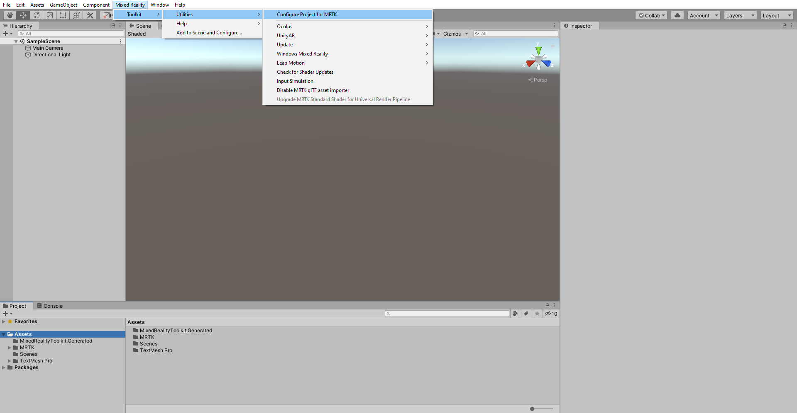
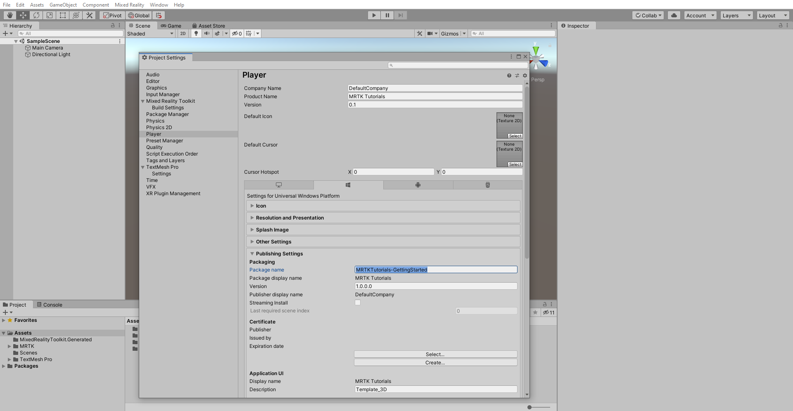
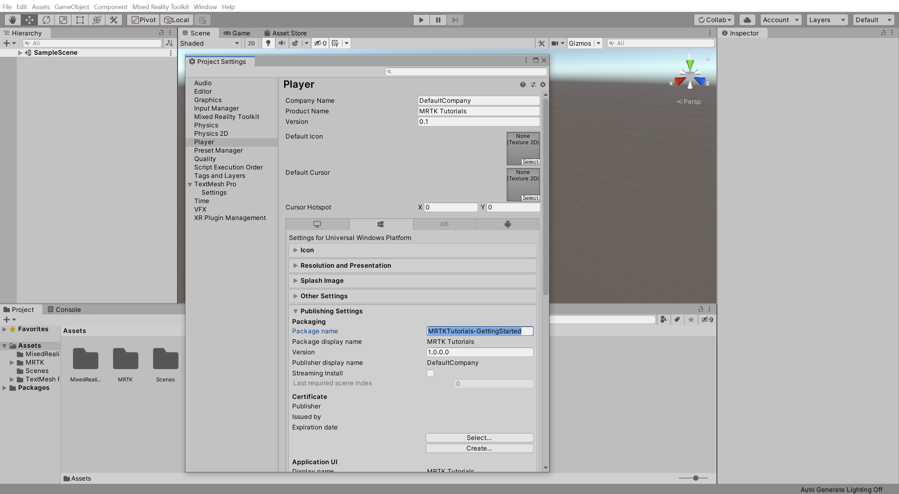
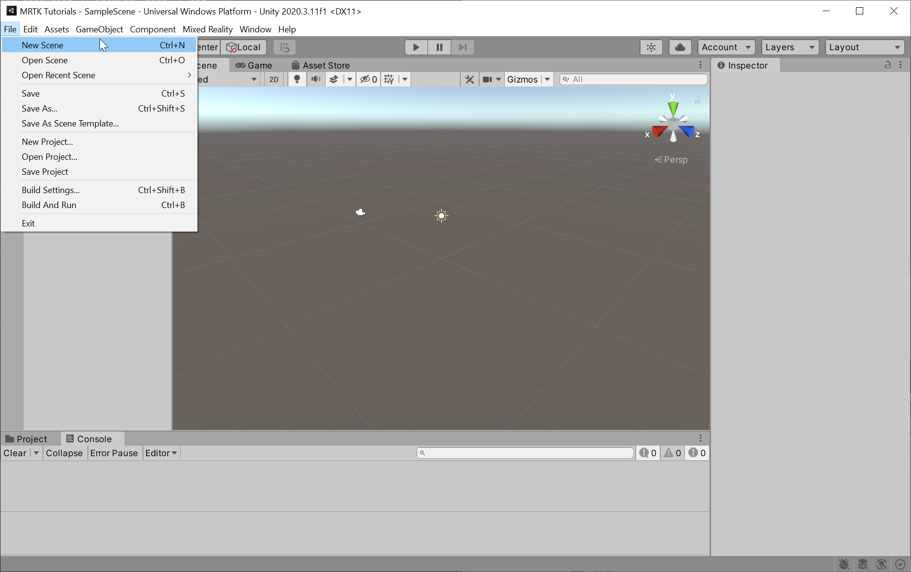
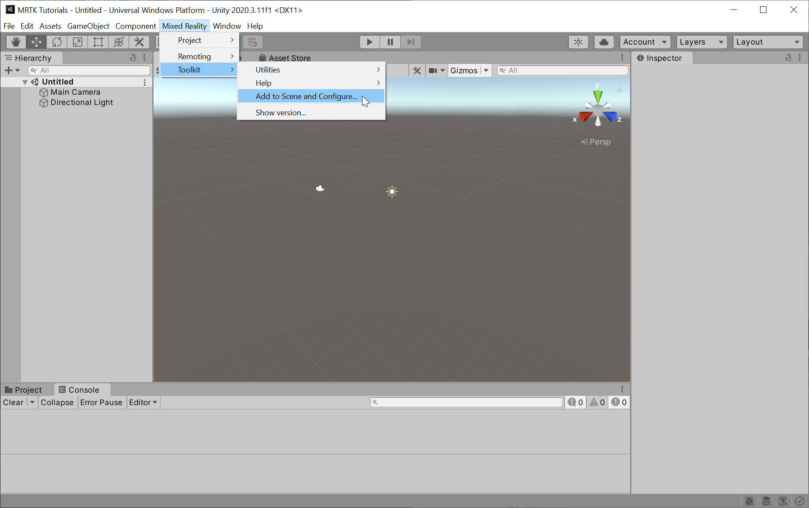
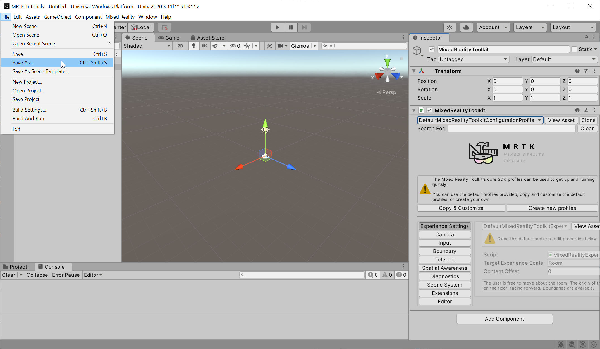
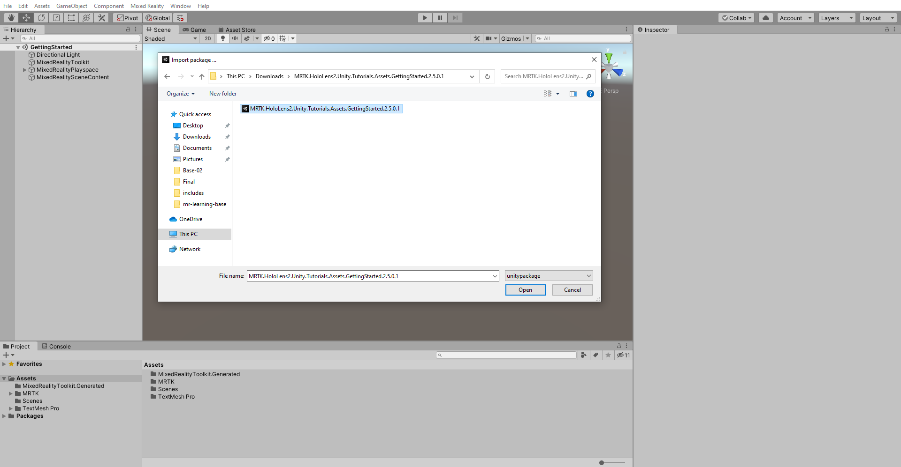

# 2. Initializing your project and deploying your first application

In this tutorial, you'll learn how to create a new Unity project, configure it for <a href="https://github.com/microsoft/MixedRealityToolkit-Unity" target="_blank">Mixed Reality Toolkit (MRTK)</a> development, and import MRTK. You'll also walk through configuring, building, and deploying a basic Unity scene from Visual Studio to your HoloLens 2. Once you have deployed it to your HoloLens 2, you should see a spatial mapping mesh covering the surfaces that are perceived by the HoloLens. Additionally, you should see indicators on your hands and fingers for hand tracking and a frame rate counter for keeping an eye on app performance.

## Objectives

* Learn how to configure Unity for HoloLens development
* Learn how to build and deploy your app to HoloLens
* Experience the spatial mapping mesh, hand meshes, and the framerate counter on HoloLens 2 device

## Creating the Unity project

Launch **Unity Hub**, select the **Projects** tab, and click the **down arrow** next to the **New** button:

In the dropdown, select the Unity **version** specified in the [Prerequisites](mr-learning-base-01.md#prerequisites):

> [!TIP]
> If the particular Unity version is not available in Unity Hub, you can initiate the installation from Unity's <a href="https://unity3d.com/get-unity/download/archive" target="_blank">Download Archive</a>.

In the Create a new project window:

* Ensure **Templates** is set to **3D**
* Enter a suitable **Project Name**, for example, _MRTK Tutorials_
* Choose a suitable **Location** to store your project, for example, _D:\MixedRealityLearning_
* Click the **Create** button to create and launch your new Unity project

> [!CAUTION]
> When working on Windows, there is a MAX_PATH limit of 255 characters. Consequently, you should save the Unity project close to the root of the drive.

Wait for Unity to create the project:

## Switching the build platform

In the Unity menu, select **File** > **Build Settings...** to open the Build Settings window:

In the Build Settings window, select **Universal Windows Platform** and click the **Switch Platform** button:

Wait for Unity to finish switching the platform:

When Unity has finished switching the platform, click the red **x** icon to close the Build Settings window:

## Importing the TextMeshPro Essential Resources

In the Unity menu, select **Window** > **TextMeshPro** > **Import TMP Essential Resources** to open the Import Unity Package window:

In the Import Unity Package window, click the **All** button to ensure all the assets are selected, then click the **Import** button to import the assets:

> [!TIP]
> The TextMeshPro Essential Resources are required by MRTK's UI elements. You can skip this step if you are not planning to use MRTK's UI elements in your project.

## Importing the Mixed Reality Toolkit

### Using the Mixed Reality Feature Tool

To install MRTK with our new Mixed Reality Feature Tool application, follow our [installation and usage instructions](../welcome-to-mr-feature-tool.md) and select the **Mixed Reality Toolkit Foundation** package in the Mixed Reality Toolkit category.

### Using Unity Packages

To install MRTK with a custom package:

* [Microsoft.MixedReality.Toolkit.Unity.Foundation.2.5.1.unitypackage](https://github.com/microsoft/MixedRealityToolkit-Unity/releases/download/v2.5.1/Microsoft.MixedReality.Toolkit.Unity.Foundation.2.5.1.unitypackage)

In the Unity menu, select **Assets** > **Import Package** > **Custom Package...** to open the Import package... window:

In the Import package... window, select the **Microsoft.MixedReality.Toolkit.Unity.Foundation.2.5.1.unitypackage** you downloaded and click the **Open** button:

In the Import Unity Package window, click the **All** button to ensure all the assets are selected, then click the **Import** button to import the assets:

## Configuring the Unity project

### 1. Apply the MRTK Project Configurator settings

After Unity has finished importing the package from the previous section, the MRTK Project Configurator window should appear. If it doesn't, you can manually open it by going to **Mixed Reality Toolkit** > **Utilities** > **Configure Unity Project**:

In the MRTK Project Configurator window, expand the **Modify Configurations** section, ensure all options are checked, and click the **Apply** button to apply the settings:

> [!TIP]
> Applying the MRTK Default Settings is optional but strongly recommended as it will help configure some recommended Unity settings:

> * Set Single Pass Instanced rendering path: Improves graphics performance by executing the render pipeline for both eyes in the same draw call. To learn more about this topic, you can refer to the [Single-Pass Instanced rendering](https://microsoft.github.io/MixedRealityToolkit-Unity/Documentation/Performance/PerfGettingStarted.html#single-pass-instanced-rendering) section of MRTK's [Performance](https://microsoft.github.io/MixedRealityToolkit-Unity/Documentation/Performance/PerfGettingStarted.html) documentation.
> * Set default Spatial Awareness layer: Creates a Unity Layer named Spatial Awareness and configures MRTK to use this layer for the spatial awareness mesh. To learn more about Unity Layers, you can refer to Unity's <a href="https://docs.unity3d.com/Manual/Layers.html" target="_blank">Customizing Your Workspace</a> documentation.

### 2. Configure additional project settings

In the Unity menu, select **Edit** > **Project Settings...** to open the Project Settings window:

In the Project Settings window, select **XR Plug-in Management** > **Install XR Plug-in Management**, to install XR Plug-in Management:

After Unity has finished installing the XR Plug-in Management. Ensure that you are in Universal Windows Platform settings and Check the Initialize XR on Startup.

In the Project Settings window, select **Player** > **XR Settings**, click the **+** icon, and select Windows Mixed Reality to add the Windows Mixed Reality SDK:

After Unity has finished importing the Windows Mixed Reality SDK, the MRTK Project Configurator window should appear again. If it doesn't, use the Unity menu to open it.

In the MRTK Project Configurator window, use the **Audio spatializer** dropdown to select the **MS HRTF Spatializer**, then click the **Apply** button to apply the setting:

> [!TIP]
>Setting the Audio spatializer property is optional but may improve the audio experience in your project. If you set it to MS HRTF Spatializer, this spatializer plugin will be used when Unity's AudioSource.spatialize property is enabled. To learn more about this topic, you can refer to the  <a href="https://docs.microsoft.com/en-us/windows/mixed-reality/develop/unity/tutorials/unity-spatial-audio-ch1" target="_blank"> Spatial audio tutorials</a>.

In the Project Settings window, select **Player** > **XR Settings**, then use the **Depth Format** dropdown to select **16-bit depth**:

> [!TIP]
> Reducing the Depth Format to 16-bit is optional but my help improve graphics performance in your project. To learn more about this topic, you can refer to the   <a href="https://microsoft.github.io/MixedRealityToolkit-Unity/Documentation/Performance/PerfGettingStarted.html#depth-buffer-sharing-hololens" target="_blank">  Depth buffer sharing (HoloLens) </a> section of MRTK's  <a href="https://microsoft.github.io/MixedRealityToolkit-Unity/Documentation/Performance/PerfGettingStarted.html" target="_blank"> Performance </a> documentation.

In the Project Settings window, select **Player** > **Publishing Settings**, then in the **Package name** field, enter a suitable name, for example, _MRTKTutorials-GettingStarted_:

> [!NOTE]
> The 'Package name' is the unique identifier for the app. You should change this identifier before deploying the app to avoid overwriting previously installed apps.

> [!TIP]
> The 'Product Name' is the name displayed in the HoloLens Start menu. To make the app easier to locate during development, add an underscore in front of the name to sort it to the top.

## Creating and configuring the scene

In the Unity menu, select **File** > **New Scene** to create a new scene:

In the Unity menu, select **Mixed Reality Toolkit** > **Add to Scene and Configure...** to add the MRTK to your current scene:

With the **MixedRealityToolkit** object still selected in the Hierarchy window, in the Inspector window, verify that the **MixedRealityToolkit** configuration profile is set to **DefaultMixedRealityToolkitConfigurationProfile**:

In the Unity menu, select **File** > **Save As...** to open the Save Scene window:

In the Save Scene window, navigate to your project's **Scenes** folder, give your scene a suitable name, for example, _GettingStarted_, and click the **Save** button to save the scene:

## Building your application to your HoloLens 2

### 1. Build the Unity project

In the Unity menu, select **File** > **Build Settings...** to open the Build Settings window.

In the Build Settings window, click the **Add Open Scenes** button to add your current scene to the **Scenes In Build** list, then click the **Build** button to open the Build Universal Windows Platform window:

In the Build Universal Windows Platform window, choose a suitable location to store your build, for example, _D:\MixedRealityLearning\Builds_, create a new folder and give it a suitable name, for example, _GettingStarted_, and then click the **Select Folder** button to start the build process:

Wait for Unity to finish the build process:

### 2. Build and deploy the application

When the build process has completed, Unity will prompt Windows File Explorer to open the location you stored the build. Navigate inside the folder, and double-click the solution file to open it in Visual Studio:

> [!NOTE]
> If Visual Studio asks you to install new components, take a moment to check that you have all the prerequisite components in the **[Install the Tools](../../install-the-tools.md)** documentation.

Configure Visual Studio for HoloLens by selecting the **Master** or **Release** configuration, the **ARM64** architecture, and **Device** as target:

> [!TIP]
> If you're deploying to HoloLens (1st generation), select the **x86** architecture.

> [!NOTE]
> For HoloLens, you will typically build for the ARM architecture. However, there is a  <a href="https://github.com/microsoft/MixedRealityToolkit-Unity" target="_blank"><strong>known issue</strong></a> in Unity 2019.3 that causes errors when selecting ARM as the build architecture in Visual Studio. The recommended workaround is to build for ARM64. If that is not an option, go to **Edit > Project Settings > Player > Other Settings** and disable **Graphics Jobs**.

> [!NOTE]
> If you don't see Device as a target option, you may need to change the startup project for the Visual Studio solution from the IL2CPP project to the UWP project. To do this, in the Solution Explorer, right-click on YourProjectName (Universal Windows) and select **Set as StartUp Project**.

Connect your HoloLens to your computer, then select **Debug** > **Start Without Debugging** to build and deploy to your device:

> [!IMPORTANT]
> Before building to your device, the device must be in Developer Mode and paired with your development computer. Both of these steps can be completed by following [these instructions](../../platform-capabilities-and-apis/using-visual-studio.md).

> [!TIP]
> You can also deploy to the [HoloLens Emulator](../../platform-capabilities-and-apis/using-the-hololens-emulator.md) or create an [App Package](https://docs.microsoft.com/windows/uwp/packaging/packaging-uwp-apps) for sideloading.

Using Start Without Debugging automatically starts the app on your device without the Visual Studio debugger attached.

Select **Build > Deploy Solution** to deploy to your device without having the app start automatically.

> [!NOTE]
>You may notice the Diagnostics profiler in the app, which you can toggle on or off by using the speech command **Toggle Diagnostics**. It's recommended that you keep the profiler visible most of the time during development to understand when changes to the app may impact performance. For example, HoloLens apps should [continuously run at 60 FPS](../../platform-capabilities-and-apis/understanding-performance-for-mixed-reality.md).

## Congratulations

You've now deployed your first HoloLens app. As you walk around, you should see a spatial mapping mesh covering the surfaces that are perceived by the HoloLens. Additionally, you should see indicators on your hands and fingers for hand tracking and a frame rate counter for keeping an eye on app performance. These features are just a few foundational pieces included with MRTK. In the upcoming tutorials, you'll add content to your scene to explore the capabilities of HoloLens and the MRTK.

> [!div class="nextstepaction"]
> [Next Tutorial: 3. Configuring the MRTK profiles](mr-learning-base-03.md)